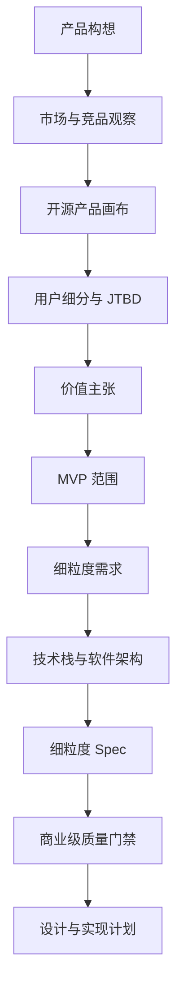

# 产品经理工作流程

## 状态

- 状态: 草案
- 作用: 定义本项目需求如何从想法收敛为可实现、可验收的产品规格。
- 当前阶段: 从产品构想到 MVP 定义。

## 工作流总览

## 1. 产品构想

已确认:

- 面向吉他手的工业级、开源打谱软件。
- 参考 Guitar Pro 8，但要更模块化、更可扩展、更方便。
- 架构可以按本项目需求重新设计，不需要沿用旧草案。
- 软件采用类似操作系统微内核的 Core Kernel + 用户态服务模块思路，内核提供稳定接口，功能通过模块与内核协作；接受少量性能损耗以换取架构稳定性和扩展性。
- 第一版主线是基础创作、编辑、编曲。
- 后续支持插件生态。
- 项目先全部开源验证效果，但按商业级软件流程做；近期不做商业化变现。
- 项目可作为毕业设计，必须可演示、可验收、可写论文。

输出文档:

- `notes/context-snapshot.md`
- `prd.md`

## 2. 市场与竞品观察

目标:

- 找到用户对商业级打谱软件的最低预期。
- 找到可差异化的机会。
- 避免把竞品未公开技术误认为必须照抄。

当前竞品:

- Guitar Pro 8: 商业桌面打谱软件基准。
- Soundslice: 交互谱、练习和真实音频/视频同步基准。
- MuseScore: 通用制谱和插件生态参考。

输出文档:

- `research/competitor-baseline.md`
- `research/guitar-pro-8-technical-notes.md`

## 3. 开源产品画布

目标:

- 明确谁会采用。
- 明确为什么采用、反馈或贡献。
- 明确哪些能力服务开源验证和长期维护目标。
- 防止 MVP 被曲库、云、AI、插件市场过早拉散。

输出文档:

- `product/business-model-canvas.md`

## 4. 用户细分与 JTBD

当前核心用户:

- 专业/半专业吉他手。
- 吉他教师。
- 编曲者。
- 内容创作者。

核心 JTBD:

- 快速记录和完善吉他乐句。
- 制作可播放、可打印、可导出的谱面。
- 建立多轨编曲草案。
- 迁移已有 Guitar Pro、MusicXML、MIDI 或文本谱素材。
- 通过插件或脚本补齐个人工作流。

输出文档:

- `requirements/REQ-001-product-positioning.md`

## 5. 价值主张

当前价值主张:

- 比传统工具更模块化。
- 比文本谱工具更专业。
- 比全功能 DAW 更聚焦谱面创作。
- 比闭源封闭工具更适合扩展和自动化。
- 比在线练习工具更适合作为创作源头。

需要后续量化:

- 输入效率提升。
- 导出质量。
- 文件稳定性。
- 插件能力覆盖。
- 竞品迁移成功率。

## 6. MVP 范围

当前推荐:

- 桌面优先。
- 吉他优先多轨。
- 核心编辑器。
- 结构化文档模型。
- 播放与基础练习。
- 导入导出。
- 内部插件注册表。
- 本地文件、自动保存和崩溃恢复。

明确后置:

- 在线曲库。
- 云同步。
- 账号体系。
- AI 自动扒谱。
- 第三方插件市场。
- 移动端编辑器。
- DAW 级音频编辑。

## 7. 细粒度需求

规则:

- 每个需求一个 `REQ-xxx` 文档。
- 每个需求包含用户价值、MVP 必须项、MVP 不做、行为契约、验收标准、开放问题。
- 每个功能规划必须包含“功能规划四视角”，用于帮助用户审核，也用于约束后续 AI 编码输入。
- 用户确认后必须更新对应文档。

输出目录:

- `requirements/`

### 功能规划四视角

后续规划每一个功能、模块或内核子系统时，必须补充以下四类说明:

- 产品视角: 说明这个模块解决什么用户问题、有哪些使用场景、哪些功能真正必要。
- 业务逻辑视角: 说明业务流程、业务规则、状态变化、边界条件和异常情况。
- 技术实现视角: 说明模块边界、数据模型、接口契约、依赖关系、可测试性和可维护性。
- 反过度设计视角: 检查当前阶段是否把模块设计得太复杂，是否引入不必要的抽象、框架、服务、配置或扩展机制。

使用规则:

- 四视角不是口号，必须写到具体模块或功能文档里。
- 如果某个视角暂时没有内容，必须写明“当前阶段不需要”，并说明为什么。
- 反过度设计视角必须明确 MVP 保留什么、后置什么、拒绝什么。
- 当一个功能复杂到四视角内容过长，应拆成独立 `REQ` 或 `SPEC`，而不是塞进总 PRD。

## 8. 技术栈与软件架构

目标:

- 让技术选择服务产品战略。
- 避免后续 AI 自行选择核心框架和目录结构。
- 保证 Core Kernel、模块化和插件系统从第一天进入架构。

输出文档:

- `technical/tech-stack.md`
- `technical/software-architecture.md`
- `technical/project-architecture.md`
- `technical/modular-plugin-architecture.md`

## 9. 细粒度 Spec

目标:

- 把需求翻译成可编码约束。
- 每个 spec 都能指导测试和代码评审。

输出目录:

- `specs/`

## 10. 设计与实现计划

进入实现前必须完成:

- 最终 PRD 收敛。
- `design.md` 技术设计。
- `implement.md` 实施计划。
- 核心 `.trellis/spec` 重写，不保留初始化模板。

## 11. 商业级质量门禁

目标:

- 开源不降低工程质量门槛。
- 每个核心能力都有可验证的质量属性。
- 实现阶段不能只追求 UI 演示，必须保护用户谱面资产和本地文件安全。

门禁:

- 需求门禁: 功能必须能映射到 REQ、spec 和验收标准。
- 设计门禁: 核心模块必须有边界、数据流、错误处理和测试策略。
- 编码门禁: 类型检查、lint、单元测试、关键集成测试必须通过。
- 文件门禁: 保存、打开、迁移、损坏文件处理和自动保存恢复必须有测试。
- 安全门禁: 外部文件、插件、导入资源和诊断包必须按不可信输入处理。
- 性能门禁: 打开、编辑、播放、保存、导出必须有基准或最低体验阈值。
- 发布门禁: 版本号、更新日志、第三方许可、诊断入口和发布清单必须完整。

## 当前待确认决策

- 第一阶段 Core Kernel 的最小边界应包含哪些能力。
- 项目目录结构后置到架构确认后再定。

## 流程验收标准

- [ ] 每个产品决策都有来源、推荐答案和取舍。
- [ ] 每个功能规划都包含产品视角、业务逻辑视角、技术实现视角和反过度设计视角。
- [ ] 每个 MVP 功能能映射到开源产品画布和 JTBD。
- [ ] 每个核心技术决策能映射到一个产品目标。
- [ ] 每个 spec 能映射到一个或多个需求编号。
- [ ] 每个核心质量属性都有对应测试或人工验收方法。
- [ ] 实现开始前，关键开放问题不再悬空。
