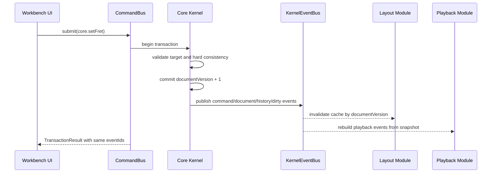
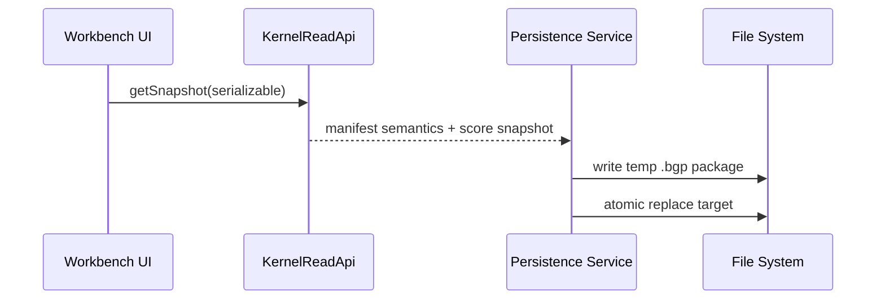
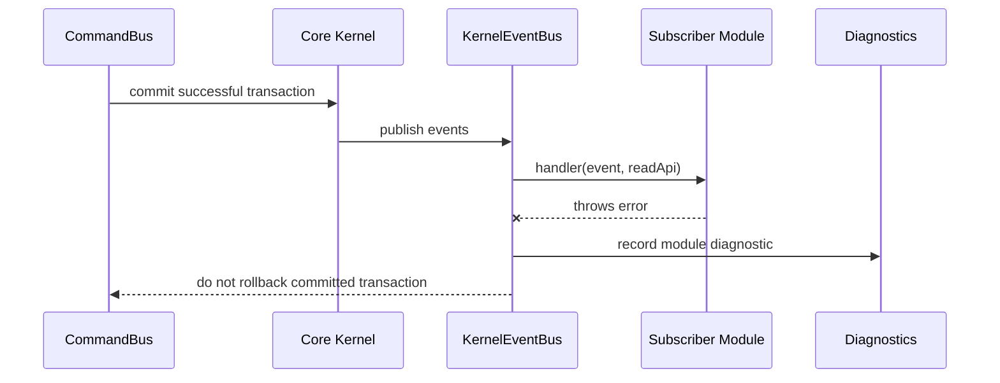

# SPEC-014 内核快照、事件与模块通信协议

## 状态

- 状态: 已确认核心通信模型；外部可变 `ScoreDocument` 副本方案已拒绝。
- 映射需求: `REQ-002`, `REQ-007`, `REQ-010`, `REQ-015`, `REQ-016`。
- 目标: 定义 Core Kernel 对外的只读状态出口、变更通知出口和模块协作协议，让渲染、播放、导出、导入、内部模块和未来插件都围绕同一份 `ScoreDocument` 真相工作。

## 问题定义

模块化软件不能靠共享可变对象协作。对于 `Brilliant Guitar`，真正的业务事实只有 `ScoreDocument`。布局坐标、SVG/VexFlow 对象、播放事件、PDF/PNG 页面模型、React 状态和未来插件缓存都只能从内核快照派生，不能反向成为谱面事实。

本 spec 要解决三个问题:

- 模块如何读取谱面状态而不拿到可变 `ScoreDocument`。
- 模块如何知道文档、诊断、历史、脏状态和注册表发生了变化。
- 模块如何协作而不直接互相调用、互相持有内部对象或绕过命令系统。

## 设计结论

第一阶段采用“Snapshot / Selector + Post-Commit Event Bus + Command-only write”的内核通信模型。

- 写入: 所有谱面修改必须通过 `CommandBus.submit`、`CommandBus.undo` 或 `CommandBus.redo`。
- 读取: 渲染、播放、导出、分析、内部模块和未来插件只能通过 `DocumentSnapshot` 或受控 selector 读取状态。
- 通知: 内核只发布提交后的事实事件，例如文档已变化、命令已执行、诊断已变化、历史状态已变化、脏状态已变化和注册表已变化。
- 协作: 模块之间不共享可变对象，也不直接以对方私有类型通信；它们通过内核 API、版本号、事件和结构化 report 协作。

外部模块可以基于 snapshot 创建非谱面事实的派生数据，例如布局缓存、hit areas、播放队列、导出页面模型、缩略图、分析报告或导入中间模型；它们不能是可变 `ScoreDocument` 副本，不能作为权威谱面整体写回 Core Kernel。任何最终改变谱面的行为仍必须通过语义命令、导入结果或迁移入口。

这个协议不是网络 IPC、不是协同编辑协议、不是插件沙箱协议，也不是持久审计日志。MVP 只需要单进程、内存内、强类型的模块协议。

## 适用范围

本 spec 约束:

- Core Kernel 的 `KernelReadApi`。
- `DocumentSnapshot`。
- built-in selector。
- `KernelEvent` envelope。
- `KernelEventBus`。
- 模块订阅、缓存失效和版本对齐规则。
- `TransactionResult.events` 中返回的事件摘要。

本 spec 不约束:

- React 状态管理库。
- SVG DOM、VexFlow 对象或 Web Audio 节点。
- Tauri/Rust 原生命令消息格式。
- 第三方插件沙箱实现。
- 协同编辑、网络同步或云端消息队列。
- 真实音频播放事件结构；播放事件属于 `Playback Module`。
- 布局 primitives 结构；布局 primitives 属于 `Layout Module`。

## 第一性原则

- SCORE-TRUTH: `ScoreDocument` 是唯一谱面业务真相。
- NO-MUTABLE-LEAK: 外部模块不得拿到可变 `ScoreDocument` 引用。
- COMMAND-WRITES: 外部写入只能通过语义命令，不能通过 snapshot、selector、event 或 patch 写入。
- POST-COMMIT-EVENTS: 内核事件描述已经发生的事实，不是命令，也不是请求。
- VERSIONED-READS: 每个 snapshot、selector 结果和文档事件必须带有文档版本。
- MODULE-ISOLATION: 一个模块的缓存、错误或私有派生模型不能污染内核文档。
- MVP-SIMPLE: 第一阶段不做分布式 IPC、持久事件日志、协同编辑和第三方脚本事件桥。

## 强制规则

- KSE-001: Core Kernel 必须提供只读 `KernelReadApi`，不得把可变 `ScoreDocument` 暴露给 UI、渲染、播放、导出、导入器、内部模块或未来插件。
- KSE-002: `DocumentSnapshot` 必须包含 `documentId`、`schemaVersion`、`documentVersion`、`snapshotId` 和创建时间。
- KSE-003: snapshot 数据必须按只读契约返回；实现可使用深冻结、不可变结构、结构共享或只读代理，但外部修改 snapshot 不得影响内核文档。
- KSE-004: selector 必须是纯读操作，不得修改文档、历史、诊断、注册表、脏状态或模块缓存。
- KSE-005: selector 结果必须携带来源 `documentVersion`，用于渲染、播放、导出和插件缓存失效。
- KSE-006: 内核事件必须在事务 commit 成功后发布；失败、回滚或被拒绝的命令不得发布 `kernel.document.changed`。
- KSE-007: `TransactionResult.events` 返回的事件必须和 `KernelEventBus` 发布的事件使用同一组 `eventId`。
- KSE-008: 事件 payload 不得包含完整可变文档、内部 delta operation、SVG/VexFlow 对象、Web Audio 节点、React 组件或文件系统路径私有对象。
- KSE-009: 文档变更事件可以包含变更范围、实体 ID 和粗粒度摘要，但内部 delta 只能留在 Core Kernel 内部。
- KSE-010: 事件处理器抛出异常不得回滚已经 commit 的文档事务；内核必须捕获异常并记录结构化 diagnostic 或模块错误报告。
- KSE-011: 事件分发过程中不得重入提交命令。事件处理器若需要后续写入，必须通过外部调度队列在当前事件分发结束后提交新命令。
- KSE-012: `documentVersion` 只在谱面内容成功变化后递增；诊断、脏状态、历史状态和注册表可使用各自 version 或事件序号表达变化。
- KSE-013: `eventSequence` 必须在当前内核运行期内单调递增；它用于内存内订阅顺序，不作为持久文件格式字段。
- KSE-014: `DocumentSnapshot`、selector 结果和 `KernelEvent` 中的用户可见文本必须使用 i18n key 或结构化 code，不得硬编码中文或英文 UI 文案。
- KSE-015: UI 当前光标、选区高亮、鼠标拖拽状态和编辑模式变化不属于 Core Kernel 事件；它们属于 `Editor Session Service`，可以有自己的 session event。
- KSE-016: `KernelEventBus` 是内核状态通知协议，不是模块间任意消息总线；模块不能通过它发送自定义业务命令绕过内核。
- KSE-017: 未来第三方插件不能直接订阅裸 `KernelEventBus`；必须由 `Extension Host` 按 capability 过滤和代理。
- KSE-018: 渲染、播放、导出、分析和插件缓存必须以 `documentVersion` 或 selector 结果版本作为失效依据，不能偷读可变对象判断变化。
- KSE-019: 外部模块不得创建、持有、修改或提交可变 `ScoreDocument` 副本。
- KSE-020: Core Kernel 不得提供 `getMutableDocumentCopy`、`replaceDocumentFromExternalCopy`、`saveMutableWorkingCopy`、外部任意整文档覆盖或外部 mutable draft 直接提交 API。
- KSE-021: 导入器或迁移器可以生成文档候选或中间模型，但必须通过专门入口、来源标识、硬一致性验证、report 和事务提交，不能走普通外部副本覆盖路径。
- KSE-022: 外部派生数据不能产生 undo/redo 历史；只有内核成功 commit 的语义命令、导入结果或迁移结果才能进入历史和事件系统。

## 数据结构草案

本节是后续实现的编码输入。每个结构都必须保留注释，说明用途和边界。

```ts
/**
 * ISO 时间字符串。
 *
 * 用途:
 * - 记录 snapshot 和 event 创建时间。
 * - 用于诊断和调试，不参与音乐语义计算。
 */
export type IsoTimestamp = string

/**
 * 内核运行期事件序号。
 *
 * 用途:
 * - 在单次应用运行中保持事件顺序稳定。
 * - 不写入 `.bgp`，不作为持久审计日志。
 */
export type KernelEventSequence = number

/**
 * 文档版本号。
 *
 * 用途:
 * - 标识 `ScoreDocument` 内容版本。
 * - 每次成功改变谱面内容的事务 commit 后递增。
 * - selector、snapshot、event 和缓存都依赖它判断状态是否过期。
 */
export type DocumentVersion = number

/**
 * 快照 ID。
 *
 * 用途:
 * - 区分同一个文档版本下的多次只读快照请求。
 * - 方便测试、诊断和性能统计。
 */
export type SnapshotId = string

/**
 * 快照作用域。
 *
 * 用途:
 * - 表达调用方希望读取的范围。
 * - MVP 必须支持 `full` 和 `serializable`。
 * - `range` 和 `entities` 可以先通过 full snapshot 实现，后续再优化。
 */
export type SnapshotScope =
  | { kind: "full" }
  | { kind: "serializable" }
  | { kind: "range"; range: ScoreRange }
  | { kind: "entities"; entityIds: EntityId[] }

/**
 * 文档快照。
 *
 * 用途:
 * - 给布局、渲染、播放、导出、分析和插件提供稳定只读视图。
 * - 作为模块派生模型的唯一输入来源。
 *
 * 边界:
 * - `score` 必须按只读契约暴露。
 * - 不包含 React、SVG、VexFlow、Web Audio、Tauri 文件句柄或 UI 会话状态。
 */
export interface DocumentSnapshot {
  snapshotId: SnapshotId
  scope: SnapshotScope
  documentId: EntityId
  schemaVersion: string
  documentVersion: DocumentVersion
  diagnosticsVersion: number
  registryVersion: number
  createdAt: IsoTimestamp
  score: ReadonlyScoreDocument
}

/**
 * 只读谱面文档。
 *
 * 用途:
 * - 类型层表达外部模块只能读取，不能写入。
 * - 具体实现可以用 deep freeze、readonly 类型、不可变数据结构或结构共享。
 */
export type ReadonlyScoreDocument = DeepReadonly<ScoreDocument>

/**
 * 深层只读类型。
 *
 * 用途:
 * - 避免 `Readonly<T>` 只保护第一层字段导致深层数组或对象仍可被外部修改。
 * - 这是类型契约；运行时仍需要 deep freeze、不可变数据结构或只读代理等机制兜底。
 */
export type DeepReadonly<T> =
  T extends (...args: never[]) => unknown
    ? T
    : T extends readonly unknown[]
      ? ReadonlyArray<DeepReadonly<T[number]>>
      : T extends object
        ? { readonly [K in keyof T]: DeepReadonly<T[K]> }
        : T

/**
 * selector ID。
 *
 * 用途:
 * - 稳定标识一个内核只读查询。
 * - 允许测试、插件 API 和性能日志按查询类型归因。
 */
export type SelectorId = string

/**
 * selector 执行上下文。
 *
 * 用途:
 * - 给 selector 提供受控只读访问能力。
 * - 不提供 draft、delta 或任何写入入口。
 */
export interface SelectorContext {
  documentId: EntityId
  documentVersion: DocumentVersion
  schemaVersion: string
  score: ReadonlyScoreDocument
}

/**
 * selector 定义。
 *
 * 用途:
 * - 定义一个可测试、可权限控制、可复用的只读查询。
 * - 比让模块随意遍历内部对象更稳定。
 */
export interface KernelSelectorDefinition<TArgs = unknown, TResult = unknown> {
  id: SelectorId
  inputSchemaVersion: string
  inputSchema: unknown
  requiredCapabilities: KernelCapability[]
  select: (context: SelectorContext, args: TArgs) => TResult
}

/**
 * selector 结果。
 *
 * 用途:
 * - 返回 selector 数据及其来源文档版本。
 * - 让调用方可以做缓存和过期判断。
 */
export interface SelectorResult<TResult = unknown> {
  selectorId: SelectorId
  documentId: EntityId
  documentVersion: DocumentVersion
  data: TResult
  diagnostics?: DocumentDiagnostic[]
}

/**
 * 内核只读 API。
 *
 * 用途:
 * - Core Kernel 对外围模块的统一读取入口。
 * - 命令处理器、布局、播放、导出、分析和未来插件都应复用它。
 *
 * 边界:
 * - 不提供写入能力。
 * - 不返回可变内部对象。
 */
export interface KernelReadApi {
  getSnapshot(options?: { scope?: SnapshotScope }): DocumentSnapshot
  select<TArgs, TResult>(
    selector: KernelSelectorDefinition<TArgs, TResult>,
    args: TArgs
  ): SelectorResult<TResult>
  getDocumentVersion(): DocumentVersion
  getDiagnostics(): DocumentDiagnostic[]
}

/**
 * 内核事件类型。
 *
 * 用途:
 * - 让订阅者按稳定类型处理内核事实。
 * - 事件类型不随 UI 文案变化。
 */
export type KernelEventType =
  | "kernel.document.loaded"
  | "kernel.document.changed"
  | "kernel.command.executed"
  | "kernel.history.changed"
  | "kernel.diagnostics.changed"
  | "kernel.dirty-state.changed"
  | "kernel.registry.changed"
  | "kernel.migration.completed"

/**
 * 内核事件来源。
 *
 * 用途:
 * - 表达事件由哪个模块、命令或内核流程触发。
 * - 方便诊断、权限审计和测试定位。
 */
export interface KernelEventSource {
  kind: "core-kernel" | "ui" | "internal-module" | "importer" | "persistence" | "replay"
  moduleId: string
}

/**
 * 内核事件信封。
 *
 * 用途:
 * - 统一所有内核事件的版本、顺序、来源和关联信息。
 * - 让模块不依赖具体 command result 或内部 delta。
 *
 * 边界:
 * - payload 只能包含结构化摘要，不得包含可变文档或内部 delta operation。
 */
export interface KernelEvent<TPayload = unknown> {
  eventId: string
  type: KernelEventType
  sequence: KernelEventSequence
  createdAt: IsoTimestamp
  source: KernelEventSource
  documentId?: EntityId
  documentVersion?: DocumentVersion
  registryVersion?: number
  transactionId?: string
  commandId?: CommandId
  requestId?: string
  payload: TPayload
}

/**
 * 文档加载事件 payload。
 *
 * 用途:
 * - 表示内核接受了一份新的活动文档。
 * - 新建文档、打开 `.bgp`、自动恢复和导入映射成功后都可以产生该事件。
 */
export interface DocumentLoadedPayload {
  reason: "new-document" | "open-file" | "autosave-restore" | "import-result" | "test-fixture"
  schemaVersion: string
  migrated: boolean
}

/**
 * 文档变更事件 payload。
 *
 * 用途:
 * - 通知渲染、播放、导出、自动保存和 UI 缓存失效。
 * - 提供足够的粗粒度信息让模块决定局部刷新还是全量刷新。
 *
 * 边界:
 * - `deltaSummary` 不是内部 delta，不得用于重放文档。
 */
export interface DocumentChangedPayload {
  changeKind: "edit" | "undo" | "redo" | "migration" | "import"
  documentVersionBefore: DocumentVersion
  documentVersionAfter: DocumentVersion
  affectedEntityIds: EntityId[]
  affectedRanges: ScoreRange[]
  requiresFullRefresh: boolean
  deltaSummary: ChangeSummary[]
  historyEntryId?: string
}

/**
 * 变更摘要。
 *
 * 用途:
 * - 给外部模块描述变化类别，帮助缓存失效。
 * - 不表达字段级内部 patch。
 */
export interface ChangeSummary {
  kind:
    | "metadata"
    | "track-structure"
    | "measure-structure"
    | "beat-content"
    | "note-content"
    | "technique-content"
    | "tuning"
    | "schema"
    | "unknown"
  target?: ScoreAddress | ScoreRange
}

/**
 * 命令执行事件 payload。
 *
 * 用途:
 * - 表示一个语义命令已经成功 commit。
 * - UI、命令面板、测试和插件调试可以用它做状态反馈。
 */
export interface CommandExecutedPayload {
  commandId: CommandId
  undoable: boolean
  historyEntryId?: string
  diagnostics: DocumentDiagnostic[]
}

/**
 * 历史状态事件 payload。
 *
 * 用途:
 * - 让 UI 更新 undo/redo 可用状态。
 * - 不暴露完整 undo stack 或内部 delta。
 */
export interface HistoryChangedPayload {
  canUndo: boolean
  canRedo: boolean
  undoDepth: number
  redoDepth: number
  lastHistoryEntryId?: string
}

/**
 * 诊断变化事件 payload。
 *
 * 用途:
 * - 通知 UI、导出、保存前检查和插件诊断面板刷新。
 */
export interface DiagnosticsChangedPayload {
  diagnosticsVersionBefore: number
  diagnosticsVersionAfter: number
  changedCodes: string[]
  severityCounts: Record<"info" | "warning" | "error", number>
}

/**
 * 脏状态事件 payload。
 *
 * 用途:
 * - 通知 UI、自动保存和关闭确认逻辑。
 * - 脏状态属于应用会话状态，但由内核事务边界统一更新。
 */
export interface DirtyStateChangedPayload {
  dirty: boolean
  savedDocumentVersion?: DocumentVersion
  currentDocumentVersion: DocumentVersion
}

/**
 * 注册表变化事件 payload。
 *
 * 用途:
 * - 通知命令面板、导入导出菜单、模板列表和内部扩展点刷新。
 */
export interface RegistryChangedPayload {
  registryVersionBefore: number
  registryVersionAfter: number
  contributionKinds: Array<"command" | "validator" | "importer" | "exporter" | "template" | "selector">
  moduleId: string
}

/**
 * 迁移完成事件 payload。
 *
 * 用途:
 * - 让 Persistence、UI 和诊断面板知道打开文件发生了 schema 迁移。
 * - 详细迁移信息仍以 `MigrationReport` 为准。
 */
export interface MigrationCompletedPayload {
  fromSchemaVersion: string
  toSchemaVersion: string
  reportId: string
  warningCount: number
  errorCount: number
}

/**
 * 内核事件处理器。
 *
 * 用途:
 * - 让模块订阅内核事实事件。
 * - 处理器只能读 snapshot/selector 或更新本模块缓存。
 */
export type KernelEventHandler<TPayload = unknown> = (
  event: KernelEvent<TPayload>,
  read: KernelReadApi
) => void | Promise<void>

/**
 * 订阅选项。
 *
 * 用途:
 * - 限制模块只接收自己关心的事件。
 * - 未来 Extension Host 可按 capability 做过滤。
 */
export interface KernelEventSubscriptionOptions {
  eventTypes?: KernelEventType[]
  moduleId: string
}

/**
 * 取消订阅函数。
 *
 * 用途:
 * - 允许模块释放订阅，避免关闭文档或卸载模块后继续接收事件。
 */
export type UnsubscribeKernelEvent = () => void

/**
 * 内核事件总线。
 *
 * 用途:
 * - 发布 Core Kernel 的提交后事实。
 * - 支撑 UI 刷新、布局缓存失效、播放事件重建、自动保存和诊断刷新。
 *
 * 边界:
 * - 不作为任意模块消息通道。
 * - 不允许事件处理器在当前分发栈中重入提交命令。
 */
export interface KernelEventBus {
  subscribe<TPayload>(
    options: KernelEventSubscriptionOptions,
    handler: KernelEventHandler<TPayload>
  ): UnsubscribeKernelEvent
  publish(events: KernelEvent[]): void
}
```

## MVP 内置 selector

MVP 必须至少定义以下只读 selector:

- `core.selectDocumentMetadata`: 读取标题、作者、tempo、time signature 和文档标识。
- `core.selectFullScore`: 读取完整只读谱面快照，供小型 MVP 文档使用。
- `core.selectSerializableScore`: 读取可写入 `score.json` 的领域模型，不包含 UI 会话状态和派生缓存。
- `core.selectMeasureRange`: 读取指定小节范围，供布局、播放和导出局部刷新使用。
- `core.selectEntityByAddress`: 按 `ScoreAddress` 读取实体。
- `core.selectDiagnostics`: 读取当前 hard validation diagnostic。
- `core.selectHistoryState`: 读取 undo/redo 可用状态，不暴露内部 delta。
- `core.selectDirtyState`: 读取当前脏状态。
- `core.selectRegistrySummary`: 读取命令、验证器、导入器、导出器、模板和 selector 的注册摘要。

## MVP 内核事件集合

MVP 必须至少支持以下事件:

- `kernel.document.loaded`: 新建、打开、自动恢复或导入映射后，内核接受新的活动文档。
- `kernel.document.changed`: 成功写命令、undo、redo、导入映射或迁移导致谱面内容变化。
- `kernel.command.executed`: 一个语义命令成功 commit。
- `kernel.history.changed`: undo/redo 可用状态变化。
- `kernel.diagnostics.changed`: hard validation diagnostic 变化。
- `kernel.dirty-state.changed`: 当前文档是否有未保存修改发生变化。
- `kernel.registry.changed`: 命令、验证器、导入器、导出器、模板或 selector 注册表变化。
- `kernel.migration.completed`: 打开文件或恢复文件时完成 schema migration。

MVP 不发布:

- UI 光标变化事件。
- 选区高亮事件。
- 鼠标拖拽事件。
- 播放光标 tick 事件。
- Web Audio 节点事件。
- SVG DOM 事件。
- 任意第三方插件自定义事件。

这些事件属于对应用户态服务模块，不属于 Core Kernel。

## 模块协作流程

### 编辑命令后刷新



### 保存



### 事件订阅异常



## 错误和边界行为

- Snapshot mutation attempt: 外部修改 snapshot 不得影响内核；测试环境建议直接抛出只读错误。
- Mutable ScoreDocument copy: 外部模块不得获得可变 `ScoreDocument` 副本。布局、播放、导出和分析只能生成非谱面事实的派生数据结构。
- Stale snapshot: 模块持有旧 `documentVersion` 时必须在收到更高版本事件后失效缓存；如果继续基于旧地址提交命令，命令系统必须重新解析目标并可能返回 `command-target-not-found` 或 `command-precondition-failed`。
- Failed command: 命令失败时，`TransactionResult.ok = false`，不产生 `kernel.document.changed`、`kernel.command.executed` 或 `kernel.history.changed`。
- Subscriber failure: 订阅者失败不得回滚事务；内核记录 `module-event-handler-failed` diagnostic 或模块错误报告。
- Reentrant command: 事件处理器在分发栈中直接提交命令必须被拒绝，返回 `command-precondition-failed` 或专用 `kernel-reentrant-command-denied`。
- Full refresh: 如果内核无法给出可靠局部影响范围，`DocumentChangedPayload.requiresFullRefresh` 必须为 `true`。
- Unknown event: MVP 内部模块收到未知事件类型必须忽略并记录 debug diagnostic，不得崩溃。
- Future plugin bridge: 未来第三方插件只能看到 Extension Host 过滤后的事件，不得获得裸 `KernelEventBus`。

## 与其它 spec 的关系

- `SPEC-001-document-model.md`: 定义 `ScoreDocument`、`EntityId`、调弦、note/rest 和技巧注解等被 snapshot 暴露的领域结构。
- `SPEC-002-file-format.md`: `selectSerializableScore` 输出必须能进入 `.bgp` 的 `score.json`。
- `SPEC-003-command-system.md`: `TransactionResult.events` 使用本 spec 的 `KernelEvent`。
- `SPEC-004-selection-editing.md`: UI 光标、选区和临时编辑状态不属于内核事件。
- `SPEC-006-layout-rendering.md`: Layout Module 只从 snapshot/selector 派生布局 primitives。
- `SPEC-007-playback.md`: Playback Module 只从 snapshot/selector 派生播放事件。
- `SPEC-009-extension-api.md`: 插件读取能力通过 snapshot/selector 暴露，事件由 Extension Host 代理。

## MVP 必须做

- 定义 `KernelReadApi`。
- 定义 `DocumentSnapshot`。
- 定义 MVP built-in selector。
- 定义 `KernelEvent` envelope。
- 定义 `KernelEventBus.subscribe` 和内部 `publish`。
- 在成功命令、undo、redo 和文档加载后生成稳定事件。
- 在 `TransactionResult.events` 中返回事件摘要。
- 事件处理器异常隔离。
- 禁止事件分发期间重入提交命令。
- 为渲染、播放、导出和 Persistence 提供只读 snapshot/selector 读取路径。

## MVP 不做

- 不做网络 IPC。
- 不做协同编辑。
- 不做持久事件日志。
- 不做事件溯源数据库。
- 不做跨进程事件总线。
- 不做第三方插件直接订阅裸事件总线。
- 不做 UI 光标、选区和鼠标事件的内核事件。
- 不做播放光标高频 tick 的内核事件。
- 不做 full document event payload。
- 不通过 event payload 暴露内部 delta operation。
- 不做外部可变 `ScoreDocument` 副本。
- 不做外部整文档覆盖 API。

## 测试要求

- [ ] AC-014-01: 外部模块拿到 `DocumentSnapshot` 后尝试修改对象，不会改变内核 `ScoreDocument`。
- [ ] AC-014-02: 成功执行 `insertNote` 后，`documentVersion` 增加，返回 `kernel.command.executed`、`kernel.document.changed`、`kernel.history.changed` 和 `kernel.dirty-state.changed` 中的必要事件。
- [ ] AC-014-03: 失败命令不会发布 `kernel.document.changed`，不会增加 undo stack，也不会改变 `documentVersion`。
- [ ] AC-014-04: `TransactionResult.events` 和 `KernelEventBus` 订阅者收到的事件具有相同 `eventId`。
- [ ] AC-014-05: 事件处理器抛出异常时，事务结果仍保持已提交状态，并生成可诊断的模块错误。
- [ ] AC-014-06: 事件处理器在分发栈中直接提交命令时被拒绝或延迟调度，不允许重入修改。
- [ ] AC-014-07: Layout Module 可以只通过 snapshot/selector 生成布局 primitives，不访问可变文档。
- [ ] AC-014-08: Playback Module 可以只通过 snapshot/selector 生成播放事件，不访问可变文档。
- [ ] AC-014-09: Persistence 保存 `.bgp` 时使用 `selectSerializableScore` 或 serializable snapshot，不读取 React、SVG、VexFlow 或 UI 会话状态。
- [ ] AC-014-10: 打开 `.bgp` 并完成迁移后，内核发布 `kernel.document.loaded`，如发生迁移则发布 `kernel.migration.completed`。
- [ ] AC-014-11: `kernel.document.changed` 不包含完整可变文档、内部 delta operation、SVG/VexFlow 对象或 Web Audio 节点。
- [ ] AC-014-12: UI 光标移动或选区高亮变化不会触发 Core Kernel 的 `kernel.document.changed`。
- [ ] AC-014-13: 渲染缓存以 `documentVersion` 或 selector 结果版本失效，不能通过可变引用判断变化。
- [ ] AC-014-14: 未来第三方插件 manifest 即使声明事件订阅，MVP 也必须返回 unsupported 或只允许内部模块订阅。
- [ ] AC-014-15: 外部模块无法通过公开 API 获取可变 `ScoreDocument` 副本。
- [ ] AC-014-16: 调用不存在或被禁止的外部整文档覆盖 API 时，必须返回 unsupported 或编译期不可访问。
- [ ] AC-014-17: 导入器或迁移器提交文档候选时，必须产生 `ImportReport` 或 `MigrationReport`，并通过硬一致性验证后才能 commit。
