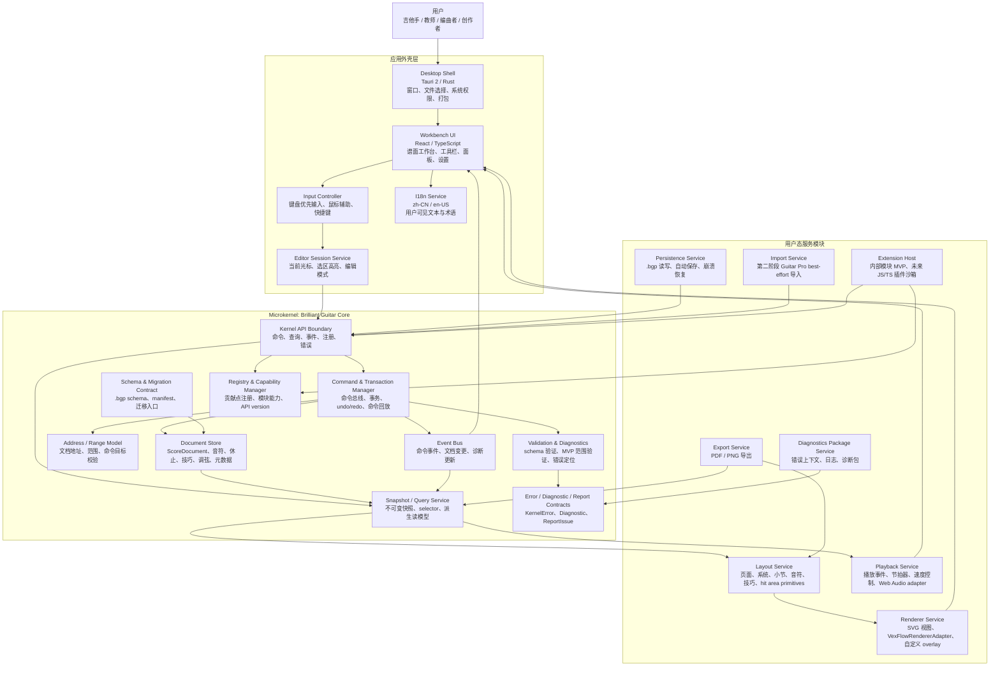
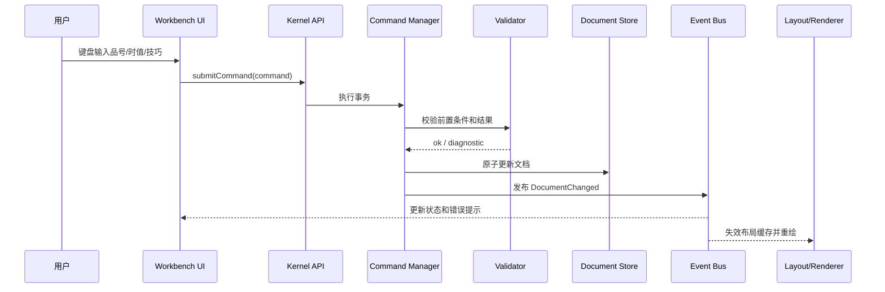
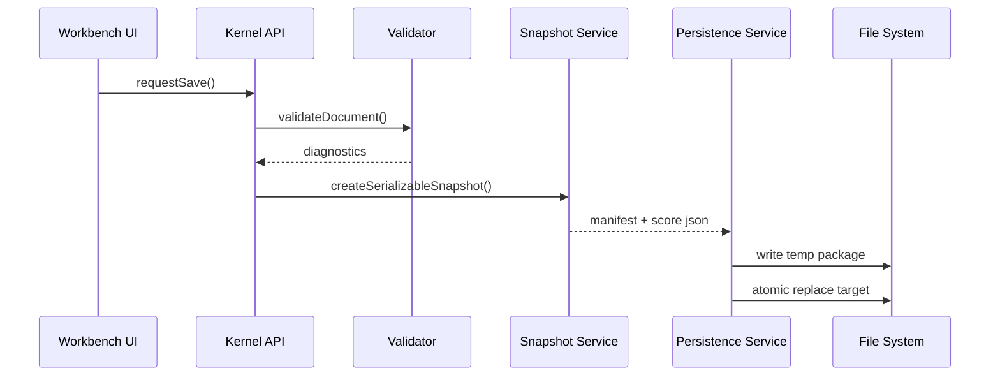

# 微内核架构图与模块职责

## 架构结论

`Brilliant Guitar` 采用参照操作系统微内核思想的软件架构。核心原则是: 内核只保留最关键、最稳定、最需要一致性的能力；其它功能作为用户态服务模块围绕内核工作。

这个选择允许我们牺牲少量直接调用性能，换取更强的架构稳定性、可测试性、可维护性和扩展性。对于打谱软件来说，这是合理取舍: 谱面文件、编辑历史、插件 API、导入导出和未来长期兼容比极限性能更重要。

## 微内核功能复审结论

向 Linux 的核心思想看齐时，要抓住的是“内核保留最关键机制，外部模块承接可替换能力”。严格说 Linux 本身不是微内核，而是模块化单体内核；但它给本项目的启发很清楚: 内核要掌握事实、边界、调度入口、权限和稳定 ABI，驱动、文件系统、用户态服务和业务策略尽量放到外部模块。

因此本项目微内核不应该变成一个“万能业务层”。复审后，微内核只保留 9 类核心机制，其它功能移到用户态服务模块。

## 内核总规划优先级

当前阶段先完成 Core Kernel V1 的 9 类机制规划和实现，不把注册表 handler 注销、运行时卸载、第三方插件启停、热插拔、插件禁用、权限 UI 等生命周期治理放入当前内核实现。官方内置 UI 模块可视为第一个可信模块/官方插件，用于在内核完成后验证 snapshot、semantic command、event、registry/capability 等协作链路；第三方插件安装、启停、卸载、热插拔、权限 UI 和完整生命周期治理后置到该 UI 模块可用之后再规划。

内核总规划按以下 9 类机制收敛:

| 序号 | 内核机制 | 解决的问题 | MVP 只保留 |
| --- | --- | --- | --- |
| 1 | 谱面核心对象模型 | 定义唯一谱面事实 | `ScoreDocument`、单轨 6 弦、明确调弦、基础音符/休止/技巧注解 |
| 2 | 命令系统调用边界 | 统一写入口 | 语义命令、payload schema、内部 delta 不外露 |
| 3 | 事务、历史和一致性边界 | 保证写入可回滚可回放 | 细粒度 undo/redo、dirty state、command replay |
| 4 | 文档地址和范围模型 | 统一命令目标语言 | 稳定 ID、`ScoreAddress`、`ScorePoint`、`ScoreRange` |
| 5 | 硬一致性验证 | 防止文件和文档被写坏 | schema、引用、时值、弦/品/音高、MVP 范围验证 |
| 6 | `.bgp` 语义契约和迁移入口 | 保护长期文件资产 | manifest/score schema、schema version、migration/report 入口 |
| 7 | 快照、事件和模块通信协议 | 让外部模块低耦合协作 | 只读 snapshot/selector、提交后事件、command-only write |
| 8 | 注册表与能力边界 | 管理贡献点和模块权限 | registry、capability、module identity、静态可信启动清单 |
| 9 | 错误、Diagnostic 和 Report 契约 | 统一失败表达和定位 | `KernelError`、diagnostic、shared report shell |

后置到内核总规划完成后再讨论:

- 注册表 handler 是否允许注销或卸载。
- `trusted-core` 模块是否允许运行时禁用。
- 未来第三方插件的启用、停用、热插拔和隔离恢复。
- 权限 UI、插件市场、签名、审核和插件生命周期治理。

### 内核保留 1: 谱面核心对象模型

微内核保留最小 `ScoreDocument` 核心语义。

它定义:

- 谱面文档、track、measure、beat、note/rest 的基础结构。
- 吉他弦号、品号、调弦和音高关系的核心表示。
- 调弦必须逐弦保存为明确科学音高，例如标准 6 弦吉他低到高 `E2 A2 D3 G3 B3 E4`，不得把 `EADGBE` 作为核心数据。
- 技巧数据的最小可序列化表达，例如 `TechniqueAnnotation`；具体 `slide`、`bend`、`vibrato` 定义由技巧注册器注册。
- 元数据的核心字段，例如 title、author、tempo、time signature。

不放入内核:

- 布局偏好。
- UI 展开/折叠状态。
- 渲染缓存。
- 播放光标。
- PDF 页面设置。
- Guitar Pro 专用解析中间结构。

### 内核保留 2: 命令系统调用边界

微内核提供唯一写入入口，类似操作系统 syscall。

所有修改必须通过语义命令。语义命令表达“要做什么”，例如输入音符、修改品号、添加技巧；patch/delta 表达“文档字段怎么变”，只能由内核内部生成和消费。

对外允许的典型语义命令:

- `createScore`
- `insertNote`
- `setFret`
- `setDuration`
- `addTechnique`
- `deleteRange`
- `undo`
- `redo`

对外禁止的 patch 类命令:

- `patchDocument`
- `replaceJsonPath`
- `setField`
- `spliceArray`
- `runScript`
- 任意字段路径或脚本式写入。

内核保证:

- 命令输入有 schema。
- 命令有前置条件。
- 命令执行是事务。
- 失败可以 rollback。
- 语义命令可以被编译为内部 delta。
- 命令可以进入 undo/redo。
- 命令可以被回放测试。

不放入内核:

- 快捷键映射。
- 菜单项。
- 命令面板搜索。
- 插件 UI 入口。

### 内核保留 3: 事务、历史和一致性边界

微内核负责所有文档写入的事务语义。

它负责:

- transaction begin / commit / rollback。
- undo stack。
- redo stack。
- dirty state。
- command replay log。
- 批量命令的原子提交。
- MVP 细粒度历史: 每个成功可撤销语义命令默认生成一个 `HistoryEntry`，`undo` 和 `redo` 一次只移动一个历史条目。
- MVP 不做复杂历史合并、时间窗口合并或跨命令智能压缩；后续如需合并，必须通过显式 `historyMergePolicy` 和测试定义。

为什么必须在内核:

- UI、导入器、模板、内部模块、未来插件都必须共享同一套历史和回滚语义。

### 内核保留 4: 文档地址和范围模型

复审后，活动光标不应该完整放进内核。内核只保留文档地址和范围模型。

内核定义:

- `DocumentAddress`
- `TrackAddress`
- `MeasureAddress`
- `BeatAddress`
- `StringAddress`
- `NoteAddress`
- `DocumentRange`

内核负责:

- 校验命令目标地址是否存在。
- 校验范围是否可编辑。
- 让命令、导出、验证、插件都使用同一套地址语言。

移出内核:

- 当前 UI 光标。
- 当前选区高亮。
- 鼠标拖选状态。
- 多选交互状态。

这些属于 `Editor Session Service`，它可以把 UI 当前光标转换成内核命令目标。

### 内核保留 5: 硬一致性验证

微内核只保留“破坏文档正确性就不能通过”的硬验证。

内核验证:

- schema 合法。
- 引用地址存在。
- 弦号、品号、duration、tick 合法。
- 小节时值总量在当前 MVP 规则下可验证。
- note/rest 不出现互斥冲突。
- 技巧参数结构合法。

移出内核:

- MVP 产品范围策略，例如是否显示 unsupported。
- 可演奏性分析。
- 指法建议。
- 教学提示。
- 风格检查。
- 导入兼容性评分。

这些软一致性/分析类能力第一阶段不实现，也不作为 MVP 闭环依赖。后续如果有明确产品价值，可以作为外部 `Analysis Service`、`Teaching Service` 或 UI 能力重新立项，并通过注册表读取内核 diagnostic。

### 内核保留 6: `.bgp` 语义契约和迁移入口

微内核不负责真实文件 IO，但必须定义 `.bgp` 包内语义。

内核负责:

- `manifest.json` 语义契约。
- `score.json` schema。
- schema version。
- 迁移入口和迁移注册。
- 插件私有数据命名空间规则。

移出内核:

- 打开文件对话框。
- zip 包读写。
- 临时文件和原子替换。
- 自动保存路径。
- 崩溃恢复扫描。

这些属于 `Persistence Service`。

### 内核保留 7: 快照、事件和模块通信协议

微内核必须像操作系统内核提供 IPC/通知机制一样，为模块提供稳定通信协议。

内核提供:

- 只读 `DocumentSnapshot`。
- 受控 selector。
- 提交后 `KernelEventBus`。
- `kernel.document.loaded`。
- `kernel.document.changed`。
- `kernel.command.executed`。
- `kernel.history.changed`。
- `kernel.diagnostics.changed`。
- `kernel.dirty-state.changed`。
- `kernel.registry.changed`。
- `kernel.migration.completed`。

移出内核:

- layout 专用派生模型。
- playback 专用事件表。
- PDF/PNG 专用页面模型。
- VexFlow 专用对象。
- UI 当前光标。
- 选区高亮。
- 鼠标拖拽状态。
- 播放光标 tick。

关键约束:

- Snapshot 和 selector 只读，不能泄露可变 `ScoreDocument`。
- Event 描述已经 commit 的事实，不是命令请求。
- 失败或 rollback 命令不得发布文档变更事件。
- Event payload 不得包含内部 delta operation、SVG/VexFlow 对象、Web Audio 节点、React 组件或 Tauri 文件对象。
- 事件处理器异常不得回滚已提交事务。
- 事件分发期间不得重入提交命令。

这些由对应服务模块从快照派生。

### 内核保留 8: 内核注册表与能力边界

微内核负责最小注册表和能力检查。

内核负责:

- `KernelRegistry`。
- 注册 command handler。
- 注册 selector。
- 注册 hard validator。
- 注册 technique definition。
- 注册 migration。
- 注册 importer/exporter 的内核级入口描述。
- 注册 template descriptor。
- 校验 API version。
- 校验 capability。
- 阻止模块拿到可变文档对象。
- 在注册表变化后递增 `registryVersion` 并发布 `kernel.registry.changed`。

移出内核:

- 第三方插件发现。
- 插件 manifest 文件读取。
- 插件沙箱。
- 插件市场。
- 插件 UI 面板生命周期。
- 插件签名和审核。
- 插件权限 UI。

### 内核保留 9: 错误、Diagnostic 和 Report 契约

微内核负责结构化失败表达和可定位问题外壳，但不负责完整日志产品或诊断包上传。

内核负责:

- 定义 `KernelError`。
- 定义 `KernelDiagnostic`。
- 定义 `KernelIssueTarget` 和 `KernelIssueSource`。
- 定义 `KernelReport`、`KernelReportIssue` 和 `KernelReportSummary`。
- 定义 `ImportReport`、`ExportReport`、`MigrationReport`、`ValidationReport` 和恢复报告外壳。
- 为命令、schema、迁移、导入、导出、注册、capability 和模块异常提供稳定错误 code。
- 将模块异常转换为 `module-error` diagnostic 或 report issue。
- 确保用户可见文本只通过 i18n key 表达。
- 确保 report 默认不包含用户谱面正文、访问令牌、本机隐私路径或第三方密钥。

移出内核:

- 诊断包打包。
- 诊断包上传。
- 远程错误上报。
- 崩溃转储采集。
- 完整日志产品。
- 隐私脱敏策略 UI。

第三方插件发现、manifest、沙箱、市场、签名、审核和权限 UI 属于 `Extension Host`；诊断包打包、上传、远程上报和隐私过滤产品化属于后续 `Diagnostics Package Service`。

## 从微内核移出的功能

复审后，以下功能明确不属于微内核:

- `Editor Session Service`: 当前光标、选区高亮、鼠标拖选、编辑模式。
- `Guitar Technique Module`: 具体技巧定义、参数 schema、互斥规则、显示语义、播放语义和技巧选择 UI。
- `Layout Service`: 页面、系统、小节、hit area、布局缓存。
- `Renderer Service`: SVG、VexFlow、overlay、截图渲染。
- `Playback Service`: 播放事件编译、Web Audio、节拍器、播放光标。
- `Persistence Service`: zip 读写、自动保存、崩溃恢复、文件系统路径。
- `Export Service`: PDF/PNG 生成、页面尺寸、字体嵌入。
- `Import Service`: Guitar Pro 解析、能力映射、降级报告细节。
- `Extension Host`: 插件运行时、沙箱、manifest 读取、权限 UI。
- `Analysis Service`: 可演奏性分析、指法建议、教学提示。第一阶段不实现，仅作为后续候选外部服务。
- `Diagnostics Package Service`: 日志收集、诊断包生成和隐私过滤。

## 内核质量约束

“可测试核心”不是一个运行时功能，而是微内核必须满足的工程质量约束。

内核必须能在没有 UI、没有 Tauri、没有 VexFlow、没有 Web Audio 的环境下测试:

- fixture 谱面验证。
- 命令回放测试。
- undo/redo 测试。
- schema round-trip 测试。
- migration 测试。
- unsupported feature 测试。

## 总体架构图

## 微内核边界

微内核不是“什么都不做的薄壳”。它必须掌握会影响长期一致性的能力:

- 文档真相: 谱面数据的唯一事实来源。
- 写入入口: 所有编辑都通过命令事务。
- 一致性检查: 所有写入、打开、保存、导入都经过验证。
- 版本契约: `.bgp` schema、迁移、兼容矩阵。
- 协作协议: query、snapshot、event、registry、capability、report。
- 可测试核心: 无 UI 环境下可以运行 fixture、命令回放、schema round-trip。

微内核不包含:

- React 组件和 UI 状态。
- Tauri 文件选择、窗口系统和打包逻辑。
- VexFlow 对象、SVG DOM、Canvas/WebGL。
- Web Audio 节点或真实音色实现。
- PDF/PNG 具体生成库。
- Guitar Pro 解析器。
- 第三方插件运行时和沙箱。

## 模块职责

### 1. Desktop Shell

作用: 把产品运行在 Windows 桌面上。

负责:

- Tauri 窗口、菜单、文件选择器。
- 本地文件系统权限和路径访问。
- 应用配置、崩溃诊断、打包发布。
- 未来自动更新和系统集成。

禁止:

- 不保存谱面真相。
- 不实现音乐规则。
- 不绕过内核直接读写 `.bgp` 语义。

### 2. Workbench UI

作用: 给用户提供高效的专业打谱工作台。

负责:

- 六线谱/五线谱编辑界面。
- 工具栏、属性面板、命令面板、设置。
- 快捷键展示、状态栏、错误提示。
- 把用户动作转换成内核命令。

禁止:

- 不直接修改 `ScoreDocument`。
- 不从 VexFlow 或 SVG 反推音乐语义。
- 不把组件状态当成文档状态。

### 3. Input Controller

作用: 把键盘优先输入变成稳定、可测试的命令。

负责:

- 时值键、数字品号输入、方向键移动。
- 技巧快捷键、删除、撤销、重做。
- 鼠标辅助定位和选区。

MVP 范围:

- 支持 4 小节 riff 的单音、休止、移动、删除和 3 个 Core Loop 技巧输入。
- MIDI、虚拟指板、自由文本谱解析后置。

### 4. Core Kernel API Boundary

作用: 所有模块进入内核的统一入口，类似微内核的系统调用边界。

负责:

- 接收命令。
- 提供 query 和 snapshot。
- 提供事件订阅。
- 提供注册表和 capability 检查。
- 返回结构化报告和错误。

禁止:

- 不允许模块直接拿到可变内部对象。
- 不允许绕过权限、验证和事务。

### 5. Command & Transaction Manager

作用: 保证所有编辑行为可验证、可撤销、可回放。

负责:

- 命令总线。
- 语义命令注册和 payload schema。
- 内部 delta 生成和应用。
- 事务执行。
- undo/redo。
- 命令回放测试。
- 脏状态判断。

典型命令:

- `createScore`
- `insertNote`
- `setFret`
- `setDuration`
- `addTechnique`
- `deleteSelection`
- `undo`
- `redo`

禁止:

- 不暴露任意 patch 写入 API。
- 不允许 UI、插件或导入器提交 JSON path、字段替换或数组 splice。
- 不以内部字段变化作为用户可见 undo/redo 文案。

### 6. Document Store

作用: 保存谱面的唯一事实来源。

负责:

- `ScoreDocument`。
- track、measure、beat、note/rest。
- 6 弦调弦。
- 吉他技巧。
- 标题、作者、tempo、4/4 拍号、段落标记。

MVP 限制:

- 一个标准 6 弦吉他轨道。
- 单 voice。
- 每 beat 单音或休止。
- 不做和弦、多轨、变拍号、歌词、复杂理论标注。

### 7. Selection / Cursor Service

作用: 把“用户当前在谱面哪里编辑”变成内核级稳定状态。

负责:

- 当前小节、beat、弦、音符槽位。
- 选区范围。
- 输入目标定位。
- 命令前置条件判断。

价值:

- UI 可以换，但光标语义不变。
- 命令回放可以复现编辑步骤。
- 插件未来也能基于选区工作。

### 8. Validation & Diagnostics

作用: 保护谱面一致性和用户文件安全。

负责:

- `.bgp` schema 验证。
- MVP 能力范围验证。
- unsupported 能力诊断。
- 错误位置定位。
- 用户可理解错误消息。

示例:

- 同一 beat 多个 note: unsupported。
- 7 弦吉他: unsupported in MVP。
- 非 4/4 拍号: unsupported in MVP。
- 非法品号或弦号: validation error。

### 9. Schema & Migration Contract

作用: 保证 `.bgp` 长期可打开、可迁移。

负责:

- `manifest.json`。
- `score.json`。
- schema version。
- 迁移入口。
- 兼容矩阵。

原则:

- 1.x 稳定版应能打开所有 1.x 稳定版保存的 `.bgp`。
- 任何破坏性变更必须有迁移策略、测试和发布说明。

### 10. Snapshot / Query Service

作用: 给外围模块提供只读视图。

负责:

- `DocumentSnapshot`，包含 `documentId`、`schemaVersion`、`documentVersion`、`snapshotId` 和创建时间。
- `KernelReadApi`。
- 纯读 selector。
- selector 结果版本标记。
- 可序列化 snapshot，供 `.bgp` 保存使用。
- 按小节、范围或实体读取的优化入口。

使用方:

- Layout。
- Renderer。
- Playback。
- Export。
- Analysis。
- Plugin。

禁止:

- 返回可变内部对象。
- 把 React、SVG、VexFlow、Web Audio、Tauri 文件句柄或 UI 会话状态放进 snapshot。
- 通过 selector 修改文档、历史、诊断、脏状态或注册表。

### 11. Event Bus

作用: 让模块知道内核发生了什么，而不是直接耦合。

负责:

- 文档加载事件。
- 文档变更事件。
- 命令执行事件。
- 历史状态变化事件。
- 诊断更新事件。
- 脏状态变化事件。
- 注册表变化事件。
- 迁移完成事件。

价值:

- UI 刷新、渲染缓存失效、播放事件重建、自动保存和诊断面板都可以订阅事件。
- 模块之间不需要互相直接调用。

禁止:

- 发布 UI 光标、选区高亮、鼠标拖拽、播放光标 tick、SVG DOM 或 Web Audio 节点事件。
- 用事件总线发送自定义写命令。
- 事件 payload 携带完整可变文档或内部 delta operation。
- 事件处理器异常影响已提交事务。

### 12. Registry & Capability Manager

作用: 管理模块和未来插件贡献点。

负责:

- 注册命令。
- 注册验证器。
- 注册导入器和导出器。
- 注册模板。
- 声明模块 capability。
- 校验 API version 和权限。

MVP:

- 只允许内部模块注册。
- 不开放第三方代码执行。

### 13. Error / Diagnostic / Report Contracts

作用: 统一内核失败表达、diagnostic 和操作报告。

负责:

- 定义稳定错误 code。
- 定义 `KernelError`、`KernelDiagnostic` 和 `KernelReportIssue`。
- 定义导入、导出、迁移、验证和恢复报告外壳。
- 捕获模块异常并转换为结构化问题。
- 保护 report 隐私边界。

MVP:

- 不做远程错误上报。
- 不做完整诊断包产品化。

### 14. Layout Service

作用: 把音乐语义变成可渲染布局。

负责:

- 页面、系统、小节布局。
- 六线谱与五线谱位置。
- 音符、休止、技巧、文本、hit area primitives。
- PDF/PNG 导出复用的布局结果。

禁止:

- 不修改谱面。
- 不依赖 SVG DOM 或 VexFlow 对象作为布局真相。

### 15. Renderer Service

作用: 把布局 primitives 画出来。

负责:

- SVG 渲染。
- `VexFlowRendererAdapter`。
- 自定义 SVG overlay。
- 选区、高亮、播放光标、编辑辅助。

边界:

- VexFlow 只是适配器内部实现。
- VexFlow 对象不得写进 `.bgp` 或内核。

### 16. Playback Service

作用: 做最基本播放校对。

负责:

- 从快照生成播放事件。
- 节拍器。
- 播放光标。
- 开始、暂停、继续、停止。
- 基础速度控制。

禁止:

- 不修改文档。
- 不把播放状态写进谱面语义。
- 不从 SVG 或 UI 状态反推音乐。

### 17. Persistence Service

作用: 把内核文档安全落盘。

负责:

- `.bgp` 读写。
- 自动保存。
- 崩溃恢复。
- 保存失败保护。
- round-trip 测试。

原则:

- 保存前验证。
- 打开后验证。
- 保存失败不能破坏原文件。

### 18. Export Service

作用: 生成用户可交付文件。

MVP 负责:

- PDF 导出。
- PNG 导出。

输入:

- 内核快照。
- 布局结果。
- locale。

输出:

- `ExportReport`。

### 19. Import Service

作用: 把外部格式转换为内核可验证文档。

MVP:

- 不做外部导入，只打开 `.bgp` 和自动保存恢复文件。

第二阶段:

- 只做 Guitar Pro best-effort 导入。
- 输出 `ImportReport`。
- 不能绕过内核验证器。

### 20. Extension Host

作用: 未来插件生态的运行和隔离层。

MVP:

- 内部模块 manifest。
- 内部贡献点注册。
- API version 字段。
- 插件私有数据命名空间。

后续:

- JS/TS 插件沙箱。
- 权限声明。
- 插件禁用。
- 异常隔离。

禁止:

- MVP 不执行第三方 JS/TS、Lua 或 native 代码。

### 21. Diagnostics Package Service

作用: 辅助长期维护和商业级质量。

负责:

- 收集错误上下文。
- 收集版本、平台、插件和文件状态。
- 生成用户可分享的诊断包。

边界:

- 不能收集用户谱面内容，除非用户明确选择附带。
- 诊断包也按不可信输出处理，避免泄露隐私。

## 核心数据流

### 编辑数据流

### 保存数据流

## 性能取舍与补偿策略

微内核会带来一些成本:

- 模块之间多一层 API 调用。
- 快照和事件会有额外对象分配。
- 渲染、播放、导出不能直接改内部对象。
- 一些缓存需要根据事件失效，而不是偷读可变状态。

补偿策略:

- 使用不可变数据和结构共享，避免整份谱面深拷贝。
- snapshot 支持按小节、track、range 增量读取。
- command 支持批处理和事务合并。
- layout 和 renderer 使用增量失效。
- playback 读取预编译播放事件。
- 性能热点可以局部下沉到 Rust 或 worker，但不能绕过内核契约。

## 架构验收标准

- [ ] 任意模块不能直接修改 `ScoreDocument`。
- [ ] 所有写操作都能映射到命令事务。
- [ ] 渲染、播放、导出、分析和插件都只读快照或 selector。
- [ ] `.bgp` 打开、保存、迁移必须经过内核验证器。
- [ ] VexFlow、Web Audio、PDF/PNG 具体实现可以替换，不影响 `.bgp` 和内核。
- [ ] 禁用插件后，核心谱面仍可打开、编辑、播放和保存。
- [ ] 第一条 4 小节 riff 闭环能作为长期回归测试运行。
