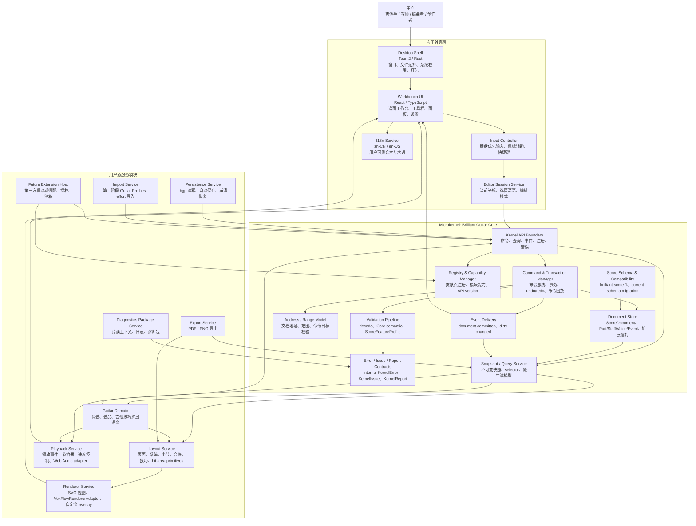
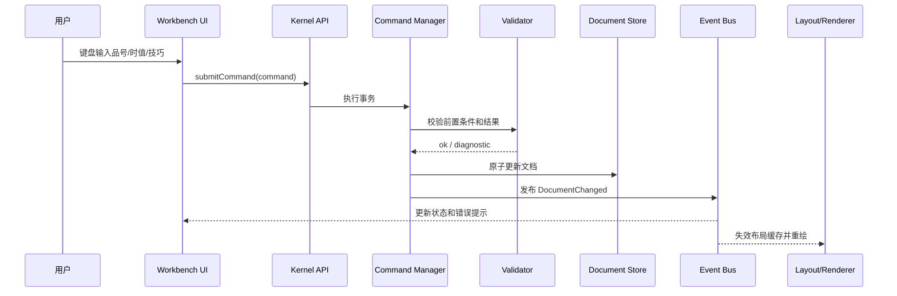
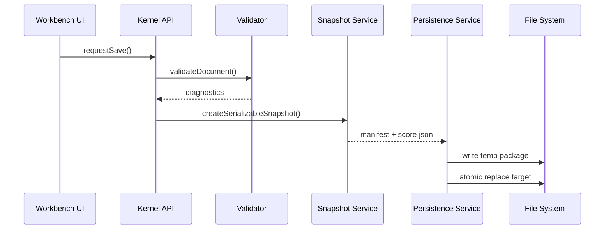
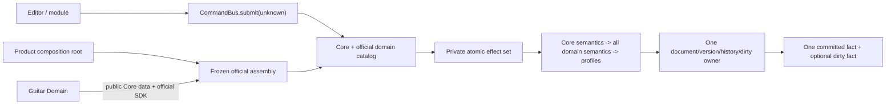

# 微内核架构图与模块职责

> **当前 Core 状态（2026-07-26）：** K1-1～K1-6 已验收；K1-6 测试基线 `355512aba4a8057d2d75aa665d74df49cdd2e23c` 在审查基线 `989c1f7a4056b14d3d59918c9b96874ad71591a8` 通过独立验收，8/8 聚焦、169/169 完整测试通过。Pure Core Kernel V1 已正式关闭；第三方模块章节仍是后续路线图并需独立批准。

## 架构结论

`Brilliant Guitar` 采用参照操作系统微内核思想的软件架构。核心原则是: 内核只保留最关键、最稳定、最需要一致性的能力；其它功能作为用户态服务模块围绕内核工作。

这个选择允许我们牺牲少量直接调用性能，换取更强的架构稳定性、可测试性、可维护性和扩展性。对于打谱软件来说，这是合理取舍: 谱面文件、编辑历史、插件 API、导入导出和未来长期兼容比极限性能更重要。

## 微内核功能复审结论

向 Linux 的核心思想看齐时，要抓住的是“内核保留最关键机制，外部模块承接可替换能力”。严格说 Linux 本身不是微内核，而是模块化单体内核；但它给本项目的启发很清楚: 内核要掌握事实、边界、调度入口、权限和稳定 ABI，驱动、文件系统、用户态服务和业务策略尽量放到外部模块。

因此本项目微内核不应该变成一个“万能业务层”。复审后，微内核只保留 9 类核心机制，其它功能移到用户态服务模块。

## 内核总规划优先级

Core Kernel V1 仍用 9 类机制整理路线图，并已按 K1-1 至 K1-6 分块完成规划、实施和独立评审。Pure Core Kernel V1 已关闭；Guitar Domain、物理文件合同和第三方插件平台仍有各自门禁。注册表 handler 运行时注销、第三方插件运行中启停、热插拔、权限 UI 等生命周期治理不进入已验收内核；未来插件平台也不得反向要求已完成分块预建执行基础设施。

内核总规划按以下 9 类机制收敛:

| 序号 | 内核机制 | 解决的问题 | MVP 只保留 |
| --- | --- | --- | --- |
| 1 | 谱面核心对象模型 | 定义唯一谱面事实 | `ScoreDocument`、Part/Staff/Voice/Event、Fraction/NoteValue、WrittenPitch、ExtensionBlock |
| 2 | 命令系统调用边界 | 统一写入口 | 语义命令、payload schema、内部 delta 不外露 |
| 3 | 事务、历史和一致性边界 | 保证写入可回滚可回放 | 细粒度 undo/redo、dirty state、command replay |
| 4 | 文档地址和范围模型 | 统一命令目标语言 | 稳定 ID、`ScoreAddress`、`ScorePoint`、`ScoreRange` |
| 5 | 验证边界 | 防止文档被写坏并区分产品支持面 | decode、Core semantic validation、ScoreFeatureProfile；吉他语义由 Guitar Domain 验证 |
| 6 | 谱面语义契约和迁移入口 | 保护长期文件资产 | `brilliant-score-1` schema/codec、current-schema 内存兼容入口、`MigrationReport`；物理 `.bgp`/manifest/IO/旧版本步骤后置 |
| 7 | 快照、事件和模块通信协议 | 让外部模块低耦合协作 | 只读 snapshot/selector、提交后事件、command-only write |
| 8 | 注册表与能力边界 | 管理贡献点和模块权限 | registry、capability、module identity、静态可信启动清单 |
| 9 | 错误、Diagnostic 和 Report 契约 | 统一失败表达和定位 | 内部 `KernelError`、公开 `KernelIssue`、`KernelReport<"validation" | "migration">` |

后置到内核总规划完成后再讨论:

- 启动前第三方插件安装、移除、启用和禁用配置如何由未来插件平台或 Extension Host 管理。
- 插件配置变更后的重启提示、兼容性报告和降级策略。
- 第三方插件隔离恢复和异常降级。
- 权限 UI、插件市场、签名、审核和插件生命周期治理。

明确不作为目标:

- 注册表 handler 运行时注销或卸载。
- 系统级模块运行时禁用。
- 第三方插件运行中启用、停用、卸载或热插拔。

### 内核保留 1: 谱面核心对象模型

微内核保留最小 `ScoreDocument` 核心语义。

它定义:

- `ScoreDocument = metadata + measureDefinitions + parts + extensions` 与 Part/Staff/Voice/Event/Note 所有权结构。
- 规范化 `Fraction + NoteValue` 的精确音乐时间；事件位置、tick、毫秒和布局时间全部派生。
- WrittenPitch 与 Part transposition；SoundingPitch 确定性派生。
- score/part-owned `ExtensionBlock` 信封与未知 JsonValue 语义保真；Core 不解释 Guitar payload。
- 文档元数据、全谱小节顺序、meter 与 tempo 等跨领域事实。

标准 6 弦调弦、弦号、品号、指法位置和吉他技巧由后续 Guitar Domain 在 Part-owned extension 中定义，不是 Core 字段或 K1-1 registry contribution。

不放入内核:

- 布局偏好。
- UI 展开/折叠状态。
- 渲染缓存。
- 播放光标。
- PDF 页面设置。
- Guitar Pro 专用解析中间结构。

### 内核保留 2: 命令系统调用边界

微内核提供唯一写入入口，类似操作系统 syscall。

所有修改必须通过语义命令。Core 命令表达“要做什么”，例如输入 note/rest、设置 WrittenPitch 或 NoteValue；Guitar Domain 后续提供弦品和技巧领域命令。patch/delta 表达“文档字段怎么变”，只能由内核内部生成和消费。该命令集合必须在 K1-2 基于 `brilliant-score-1` 重新设计。

对外允许的典型语义命令:

- `createScore`
- `insertNote`
- `setNotePitch`
- `setDuration`
- `addTechnique`
- `deleteRange`
- `undo`
- `redo`

对外禁止的 patch 类命令:

- `patchDocument`
- `replaceJsonPath`
- `setField`
- `spliceArray`
- `runScript`
- 任意字段路径或脚本式写入。

内核保证:

- 命令输入有 schema。
- 命令有前置条件。
- 命令执行是事务。
- 失败可以 rollback。
- 语义命令可以被编译为内部 delta。
- 命令可以进入 undo/redo。
- 命令可以被回放测试。

不放入内核:

- 快捷键映射。
- 菜单项。
- 命令面板搜索。
- 插件 UI 入口。

### 内核保留 3: 事务、历史和一致性边界

微内核负责所有文档写入的事务语义。

它负责:

- transaction begin / commit / rollback。
- undo stack。
- redo stack。
- dirty state。
- command replay log。
- 批量命令的原子提交。
- MVP 细粒度历史: 每个成功可撤销语义命令默认生成一个 `HistoryEntry`，`undo` 和 `redo` 一次只移动一个历史条目。
- MVP 不做复杂历史合并、时间窗口合并或跨命令智能压缩；后续如需合并，必须通过显式 `historyMergePolicy` 和测试定义。

为什么必须在内核:

- UI、导入器、模板、内部模块、未来插件都必须共享同一套历史和回滚语义。

### 内核保留 4: 文档地址和范围模型

复审后，活动光标不应该完整放进内核。内核只保留文档地址和范围模型。

内核定义:

- `EntityId`
- `ScoreAddress`
- `ScorePoint`
- `ScoreRange`
- `CommandTarget`

内核负责:

- 校验命令目标地址是否存在。
- 校验范围是否可编辑。
- 让命令、导出、验证、插件都使用同一套地址语言。

移出内核:

- 当前 UI 光标。
- 当前选区高亮。
- 鼠标拖选状态。
- 多选交互状态。

这些属于 `Editor Session Service`，它可以把 UI 当前光标转换成内核命令目标。

### 内核保留 5: 硬一致性验证

微内核只保留“破坏文档正确性就不能通过”的硬验证。硬一致性验证不是音乐质量判断，也不是可演奏性分析；它只回答一个问题: 当前 `ScoreDocument` 是否仍然结构合法、引用完整、可保存、可迁移、可回放，并且能被外部渲染、播放、导入/导出模块安全消费。

内核验证:

- schema 合法。
- 引用地址存在。
- WrittenPitch、transposition、Fraction/NoteValue、measure coverage、Staff/Voice/Event 引用与 ExtensionBlock 信封合法。
- 小节序列起点和精确时值总量不越界。
- Core semantic validity 与 `ScoreFeatureProfile` 支持面分别报告。
- 调弦、弦品和吉他技巧 payload 由 Guitar Domain codec/validator 负责。

移出内核:

- MVP 产品范围策略，例如是否显示 unsupported。
- 可演奏性分析。
- 指法建议。
- 教学提示。
- 风格检查。
- 导入兼容性评分。

这些软一致性/分析类能力第一阶段不实现，也不作为 MVP 闭环依赖。后续如果有明确产品价值，可以作为外部 `Analysis Service`、`Teaching Service` 或 UI 能力重新立项，并通过注册表读取内核 diagnostic。

### 内核保留 6: 谱面语义契约和迁移入口

当前 Core 不负责真实文件 IO，也尚未定义物理 `.bgp` 包。已实现的边界是内存中的谱面语义与兼容入口。

当前 Core 负责:

- K1-1 的 `brilliant-score-1` `score.json` 语义 schema、strict decode 和 encode。
- K1-5 的 `migrateScoreDocument(unknown)` current-schema compatibility：只返回 `not-required` 或 `rejected`，并生成深冻结 validation/migration `KernelReport`。
- 当前没有公开 `migrated` 分支，真实旧版本 step table 保持私有且为空。
- K1 不定义插件私有数据命名空间、模块私有数据持久化位置或 extension payload 语义；这些内容后续按模块单独规划。

未来 File Contract/Persistence 阶段再定义物理 `.bgp` zip、`manifest.json`、包一致性、文件 IO、兼容矩阵和真实旧版本 migration step，不得把这些未来合同写成 K1-5 已实现能力。

移出内核:

- 打开文件对话框。
- zip 包读写。
- 临时文件和原子替换。
- 自动保存路径。
- 崩溃恢复扫描。

这些属于 `Persistence Service`。

### 内核保留 7: 快照、事件和模块通信协议

微内核必须像操作系统内核提供 IPC/通知机制一样，为模块提供稳定通信协议。

内核提供:

- 只读 `DocumentSnapshot`。
- 受控 selector。
- `CommandBus.subscribe()` 订阅提交后事实；发布器保持私有。
- `core.document.committed`。
- `core.session.dirty-state-changed`。

K1-3 不提供 load/history/diagnostics/registry/migration 事件；K1-4 不新增 Registry event，K1-5 也不新增 issue/report/migration event。初始化调用方通过显式 API 获取结果，外部模块不得伪造 Core 事件。

移出内核:

- layout 专用派生模型。
- playback 专用事件表。
- PDF/PNG 专用页面模型。
- VexFlow 专用对象。
- UI 当前光标。
- 选区高亮。
- 鼠标拖拽状态。
- 播放光标 tick。

关键约束:

- Snapshot 和 selector 只读，不能泄露可变 `ScoreDocument`。
- Event 描述已经 commit 的事实，不是命令请求。
- 失败或 rollback 命令不得发布文档变更事件。
- Event payload 不得包含内部 delta operation、SVG/VexFlow 对象、Web Audio 节点、React 组件或 Tauri 文件对象。
- 事件处理器异常不得回滚已提交事务。
- 事件分发期间不得重入提交命令。

这些由对应服务模块从快照派生。

### 内核保留 8: 内核注册表与能力边界

微内核在 K1-4 只负责官方模块的启动期静态 Registry、能力检查和 gateway 委托。

内核负责:

- 一次性严格解码完整 `KernelStartupModuleManifest`，隔离验证后原子返回 frozen ready `KernelRegistry`。
- 通过两个 compiled entry 绑定现有六个 command 与六个 K1-3 selector adapter；贡献 kind 固定为 `command | selector`。
- 独立校验 module origin/runtime/trust/API version 与七个互不蕴含的 capability。
- 为 manifest-declared consumer 创建 capability-scoped gateway，授权后委托既有 CommandBus/selector/read/subscribe。
- 提供确定排序、深冻结且隐私白名单化的 Registry summary。
- 收口 startup/access 异常并保证失败零状态变化。
- 阻止模块拿到可变文档或第二条写入路径。
- ready 后不变更 Registry，不维护 runtime version，不发布 Registry event。

移出内核:

- 第三方插件发现。
- 插件 manifest 文件读取。
- 插件沙箱。
- 插件市场。
- 插件 UI 面板生命周期。
- 插件签名和审核。
- 插件权限 UI。
- hard validator、technique、真实旧版本 migration step、import/export descriptor、template、Guitar Domain 和未来 plugin report contribution。

### 内核保留 9: 错误、Diagnostic 和 Report 契约

微内核负责结构化失败表达和可定位问题外壳，但不负责完整日志产品或诊断包上传。

已验收 K1-5 合同负责:

- 内部封闭 `KernelError` family；错误类不进入公共 API。
- 公开深冻结、纯数据的 `KernelIssue`、`KernelIssueLocation`、`KernelIssueSource` 和 `KernelReport`/summary/counts。
- 把 K1-1～K1-4 已验收 failure/diagnostic 无损映射为 issue，并以编译期穷尽门禁防止新增 code 漏映射。
- validation report 与 current-schema `MigrationReport`；report 状态和计数只能由 issues 推导。
- 通过批准 details 白名单、i18n `messageKey` 和异常隔离保护隐私边界。

`ImportReport`、`ExportReport`、recovery 专属报告、plugin report ingress 和远程诊断属于未来真实消费者所在阶段，不是当前公共合同。
- 确保 report 默认不包含用户谱面正文、访问令牌、本机隐私路径或第三方密钥。

移出内核:

- 诊断包打包。
- 诊断包上传。
- 远程错误上报。
- 崩溃转储采集。
- 完整日志产品。
- 隐私脱敏策略 UI。

第三方插件启动期发现、manifest、沙箱、市场、签名、审核和权限 UI 属于未来插件平台或 `Extension Host`；诊断包打包、上传、远程上报和隐私过滤产品化属于后续 `Diagnostics Package Service`。

## 从微内核移出的功能

复审后，以下功能明确不属于微内核:

- `Editor Session Service`: 当前光标、选区高亮、鼠标拖选、编辑模式。
- `Guitar Domain`: Part-owned GuitarExtension 的调弦、弦品映射、技巧 payload、参数/引用/互斥验证，以及显示与播放语义。
- `Layout Service`: 页面、系统、小节、hit area、布局缓存。
- `Renderer Service`: SVG、VexFlow、overlay、截图渲染。
- `Playback Service`: 播放事件编译、Web Audio、节拍器、播放光标。
- `Persistence Service`: zip 读写、自动保存、崩溃恢复、文件系统路径。
- `Export Service`: PDF/PNG 生成、页面尺寸、字体嵌入和文件输出。
- `Import Service`: Guitar Pro 解析、能力映射、降级报告细节。
- `Extension Host`: 未来第三方插件启动期发现、运行时、沙箱、manifest 读取、权限 UI 和统一注册协议映射。
- `Analysis Service`: 可演奏性分析、指法建议、教学提示。第一阶段不实现，仅作为后续候选外部服务。
- `Diagnostics Package Service`: 日志收集、诊断包生成和隐私过滤。

## 内核质量约束

“可测试核心”不是一个运行时功能，而是微内核必须满足的工程质量约束。

内核必须能在没有 UI、没有 Tauri、没有 VexFlow、没有 Web Audio 的环境下测试:

- fixture 谱面验证。
- 命令回放测试。
- undo/redo 测试。
- schema round-trip 测试。
- migration 测试。
- unsupported feature 测试。

Pure Core Kernel V1 是第一实现里程碑。它只交付内核机制和测试，不交付桌面壳、React UI、VexFlow/SVG 渲染、Web Audio 播放、PDF/PNG 真实导出、Guitar Pro 导入、Tauri 文件系统或第三方插件运行时。后续用户态服务模块必须在该里程碑验收通过后再进入实现。

## 总体架构图

## 微内核边界

微内核不是“什么都不做的薄壳”。它必须掌握会影响长期一致性的能力:

- 文档真相: 谱面数据的唯一事实来源。
- 写入入口: 所有编辑都通过命令事务。
- 一致性检查: 所有写入、打开、保存、导入都经过验证。
- 版本契约: 当前为 `brilliant-score-1` schema/current-schema compatibility；物理 `.bgp`、manifest、IO、兼容矩阵和旧版本迁移后置。
- 协作协议: query、snapshot、event、registry、capability、report。
- 可测试核心: 无 UI 环境下可以运行 fixture、命令回放、schema round-trip。

微内核不包含:

- React 组件和 UI 状态。
- Tauri 文件选择、窗口系统和打包逻辑。
- VexFlow 对象、SVG DOM、Canvas/WebGL。
- Web Audio 节点或真实音色实现。
- PDF/PNG 具体生成库。
- Guitar Pro 解析器。
- 第三方插件运行时和沙箱。

## 模块职责

### 1. Desktop Shell

作用: 把产品运行在 Windows 桌面上。

负责:

- Tauri 窗口、菜单、文件选择器。
- 本地文件系统权限和路径访问。
- 应用配置、崩溃诊断、打包发布。
- 未来自动更新和系统集成。

禁止:

- 不保存谱面真相。
- 不实现音乐规则。
- 不绕过内核直接读写 `.bgp` 语义。

### 2. Workbench UI

作用: 给用户提供高效的专业打谱工作台。

负责:

- 六线谱/五线谱编辑界面。
- 工具栏、属性面板、命令面板、设置。
- 快捷键展示、状态栏、错误提示。
- 把用户动作转换成内核命令。

禁止:

- 不直接修改 `ScoreDocument`。
- 不从 VexFlow 或 SVG 反推音乐语义。
- 不把组件状态当成文档状态。

### 3. Input Controller

作用: 把键盘优先输入变成稳定、可测试的命令。

负责:

- 时值键、数字品号输入、方向键移动。
- 技巧快捷键、删除、撤销、重做。
- 鼠标辅助定位和选区。

MVP 范围:

- 支持 4 小节 riff 的单音、休止、移动和删除；slide、bend、vibrato 等首批技巧输入在 Guitar Domain 契约确认后接入。
- MIDI、虚拟指板、自由文本谱解析后置。

### 4. Core Kernel API Boundary

作用: 所有模块进入内核的统一入口，类似微内核的系统调用边界。

负责:

- 接收命令。
- 提供 query 和 snapshot。
- 提供事件订阅。
- 提供注册表和 capability 检查。
- 返回结构化报告和错误。

禁止:

- 不允许模块直接拿到可变内部对象。
- 不允许绕过权限、验证和事务。

### 5. Command & Transaction Manager

作用: 保证所有编辑行为可验证、可撤销、可回放。

负责:

- 命令总线。
- 语义命令注册和 payload schema。
- 内部 delta 生成和应用。
- 事务执行。
- undo/redo。
- 命令回放测试。
- 脏状态判断。

典型命令:

- `createScore`
- `insertNote`
- `setNotePitch`
- `setDuration`
- `addTechnique`
- `deleteSelection`
- `undo`
- `redo`

禁止:

- 不暴露任意 patch 写入 API。
- 不允许 UI、插件或导入器提交 JSON path、字段替换或数组 splice。
- 不以内部字段变化作为用户可见 undo/redo 文案。

### 6. Document Store

作用: 保存谱面的唯一事实来源。

负责:

- `ScoreDocument`。
- `metadata + measureDefinitions + parts + extensions`。
- Part/Staff/Voice/Event/Note、Fraction/NoteValue 与 WrittenPitch/transposition。
- 标题、作者、tempo、meter 和扩展信封。

MVP 限制:

- 当前 K1 profile 支持一个 Part、一个 Staff、每小节一个 Voice。
- 每个 Event 是休止或单 Note；通用 schema 中合法和弦由 profile 报告 unsupported。
- 当前 profile 不支持弱起、非 4/4、附点、连音比例或复杂理论标注。

### 7. Editor Session Service

作用: 在 Core Kernel 外维护“用户当前在谱面哪里编辑”的会话状态，并把光标、选区和输入焦点解析成内核可接受的语义命令或命令目标。

负责:

- 当前小节、beat、弦、音符槽位等谱面光标状态。
- 当前选区、高亮、鼠标拖选和编辑模式。
- 把临时光标/选区解析为 `ScoreAddress`、`ScorePoint`、`ScoreRange`、`CommandTarget` 或语义命令 payload。
- 调用内核已注册命令，并让真正修改谱面的操作进入事务、验证、undo/redo 和事件链路。

价值:

- Core Kernel 不保存 UI 当前光标、当前选区、鼠标拖拽、编辑模式或播放光标。
- 命令回放回放的是语义命令，不回放纯 UI 光标移动。
- 插件未来如需基于选区工作，也只能通过外部 facade/session context 获得已解析目标，再提交已注册语义命令。

Core Kernel 只负责:

- 定义 `EntityId`、`ScoreAddress`、`ScorePoint`、`ScoreRange` 和 `CommandTarget`。
- 校验命令目标是否合法。
- 接收外部模块提交的已注册语义命令。
- 保护 `ScoreDocument` 事务一致性。

禁止:

- 把当前光标、当前选区、高亮、鼠标拖拽或编辑模式写入 Core Kernel 状态。
- 把光标移动、选区高亮或鼠标拖选发布为 Core Kernel 文档事件。
- 让 UI、插件或导入器绕过命令注册表直接修改 `ScoreDocument`。

### 8. Hard Validation

作用: 保护谱面一致性和用户文件安全。

负责:

- `brilliant-score-1` schema 验证；物理 `.bgp` 包验证后置。
- MVP 能力范围验证。
- unsupported 能力识别。
- 验证失败目标收集，例如 `ScoreAddress` 或 `ScoreRange`。
- 产出 `ValidationResult` / `ValidationReport` 所需的 issue 数据。

边界:

- Hard Validation 只判断文档是否结构合法、引用完整、可保存、可迁移、可回放。
- Hard Validation 不拥有 `KernelError`、`KernelIssue` 或 `KernelReport` 的结构定义；K1-1 `Diagnostic`/`ValidationReport` 合同保持不变。
- K1-5 adapter 负责把既有 diagnostics 转换成公开 issue/report；用户可见错误文本、severity、messageKey、details 白名单和隐私边界由 `Error / Diagnostic / Report Contracts` 定义。

示例:

- Event 中多个 note（合法和弦）: 当前 profile 返回 `unsupported.chord`。
- 7 弦吉他: unsupported in MVP。
- 非 4/4 拍号: unsupported in MVP。
- 非法 WrittenPitch、Fraction/NoteValue、measure coverage 或 Staff/Voice/Event 引用: Core semantic diagnostic。
- 非法调弦、弦品或吉他技巧 payload: Guitar Domain diagnostic。

### 9. Schema & Migration Contract

作用: 先保证 `ScoreDocument` 的当前 schema 输入可严格判定、可验证和可报告，再由后续物理文件阶段扩展长期文件兼容。

当前已实现:

- K1-1 `brilliant-score-1` `score.json` schema/codec 与 schema version。
- K1-5 `migrateScoreDocument(unknown)` 的 current-schema pass-through/rejection、未知 ExtensionBlock 保真和 validation/migration report。
- 无真实旧版本 migration step，也不暴露虚构的 `migrated` 分支。

后续 File Contract/Persistence 阶段负责 `manifest.json`、物理 `.bgp` zip、文件 IO、兼容矩阵和真实旧版本迁移。任何破坏性变更届时必须有迁移策略、fixture、测试和发布说明。

### 10. Snapshot / Query Service

作用: 给外围模块提供只读视图。

负责:

- `DocumentSnapshot`，身份仅为 `documentId`、`schemaVersion`、`documentVersion`。
- `CommandBus.read()` 原子返回 snapshot、history depths 与 dirty。
- metadata/entity/ownership/range/history/dirty 六个纯 selector。
- 全局 Measure、Part Measure、Voice Event 三类分层范围。
- `markPersisted` 精确保存点合同；实际 `.bgp` 序列化和 IO 属于 Persistence。

使用方:

- Layout。
- Renderer。
- Playback。
- Export。
- Analysis。
- Plugin。

禁止:

- 返回可变内部对象。
- 把 React、SVG、VexFlow、Web Audio、Tauri 文件句柄或 UI 会话状态放进 snapshot。
- 通过 selector 修改文档、历史、诊断、脏状态或注册表。

### 11. Event Delivery

作用: 让模块知道内核发生了什么，而不是直接耦合。

负责:

- K1-3 成功 submit/undo/redo 的 `core.document.committed`。
- K1-3 dirty 布尔变化时的 `core.session.dirty-state-changed`。
- 确定性 event sequence、稳定 ID/版本关联、订阅快照、handler 同步 throw/异步 rejection 隔离与同步写入重入拒绝。
- K1-4 Registry 与 K1-5 issue/report/migration 均不新增事件；这些 API 由调用方显式调用。文档初始加载由外部初始化调用方负责，不伪造 K1-3 commit 事件。

价值:

- UI 刷新、渲染缓存失效、播放事件重建、自动保存和诊断面板都可以订阅事件。
- 模块之间不需要互相直接调用。

禁止:

- 发布 UI 光标、选区高亮、鼠标拖拽、播放光标 tick、SVG DOM 或 Web Audio 节点事件。
- 用事件总线发送自定义写命令。
- 事件 payload 携带完整可变文档或内部 delta operation。
- 事件处理器异常影响已提交事务。

### 12. Registry & Capability Manager

作用: 管理官方内置模块对既有 command/selector 的启动期目录与调用权限。

负责:

- 原子创建 frozen Registry。
- 绑定现有六命令和六 selector adapter。
- 校验 module identity、API version 和七个 capability。
- 通过 gateway 委托既有 read/select/submit/undo/redo/subscribe。
- 返回最小、确定、隐私安全的 summary 与封闭失败。

MVP:

- 只接受 manifest-bound official trusted builtin/internal module。
- 不开放第三方代码执行。
- 不开放其他 contribution kind、runtime mutation、Registry version/event 或 module history attribution。

### 13. Error / Diagnostic / Report Contracts

作用: 统一内核失败表达、diagnostic 和操作报告。

已验收 K1-5 合同负责:

- 定义稳定 issue code，并穷尽映射 K1-1～K1-4 的已验收 failure/diagnostic。
- 内部使用封闭 `KernelError`；公开只返回深冻结 `KernelIssue` 和 validation/migration `KernelReport`。
- current-schema migration 只表达 `not-required` 或 `rejected`，不虚构旧版本步骤或成功迁移分支。
- 捕获 adapter/migration 边界异常并转换为隐私安全的结构化 issue。
- `ImportReport`、`ExportReport`、recovery 报告及第三方 report ingress 后置到对应真实模块。

MVP:

- 不做远程错误上报。
- 不做完整诊断包产品化。

### 14. Layout Service

作用: 把音乐语义变成可渲染布局。

负责:

- 页面、系统、小节布局。
- 六线谱与五线谱位置。
- 音符、休止、技巧、文本、hit area primitives。
- PDF/PNG 导出复用的布局结果。

禁止:

- 不修改谱面。
- 不依赖 SVG DOM 或 VexFlow 对象作为布局真相。

### 15. Renderer Service

作用: 把布局 primitives 画出来。

负责:

- SVG 渲染。
- `VexFlowRendererAdapter`。
- 自定义 SVG overlay。
- 选区、高亮、播放光标、编辑辅助。

边界:

- VexFlow 只是适配器内部实现。
- VexFlow 对象不得写进 `.bgp` 或内核。

### 16. Playback Service

作用: 做最基本播放校对。

负责:

- 从快照生成播放事件。
- 节拍器。
- 播放光标。
- 开始、暂停、继续、停止。
- 基础速度控制。

禁止:

- 不修改文档。
- 不把播放状态写进谱面语义。
- 不从 SVG 或 UI 状态反推音乐。

### 17. Persistence Service

作用: 把内核文档安全落盘。

负责:

- `.bgp` 读写。
- 自动保存。
- 崩溃恢复。
- 保存失败保护。
- round-trip 测试。

原则:

- 保存前验证。
- 打开后验证。
- 保存失败不能破坏原文件。

### 18. Export Service

作用: 生成用户可交付文件。

定位: 用户态服务模块，不属于 Core Kernel。

MVP 负责:

- PDF 导出。
- PNG 导出。

输入:

- 内核快照。
- 布局结果。
- locale。

输出:

- 未来经独立批准的 export report；必须复用 K1-5 `KernelIssue`/`KernelReport` 数据与隐私边界。

### 19. Import Service

作用: 把外部格式转换为内核可验证文档。

定位: 用户态服务模块，不属于 Core Kernel。

未来 File Contract/Persistence MVP:

- 只打开 `.bgp` 和自动保存恢复文件，不做外部格式导入；这不是 K1-5 已实现能力。

第二阶段:

- 只做 Guitar Pro best-effort 导入。
- 输出未来经独立批准的 import report；必须复用 K1-5 `KernelIssue`/`KernelReport` 数据与隐私边界。
- 不能绕过内核验证器。

### 20. Extension Host

作用: 未来 VS Code 式插件生态的启动期发现、授权、运行和隔离层，并把第三方模块映射进 Core Kernel 的统一注册协议。

MVP:

- Pure Core Kernel V1 不实现真实 Extension Host。
- K1-4 只实现静态 `KernelStartupModuleManifest`、私有 compiled registration binding、frozen Registry、七个 capability 与模块 gateway。
- K1-4 内部模块只能调用现有 command/selector/read/event adapter；不提供公开 register 或第三方代理。
- Pure Core Kernel V1 不定义插件私有数据命名空间或 round-trip 约束；未来模块私有数据存储在对应模块规划阶段单独设计。

后续:

- 第三方 TypeScript 插件沙箱。
- 权限声明。
- 启动前插件启用/禁用配置。
- 异常隔离。
- 第三方 `PluginManifest` 读取、校验、授权和 capability 分配。
- 第三方模块映射为 `KernelModuleIdentity + capability + contribution descriptor + handler`。

禁止:

- MVP 不执行第三方 TypeScript 插件运行时、编译产物、Lua 或 native 代码。
- 应用 ready 后不新增、卸载、启用、禁用或热插拔第三方插件。

### 21. Diagnostics Package Service

作用: 辅助长期维护和商业级质量。

负责:

- 收集错误上下文。
- 收集版本、平台、插件和文件状态。
- 生成用户可分享的诊断包。

边界:

- 不能收集用户谱面内容，除非用户明确选择附带。
- 诊断包也按不可信输出处理，避免泄露隐私。

## 核心数据流

### 编辑数据流

### 保存数据流

## 性能取舍与补偿策略

微内核会带来一些成本:

- 模块之间多一层 API 调用。
- 快照和事件会有额外对象分配。
- 渲染、播放、导出不能直接改内部对象。
- 一些缓存需要根据事件失效，而不是偷读可变状态。

补偿策略:

- 使用不可变数据和结构共享，避免整份谱面深拷贝。
- snapshot 支持按小节、track、range 增量读取。
- command 支持批处理和事务合并。
- layout 和 renderer 使用增量失效。
- playback 读取预编译播放事件。
- 性能热点可以局部下沉到 Rust 或 worker，但不能绕过内核契约。

## GD-0：官方领域事务集成（2026-07-28）

Pure Core Kernel V1 继续作为稳定兼容基线。GD-0 当前为 **USER PLAN APPROVED / DOCUMENTATION REVIEW CANDIDATE / INDEPENDENT ACCEPTANCE PENDING**；additive Core V1.1 seam 仍是待独立验收文档候选，而不是 accepted baseline 或生产授权。

固定边界：

- Core-only construction、六个 Core commands、K1-3 events 与 K1-4 Registry 行为保持不变。
- integrated construction 使用同一个 CommandBus 实现、history、replay、checkpoint/dirty 与事件序列；不存在第二套 Guitar runtime。
- static manifest 只选择 descriptor，compiled functions 由 composition root 直接绑定；ready catalog 无 runtime mutation。
- domain contribution 拥有 namespace、command/effect/issue/validator/profile policy，Core 只拥有机制且保持零 Guitar import。
- changed candidate 依次执行 Core semantic、全部 exactly schema-compatible installed-domain semantic、Core profile、全部 domain profile，再原子接纳状态；同一 contribution 在 compatible block 为 0 时 validator/classifier `0/0`，至少一个时每个 applicable pass 恰好 validate 1 次，并仅在全部 validator 成功后用同一 canonical compatible view classify 1 次；validation failure 为 `1/0`，read-only 写路径 operation-phase validator/classifier/write `0/0/0`，不兼容 block 零调用。缺失/不兼容 validator 明确产生 validation-incomplete 完整 facts，不能把仅 Core validation 表示为完整领域有效。
- 一个 domain command 可产生多个私有细粒度 effects，但只形成一个 history entry、一个 version increment 和一个 committed event。
- known official requirement 以有限精确列表逐 block 匹配 `ExtensionBlock.schemaVersion`；required domain missing、incompatible 或 future schema 时 integrated session lossless read-only + validation incomplete，禁止执行不兼容 handler，并原样保留数据；mixed gaps 在所有写路径选择 incompatible code 且返回全量 facts；unknown opaque extension 仍按 Core V1 保真并保持可写。
- integrated factory、bus/gateway result、write/validation availability 与 replay 使用 GD-0 候选固定的最小 public declarations；Layer A 编译 Markdown declarations，Layer B 直接导入真实 accepted Core 类型证明 `authorized/rejected`、Registry 实例 `createGateway`、全部 typed `select`、`summary`/`subscribe`、共用 bus/checkpoint/subscription 表面，private SDK/runtime 布局留给后续独立 Gate。
- public hostile `unknown` 边界统一 descriptor-first、no-getter、no-throw；error instances、handlers、effects、history 与 mutable catalog 均不公开。

执行采用 Core-first 独立 Gate：已归档 CVN-0/CVN-1 承接 guard 与 private spine；CVN-2 承接 SDK/frozen Assembly；CVN-6 承接 integrated runtime/validation/replay；CVN-5 承接 bounded batch；CVN-7 完成 Core VNext 总验收后，才重新规划 GD-1/GD-3/GD-4。旧 GD-2 generic Core seam 已被这些唯一 owner 完整吸收。当前 GD-0 只准备并验收文档合同，不修改 `src/**` 或 `test/**`，也不激活下游 Gate。

## 架构验收标准

- [ ] 任意模块不能直接修改 `ScoreDocument`。
- [ ] 所有写操作都能映射到命令事务。
- [ ] 渲染、播放、导出、分析和插件都只读快照或 selector。
- [ ] 未来 `.bgp` 打开、保存和真实迁移必须经过内核验证器；当前 K1-5 只覆盖纯内存 current-schema compatibility。
- [ ] VexFlow、Web Audio、PDF/PNG 具体实现可以替换，不影响 `.bgp` 和内核。
- [ ] 未知 opaque extension 缺失解释器时仍保真并可按 Core V1 编辑；若已知官方 exact-version requirement 的 contribution 缺失或 schema 不兼容，则必须 lossless read-only + validation incomplete，禁止不兼容 handler 与未经领域验证的编辑/保存写入。
- [ ] 第一条 4 小节 riff 闭环能作为长期回归测试运行。
