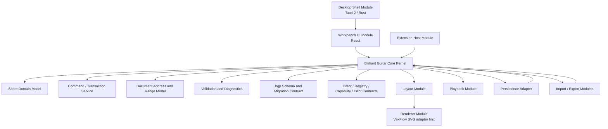

# 软件架构

## 状态

- 状态: 草案，已按当前需求重新设计。
- 作用: 定义后续实现的核心边界、模块协作方式、依赖方向和架构验收标准。
- 当前架构决策: 采用参照操作系统微内核思想的 Core Kernel + 用户态服务模块架构。内核负责谱面真相、命令事务、验证、版本化契约和模块协作接口；UI、渲染、播放、导入导出、桌面壳和未来插件都作为模块或适配器与内核协作。
- 详细架构图: `technical/microkernel-architecture.md`。
- 当前 Core 状态: K1-1～K1-6 已验收；K1-6 测试基线 `355512aba4a8057d2d75aa665d74df49cdd2e23c` 在审查基线 `989c1f7a4056b14d3d59918c9b96874ad71591a8` 通过独立验收，8/8 聚焦、169/169 完整测试通过。权威合同位于 `.trellis/spec/core-kernel/`；Pure Core Kernel V1 已正式关闭，后续分块仍需独立规划和批准。
- 当前阶段边界: 当前是 Pure Core Kernel 分块实施阶段。本文件只定义内核边界、模块协作原则和依赖方向；外部工程目录结构、monorepo 方案、`apps/desktop` 和 `packages/*` 拆分不属于当前阶段。
- 首个实现里程碑: Pure Core Kernel V1。先实现纯 TypeScript 内核和内核测试；桌面壳、UI、渲染、播放、持久化物理 IO、导出和导入均后置。
- 目录状态: 目录结构仍未确认，必须等工程脚手架阶段从已确认内核边界、测试边界、构建方式和发布方式反推，不得反过来限制当前内核规划。

## 需求反推的架构原则

本项目不是一次性毕业设计 demo，而是一款希望长期维护的开源打谱软件。因此架构必须先保护长期资产，再服务第一版界面。

- 谱面语义是核心资产: `.bgp` 文件、撤销重做、播放、导出、导入、插件和未来迁移都必须依赖同一份谱面语义。
- 谱面数据是唯一业务真相: 所有操作都必须服务 `ScoreDocument`；布局坐标、屏幕坐标、PDF/PNG 页面坐标、播放光标和渲染对象都只能从谱面快照派生，不能成为独立事实来源。
- 内核必须稳定且尽量小: 内核 API 比模块内部实现更保守，所有破坏性变更都要有版本、迁移和测试。
- 模块必须可替换: VexFlow、Web Audio、PDF/PNG 导出实现、Tauri 壳层和未来插件运行时都可以替换，不得成为谱面事实来源。
- 所有写操作必须事务化: UI、快捷键、导入器、模板、内部插件和未来第三方插件都只能通过命令事务修改文档。
- 对外写入必须语义化: 外部模块只能提交 `insertNote`、`setNotePitch`、`addTechnique` 这类语义命令；patch、JSON path、字段替换和数组操作只允许作为内核内部 delta。`setFret` 属于后续吉他谱模块命令或模块到核心命令的转换，不属于 Pure Core Kernel K1。
- 读操作必须快照化: 渲染、播放、导出、分析和插件读取稳定快照或 selector，不直接持有可变文档对象。
- 架构从第一天服务扩展性，但第三方代码执行后置: MVP 只做内部模块注册和 API 边界，不开放任意第三方插件运行。
- 可以接受微内核带来的少量性能成本: 优先换取架构稳定性、模块替换能力、插件边界和长期维护能力；性能补偿通过增量快照、结构共享、批量命令、缓存失效和局部性能模块解决。

## 架构总览



图中的箭头表示允许依赖或调用方向。外围模块可以调用内核公开接口，内核不能依赖 React、Tauri、VexFlow、Web Audio、浏览器 DOM 或具体 PDF/PNG 实现。

## Microkernel: Core Kernel

核心内核是本项目的“微内核”。它不是一个大而全的业务层，而是一组稳定、可测试、版本化的核心机制。所有容易变化、依赖外部库、依赖平台或需要独立演进的能力都应放到用户态服务模块。

### 内核负责

- 谱面真相管理: `ScoreDocument = schemaVersion + id + metadata + measureDefinitions + parts + extensions`，通用结构为 `Part -> Staff -> Voice -> Event -> Note`；吉他 tuning/technique 由后续 Part-owned extension 定义。
- 唯一写入入口: 所有编辑动作都通过语义命令系统进入，模块不得直接修改可变文档，也不得提交任意 patch。
- 编辑事务和历史: transaction、rollback、dirty state、undo/redo、命令回放和批量命令合并。MVP 采用细粒度历史模型，每个成功可撤销语义命令默认生成一个 `HistoryEntry`，复杂历史合并后置。
- 文档地址和范围模型: `ScoreAddress`、`ScorePoint`、`ScoreRange` 和命令目标校验；活动光标、选区高亮、鼠标拖选状态和临时 `ScoreCoordinate` 属于 `Editor Session Service` 或 `Layout Module`。
- 语义目标协议: 内核只承认从谱面数据解析出的语义目标；`ViewCoordinate`、`LayoutCoordinate`、SVG/VexFlow 坐标和 hit testing 由外部模块处理，外部模块只能把解析后的 `ScoreAddress | ScorePoint | ScoreRange` 或合法语义 payload 提交给命令系统。
- 验证和诊断: strict decode 检查输入形状，Core semantic validation 检查 ID、measure coverage、Part/Staff/Voice/Event 引用、Fraction/NoteValue、WrittenPitch/transposition 与 ExtensionBlock 信封，ScoreFeatureProfile 报告产品不支持项；调弦、弦品和技巧 payload 由后续 Guitar Domain 验证。软一致性、可演奏性分析、教学提示、风格检查和难度评分不进入 MVP。
- 文件兼容边界: K1-1 定义 `brilliant-score-1` 语义 codec；K1-5 提供纯内存 current-schema migration compatibility 与 `MigrationReport`。物理 `.bgp` zip 包、`manifest.json`、文件 IO、兼容矩阵和真实旧版本 migration step 仍属于后续 File Contract/Persistence 阶段。
- 查询和快照: 为渲染、播放、导出、分析和插件提供只读快照或 selector。
- 事件系统: K1-3 只提供 committed submit/undo/redo 与 dirty 布尔变化事实；K1-4 不新增 Registry event，K1-5 也只提供显式 issue/report/migration API，不新增 diagnostic/report/migration event。文档加载由外部初始化调用方负责；UI 光标、选区高亮、鼠标拖拽和播放光标 tick 属于外部服务事件，不属于 Core Kernel 事件。
- 注册表和能力管理: K1-4 只登记现有六命令和六 selector adapter，原子冻结，使用七个 capability 与 module gateway；validator、格式、模板和未来插件贡献点后置。
- 错误、诊断和报告模型: K1-5 使用内部封闭 `KernelError` family，并公开深冻结 `KernelIssue`、`KernelReport<"validation" | "migration">`、validation adapter 与 `MigrationReport`；K1-1 `Diagnostic`/`ValidationReport` 保持不变。`ImportReport`、`ExportReport` 和 recovery 专属报告仍由未来真实模块定义。
- 可测试核心: fixture 验证、命令回放、undo/redo、round-trip、迁移和 unsupported feature 测试。

### 内核不负责

- 不负责窗口、菜单、文件选择器、安装更新、系统权限和路径访问。
- 不负责 React 状态管理、组件布局、视觉样式和快捷键展示。
- 不负责 VexFlow 对象、SVG DOM、Canvas/WebGL、PDF/PNG 具体输出实现。
- 不负责屏幕坐标、布局坐标、SVG/VexFlow 坐标、hit testing、光标拖选和视图缩放滚动解析。
- 不负责 Web Audio 或真实音色合成实现。
- 不负责 Guitar Pro、MusicXML、MIDI 等外部格式的具体解析细节。
- 不负责第三方插件运行时、沙箱、市场、签名和安装。
- 不负责软一致性、可演奏性分析、指法建议、教学提示、风格检查或难度评分；这些能力第一阶段不实现。

### MVP 内核边界建议

第一阶段推荐内核至少包含:

- `ScoreDocument` 领域模型。
- `DocumentValidator` 和 diagnostic 类型。
- `CommandBus`、语义命令定义、内部 delta、事务、undo/redo、命令回放。
- 语义地址、范围模型和命令目标校验。
- `brilliant-score-1` schema/codec，以及 K1-5 已实现的纯内存 current-schema compatibility 入口；物理 `.bgp`/manifest/文件 IO 后置。
- K1-3 的封闭 snapshot/selectors、`CommandBus.subscribe()` 与两个事件类型；K1-4 Registry/Capability 与 K1-5 Issue/Report/migration 均已验收归档。
- K1-1 diagnostics 与 K1-5 `KernelIssue`、validation/migration `KernelReport` 基础；import/export/recovery 专属报告后置。

第一阶段推荐内核排除:

- React UI。
- VexFlow/SVG 渲染适配器。
- Web Audio 播放实现。
- PDF/PNG 具体导出实现。
- Guitar Pro 导入实现。
- 第三方插件运行时。
- Tauri 文件系统和窗口系统实现。

Pure Core Kernel V1 验收通过前，不进入 React UI、Tauri 桌面壳、VexFlow/SVG 渲染、Web Audio 播放、PDF/PNG 真实导出、Guitar Pro 导入或第三方插件运行时实现。

## 外围模块

### Desktop Shell Module

- 技术: Tauri 2 + Rust。
- 负责窗口、菜单、文件选择器、文件系统访问、应用配置、崩溃诊断、打包和未来自动更新。
- 通过受控命令或持久化适配器与内核协作。
- 不写谱面业务规则。

### Workbench UI Module

- 技术: TypeScript + React + Vite。
- 负责工作台布局、工具栏、属性面板、命令面板、设置、快捷键显示、i18n 文案和用户交互编排。
- 把用户动作转换为内核命令。
- 读取内核快照、布局结果和诊断。
- 不直接修改谱面文档对象。

### Layout Module

- 从内核快照生成页面、系统、小节、音符、技巧、文本和 hit area primitives。
- 布局 primitives 必须独立于 SVG DOM、VexFlow 对象、React 状态和浏览器事件。
- 布局坐标是从 `ScoreDocument` 快照派生的视图坐标，不得写回为谱面事实。
- 负责外部坐标解析: 把 `ViewCoordinate` 或 `LayoutCoordinate` 通过 hit testing 解析为可提交给内核的语义目标候选。
- 示例: 鼠标点击六线谱第 3 小节第 2 拍第 4 弦时，布局模块解析为对应吉他谱模块语义目标；后续吉他谱模块把弦/品输入转换为核心可接受的 `insertNote` 或 `setNotePitch` 命令。Pure Core Kernel K1 不保存弦号/品号。
- MVP 不单独拆 `Positioning Service`；坐标解析先由 `Layout Module + Editor Session Service` 协作承担。未来当多页、多轨、多声部、复杂选区或多渲染后端让定位逻辑膨胀时，再抽出独立 `Positioning Service`。
- PDF/PNG、SVG 视图和未来 Canvas/WebGL 必须复用同一布局语义。

### Renderer Module

- MVP 渲染目标为 SVG，首发适配器为 `VexFlowRendererAdapter`。
- VexFlow 只存在于渲染适配器内，不得进入内核、`.bgp`、命令系统、文件格式或唯一 hit testing 真相。
- 自定义 SVG overlay 用于 Core Loop 技巧、选区、播放光标和编辑辅助。

### Playback Module

- 从内核快照生成播放事件。
- MVP 支持开始、暂停、继续、停止、播放光标、节拍器和基础速度控制。
- 只读快照，不修改文档。
- 真实采样音色、音频轨、混音和音频导出后置。

### Persistence Adapter

- 负责把 `.bgp` 读写落到本地文件系统。
- 调用已实现的 `brilliant-score-1` codec、验证与 K1-5 纯内存 compatibility 入口。
- 未来物理 `.bgp` 包、`manifest.json`、zip 结构和真实旧版本 migration step 必须先形成独立文件合同；Persistence 负责 IO，不得改写 Core 的 `score.json` 语义或 K1-5 `MigrationReport`。
- 保存失败不能破坏原文件。
- 自动保存和崩溃恢复必须保持和正式保存同样的验证纪律。

### Import / Export Modules

- 未来导入器把外部格式转换为内核可验证模型，并输出经独立批准的 import report；该合同必须复用 K1-5 `KernelIssue`/`KernelReport` 基础。
- 未来导出器把内核快照和布局结果转换为外部格式，并输出经独立批准的 export report；该合同必须复用 K1-5 `KernelIssue`/`KernelReport` 基础。
- MVP 只要求 `.bgp` 打开保存和 PDF/PNG 导出。
- 第二阶段只规划 Guitar Pro 导入，其它外部导入后置。
- 导入导出不得绕过内核验证器。

### Extension Host Module

- MVP 只支持内部模块注册和 API 边界。
- 负责读取内部 manifest、校验 API version、注册贡献点、隔离异常。
- 第三方 TypeScript 插件运行时、编译产物执行、Lua 和 native 插件运行后置。
- 插件修改文档必须提交命令事务。

## 模块协作协议

模块之间不得共享可变内部对象，必须通过明确协议协作。详细契约见 `specs/SPEC-014-kernel-snapshot-events.md`。

- Command: 写操作入口，必须是可验证、可撤销、可回放的语义命令；patch 只能作为内核内部 delta。
- Query/Selector: `CommandBus.read()` 返回 snapshot、history depths、dirty；六个 selector 只读且以 `documentVersion` 关联。
- Snapshot: 渲染、播放、导出、分析和未来插件使用的深冻结视图，身份仅为 `documentId`、`schemaVersion`、`documentVersion`，无随机 ID/时间。
- Event: K1-3 只发布成功 submit/undo/redo 的 document-committed 与 dirty 布尔变化事实；失败、no-op 或 rollback 零事件。Registry/Migration/Report 事件不得提前混入。
- Registry: K1-4 仅有现有 command/selector adapter 的启动期目录；更广贡献点属于未来独立规划。
- Report: K1-5 当前只批准 validation/migration `KernelReport`；未来导入、导出和恢复模块必须复用 `KernelIssue`/`KernelReport` 基础，再定义各自有真实消费者的专属结果。
- Capability Manifest: trusted Host 为官方模块声明身份、七个 capability 与兼容 API 版本；模块不能自授权。

注册表和 capability 的详细契约见 `specs/SPEC-015-kernel-registry-capability.md`。错误、diagnostic 和 report 的详细契约见 `specs/SPEC-016-kernel-errors-diagnostics-reports.md`。K1-4 只负责 command/selector-only frozen Registry、能力 gateway 和本地结构化失败；第三方插件发现、安装、沙箱、签名、审核、插件市场、权限 UI 与新增 contribution kind 属于外部 `Extension Host` 或后续任务。

禁止事项:

- 通过事件总线发送自定义写命令。
- 在事件 payload 中携带可变 `ScoreDocument`、内部 delta operation、SVG/VexFlow 对象、Web Audio 节点、React 组件或 Tauri 文件对象。
- 在事件分发期间重入提交命令；需要后续写入的模块必须在当前事件分发结束后通过外部调度提交新命令。

## 目录结构候选

以下只是后续工程脚手架候选落地方式，不是当前 Core Kernel 规划事项，也不是实现约束。具体目录结构要等内核最小边界、模块协作方式、测试边界、构建方式和发布方式确认后再定。

```text
apps/
  desktop/               # Tauri 桌面壳和 React 工作台入口
packages/
  core-kernel/           # 谱面内核: domain, commands, validation, schema, events
  layout/                # 布局 primitives
  renderer-svg/          # SVG/VexFlow 渲染适配器
  playback/              # 播放事件和 Web Audio adapter
  persistence/           # .bgp 本地读写适配器
  import-export/         # 导入导出模块
  extension-api/         # manifest、权限、贡献点和插件 API 类型
  fixtures/              # 测试谱库和 golden files
```

## 架构验收标准

- [ ] 内核不依赖 React、Tauri、VexFlow、Web Audio、浏览器 DOM 或具体文件选择器。
- [ ] UI、导入器、模板、内部插件和未来第三方插件不能直接修改谱面对象。
- [ ] UI、导入器、模板、内部插件和未来第三方插件不能提交任意 patch 或字段路径写入命令。
- [ ] 布局坐标、屏幕坐标、SVG/VexFlow 坐标、PDF/PNG 页面坐标和播放光标不能成为谱面事实来源。
- [ ] 每个编辑动作都有命令定义、验证、undo/redo 和回放测试。
- [ ] 渲染、播放、导出和分析只读取快照或 selector。
- [ ] `brilliant-score-1` schema/codec 与纯内存 current-schema compatibility 从 Core 阶段进入测试；物理 `.bgp`/manifest/文件 IO 和真实旧版本 migration step 在对应后续阶段进入测试。
- [ ] 任意核心模块都能用 fixture 在无 UI 环境下测试。
- [ ] 缺失领域模块时，Core 仍能打开并验证通用谱面语义，且必须语义保真未知 score/part ExtensionBlock；Core 不解释领域 payload，也不承诺物理资源或字节级保真。
- [ ] 目录结构确认时必须能追溯到本文件定义的内核和模块边界。

## 横切质量属性

- 健壮性: 每个模块必须定义错误类型、失败恢复策略和用户可理解的错误消息。
- 安全性: 文件、导入内容、插件 manifest、资源和诊断包都按不可信输入处理。
- 高效性: 编辑命令、布局、渲染、播放和导出必须可度量，不能只凭主观流畅判断。
- 可靠性: 保存必须尽量原子化，自动保存和崩溃恢复不能破坏正式文件。
- 可维护性: 内核 API、模块边界、schema、迁移和兼容策略必须从第一阶段执行。
- 可测试性: 核心模块必须能在无 UI 环境下用 fixture、golden file 和命令回放测试。
- 可发布性: 桌面壳、文件关联、版本号、许可、诊断包和发布清单进入发布门禁。
- 可演进性: schema version、迁移器、兼容矩阵、变更日志和废弃策略必须从第一阶段执行。

详细门禁见 `technical/commercial-quality-gates.md`。
