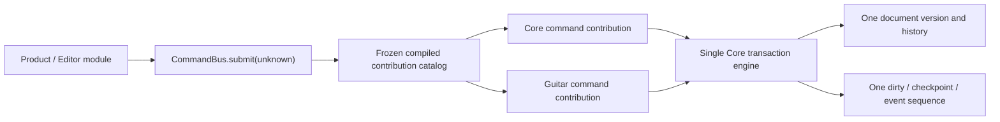

# GD-0 Guitar Domain / Core Transaction Integration Design

> **Status:** FINAL PLAN APPROVED 2026-07-28 / STAGE 0 DOCUMENTATION SYNC IN PROGRESS
> **Planning base:** `064dc2bffe26022bc58f0690986b09a0c6a257aa`
> **Production implementation:** not authorized by this draft

## 1. Architectural Intent

Brilliant Guitar uses a microkernel architecture. Core remains a small, domain-neutral transaction kernel; official notation domains attach through narrow, versioned, startup-frozen contracts.

The seam must support an atomic Guitar edit without making the kernel understand strings, frets, tuning, slide, bend, or vibrato. The same mechanism must remain usable by future official domains without adding domain imports or parallel transaction runtimes.



Dependency direction:

```text
Product composition root -> Core public contracts
Product composition root -> Guitar Domain
Guitar Domain            -> Core public contracts
Core                      -> no Guitar Domain import
```

## 2. Responsibility Boundary

### Kernel-owned mechanisms

- detached initial state and candidate isolation;
- immutable startup catalog binding;
- strict top-level command routing;
- atomic effect application and rollback;
- document version and history invariants;
- undo, redo, deterministic semantic-command replay;
- checkpoint and dirty-state transitions;
- ordered post-commit event publication;
- total synchronous/asynchronous exception isolation;
- public result detachment and privacy-safe failure conversion.

### Domain-contribution-owned policy

- versioned command IDs, target kinds, and payload schemas;
- strict domain envelope/payload decoding after catalog routing;
- domain target and ownership resolution;
- deterministic effect preparation through domain-neutral effect capabilities;
- GuitarExtension interpretation and domain semantic validation;
- product-profile support classification;
- stable domain diagnostics and affected-entity facts.

### Forbidden coupling

- Guitar-specific cases in Core command, mutation, event, or validation switches;
- Core imports from Guitar Domain;
- domain access to mutable kernel documents, history entries, or event sequence state;
- public JSON Patch, JSON paths, splice/index mutation, or whole-document replacement;
- a Guitar-only transaction engine, history, replay log, dirty state, or event bus;
- runtime contribution registration, unloading, or arbitrary third-party callbacks.

## 3. Decision Record

### GD0-D001 — One public command submission port

**Status:** approved by user on 2026-07-28
**Decision:** Core and installed official domain commands are submitted through the existing `CommandBus.submit(unknown)` and `KernelModuleGateway.submit(unknown)` public entry points.

The active session binds one immutable compiled contribution catalog. The port performs safe top-level routing, then delegates strict decoding and domain policy to the matching trusted compiled contribution. All accepted commands enter the same transaction engine.

**Why this fits the product:**

- preserves one write boundary for a modular microkernel application;
- keeps UI and product modules independent of kernel-internal routing;
- prevents each domain from creating its own façade and lifecycle semantics;
- makes one history, replay, dirty, and event contract the default rather than a convention;
- gives future official notation domains the same bounded seam.

**Rejected alternative:** a public `GuitarCommandGateway.submit()` façade. Although it would reduce the visible change to the existing Core submission type, it would multiply public write ports and encourage domain-specific lifecycle behavior.

**Compatibility constraint:** the exact result and TypeScript typing strategy must keep the six accepted Core commands behaviorally compatible. GD0-D002 below fixes the modular assessment shape while preserving that Core-only surface.

### GD0-D002 — Modular result, support, and error contract

**Status:** approved by user on 2026-07-28
**Decision:** use an extensible, domain-neutral result contract. Core does not enumerate Guitar error or support codes.

The public write method remains `submit(unknown)`, but its compile-time result is selected by the catalog-bound bus type:

- Core-only construction retains the existing `CommandResult` contract and runtime shape for the six Core commands.
- Integrated construction exposes a `KernelCommandResult` common envelope with the same status/version/history fields, Core support, and a deterministically ordered, deeply frozen module result collection.
- A Core-only command submitted through an integrated bus still returns the integrated envelope because installed validators and profiles may classify cross-domain invariants.

Illustrative domain-neutral shape; final names may follow repository naming during GD-2:

```typescript
interface ModuleCommandAssessment {
  readonly moduleId: string;
  readonly contributionId: string;
  readonly status: "supported" | "unsupported";
  readonly issues: readonly ModuleKernelIssue[];
}

interface KernelCommandAssessment {
  readonly core: ScoreSupportResult;
  readonly modules: readonly ModuleCommandAssessment[];
}

type KernelCommandResult =
  | {
      readonly status: "committed" | "no-op";
      readonly documentVersion: number;
      readonly assessment: KernelCommandAssessment;
      readonly undoDepth: number;
      readonly redoDepth: number;
    }
  | {
      readonly status: "rejected";
      readonly documentVersion: number;
      readonly failure: KernelCommandFailure;
      readonly undoDepth: number;
      readonly redoDepth: number;
    };
```

The integrated failure union contains only domain-neutral mechanism codes, for example contribution unavailable, contribution semantic rejection, contribution contract violation, and contribution internal failure. Domain-specific meaning is carried by frozen module issues whose source includes `moduleId` and `contributionId` and whose codes belong to that module's registered namespace.

The object-oriented construction model is:

```text
Error
└─ KernelErrorBase<Code>
   ├─ CoreOperationError<Code>
   ├─ KernelInfrastructureError<Code>
   └─ ModuleKernelErrorBase<ModuleId, Code>
      └─ GuitarDomainError<Code>
```

- Core V1.1 exports only the narrow base contract needed by trusted official modules.
- Guitar Domain derives its typed internal errors without requiring Core to import Guitar codes.
- Every error converts through `toIssue()` to detached, deeply frozen data.
- Public command APIs return result data and never expose or throw these instances.
- Module issue codes and message keys are namespace-qualified and validated when the contribution catalog is compiled.

**Compatibility strategy:** preserve the existing Core-only constructor/factory and `CommandResult`; introduce an additive catalog-bound integrated bus/factory using the same class and submit method rather than widening every Core-only caller to an open module union.

**Rejected alternatives:**

- adding every `guitar.*` code to Core-owned `CommandFailure`/`KernelIssueCode`, which couples Core releases to domain policy;
- collapsing all domain failures into `module.internal-error`, which loses actionable semantic diagnostics and support classification;
- returning live `Error` subclasses publicly, which leaks runtime behavior and undermines deterministic detached results.

### GD0-D003 — Complete installed-domain validation

**Status:** approved by user on 2026-07-28
**Decision:** after Core semantic validation succeeds, run every installed domain semantic validator in the deeply frozen catalog order for every changed candidate.

The authoritative lifecycle is:

| Path | Semantic validation | Support classification | State effect |
|---|---|---|---|
| Initial construction | Core, then all installed domains | Core, then all installed domains | Create only when semantic-valid |
| Changed submit | Core, then all installed domains | Core, then all installed domains | Commit once only after all phases finish |
| No-op submit | Current state is already invariant-valid | Core, then all installed domains | No version/history/redo/dirty/event change |
| Undo | Apply full inverse to candidate; Core, then all installed domains | Core, then all installed domains | Move history atomically |
| Redo | Apply full forward to candidate; Core, then all installed domains | Core, then all installed domains | Move history atomically |
| Replay | Same catalog and submit lifecycle | Same catalog order | Deterministic detached result |

Rules:

- Domain validators receive only a detached read view plus their versioned contribution context; they receive no mutable candidate reference.
- If Core semantics fail, domain validators are skipped because their precondition is a coherent Core score.
- If Core passes, all installed domain validators run and their returned semantic issues are collected in catalog order before rejection, so callers receive a complete deterministic report.
- A thrown/rejected validator is not a semantic diagnostic. It becomes a stable contribution-internal failure at that catalog position and the complete pre-operation state is retained.
- Support classifiers run only for a semantically valid state. Core profile classification runs first, followed by every installed domain profile in catalog order.
- `unsupported` is reportable and committable; `invalid` is a transaction rejection.
- Classification completes before the commit becomes externally visible. A classifier failure therefore leaves document, version, history, dirty state, and event sequence unchanged.
- Direct Core pitch edits are checked by Guitar validation whenever Guitar is installed, which prevents stale placement from surviving a generic pitch-only command.
- Optimization by declared invalidation triggers is deferred. A later optimization must prove result equivalence against the all-validator model and cannot change ordering or visible classifications.

**Rejected alternative:** trigger-selected validators. It could reduce work but introduces a second correctness contract for dependency declarations; a missed trigger could commit cross-domain inconsistency.

### GD0-D004 — One unified committed event per transaction

**Status:** approved by user on 2026-07-28
**Decision:** every committed submit/undo/redo produces one domain-neutral `core.document.committed` fact, regardless of how many Core-owned or domain-owned effects the transaction contains.

Integrated sessions use a domain-neutral identity equivalent to:

```typescript
interface KernelCommandIdentity {
  readonly commandId: string;
  readonly source:
    | { readonly kind: "core" }
    | {
        readonly kind: "module";
        readonly moduleId: string;
        readonly contributionId: string;
      };
}
```

The integrated committed event retains the accepted event version, event sequence, document ID/version, cause, and affected `ScoreAddress` facts, while replacing the closed `CoreCommandId` identity with the catalog-validated modular identity. Core-only sessions retain the existing `KernelEvent` runtime and compile-time shape; integrated sessions expose an additive modular event type.

Affected-fact rules:

- The command contribution returns detached affected-address facts as part of deterministic command preparation; event derivation does not reopen or reinterpret private domain payloads after commit.
- The kernel validates every fact against the previous or committed document as appropriate for insert/remove/undo/redo.
- The kernel canonicalizes, deduplicates, clones, and deeply freezes the complete address set before state becomes externally visible.
- A Guitar placement command reports at least the affected note and the Part that owns the mutated GuitarExtension.
- Unknown address kinds, duplicate-identity ambiguity, ownership mismatch, getter execution, contribution failure, or event-sequence overflow rejects the complete session transition with the stable integration failure and preserves the prior state.
- No-op and rejected commands publish no committed event.
- If dirty state changes, one `core.session.dirty-state-changed` event follows the committed event at the next sequence number.
- Handler exceptions remain post-commit isolated as established by K1-3; they neither roll back the commit nor interrupt later handlers.

**Rejected alternative:** separate Core and Guitar committed events. Multiple commit facts for one transaction would make subscribers reconstruct atomic grouping and would complicate sequence reservation, rollback, undo/redo, and replay equivalence.

### GD0-D005 — Lossless read-only degradation for a required missing domain

**Status:** approved by user on 2026-07-28
**Decision:** when a document contains a known official extension whose immutable compatibility declaration requires an unavailable contribution, create a detached read-only integrated session rather than allowing unvalidated writes or rejecting all access.

The composition root supplies a frozen, domain-neutral compatibility declaration equivalent to:

```typescript
interface ExtensionRuntimeRequirement {
  readonly namespace: string;
  readonly moduleId: string;
  readonly contributionId: string;
  readonly requiredForWrite: true;
}
```

The declaration is metadata; Core contains no Guitar namespace or module ID. Session construction compares document extension namespaces, compatibility requirements, and the compiled contribution catalog.

Read-only degraded behavior:

- decode, encode, snapshots, selectors, ownership/range reads, validation reports based on available contracts, and opaque extension round-trip remain available;
- write availability is exposed as detached data containing the stable missing module/contribution identities;
- submit, undo, and redo reject before command/effect processing with a domain-neutral required-contribution-unavailable failure and unchanged state;
- checkpoint marking remains available because it changes session bookkeeping rather than document content;
- replay with a missing required contribution rejects before the first write while returning a detached unchanged initial document;
- installing the contribution and reopening creates a normally validated writable session;
- the kernel never deletes, rewrites, guesses, or implicitly migrates the unavailable extension payload.

Unknown extension compatibility remains unchanged: an undeclared opaque namespace is preserved under Core V1 rules and does not automatically trigger read-only mode. This avoids converting existing forward-compatible documents into write-blocked documents. Official domains that require invariant enforcement must ship an immutable compatibility declaration even when their executable contribution is absent.

**Rejected alternatives:**

- allowing Core writes while the required validator is absent, which can create contradictory Core pitch and Guitar placement state;
- rejecting document opening entirely, which prevents inspection and lossless preservation during a missing/corrupt module installation.

## 4. Startup Composition Shape

The intended lifecycle is:

1. The product composition root selects trusted, version-compatible official contributions.
2. Core compiles and validates the contribution manifests once.
3. Duplicate IDs, unsupported contract versions, malformed manifests, invalid namespaces, or capability conflicts fail session construction with stable errors.
4. The compiled catalog and all nested records are deeply frozen.
5. `CommandBus`, replay, undo/redo validation, and the module gateway bind the same catalog identity for that session.
6. No registration, replacement, or removal occurs after session construction.

The catalog is configuration data plus statically linked official behavior. It is not a general plugin runtime and does not accept network code, scripts, or arbitrary late-bound handlers.

## 5. Unified Submission Flow

The stable integrated flow is:

1. Inspect the hostile `unknown` envelope descriptor-first without invoking getters.
2. Read the versioned command ID and resolve exactly one frozen contribution.
3. Strictly decode the complete command through that contribution; reject extra fields and malformed targets/payloads.
4. Resolve targets and prove ownership against a detached current state.
5. Prepare deterministic domain-neutral forward effect requests and affected-address facts.
6. Let the kernel validate each request, derive its inverse from the current candidate, and apply the complete forward effect set to one isolated candidate.
7. Run Core validation and every installed domain validator in the approved order.
8. Classify Core and domain product-profile support.
9. Commit once, increment the document version once, create one history entry, update dirty/checkpoint state, and publish one ordered post-commit event sequence.

Any failure before step 9 preserves the complete pre-submit state.

## 6. Product Decision Status

GD0-D001 through GD0-D005 are approved. Remaining design sections derive repository-answerable technical mechanics from those decisions and do not reopen product scope.

## 7. Public Integration Contracts

### 7.1 Core-only and integrated construction

`CommandBus.create(initialDocument)` and `replayCoreCommands()` retain their accepted Core V1 types and runtime behavior.

Core V1.1 adds an integrated construction path on the same class, conceptually:

```typescript
type IntegratedCommandBusCreationResult =
  | { readonly ok: true; readonly value: IntegratedCommandBus }
  | { readonly ok: false; readonly failure: KernelCommandBusCreationFailure };

CommandBus.createIntegrated(
  initialDocument: ScoreDocument,
  assembly: CompiledKernelAssembly,
): IntegratedCommandBusCreationResult;
```

`IntegratedCommandBus` is a catalog-bound view of the existing bus implementation. It exposes the same method names—`submit`, `undo`, `redo`, `read`, `markPersisted`, and `subscribe`—with integrated result/read/event types. It is not a second runtime, state object, or history owner.

The root API exposes application-facing integrated data contracts and construction. Official module authoring helpers live in a separate versioned module-SDK entry point so application consumers do not receive internal effect/error builders.

### 7.2 Command identity and routing

The catalog owns a unique mapping from command ID to one compiled definition:

```typescript
interface KernelCommandDescriptorV1 {
  readonly descriptorVersion: 1;
  readonly commandId: string;
  readonly commandVersion: 1;
  readonly source: KernelCommandIdentity["source"];
  readonly targetKind: ScoreEntityTarget["kind"];
  readonly requiredCapabilities: readonly KernelCapability[];
  readonly titleKey: string;
}
```

- IDs use the existing dotted lowercase namespace grammar and are globally unique within the assembly.
- The six existing `core.*` IDs remain unchanged.
- Guitar IDs use a domain namespace owned by the Guitar contribution.
- Top-level routing reads only exact data descriptors for `commandVersion` and `commandId`; accessors, Proxies, sparse arrays, extra fields, invalid prototypes, and cycles produce stable rejection without executing user code.
- Unknown ID and unsupported version remain distinct failures.
- The matched contribution strictly decodes the full target and payload from `unknown`; decoded commands and payloads are cloned and deeply frozen before preparation/history use.

### 7.3 Modular result and issue data

The integrated result uses the D002 assessment model. The stable additional mechanism failures are:

- `command.required-contribution-unavailable`;
- `command.contribution-semantic-invalid` with frozen module issues;
- `command.contribution-contract-violation` for malformed prepared effects/facts;
- `command.contribution-internal-error` for unexpected contribution exceptions or Promise-like returns from synchronous transaction hooks.

Existing Core failures keep their codes and facts. Domain-specific meaning stays inside namespace-qualified `ModuleKernelIssue` values. Ordering is Core issues first, then module assessments/issues in frozen catalog order and validator-return order.

The official module SDK exposes a narrow `ModuleKernelErrorBase` derived from the internal object-oriented error foundation. Domain subclasses may add only allowlisted detached code/source/location/details data and must convert through `toIssue()`. The application-facing Core root continues to omit runtime error classes and returns data-only results.

### 7.4 Write availability

Integrated reads add detached write availability:

```typescript
type KernelWriteAvailability =
  | { readonly status: "writable" }
  | {
      readonly status: "read-only";
      readonly reason: "required-contribution-unavailable";
      readonly missing: readonly {
        readonly namespace: string;
        readonly moduleId: string;
        readonly contributionId: string;
      }[];
    };
```

Missing entries are deduplicated and sorted by namespace/module/contribution. They contain no document payload, filesystem path, stack, or raw error.

## 8. Compiled Domain Contribution ABI

### 8.1 Assembly boundary

The product composition root imports statically linked official compiled entries and passes them beside the strict startup manifest. The manifest selects descriptors; it never carries functions. A compiled entry must match the selected official/system-trusted module identity and registration entry ID before binding.

The additive registration entry is `kernel.domain-commands.v1`. It reuses the accepted `command:register`, `command:execute`, `score:read`, and `event:subscribe` capabilities; GD-0 adds namespace ownership metadata rather than a generic document-mutation capability.

Conceptual compiled contribution:

```typescript
interface CompiledDomainCommandContributionV1 {
  readonly apiVersion: 1;
  readonly moduleId: string;
  readonly contributionId: string;
  readonly extensionNamespaces: readonly string[];
  readonly commands: readonly CompiledDomainCommandDefinitionV1[];
  readonly validate: DomainSemanticValidatorV1;
  readonly classify: DomainSupportClassifierV1;
  readonly effects: readonly CompiledModuleEffectDefinitionV1[];
}
```

The functions are direct, trusted, official code bindings supplied at startup, not values decoded from an untrusted manifest. They remain inside the compiled catalog and never appear in registry summaries, reads, events, reports, or public history.

### 8.2 Catalog compilation

Catalog construction is isolated and all-or-nothing. It validates:

- exact descriptor/manifest fields and API versions;
- official origin, allowed runtime, system trust, and required capabilities;
- unique module, contribution, command, effect-kind, and extension-namespace ownership;
- command ID namespace ownership and target kind;
- matching compiled handler/descriptor counts and identities;
- frozen profiles, compatibility requirements, and effect definitions;
- absence of runtime mutation APIs.

The successful catalog, nested arrays/records/profiles/descriptors, and compatibility declarations are deeply frozen. Construction failures expose only stable registry facts. Function closure purity is enforced through design review and deterministic/hostile-state tests; mutable global profiles are forbidden.

The integrated registry, bus, gateway, and replay runtime must share the same internal assembly identity. An integrated gateway cannot be paired with a Core-only bus or a bus created from another catalog; construction rejects with a stable assembly-mismatch failure. This identity is process-local invariant state, not a public/persisted/random catalog ID.

### 8.3 Domain reads

Decoder, preparation, validator, classifier, effect, and affected-fact code receive detached read-only inputs. They do not receive `CommandRuntimeState`, `KernelSessionState`, mutable `ScoreDocument`, history entries, subscribers, registry state, or the active `CommandBus`.

## 9. Atomic Effect-Set and History Design

### 9.1 Private effect algebra

Core V1.1 replaces the private single `CoreMutation` slot with a private nonempty `KernelEffectSet`. This type remains absent from every public root, event, result, report, snapshot, codec, and persisted format.

The initial effect algebra is deliberately narrow:

```typescript
type KernelEffect =
  | ReplaceWrittenPitchEffect
  | ExistingCoreEffect
  | ModuleExtensionEffectEnvelope;

interface ModuleExtensionEffectEnvelope {
  readonly effectVersion: 1;
  readonly moduleId: string;
  readonly contributionId: string;
  readonly namespace: string;
  readonly owner: ExtensionOwner;
  readonly effectKind: string;
  readonly payload: JsonObject;
}
```

- Existing Core commands compile to one-element effect sets.
- The first domain-to-Core request surface exposes only the Core-owned `WrittenPitch` replacement needed by Guitar placement; broader Core mutation requests require later approval.
- Module effects may address only an extension namespace owned by their compiled contribution and only the declared score/Part owner.
- Module effect payloads are strict versioned internal data, not JSON Patch or JSON path instructions.
- The module effect implementation transforms only its owned ExtensionBlock and returns a detached replacement; the kernel installs it into the isolated candidate while preserving every other block and subtree.

### 9.2 Inverse derivation

The contribution prepares forward requests only. For every accepted request, the kernel or owning compiled effect definition derives the inverse from the current candidate before forward application:

- Core effects derive inverse values by resolving the current stable entity.
- Module effects derive a fine-grained inverse payload from the current owned extension through the same compiled effect definition.
- Inverse effects are stored in reverse application order.
- No full-document before/after snapshot is stored.
- A Guitar placement history entry therefore holds one Core pitch delta plus one Guitar placement delta, not a complete score or generic extension patch.

Effect preparation rejects empty changed sets, duplicate/conflicting targets, wrong namespace owners, missing targets, unsafe IDs, malformed payloads, non-detached results, invalid inverses, and effect/application exceptions before visible commit.

### 9.3 Candidate application and no-op

Effects apply sequentially to one isolated candidate. Any failure discards the candidate. After all effects apply:

- if the candidate is deeply equal to current state, the result is no-op;
- no-op leaves version, history, redo, dirty, checkpoint, and events unchanged and returns current integrated support classification;
- otherwise the complete validation/classification/event-candidate pipeline runs before the state reference is adopted.

### 9.4 History entry

One committed semantic command creates one internal history entry containing:

- deterministic history sequence;
- cloned/frozen decoded semantic command;
- frozen command identity and contribution identity/version;
- nonempty forward effect set;
- inverse effect set in reverse application order;
- frozen affected-address facts sufficient for submit/undo/redo event derivation.

It contains no timestamp, random ID, whole-document snapshot, mutable handler, stack, file path, registry object, or public patch.

Undo and redo apply the full inverse/forward set to an isolated candidate, validate/classify all installed domains, reserve event facts, and only then move the history entry between stacks. Any effect, validation, classification, fact, or sequence failure returns `history.invariant-violation` with the entire previous state retained.

## 10. Validation, Classification, and Failure Boundary

Each contribution call has its own total sync/async exception boundary. Async return values are permitted only for post-commit event handlers; command decode, preparation, effects, validation, classification, and fact generation are synchronous pure functions so submit/undo/redo remain deterministic and atomic.

Changed-candidate order:

1. Core semantic validation.
2. Every installed domain semantic validator in catalog order; collect returned issues.
3. Reject when any semantic issue exists.
4. Core feature-profile classification.
5. Every installed domain profile classifier in catalog order.
6. Prepare and validate unified event facts and reserve event sequences.
7. Adopt document/version/history/read/event state once.
8. Publish the deeply frozen events; handler failures stay isolated post-commit.

The transaction remains invisible until step 7. Unsupported profile issues are warnings and do not block step 7. Invalid or thrown classifier results reject before step 7.

## 11. Replay Contract

`replayCoreCommands()` stays unchanged. Core V1.1 adds catalog-bound `replayKernelCommands(initialDocument, acceptedCommands, assembly)` or the equivalent integrated factory operation.

- It compiles/binds the same assembly contract used by live integrated construction.
- It replays decoded semantic commands only; internal effects, undo/redo session logs, events, timestamps, and history snapshots are not replay input.
- The same initial document, assembly, and accepted command sequence produce deeply equal final documents, result/status/version sequences, module assessments, and failure index.
- Results/final document are detached from the assembly and any live bus.
- A required missing contribution produces read-only availability and rejects before the first replayed write.
- Input commands and assembly/profile objects are cloned/frozen or safely read so later caller mutation cannot change results.

## 12. Event Fact Design

The command preparation result includes affected `ScoreAddress` facts rather than a callback that reinterprets the committed document. The kernel validates facts against the previous/committed candidates, applies canonical ordering/deduplication, and stores the frozen facts with history.

- Submit and redo use the forward fact set.
- Undo uses the same entity identities and cause `undo`; inserted/removed identities remain available from the stored semantic command/facts.
- Guitar placement includes `note` and owning `part`.
- One `core.document.committed` precedes an optional dirty-state event.
- Event building remains inside the atomic session-integration boundary established by K1-3.

## 13. Compatibility and Public Boundary

- Core-only construction remains available and installs only the six accepted Core built-ins.
- Existing Core command results, no-op behavior, version increments, history depth, replay results, public events, root exports, and ordering remain behaviorally equal.
- Integrated construction is additive and binds official domain contributions before the session begins.
- Persisted documents retain opaque extension preservation whether or not an interpreting contribution is installed.
- The application-facing root exports integrated factories/data contracts but omits compiled handlers, private effects, history entries, module effect payload decoders, mutable catalog objects, and error classes.
- The official module SDK is a separate reviewed entry point. It exposes only descriptor/building types, restricted effect requests, issue/error construction, and read-only contribution contexts required by official modules.
- Existing forbidden-dependency and public-boundary tests are extended rather than weakened.
- The Core V1.1 domain runtime seam is isolated in GD-2; CK1.1-0/CK1.1-1 own only their approved prerequisites. GD-2 must rerun K1-2, K1-3, K1-4, K1-5, K1-6, and qualification gates.

The Brilliant Guitar product composition root always uses integrated construction for product documents. The retained Core-only constructor is the compatible low-level Core API for generic Core consumers/tests; it is not the product path for a document whose official domain compatibility requirements are known.

## 14. Security, Privacy, and Determinism

- All public `unknown` inputs use descriptor-first, no-getter, no-throw decoding; the accepted P3 guard repair is a Core V1.1 prerequisite.
- No contribution can obtain the active bus, mutable candidate, registry internals, history, subscribers, filesystem, clock, randomness, network, or platform APIs through the ABI.
- Stable public failures contain only allowlisted module/contribution/namespace IDs, codes, locations, and JSON details.
- Profiles, descriptors, compatibility declarations, issues, assessments, results, events, reads, and replay output are detached and deeply frozen.
- Catalog order is explicit and deterministic; object enumeration order, registration timing, wall clock, random values, and handler identity never determine observable output.
- Unknown/non-target extension data is preserved byte-for-JSON-value through submit, reject, no-op, undo, redo, replay, read-only degradation, and codec round-trip.

## 15. Rollout and Rollback

GD-0 itself produces contract documents only. Downstream implementation is split so the Core seam and Guitar semantics remain independently reviewable:

1. Core V1.1 hostile-input guard prerequisite.
2. Core V1.1 official module-SDK contract foundation.
3. GD-1 GuitarExtension foundation and validators/profile without commands.
4. GD-2 Core V1.1 compiled contribution/effect/history/result/event/read-only seam.
5. GD-3 Guitar semantic commands using the approved seam.
6. GD-4 Core/Guitar integration and compatibility gate.

GD-0 produces contracts only. If a later Core V1.1 candidate violates accepted Core behavior, rollback removes the additive seam and integrated factory while retaining Core-only V1 behavior and persisted extension preservation. No persisted document migration may depend on an unaccepted seam candidate.
