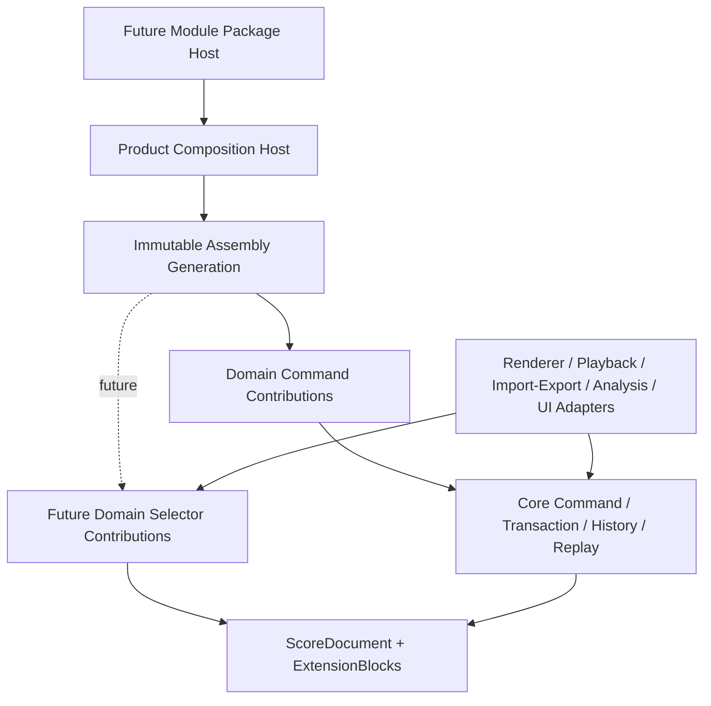
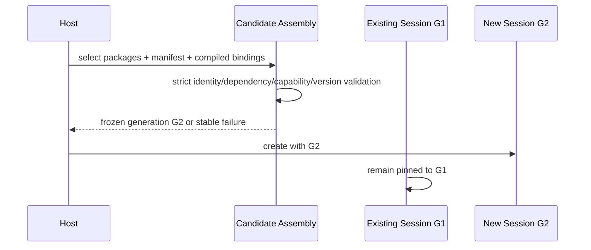

# Core VNext Extensibility Reservation Design

## 1. 设计状态与作用范围

本设计描述扩展性合同如何被预留和版本化。任务已由用户批准进入 documentation-only 执行，但本文仍不是公开 TypeScript API，也不授权生产实现。所有 `Planned*` 名称都是后续 gate 的规划标识；只有本轮父合同/GD-0 delta 经独立评审、用户接受并归档后，才能成为后续 child 的输入。

CVN-4 已独立验收并归档，本任务将其作为只读前置基线：

- CVN-4 继续拥有已接受的 Part/Staff/Voice/Event lifecycle 15 个 Core 命令；
- 本任务只拥有扩展版本章程和 CVN-2/CVN-6 前置 gate；
- accepted CVN-4 branch `700bac9` 已通过 merge `783f69c` 成为执行基线；本任务不修改其源码、测试、archive metadata 或 acceptance 结论；
- CVN-4 独立 worktree 的归档后并行 dirty paths 保持在原 worktree，不进入本任务；
- 本任务不改变 CVN-4、CVN-2、CVN-5、CVN-6 的既有 primary FC ownership。

## 2. 第一性原则

### 2.1 必须同时成立的事实

1. 乐谱业务真相只能有一份，否则模块间撤销、重放和保存会分叉。
2. 模块需要增加领域数据、命令、验证、查询和产品能力，否则微内核只能服务当前领域。
3. 模块缺失或升级失败时，用户文档仍需可读、可诊断和无损保留。
4. 运行期任意改变命令目录会让同一 history/replay envelope 得到不同解释。
5. 未来能力无法在当前阶段全部准确设计，实现占位接口会把猜测固化成兼容负担。

### 2.2 因此采用的策略

```text
稳定核心不变量
  + 精确的 V1 贡献合同
  + 新能力使用新的版本通道
  + 每种 future port 有 owner/entry gate/失败模型
  - mutable document
  - generic patch
  - active-session registry mutation
  - second transaction/history/replay owner
```

“预留”在这里表示：版本边界、所有权、兼容规则、停止点和场景已经确定；当前代码中不加入空实现、万能回调或未使用字段。

## 3. 总体分层



### 3.1 Core plane

拥有 `ScoreDocument`、strict codec、semantic validation、transaction、history、undo/redo、replay、checkpoint/dirty、event sequencing、Assembly binding 和 capability enforcement。

### 3.2 Domain plane

拥有 extension schema、领域 command payload/decoder/handler、validator、classifier、issue、affected facts 和 own-extension effect definition。Domain plane 不持有活动 Core 对象。

### 3.3 Product Host plane

未来拥有包发现、安装、来源、签名、依赖、沙箱/进程、Assembly generation、Session 创建和 Adapter 组合。Host 生成新的 Assembly，不改动已经 ready 的 Assembly。

### 3.4 Adapter plane

Renderer、Playback、Import/Export、Analysis、UI Tool 读取快照/Selector，写入时生成 Command。Adapter 自己拥有布局缓存、播放时钟、文件句柄、网络和 UI 状态。

## 4. 扩展口注册表

| Port | 当前权威 | 数据方向 | 当前阶段 | 未来版本单元 | Owner |
|---|---|---|---|---|---|
| Domain commands | `kernel.domain-commands.v1` | module → Core transaction | V1 实现目标 | 新 registration entry/API version | CVN-2/CVN-6 |
| Domain validation/classification | contribution `validate/classify` | document → module facts | V1 实现目标 | contribution API version | CVN-2/CVN-6 |
| Module-owned extension effects | contribution `effects` | module request → owned block | V1 实现目标 | effectVersion + contribution API | CVN-2/CVN-6 |
| Module-to-Core write | WrittenPitch only | module request → Core effect | V1 窄面 | future operation-expansion entry | future independent gate |
| Domain selectors | none | snapshot → derived data | reserved | future selector entry/API | future independent gate |
| Extension granularity | Score/Part `(owner, namespace)` | persisted data | V1 固定 | new Score schema + migration | future schema gate |
| Assembly generations | create one frozen catalog/session | Host → new Session | semantic reservation | Host/package contract version | future Extension Host |
| External adapters | Core 外部 | snapshot/command | architectural boundary | per-adapter contribution version | product services |

每个 Port 都有独立版本单元。一个 Port 的升级不自动扩大另一个 Port 的权限。例如 Domain Selector 不继承 document write，Renderer 不继承 filesystem-to-Core 直写，module package identity 不继承 command capability。

## 5. V1 保持与新增版本规则

### D001 — V1 原地保持

`kernel.domain-commands.v1` 与 `CompiledDomainCommandContributionV1` 保持：

- `apiVersion/moduleId/contributionId/extensionNamespaces/extensionRequirements/commands/validate/classify/effects` 九字段；
- official + builtin/internal-module + system-trusted；
- composition root 静态函数 binding；
- startup all-or-nothing catalog；
- detached/deep-freeze；
- WrittenPitch + owned score/Part ExtensionBlock effect scope；
- 现有 resource caps、failure priority、availability 和 migration 语义。

### D002 — 新能力使用新版本 lane

未来能力使用以下任一方式进入：

1. 新 registration entry ID；
2. 同一 entry 的新明确 API version；
3. 新 Score schema version；
4. Core 外部的新 Adapter contract version。

规则：

- 每个 lane 有自己的 strict decoder、descriptor/binding parity 和 export allowlist；
- 一个 compiled contribution 必须与 manifest 选择的 exact entry/version 一致；
- 未支持版本在 Catalog/Session 构建期失败；
- 同一 Session 的 Registry、bus、gateway、selector 和 replay 共享一个逻辑 Assembly identity；
- 旧版本支持是否继续存在由 composition root 明确选择，不使用“latest”；
- 版本转换只通过显式 migration 或 adapter，不在 command decode 中隐式发生。

### D003 — 不加入空占位代码

当前实现不增加 `registerLater()`、`any` handler、generic effect、万能 capability、未使用 optional 字段或空 Selector entry。预留通过文档和版本路由约束完成。

## 6. 未来模块文档操作计划

### 6.1 解决的问题

V1 适合“模块数据 + WrittenPitch”。未来钢琴自动分手、自动配器、跨 Voice 重构等高层语义可能需要一个模块命令原子组合多个 Core 结构操作。该能力应复用 Core command semantics，而不是让模块直接产生内部 mutation。

### 6.2 规划模型

后续 gate 的概念输出称为 `PlannedDomainOperationExpansionV2`：

```text
original domain command
  -> strict domain decode
  -> detached read view
  -> bounded ordered Core command envelopes
  -> owned extension effect requests
  -> declared affected ScoreAddresses
```

该名称不是当前公开接口。后续 gate 负责冻结真实名称、字段和导出。

### 6.3 固定执行顺序

1. integrated write-availability preflight；
2. strict decode 原始 module command；
3. route 到 exact contribution/version；
4. handler 读取 detached compatible view；
5. handler 同步返回 detached operation expansion；
6. 验证 capability、命令来源、数量、深度、目标与资源；
7. 只 route allowlisted Core child commands，不 route module child 或 batch；
8. 每个 Core child 依次 decode/target/preflight/prepare/apply 到同一 candidate；
9. 应用 contribution-owned extension effects；
10. 运行一次 final Core semantic，再运行 compatible module validators/classifiers；
11. 生成 canonical facts，预留一次 version/history/event；
12. 一次 adoption 和一次 committed event。

### 6.4 固定限制

- expansion depth 恰好一层；
- expansion 中只含 Core semantic envelopes；
- `core.transaction.batch`、self command 和其他 module command不进入 expansion；
- child count 上限不得高于 CVN-5 的 100；
- expanded primitive effects 和 canonical affected addresses 各不得高于 131,072；
- future gate 可以选择更低上限，提高上限需父级复审；
- target 只使用已发布 target kind、stable ID 和 ScoreAddress；
- handler 同步、有限、无 clock/random/filesystem/network/platform input；
- module 只提交 forward intent；inverse 由每个 Core/owned effect definition 派生；
- handler 抛错、Promise-like、malformed plan、capability 缺失或任一 child 失败均丢弃 candidate。

### 6.5 History 与 Replay

- history 的语义根仍是原始 module command 和 contribution identity/version；
- history 保存实际 forward effects、逆序 inverse effects 和 affected facts，不保存 mutable handler 或完整文档；
- Replay 使用兼容 Assembly 重新 route 原始 module command，不把 history effects 当作解析输入；
- contribution 缺失或版本不兼容时返回明确 availability/replay failure；
- 同一 command/version 在同一逻辑 Assembly 和初始文档上必须产生深度相等结果。

### 6.6 当前 V1 路径

在 future gate 实现前，模块或其 UI adapter 构建 `core.transaction.batch`：

```text
module-owned command
+ core.part/staff/voice/event/note commands
= one CVN-5 atomic batch
```

这条路径已有明确的单一提交、单一候选、单一 history/event 和 replay 语义，不要求 CVN-2 V1 扩大。

## 7. 未来 Domain Selector

### 7.1 输入

- detached Core snapshot 或窄化 read projection；
- 该 contribution 拥有且 exact-compatible 的 ExtensionBlock view；
- data-only query payload；
- assembly identity 和 capability 由 gateway 私有绑定。

### 7.2 输出

- data-only JSON-compatible 或版本化 SDK records；
- detached、deeply frozen、deterministically ordered；
- 明确 `selected/rejected` 或等价稳定 discriminant；
- 包含 limit/availability/module issue 时只使用 allowlisted facts；
- 不携带 handler、Registry、bus、document payload、stack 或路径。

### 7.3 资源与生命周期

- query payload 和输出元素有独立 caps；
- selector 不修改文档、history、dirty、event sequence；
- selector 结果不是持久化真相；
- 缓存属于 Host/Adapter，并以 documentVersion + assembly identity 失效；
- missing/incompatible contribution 遵循同一 availability facts；
- 后续实时增量查询通过现有 committed event 触发重新选择，不新增第二 event owner。

## 8. Extension 持久化演进

### 8.1 V1 固定聚合

`brilliant-score-1` 继续使用：

```text
ExtensionBlock key = (ExtensionOwner, namespace)
ExtensionOwner = score | part
```

领域内部可以在 payload 中用稳定 Note/Event/Voice/Measure ID 建立索引；validator 检查引用。Core 删除结构后若领域引用失效，模块-aware UI 使用 module cleanup + Core delete 的 CVN-5 batch。

### 8.2 Future schema gate

只有在实际规模、部分更新、冲突或 owner lifecycle 证据证明 Part 聚合不足时，future schema gate 才评估：

- stable `blockId`；
- measure/staff/voice/event/note owner 或通用 address owner；
- extension sharding；
- owner cascade 和 orphan 策略；
- old/new schema encode/decode/migration；
- 文件保存回滚和 crash recovery。

该 gate 必须产生新的 Score schema version。现有 `ExtensionOwner` union 不在 `brilliant-score-1` 内追加变体。

## 9. Assembly generation 与模块包 Host

### 9.1 代际模型



### 9.2 原则

- generation 是 Host 级不可变组合结果；
- active Session 保持创建时的 Assembly；
- install/update/disable 只改变后续 candidate generation；
- active Session migration 是显式产品流程，不是 Registry mutation；
- rollback 选择上一个已验证 package set 并创建新 Session；
- persisted document 记录 extension namespace/schema data，不持久化进程内 Assembly handle。

### 9.3 第三方 Host 的后续责任

- package identity/version/source；
- signature/provenance；
- dependency graph 与 cycle detection；
- capability grant；
- sandbox/process isolation；
- CPU/memory/time/output quotas；
- crash isolation 和 diagnostics；
- install/update/remove transaction；
- user consent、UI 和 rollback。

这些能力归 future Extension Host，不进入系统可信 official module V1。

## 10. 外部 Adapter 平面

| Adapter | 读取 | 写入 | 自己拥有 | Core 中保持缺席 |
|---|---|---|---|---|
| Renderer | Snapshot/Domain Selector | none 或 UI 生成 Command | layout tree/cache/font resources | layout coordinates/cache |
| Playback | Snapshot/derived timing | transport commands 位于产品层 | audio clock/device/buffer | milliseconds/device handles |
| Import | bytes/foreign model | factory + semantic commands | parser/source diagnostics | file handle/raw bytes |
| Export | Snapshot/Selector | none | formatter/package writer | output stream/path |
| Analysis | Snapshot/Selector | optional suggested Commands | analysis cache/model | inferred result truth |
| UI Tool/Panel | Snapshot/Selector/events | Gateway Commands | selection/widget/session state | UI object/state |

Adapter contribution 不能借用 domain command effect 作为万能服务定位器。每类 Adapter 有独立 entry/API、capability 和 failure contract。

## 11. 代表场景数据流

### 11.1 技巧模块 V1

```text
technique command
  -> validate Note/Event stable reference
  -> update Part-owned technique ExtensionBlock
  -> optional WrittenPitch request
  -> Core + module validation
  -> one commit/history/event
```

### 11.2 钢琴基础编辑

- Piano Part、双 Staff、Voice 和 staff assignment 使用现有/规划 Core commands；
- 指法、踏板和手分配进入 Piano-owned ExtensionBlock；
- 同时更新 Core 与 Piano data 时使用 CVN-5 batch；
- 高层自动结构重写在 future operation-expansion gate 实现前由 UI/Adapter 生成 batch。

### 11.3 模块缺失或升级

- known compatible block + contribution absent：无损只读；
- known future/incompatible schema：无损只读；
- compatible contribution 重新安装并创建新 Session：恢复完整验证和写入；
- migration 在 detached pure-data pipeline 中运行，成功后再打开新 writable Session；
- 旧 Session 不接收新 handler。

### 11.4 多模块组合

- composition root 解析所有 identity/version/schema requirements；
- 同一 Assembly 形成确定 catalog order；
- CVN-5 batch 组合 Core/module envelopes；
- final validation 先 Core，再按 catalog order module validators/classifiers；
- 任一 failure 保持完整 pre-call state。

## 12. 合同修改图

### 12.1 父 PRD

追加：

- `CVN-D012 — Versioned extensibility reservations`；
- `CVN-R012 — Future extension port charter`；
- `CVN-AC018 — Reservation trace and no-V1-drift evidence`。

内容只声明演进和 gate，不改变 CVN-D001–D011、CVN-R001–R011 和 CVN-AC001–017 的语义。

### 12.2 Feature Contract Matrix

在 CVN-FC-112 后增加一个无新 `CVN-FC-*` heading 的子节：

`Additive evolution reservation (non-V1 completion scope)`

该节记录：V1 精确保持、新 lane 规则、future gates、永久禁区。验证保持现有 FC heading/primary owner count 和 28-command count。

### 12.3 Durable roadmap

增加：

- 本任务的 live `in_progress` documentation-only 状态；
- GD-0 acceptance/CVN-2 creation 前的 reservation review gate；
- CVN-6 只消费 accepted CVN-2 和该章程；
- CVN-5 继续等待原四项依赖；
- CVN-7 后的 future extension gate index；
- CVN-4 已由独立 reviewer 验收并归档，继续作为 accepted prerequisite。

### 12.4 GD-0 design

增加 forward-evolution boundary：

- 现有 `public-contract` fences 保持；
- V1 contribution/effect scope 保持；
- 新能力走新 entry/API/schema；
- future lane 不被表述为已实现或 GD-0 acceptance 条件。

### 12.5 活动 specs

本任务保持 `.trellis/spec/**` 不变。未来 accepted runtime/schema behavior 再通过 spec sync 更新，以免 planning promise 被误写为当前行为。

## 13. 失败与停止矩阵

| 发现 | 处理 |
|---|---|
| 需要改变 `brilliant-score-1` | 停止本任务 delta，创建 future schema gate |
| 需要扩大 V1 九字段 ABI | 返回 parent/GD-0 public contract review |
| 需要新增 Core command/target/address | 返回相应 Core feature planning |
| 需要 module 获取 mutable document/bus/history | 归入永久排除，保留 single-owner invariant |
| 需要 ready Registry 原地变化 | 使用 future Assembly generation |
| 需要改变 FC count、caps、fixtures、failure priority | 显式 parent contract review，不作为文字整理处理 |
| 后续证据发现与 accepted CVN-4 parent contract 冲突 | 停止本任务并发起显式父级合同复审；不通过本任务重写已归档结论 |
| GD-0 public fence 与 reservation 冲突 | 在 GD-0 acceptance 前回到合同规划 |
| planning diff 触及 source/test/spec/CVN-4 task | 丢弃越界修改，只保留拥有的文档面 |

## 14. Rollout 与 Rollback

### Rollout

1. 本任务 planning artifacts 和 research 已完成并提交；
2. accepted CVN-4 baseline 已合入，用户已批准 `task.py start`；
3. 当前只修改列出的 parent/GD-0 planning docs 与本任务证据；
4. 独立 reviewer 复核无 V1 drift、CVN-4 状态准确且 task-owned diff 无 source/test/spec；
5. 用户接受后归档 reservation gate；
6. GD-0 acceptance 与 CVN-2 planning 消费已接受章程；
7. future gates 只在产品需求和依赖满足时单独建立。

### Rollback

本任务是文档-only。回滚只撤销该分支的任务/父/GD-0 文档提交；Core source、tests、persisted document 和已归档 CVN-4 基线没有迁移或运行时状态需要恢复。
