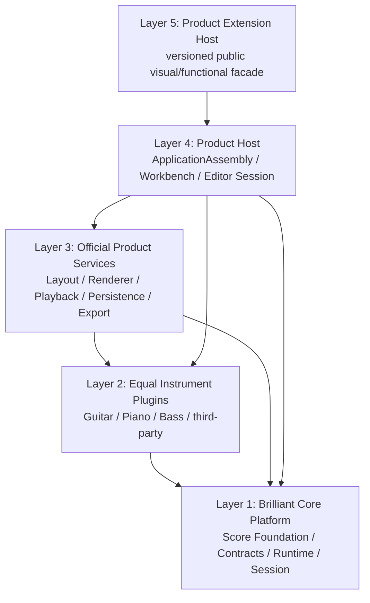
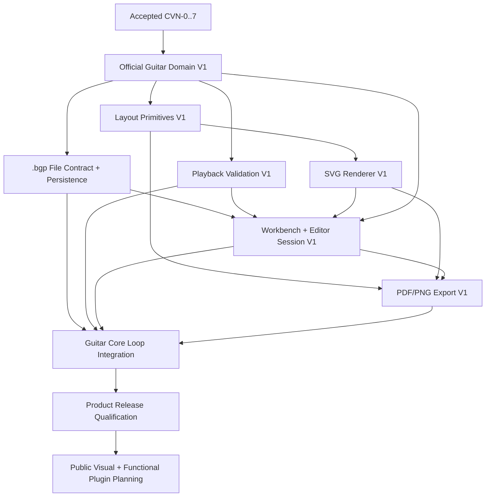

# Post-Core 官方插件与产品路线设计

> **V2 authority projection:** The current architecture is `.trellis/tasks/08-16-brilliant-guitar-architecture-reset-v2/design.md` at `e81c739b...`, independently audited PASS (`01a01da3...`, 34/34). This roadmap consumes V2; its sync task is `.trellis/tasks/08-20-brilliant-guitar-architecture-reset-v2-authority-sync`.

## 1. 设计目的

本设计把“内核扩展性优先、官方插件随后、产品闭环再后、公共插件最终开放”固化为可执行的层次、数据流和依赖合同。它只定义未来边界，不批准生产实现。

## 2. V2 五层产品投影与唯一 owner



依赖箭头表示调用稳定公开合同。Core Platform 不导入上层包；具体领域、平台、视觉、播放和物理 IO 始终位于 Core 外。公共插件只进入 Product Host 的 Product Extension Host/versioned facade，由宿主映射到已批准 Core 或产品贡献合同，不直接访问 raw Core Registry。

| V2 boundary | Unique owner | Identity rule |
|---|---|---|
| Kernel Runtime mechanisms | `brilliant-kernel-runtime` | private runtime state and kernel identity only |
| Kernel Session / Composition | `brilliant-kernel-session` | one composition root, 28 handlers, gateway and private catalog |
| Product ApplicationAssembly | Product Host / `workbench-editor-session-v1` | separate application assembly identity/fingerprint |
| Product Extension Host | Product Host / future public-extension child | separate public facade identity; no kernel private state |
| Instrument Plugin protocol | `brilliant-extension-protocol` | Guitar/Piano/Bass/third-party equal consumers; no privileged Guitar path |

`KernelSessionComposition` and `Product ApplicationAssembly` each return atomic `ready | failed`; their identities never substitute for one another. The old `Core Kernel` name in this roadmap is a product projection label, not a second owner.

## 3. Core 完成边界

### Core 必须完成

- 固定 28 个 Core 命令；
- 文档工厂和通用结构生命周期；
- 范围操作和显式原子 batch；
- 官方模块 SDK 与冻结贡献目录；
- 模块命令、validator、classifier 和 effect 的唯一运行时；
- 模块数据兼容、迁移和未知 extension 保真；
- 单一 transaction/history/replay/dirty/event owner；
- 25,600 Event 发布门和 102,400 Event 压力证据。

### Core 排除

- Guitar 调弦、弦品与技巧 payload；
- 布局坐标与 hit testing；
- SVG/具体 Renderer 对象；
- 播放队列和音频对象；
- 物理 `.bgp` zip/路径/文件句柄；
- Desktop/Workbench/React 状态；
- PDF/PNG 实现；
- 公共插件发现、安装和视觉容器。

该边界使“完整内核”成为有限、可关闭的基础，而不是全部产品功能的代称。

## 4. 职责与所有权矩阵

| 能力 | 唯一 owner | 输入 | 输出/状态 | 禁止进入 |
|---|---|---|---|---|
| 谱面真相 | Core Kernel | 严格文档/命令 | ScoreDocument、版本 | UI/布局/播放状态 |
| Guitar 语义 | Guitar Domain | Core read view、领域命令 | WrittenPitch effect、Guitar extension | Core 固定字段 |
| 布局 | Layout | snapshot、Guitar 显示语义 | layout primitives、hit areas | ScoreDocument |
| 渲染 | Renderer | layout primitives、主题 | SVG/渲染结果 | Core API、文件 schema |
| 播放 | Playback | snapshot、Guitar 播放语义 | 播放事件、光标时间 | ScoreDocument |
| 持久化 | Persistence | 经验证 snapshot、文件合同 | `.bgp`、保存结果 | Core 事务/history |
| 导出 | Export | snapshot、layout/render 页面 | PDF/PNG、ExportReport | ScoreDocument |
| 编辑会话 | Editor Session | 用户输入、hit test | cursor、selection、命令 payload | 持久谱面事实 |
| 工作台 | Workbench | 模块描述、session 状态 | UI 编排、命令调用 | 可变 ScoreDocument |
| 应用装配 | Product Host | 已批准模块集合 | 稳定应用会话装配 | ready 后 Core Registry mutation |
| 公共插件代理 | Future Extension Host | 已安装 manifest、授权配置 | 版本化 facade、过滤事件、贡献映射 | raw Registry、裸事件总线、可变 ScoreDocument |

## 5. 写入、读取与事件数据流

### 5.1 官方领域命令

```text
Workbench/Input
  -> Guitar command descriptor
  -> Core module runtime decode
  -> Guitar prepare(view, command)
  -> Core WrittenPitch effect + Guitar-owned ExtensionBlock effect
  -> Core semantic validation + Guitar validation/classification
  -> single Core commit/history/event
```

要求：一次用户动作只形成一个 candidate、一个 commit、一个 history entry 和一组确定事件；Guitar Domain 不保存自己的可变 ScoreDocument。

### 5.2 视觉与播放派生

```text
Core snapshot(documentVersion)
  -> Guitar display/playback projection
  -> Layout primitives or Playback events
  -> Renderer / Playback runtime
```

派生缓存必须以来源 `documentVersion` 失效。布局与播放结果可重新生成，不参与保存和迁移。

### 5.3 编辑定位

```text
View coordinate
  -> Layout hit test
  -> ScoreAddress / ScorePoint / ScoreRange + session context
  -> Guitar/Core semantic command
```

坐标只负责定位，最终写入目标使用稳定谱面地址。

### 5.4 保存与重开

```text
Core read at documentVersion
  -> validated semantic score
  -> Persistence physical package
  -> atomic replacement
  -> markPersisted(documentId, documentVersion)
```

重开顺序为物理包读取、manifest/score decode、版本兼容/迁移、Core semantic validation、官方模块兼容/迁移、产品支持性分类、创建 session。未知插件数据保持为纯数据。

### 5.5 事件分发

```text
single Core commit
  -> canonical Core/module events
  -> Product Host application-session router
      -> official service/Workbench subscribers
      -> future Extension Host versioned filter
          -> public plugin event facade
```

Core 继续拥有事件事实、序列和提交原子性。产品宿主只路由；未来 Extension Host 只投影允许字段并隔离订阅者，不生成第二套提交事件，也不向公共插件暴露裸 `KernelEventBus`。

### 5.6 未来公共贡献装配

```text
installed plugin configuration before startup
  -> Extension Host manifest/API/runtime/permission validation
  -> versioned logical contribution descriptors
  -> Application Assembly candidate
  -> atomic ready-or-failed application session
```

官方编译绑定与公共插件 manifest 使用不同的发现前端，但最终必须映射到同一版本化逻辑贡献模型。Core-facing 语义命令只能经批准 adapter 进入统一 runtime；UI、Renderer、Playback、Importer/Exporter 等贡献进入宿主拥有的目录。ready 后的应用会话不增删、启停或热替换贡献。

## 6. Guitar Domain 数据所有权

- Core 保存 WrittenPitch 与通用谱面结构。
- Guitar Domain 以稳定 namespace 拥有 Part-owned extension schema。
- 首版技巧、调弦、弦品和领域引用以模块纯数据表示。
- Guitar 命令可以同时请求 Core WrittenPitch effect 和 Guitar-owned effect，但二者共享同一事务。
- 模块缺失时 Core 保留其 extension 数据；相关编辑和派生能力显示为不可用，但通用文档仍可读。
- score/Part owner 粒度先按已接受章程使用；只有规模和生命周期证据表明聚合不足时，才通过独立新 Score schema 任务演进。

### `.bgp` 与插件数据的持久化关系

- 语义插件数据以 Score schema 中的 `ExtensionBlock` 保存，并由稳定 namespace、owner 和 schema version 标识；它不是独立的第二份谱面。
- `.bgp` manifest 只记录物理格式版本、score 入口、资源索引和支持判断所需的贡献要求；不得把插件可执行代码、动态入口或运行时对象写入谱面包。
- 插件自有二进制/媒体资源若被第一版文件合同批准，必须通过 manifest 中的稳定资源 ID 引用，由 Persistence 负责路径、校验和原子复制；ScoreDocument 只保存资源 ID 或纯 JSON 语义引用。
- 插件缺失时，未知或未解释的 `ExtensionBlock` 保持 JSON 值级保真，已声明资源保持字节级保真；已知 required contribution 缺失或版本不兼容时按 Core/GD-0 合同进入 lossless read-only 与 validation-incomplete，而不是删除或静默改写数据。
- 插件安装状态、权限、启停配置和宿主缓存属于产品配置，不写入 `.bgp` 谱面真相。

## 7. 官方产品服务模块

### Layout

- 输出框架中立 primitives、稳定来源地址和 hit areas。
- PDF/PNG、SVG 和未来渲染目标复用同一布局语义。

### Renderer

- 首发 SVG，具体渲染库封装在 adapter 内。
- 谱面 overlay、选区和光标使用独立渲染层，不写入谱面。

### Playback

- 从 snapshot 与领域播放语义生成事件。
- 传输控制和播放光标属于运行时状态。

### Persistence

- 拥有 `.bgp` 物理包、原子保存、自动保存、恢复和资源索引。
- 复用 Core codec/validation/migration 与官方模块数据合同。

### Export

- 输入为 snapshot 与布局/渲染页面模型。
- 输出 PDF/PNG 和结构化结果，失败不改变文档状态。

## 8. 产品宿主与 Application Assembly

Application Assembly 由未来产品宿主拥有，不加入 Core VNext；其首版唯一实施 owner 为 `workbench-editor-session-v1`。它至少组合：

- 一个已接受 Core runtime；
- 一个启动期冻结的官方领域模块集合；
- 官方 Layout/Renderer/Playback/Persistence/Export service providers；
- Workbench contribution 与 i18n 资源；
- 本次应用会话的确定模块集合版本。

首个产品阶段只装配官方模块。模块集合改变在新的应用会话生效；活动文档会话保持稳定依赖和贡献集合。Core Registry 继续只管理 Core/领域运行时贡献，Workbench 与服务 provider 目录由产品宿主拥有。公共插件开放后，Extension Host 负责启动前发现、授权和逻辑贡献映射，但仍由 Application Assembly 一次性冻结本应用会话；它不获得 ready Registry mutation 接口。

首版装配合同必须返回原子的 `ready | failed` 结果：任一 required Core/Domain/service provider 缺失、重复、版本不兼容或初始化失败时，发布零应用会话、零部分 provider 目录；成功时发布深冻结 provider 目录、稳定 session identity/assembly fingerprint 和唯一 Core runtime 引用。Workbench child 以测试 provider 固定后续 Export contribution port；Child 7 实现该 provider；Child 8 只调用已接受的 contract/factory，以全部 accepted providers 构造新 ready session 并运行纵向旅程，绝不修改既有 ready session。

## 9. 版本轴

以下版本独立演进并显式记录：

1. Core API/command version；
2. Score schema version；
3. 官方模块 contribution API version；
4. 模块 extension schema version；
5. 物理 `.bgp` format/manifest version；
6. Workbench/service adapter API version；
7. 公共插件 manifest/facade API version；
8. 产品版本。

任何子任务只拥有声明的版本轴；跨轴变化必须在 design、fixture 和兼容矩阵中显式连接。

## 10. 产品性能与兼容资格门

Core CVN-7 证据是产品门的前置，而非替代。产品资格还必须测量：

- 代表性谱面的新建、打开、保存、恢复；
- 键盘连续输入和撤销重做；
- snapshot 到 Layout 的延迟；
- SVG 首屏与增量刷新；
- 播放事件生成和光标稳定性；
- PDF/PNG 导出；
- 官方模块缺失、旧版和升级 fixture；
- Windows 安装、启动、文件关联和完整 Guitar Core Loop。

具体数字由各实现子任务基于 CVN-7 reference environment 和产品场景批准，本父任务只固定覆盖面和阻断性质。

| 资格证据 | 数字/fixture owner | 最低场景 | 阻断规则 |
|---|---|---|---|
| 打开、保存、自动保存、恢复 | File/Persistence child | Guitar Core Loop 文件、当前/旧版/未来版/损坏包、未知 extension 与资源 | 原文件被破坏、状态误标 clean、数据或资源丢失即失败 |
| 键盘编辑与撤销重做 | Workbench child | 可重复的四小节键盘脚本 | child 在 `task.py start` 前冻结 P50/P95 预算；超预算或出现非语义写入即失败 |
| Layout 与 SVG | Layout/Renderer children | 同一 snapshot 的双谱表、技巧、分页与命中 golden | 非确定输出、来源地址丢失或超过已批准预算即失败 |
| Playback | Playback child | 同一四小节 fixture 的事件序列、transport 与 cursor | 事件不确定、修改谱面或超过已批准生成/光标预算即失败 |
| PDF/PNG | Export child | 代表性页面 golden、取消和失败注入 | 不可读、无结构化结果或改变文档/history/dirty 即失败 |
| 端到端与安装 | Integration/Qualification children | Windows 干净安装、新建至导出、关闭重开和恢复 | 任一直接模块证据缺失、旅程不可重复或安装/文件关联失败即失败 |

每个 owner child 必须在生产实现激活前把 reference machine、fixture 标识、样本规模、warm-up、重复次数、统计量和数值阈值写进自己的 PRD/design；实现完成后只提交同一协议下的测量结果。产品资格任务只汇总已冻结预算并运行跨模块场景，不在结果出现后放宽阈值。

兼容矩阵必须逐轴记录 Core API/command、Score schema、官方 contribution API、extension schema、`.bgp` format、Workbench/service adapter 和公共 plugin facade 的“当前支持集合、最旧支持 fixture、明确拒绝的未来版本、迁移 owner、降级结果”。未声明的组合不得被推断为兼容。

## 11. 依赖图



File/Persistence 可以在 Guitar Domain 数据合同接受后与视觉线独立推进；最终集成仍等待所有直接依赖。

## 12. 取舍

### Core-first

- 收益：先固定长期谱面、事务、模块 ABI 和性能基础。
- 成本：可视产品出现较晚。
- 决策：保持现有优先级，用有限 CVN-7 完成线约束持续扩张。

### 官方插件先于公共 SDK

- 收益：公共合同来自真实 Guitar、视觉、文件和播放消费者。
- 成本：外部作者进入更晚。
- 决策：先完成官方模块和 Guitar Core Loop，再提取公共视觉/功能 API。

### 产品宿主拥有视觉和服务目录

- 收益：Core 保持领域与框架无关，视觉/服务可独立替换。
- 成本：产品层多一个装配边界。
- 决策：Application Assembly 属于产品宿主，Core Registry 保持专注。

## 13. 规划回滚与变更治理

- 规划文档出现 P0/P1/P2 时只修正规划文件，不吸收生产实现。
- CVN-7 前的新证据若改变 post-Core 假设，更新本父任务并重新规划复审。
- 任何未来子任务需要改变已接受 Core 行为时，先创建独立 Core 演进 gate，不在产品子任务中顺带修改。
- 子任务失败或延期不改变已接受 Core；父路线保持依赖状态并选择仍满足依赖的下一项。
