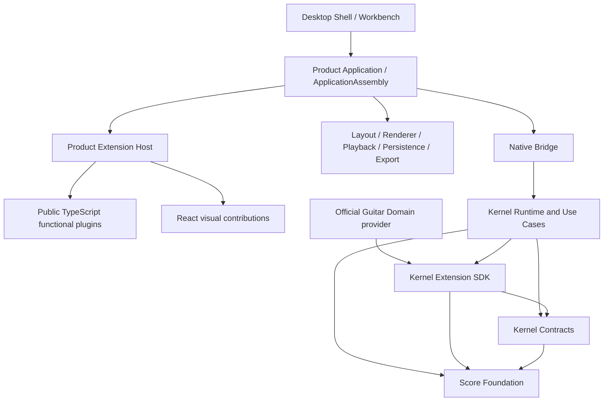
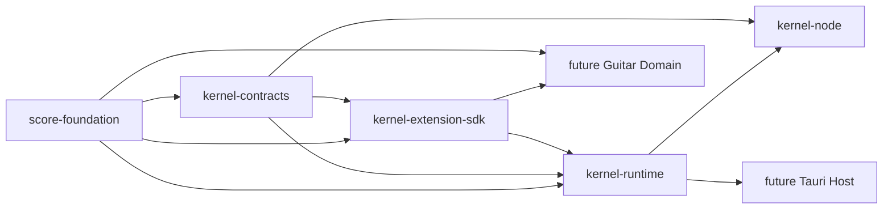
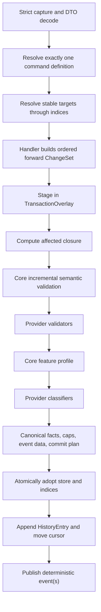
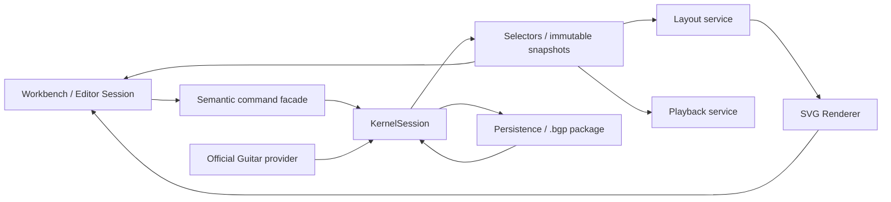

# Brilliant Guitar Architecture Reset V2 — Implementation Architecture Candidate

## 0. Authority, status, and reading contract

This is the self-contained implementation-level candidate for the next Brilliant Guitar architecture. Future operators must be able to understand the target without reconstructing historical Trellis tasks.

| Property | Candidate value |
|---|---|
| Planning base | `5e1599598b1468784ae9b7410383ef63b33201b8` |
| Branch | `codex/brilliant-guitar-architecture-reset-v2` |
| Lifecycle | `planning` |
| Authority | proposed, not current |
| Production authorization | false |
| RKP-1 lifecycle | absent and not started |
| Promotion gate | independent architecture review `0/0/0` plus explicit user acceptance |

Normative words are **MUST**, **MUST NOT**, **SHOULD**, and **MAY**. A future task may choose concrete Rust signatures and containers only where this document explicitly delegates that choice. It may not silently change ownership, observable compatibility, complexity, ordering, or lifecycle decisions.

This candidate changes no production code. Existing documents remain the current historical/operational inputs until a separate docs-only authority-sync commit is accepted.

---

## 1. Executive decision

Brilliant Guitar requires a large internal architecture refactor, not a product reset and not a blind rewrite.

We retain the product goal, general ScoreDocument semantics, 28 Core commands, command/result/failure/issue/event behavior, `brilliant-score-1`, deterministic ordering, unknown-extension preservation, rejection zero-delta, accepted official-provider contracts as migration oracles, and the staged RKP program.

We replace nested-array full scans on writes, full-document clone-per-effect-set transactions, growing history arrays copied per operation, repeated full semantic validation, complete callback-view cloning, and the overloaded use of “Core Kernel” for unrelated owners.

The replacement is an indexed Rust live store, typed generational handles, isolated overlays, compact ChangeSets, cursor history, incremental validation, explicit snapshot materialization, a frozen official-provider assembly, and small DTO bridges.

> Rust is the target runtime, but language replacement alone is not the fix. Translating the current full-scan/full-clone algorithm literally fails this architecture.

---

## 2. Current physical architecture audit

### 2.1 Repository facts at the planning base

The base contains:

- exactly one production source subtree: `src/core-kernel`;
- 71 TypeScript production files and approximately 24,765 production lines;
- `commands` (10,821 lines) plus `registry` (4,563 lines), about 62.12% of production lines;
- centralized files including `commands/integrated-runtime.ts`, `commands/effects.ts`, and `registry/domain-catalog.ts`;
- no production Guitar Domain, Layout, Renderer, Playback, Persistence, Workbench, or public Extension Host;
- no Cargo workspace, Rust production crate, Tauri application, or React application;
- an inherited verified full-suite baseline of 531/531;
- accepted and archived RKP-0 contract/oracle artifacts;
- no implemented RKP-1 through RKP-9.

CVN-7's official stress measurement at `b21540fa...` timed out during `stress-submit`; it produced invalid/incomplete evidence rather than a Core qualification pass or a candidate-specific regression verdict. It motivates remediation but does not authorize observable-contract drift.

### 2.2 Proven interactive hot paths

| Problem | Current evidence | Consequence |
|---|---|---|
| Nested-array target search | `src/core-kernel/commands/target-resolver.ts:185` | Write resolution walks the object graph despite stable IDs. |
| Read index not consumed by writes | `src/core-kernel/read/entity-index.ts:17,29,89,272-293` | Snapshot indexing does not make transactions indexed. |
| Whole-document clone for effects | `src/core-kernel/commands/effects.ts:1741,1753` | Every local edit allocates and visits the full score. |
| Growing arrays copied for history | `src/core-kernel/commands/runtime.ts:203,361,456-457,492` | Repeated commits add an avoidable quadratic history-copy term. |
| Full callback/read-view clone | `src/core-kernel/commands/integrated-runtime.ts:641` | Provider assessment pays global materialization cost. |
| Repeated global semantic pipeline | `src/core-kernel/commands/integrated-runtime.ts:687,692,2003,2134,2315,2400` | A local change repeatedly validates/profiles/classifies global state. |
| DTO tree as runtime and snapshot form | Current command/read modules | Editing, queries and persistence compete around one representation. |

For `K` commands against `E` entities, current work includes a component approximately `O(K × E + K²)`. Constants and language affect absolute time but not this shape.

### 2.3 Governance problems

1. `Core Kernel` currently names product semantics, document truth, transaction mechanics, extension machinery and sometimes the entire product core.
2. Historical architecture documents describe different repository eras.
3. `PURE_CORE_KERNEL_V1_SCOPE` is a compatibility name easily misread as the future physical architecture.
4. Synthetic contract consumers exist, but a real Guitar product vertical slice does not.
5. The accepted TypeScript Module SDK is an official-module compatibility/oracle surface, not automatically a public plugin SDK.
6. Private kernel assembly identity and Product ApplicationAssembly are distinct but historically easy to conflate.

---

## 3. Ubiquitous language and bounded contexts

### 3.1 Top-level model

```text
Brilliant Core Platform
├── Score Foundation
├── Kernel Contracts
├── Kernel Runtime
├── Kernel Use Cases
├── Kernel Extension SDK
└── Native Bridge
```

`Brilliant Core Platform` is the stable product core. “Microkernel” applies narrowly to Kernel Runtime: a small state/transaction owner with frozen providers around versioned data contracts. It does not put music primitives, product workflows, installation and rendering into one module. Imported uses of `LIN` are replaced by `Brilliant Guitar`.

### 3.2 Context ownership

#### Score Foundation

Owns pure, runtime-free Fraction, NoteValue, WrittenPitch, Transposition, ScoreDocument, Measure, Part, Staff, Voice, Event, Note, ExtensionBlock envelope, schema-level music invariants, and deterministic `brilliant-score-1` semantic encoding order.

It MUST NOT own command routing, session state, history, RuntimeHandle, Guitar fingering/techniques, UI, layout, playback, filesystem, or plugin lifecycle.

#### Kernel Contracts

Owns versioned data-only command/result/failure/issue/event/selector/snapshot DTOs, public schema versions, provider descriptors, capability/assembly data contracts, and FFI-safe types. It MUST NOT depend on runtime internals, Node, Tauri, React, or official domains.

#### Kernel Runtime

Owns KernelSession, LiveScoreStore, every live index, TransactionOverlay, ChangeSet, validation execution, history cursor/checkpoints, snapshot cache, event sequencing, dirty/replay state, and frozen KernelProviderAssembly. It is the **only** state/transaction/history/event owner.

#### Kernel Use Cases

Owns orchestration of the 28 Core commands, routes, indexed target resolution, Core/provider validation/classification, no-op, batch, undo, redo, and replay. V2 keeps it as an internal `brilliant-kernel-runtime` module rather than a sixth crate.

#### Kernel Extension SDK

Owns versioned Rust traits and data-only descriptors for source-built official providers. It exposes restricted read views and ChangeSet construction, never the mutable store or RuntimeHandle.

#### Native Bridge

Owns adapters only. Node-API supports compatibility/differential migration. A future Tauri host links runtime directly. Adapters cannot own state or repeat transaction/validation logic.

#### Product Application

Outside Rust Core, it owns Desktop Shell, Workbench, Editor Session, ApplicationAssembly, create/open/save/close/recover workflows, official product-service collaboration, Extension Host, public plugin lifecycle/configuration, i18n, and presentation.

### 3.3 Context graph



---

## 4. Rust workspace and dependency law

### 4.1 Target workspace

```text
crates/
├── brilliant-score-foundation/
├── brilliant-kernel-contracts/
├── brilliant-kernel-extension-sdk/
├── brilliant-kernel-runtime/
└── brilliant-kernel-node/
```

This five-crate shape revises the older four-crate remediation proposal by separating pure score semantics from kernel contracts. It takes effect only after V2 acceptance and a separate Rust-parent authority sync.

### 4.2 Dependency graph

An arrow points from a dependency to its consumer.



### 4.3 Crate owner table

| Crate | Owns | Does not own |
|---|---|---|
| `score-foundation` | Values, DTO semantic model, schema semantics, codec ordering | Sessions, commands, history, providers |
| `kernel-contracts` | Public/kernel DTOs and versions | Store, callbacks, domains |
| `kernel-extension-sdk` | Official provider traits/descriptors/builders/views | Mutable store, handles, public plugin lifecycle |
| `kernel-runtime` | Store, indices, transactions, use cases, validation, history, snapshots, events, kernel assembly | UI, package/files, Guitar implementation |
| `kernel-node` | Node capture/mapping, opaque handle, DTO conversion, panic containment | Business truth or second state/validation |

### 4.4 Forbidden dependencies

Architecture checks MUST reject Foundation importing another project crate; Contracts importing Runtime/Node/Tauri/React/Guitar; SDK importing store/history/overlay/RuntimeHandle; Runtime importing Guitar/product services/React/Tauri/public plugins; Node implementing semantic validation/adoption; Product Host obtaining mutable store; and public plugins linking Rust runtime.

---

## 5. Score truth and active representation

### 5.1 One semantic truth, two representations

```text
ScoreDocument DTO
    ↓ descriptor-first capture + exact decode + full validation
LiveScoreStore
    ↓ explicit snapshot / encode
ScoreDocument DTO
```

`ScoreDocument` remains the exchange, persistence, migration and round-trip form. `LiveScoreStore` is the sole mutable form inside a loaded session. Full conversion is limited to session load, explicit full snapshot, encode/save handoff, migration, full-validator fallback, and differential diagnostics. An ordinary local edit MUST NOT rebuild the complete DTO.

### 5.2 Logical store

```text
LiveScoreStore
├── SlotMap<Measure>
├── SlotMap<Part>
├── SlotMap<Staff>
├── SlotMap<Voice>
├── SlotMap<Event>
├── SlotMap<Note>
├── ExtensionBlockStore
├── EntityIndex
├── OwnershipIndex
├── OrderedChildrenIndices
├── VoiceTimeIndices
├── ExtensionIndex
└── ReferenceDependencyIndex
```

`SlotMap` means typed generational storage, not a preselected library. RKP-2 chooses the concrete container after determinism/benchmark evidence.

### 5.3 Identity separation

**EntityId** is persisted, globally unique across score entity types, stable across save/open/migration, and present in commands/events/snapshots/extensions.

**RuntimeHandle** is typed `(slot,generation)` or equivalent, session-private, invalid after generation change, average `O(1)` to dereference, and forbidden from files, FFI, SDK, snapshots and events.

**MusicalLocation** is an exact Fraction position derived from Voice ordering, sequence start and Event durations. It is an index/query key, not identity.

EntityId MUST NOT embed an arena offset or memory address. That would leak allocation into persistence, break reload/compaction and weaken stale-handle detection.

### 5.4 Index inventory

| Index | Key → value | Contract |
|---|---|---|
| Entity | `EntityId → typed RuntimeHandle` | average `O(1)`, duplicate detection |
| Ownership | child handle → parent handle | average `O(1)` |
| Ordered children | parent → ordered children | deterministic stable order |
| Measure order | score → ordered measures | insertion/move/removal |
| Part content | `(Part,Measure) → content/voices` | direct structural lookup |
| Voice timeline | exact Fraction/range → events | `O(log n + k)` |
| Extension | `(namespace,owner) → blocks` | compatibility/migration lookup |
| References | target EntityId → referrers | incremental closure |

Only overlay commit mutates store/indices. A commit plan lists all primary records and index operations; adoption applies all or none. RKP-2 must prove incrementally maintained indices equal indices rebuilt from accepted store state.

### 5.5 Complexity contract

- exact entity and owner lookup: average `O(1)`;
- ordered/exact-time range: `O(log n + k)`;
- pitch edit: one Note plus declared refs/ancestor closure;
- duration edit: one Event plus affected Voice suffix/time aggregate and declared closure;
- insert/delete: affected collections, Voice range, refs and ancestors only;
- ordinary local edit: zero visits to unrelated Part/Voice collections.

Public order is defined by semantic keys, never HashMap, slot, pointer or allocation iteration order.

---

## 6. Score, Guitar, and persistence ownership

### 6.1 Core rhythmic truth

- Event owns duration/NoteValue.
- Event start derives from Voice sequence and preceding durations.
- Chord Notes share the Event start/duration.
- Note stores stable EntityId and WrittenPitch.
- SoundingPitch derives from Part transposition.
- Note MUST NOT gain persistent `time`, `tick`, `duration`, `string`, or `fret`.

Voice time indices may cache aggregates, but they are rebuildable implementation state rather than a second persisted truth.

### 6.2 ExtensionBlock V1

Owner stays `score` or `part(partId)`. Official Guitar Domain stores Part-owned payloads such as `fingeringByNoteId`, `techniqueByEventId`, `tuning`, and domain references. The runtime may index declared references; encoding restores the accepted envelope. Entity/Note-owned blocks require a separate schema task.

### 6.3 `.bgp` boundary

Core Platform owns `brilliant-score-1` meaning, strict semantic codec, migration entry and extension compatibility. Persistence owns zip/package, manifest, paths, atomic replacement, autosave, crash recovery, resource bytes and permissions. Core never opens a user path or owns product save lifecycle.

---

## 7. KernelSession and native boundary

### 7.1 Required equivalent capabilities

Concrete signatures are frozen by RKP-1/RKP-3, but runtime capability MUST remain equivalent to:

```text
KernelSession::load(...)
KernelSession::submit(...)
KernelSession::undo()
KernelSession::redo()
KernelSession::replay(...)
KernelSession::read_state()
KernelSession::select(...)
KernelSession::mark_persisted(...)
KernelSession::encode_snapshot(...)
```

Every call returns versioned data-only success/failure. Panics are contained at adapter boundaries and mapped to stable failures without backtraces, pointers, file paths, or raw provider errors.

### 7.2 Node-API V1

- exposes opaque `KernelSessionHandle`;
- load and explicit full snapshot/encode may transfer a complete DTO;
- submit/undo/redo/select/markPersisted transfer small DTOs;
- normal edits never transfer a full ScoreDocument in either direction;
- TypeScript captures hostile JavaScript properties descriptor-first;
- Rust exact-shape decodes captured DTOs again;
- returned DTOs are detached/immutable at the TypeScript boundary;
- Rust does not call arbitrary JavaScript transaction callbacks.

The future Tauri host links runtime directly rather than passing through Node. It may use a serialized actor but must preserve identical KernelSession call ordering and results.

---

## 8. Command and transaction protocol

### 8.1 Submission pipeline



### 8.2 Handler boundary

A Core/official handler receives exact decoded payload, stable target IDs, a restricted detached read view, a restricted typed ChangeSet builder and declared namespace/effect capability. It returns ordered forward changes or data-only failures/issues.

It never receives mutable LiveScoreStore, RuntimeHandles, mutable indices, history, event dispatcher, Node/React/Tauri objects, or async/Promise callbacks.

### 8.3 ChangeSet and inverse

Each change records a typed stable address, necessary precondition and forward action/value. Runtime reads the overlay-aware current value and derives inverse before staging forward. Inverses are stored in reverse-safe order.

Required change classes include scalar replacement, entity insert/remove, ordered-child insert/remove/move, ExtensionBlock replace/remove, and declared reference update. RKP-3 freezes exact enums and resource caps. History/FFI never stores closures or trait/function pointers.

### 8.4 Atomicity and rejection

Before commit the runtime completes decode, route, indexed resolve, prepare, overlay checks, affected closure, Core/provider assessment, profile/classification, resource caps, canonical facts/addresses/event data, and the entire store/index commit plan.

On rejection, all are unchanged:

- live entities and every index;
- revision and snapshot-cache identity;
- history entries/cursor/redo tail;
- checkpoint identity;
- dirty and validation availability;
- event sequence and subscriber observations.

Subscriber failure occurs after commit, is isolated, and cannot roll back the transaction.

### 8.5 Batch

Batch children share one overlay and later children see earlier staged changes. Any child rejection discards the whole overlay. One accepted batch creates exactly one revision, history entry and committed event unit while preserving child boundaries in history/facts. V2 does not create an arbitrary public transaction callback.

### 8.6 No-op

A semantic no-op still performs target resolution, Core semantic assessment, applicable provider validation, profile and classification. It does not adopt store/indices, increment revision/history, change dirty state, or publish a committed event.

---

## 9. History, undo, redo, replay, and checkpoint

### 9.1 Structure

```text
History
├── Vec<HistoryEntry>
└── cursor: usize
```

Each entry stores semantic command identity/envelope data, ordered forward ChangeSet, reverse-safe inverse ChangeSet, canonical stable affected addresses, module/contribution identity where applicable, batch-child boundaries, and deterministic facts needed by accepted behavior.

It never stores a full document, RuntimeHandle, handler/function, wall clock, random ID, raw error, UI object or file object.

### 9.2 Behavior

- accepted submit after undo truncates entries after cursor;
- undo applies inverse without command preparer;
- redo applies forward without command preparer;
- undo/redo rerun semantic/provider validation and classification under accepted behavior;
- replay reroutes original semantic envelopes and never uses stored ChangeSets as commands;
- empty undo/redo retains existing stable failures;
- history is never silently evicted.

### 9.3 Checkpoint

Checkpoint is scheduled after 512 committed entries or 32 MiB accumulated ChangeSets. Snapshot construction runs after the interactive commit critical section and is tied to an accepted revision. Physical journal/crash recovery belongs to Persistence.

---

## 10. Incremental validation

### 10.1 Validator declaration

Every validator declares directly observed entity/change classes, parent/ancestor closure, referenced-entity closure, document-wide invariants, canonical issue ordering key, incremental support and full-fallback classes. Undeclared reads are a contract defect.

### 10.2 Affected closure

The default closure grows only as declared:

```text
changed Note/Event
→ owning Event/Voice
→ affected Voice time suffix
→ MeasureContent
→ Part
→ referenced MeasureDefinition/entities
→ explicitly declared document-wide invariant
```

It does not automatically include every Part, Voice, Event or ExtensionBlock.

### 10.3 Full fallback

Full validation is required for session load, migration, unclassified ChangeSet, validators not yet accepted for incremental closure, explicit parity check, debug/differential sampling, and index rebuild/recovery verification. Fallback is visible in metrics, not changed public ordering.

### 10.4 Equivalence gate

Before acceptance:

```text
canonical(incremental diagnostics) == canonical(full diagnostics)
```

Compare code, location, severity, issue order, facts, support classification and validation availability. Property/generative cases cover changes inside and outside the closure. Hash/slot iteration order never becomes public diagnostic order.

---

## 11. Selectors, snapshots, events, and concurrency

### 11.1 Selectors and snapshots

- selectors query LiveScoreStore/indices directly;
- selector must not first materialize a complete ScoreDocument;
- full DocumentSnapshot is explicit and revision-addressed;
- at most one full snapshot per revision may be cached;
- a commit creates a new revision and never mutates an older snapshot;
- FFI results are detached/immutable;
- RuntimeHandle never appears in results.

Provider views are filtered by capability, target/owner and compatibility. They are detached semantic views, not clones of unrelated sections.

### 11.2 Events

Retain committed and dirty-state-changed events with stable command identity, affected stable addresses, deterministic sequence, cause, and accepted facts. Events exclude ChangeSet/inverse, RuntimeHandle/index key, provider object, full document, UI/React/Tauri object, path, and raw panic.

### 11.3 Thread model

- one KernelSession has one sequential write owner;
- submit/undo/redo/replay/markPersisted execute in call order;
- provider invocation is synchronous during transaction;
- reentrant write retains stable rejection behavior;
- immutable snapshots may be read by background tasks;
- Node-API V1 is synchronous/owner-thread bound;
- future Tauri may use one serialized session actor without changing semantics.

---

## 12. Extension and assembly architecture

### 12.1 Rust official provider

Source-built, reviewed, composed at compile/startup time, using the versioned Rust SDK. It may contribute declared command/effect/validator/classifier/migration data and enters KernelProviderAssembly. It cannot access mutable store.

### 12.2 Public TypeScript functional plugin

Loaded by Product Extension Host through a versioned product facade. It reads filtered snapshots/selectors and writes through approved semantic command adapters. It never enters raw Registry/KernelProviderAssembly and never gets RuntimeHandle, pointer, or unrestricted file/UI objects.

### 12.3 React visual contribution

React is an optional visual implementation technology mounted in Workbench-owned containers. It receives host state/actions, does not own score truth, and never writes component/DOM state to ScoreDocument.

### 12.4 KernelProviderAssembly

Owned exactly once by the Kernel Runtime composition root. It contains Core handlers, accepted official Rust providers, compatibility, namespace ownership, deterministic frozen provider order, and a private assembly identity.

Construction is atomic:

```text
ready(complete directory + identity)
| failed(data-only diagnostics)
```

Failure exposes zero session and zero partial directory. A ready session's provider set never mutates; configuration changes require a new assembly/session.

### 12.5 Product ApplicationAssembly

Owned exactly once by future Product Host. It combines one accepted Core runtime factory, official Guitar Domain, Layout/Renderer/Playback/Persistence/Export, Workbench contributions, i18n, and Product Extension Host mappings.

It also returns `ready | failed` atomically and freezes after ready. Its identity is different from the private kernel identity. Product wiring consumes the accepted kernel factory and cannot reconstruct internal provider state.

### 12.6 Plugin lifecycle

Product Extension Host owns discovery, install/remove, enable/disable config, manifest, dependency resolution, permissions, isolation, version compatibility and restart prompts. V1 changes apply to a new session; ready-session hot reload/unload/replace is excluded.

---

## 13. Product service data flow



KernelSession owns truth/transactions. Guitar contributes semantic extension behavior. Layout/Playback derive from immutable reads. Renderer renders layout primitives. Persistence calls decode/load and encode/snapshot boundaries and owns package/files. Workbench may cache selection/viewport/input state but cannot become an alternative mutable score.

---

## 14. Compatibility boundary

Architecture Reset preserves these observable inventories as migration inputs:

| Surface | Frozen value |
|---|---|
| Core commands | 28 IDs |
| Application runtime exports | 51 |
| Module SDK runtime exports | 8 |
| Module SDK type exports | 34 |
| Contribution ABI | 9 fields |
| Persisted schema | `brilliant-score-1` |

The accepted TypeScript SDK remains a compatibility/oracle surface. RKP-8 removes it from the live Product ApplicationAssembly when Rust becomes default. RKP-9 may clean obsolete internal transaction code only after differential and qualification acceptance. Public names are not silently deleted.

---

## 15. Performance and resource qualification

### 15.1 Blocking targets

| Operation | Target |
|---|---:|
| Representative submit/undo/redo | p95 ≤ 8 ms; p99 ≤ 16 ms |
| Local edit in 102,400-Event score | p95 ≤ 16 ms; p99 ≤ 33 ms |
| Cached selector | p95 ≤ 1 ms |
| Batch-100 | p95 ≤ 100 ms |
| Replay-100 | p95 ≤ 500 ms |
| 10,000 submit | ≤ 180 s |
| 10,000 replay | ≤ 180 s |
| Representative peak RSS | ≤ 1 GiB |
| Stress peak RSS | ≤ 2 GiB |

Qualification uses versioned fixtures, deterministic seeds, explicit warmup/sample methods, machine metadata, native exit diagnostics, progress evidence, and zero partial publication on invalid runs.

### 15.2 Complexity counters

Every measured operation records full-document scans, full-document clones, full semantic validations, full snapshot materializations, entities visited, indices updated, overlay records, ChangeSet bytes, and FFI request/response bytes.

For ordinary local submit/undo/redo after load/warmup, the first four counters MUST be zero. A latency pass with hidden global work is not an architecture pass.

### 15.3 Resource rules

Accepted CVN caps remain migration inputs. Rust allocations, recursion, callback issue/fact counts, ChangeSet size, affected-address count, snapshot and FFI payloads require caps and stable data-only failure. Observable limit changes require compatibility proof or separate versioning.

---

## 16. Staged migration and rollback

### 16.1 RKP ownership

| Stage | Unique deliverable | Default runtime after acceptance |
|---|---|---|
| RKP-0 | Current authority, 64-row oracle, qualification method | TypeScript |
| RKP-1 | Five-crate workspace, contracts, bridge smoke | TypeScript |
| RKP-2 | Indexed LiveScoreStore, load/encode/index parity | TypeScript |
| RKP-3 | Overlay/ChangeSet and 28 Core commands | TypeScript |
| RKP-4 | History, selectors/snapshots, events, replay | TypeScript |
| RKP-5 | Incremental validation and Rust Extension SDK | TypeScript |
| RKP-6 | Synthetic official providers and integrated assembly | TypeScript |
| RKP-7 | Full TS/Rust differential and performance gate | TypeScript |
| RKP-8 | One reviewed commit switches default assembly | Rust |
| RKP-9 | Qualification V2 and obsolete internal TS-oracle cleanup | Rust |

RKP-0 remains accepted input. After V2 acceptance, RKP-1 planning must adopt the five-crate split and V2 boundaries through a separate authority-sync; it may not start from the older four-crate proposal unchanged.

### 16.2 Stage protocol

Every stage has one dependency-satisfied child, independent branch/worktree, exact allowlist, frozen rollback point, focused/full/differential gates, separate implementation audit, explicit acceptance and archive. Failure returns to the previous accepted stage.

No long-lived product-visible dual-engine switch exists. TypeScript remains default through RKP-7; RKP-8 performs one reviewed switch; RKP-9 cleans only after qualification.

### 16.3 Rollback

- RKP-1–RKP-7: abandon/revert new Rust artifacts; TypeScript default never moved.
- RKP-8: revert the single default-assembly switch to accepted RKP-7.
- RKP-9: cleanup is later than qualification; failure leaves accepted RKP-8 and retained oracle evidence.

---

## 17. First post-Rust Guitar Core Loop

Immediately after RKP-9 acceptance/archive:

```text
Official Guitar Domain
→ create one default guitar Part
→ insert ordinary notes/rests
→ attach basic fingering
→ derive Layout primitives
→ render SVG
→ basic Playback
→ save/open .bgp
→ undo/redo the journey
```

V1 is limited to one default Guitar Part, bounded measures, ordinary note/rest entry, basic string/fret assignment, visible notation/tab, basic playback, save/reopen semantic equality, and undo/redo across the journey.

This is the first real vertical consumer of Core Platform. Until it passes, pause new generic Registry layers, public plugin APIs, advanced techniques, complex engraving, and broad capability frameworks.

---

## 18. Supersession decisions

| Old idea or wording | V2 decision | Owner/rule |
|---|---|---|
| Rust Core equals Microkernel | Revised | Core Platform has several contexts; only Runtime is microkernel-like. |
| Kernel owns plugin lifecycle | Superseded | Product Extension Host owns it. |
| Multiple generic registries | Superseded | KernelProviderAssembly plus Product Application provider directory. |
| Application Layer all in Rust | Revised | Kernel Use Cases in Rust; Product Application host-side. |
| Note stores time/duration | Rejected | Event/Voice sequence is truth. |
| Runtime slot forms stable ID | Rejected | EntityId and RuntimeHandle stay separate. |
| per-Note ExtensionBlock in performance work | Deferred | V1 remains score/Part-owned. |
| TypeScript and React are both plugin languages | Revised | TypeScript functional; React optional visual. |
| Translate old full-document algorithm into Rust | Rejected | Indexed store/overlay/incremental validation required. |
| Permanent TS/Rust dual engine | Rejected | RKP-8 cutover, RKP-9 cleanup. |
| Continue horizontal Kernel work after Rust | Rejected | Guitar Core Loop first. |
| `PURE_CORE_KERNEL_V1_SCOPE` describes future physical architecture | Historical compatibility name | Retain export; V2 defines physical contexts. |
| ApplicationAssembly equals private kernel assembly | Rejected | Separate owner, identity, content and failure boundary. |

Old documents remain for traceability. Candidate creation does not edit them. A later accepted docs-only sync marks conflicts `historical/superseded` and updates current indexes.

---

## 19. Future implementation verification matrix

| Area | Required evidence |
|---|---|
| Load/encode | semantic/deterministic parity; duplicate EntityId; unknown ExtensionBlock preservation |
| Handles/indices | stale handle; O(1) counters; exact-time range; rebuild parity |
| Local edits | insert/delete/pitch/duration; zero unrelated Part/Voice visits; zero global counters |
| Transaction | rejection zero-delta; ordered multi-effect; batch atomicity; no-op; caps |
| History | submit/undo/redo; tail truncation; empty cases; 512/32MiB checkpoint; no document copies |
| Replay | semantic reroute; no stored-effect command input; deterministic state/event |
| Validation | incremental/full parity; fallback; canonical issues/facts/availability |
| Providers | frozen order; missing/incompatible; throw/panic/malformed isolation; restricted view/builder |
| Snapshot/event | old snapshot stability; cache; detached aliases; event identity/order/dirty |
| Boundary | hostile JS; exact Rust decode; no handle/pointer/path/backtrace leaks; FFI caps |
| Differential | 64-row oracle; 28 commands; 51 exports; SDK 8/34; ABI 9; schema V1 |
| Performance | 60 FPS; 102,400-Event edit; batch/replay; 10,000 operations; RSS; complexity counters |
| Product | Guitar edit, fingering, layout, SVG, playback, `.bgp`, reopen, undo/redo |

---

## 20. Protected compatibility inventories

### 20.1 Core semantic commands (28)

```text
core.document.set-metadata
core.note.set-written-pitch
core.event.set-note-value
core.voice.insert-notes-event
core.voice.insert-rest-event
core.event.remove
core.measure.insert
core.measure.remove
core.measure.move
core.measure.set-definition
core.part.insert
core.part.remove
core.part.move
core.part.set-name
core.part.set-instrument
core.staff.insert
core.staff.remove
core.staff.move
core.staff.set-definition
core.voice.insert
core.voice.remove
core.voice.move
core.voice.set-default-staff
core.voice.set-sequence-start
core.event.set-staff-assignment
core.range.delete
core.range.transpose-written-pitch
core.transaction.batch
```

### 20.2 Application runtime exports (51)

```text
CORE_KERNEL_STARTUP_MANIFEST
CommandBus
K1_SCORE_FEATURE_PROFILE
KernelModuleGateway
KernelRegistry
PURE_CORE_KERNEL_V1_SCOPE
SCORE_DOCUMENT_SCHEMA_VERSION
addFractions
compareFractions
createDiagnostic
createFraction
createKernelRegistry
createKernelValidationReport
createModuleInternalIssue
createScoreDocument
decodeScoreDocument
deriveSequenceEventStarts
encodeScoreDocumentJson
getEffectiveMeasureDuration
getNoteValueDuration
isCanonicalFraction
isJsonValue
isNoteValueBase
isNoteValueDots
isScoreDocumentSchemaVersion
isTransposition
isWrittenPitch
mapCheckpointFailureToKernelIssues
mapCommandBusCreationFailureToKernelIssues
mapCommandFailureToKernelIssues
mapDiagnosticToKernelIssue
mapEventSubscriptionFailureToKernelIssues
mapReadFailureToKernelIssues
mapRegistryAccessFailureToKernelIssues
mapRegistryStartupFailureToKernelIssues
migrateKernelExtension
migrateScoreDocument
multiplyFractions
parseScoreDocumentJson
replayCoreCommands
replayKernelCommands
selectDirtyState
selectHistoryState
selectScoreEntity
selectScoreEntityOwnership
selectScoreMetadata
selectScoreRange
subtractFractions
transposeWrittenPitch
validateScoreDocumentSemantics
validateScoreFeatureProfile
```

### 20.3 Module SDK runtime exports (8)

```text
ModuleKernelErrorBase
OFFICIAL_MODULE_SDK_V1_LIMITS
compileOfficialModuleCatalogV1
createModuleKernelIssueV1
defineDomainCommandContributionV1
defineDomainCommandRegistrationEntryV1
defineDomainCommandV1
defineModuleEffectV1
```

### 20.4 Module SDK type exports (34)

```text
CompiledDomainCommandContributionV1
CompiledDomainCommandDefinitionV1
CompiledDomainCommandRegistrationEntryV1
CompiledModuleEffectDefinitionV1
CoreWrittenPitchEffectRequestV1
DomainCommandDecodeInputV1
DomainCommandDecodeResultV1
DomainCommandDecoderV1
DomainCommandDefinitionInputV1
DomainCommandDescriptorV1
DomainCommandPreparationResultV1
DomainCommandPreparerV1
DomainContributionReadViewV1
DomainEffectRequestV1
DomainSemanticValidatorV1
DomainSupportClassificationV1
DomainSupportClassifierV1
ExtensionRuntimeRequirementV1
KernelIntegratedCatalog
ModuleEffectApplyInputV1
ModuleEffectApplyResultV1
ModuleEffectDefinitionInputV1
ModuleEffectDescriptorV1
ModuleEffectPayloadDecodeResultV1
ModuleEffectPayloadDecoderV1
ModuleEffectTransformerV1
ModuleIssueCode
ModuleIssueCreationResultV1
ModuleIssueInputV1
ModuleKernelIssue
ModuleOwnedEffectRequestV1
OfficialModuleCatalogCompilationResultV1
OfficialModuleDefinitionResultV1
OfficialModuleSdkV1Limits
```

### 20.5 Contribution ABI fields (9)

```text
apiVersion
moduleId
contributionId
extensionNamespaces
extensionRequirements
commands
validate
classify
effects
```

---

## 21. Architecture invariants

1. One active mutable score owner: Kernel Runtime.
2. One persisted semantic model: Score Foundation and `brilliant-score-1`.
3. DTO and live representations convert explicitly and are not edited simultaneously.
4. EntityId, RuntimeHandle and MusicalLocation remain distinct.
5. Ordinary local edits perform no full scan, clone, validation or snapshot.
6. Store and indices adopt atomically from one overlay.
7. History stores changes, not documents.
8. Incremental validation is gated by full parity.
9. Public ordering is semantic, not hash/allocation order.
10. Official providers never access mutable store.
11. Public TypeScript plugins never access raw kernel internals.
12. React contributes views, not score truth.
13. KernelProviderAssembly and Product ApplicationAssembly have different unique owners.
14. Product files and plugin lifecycle remain outside Core Platform.
15. Every RKP stage remains reversible until the one reviewed cutover.
16. RKP-9 is followed by a real Guitar vertical slice before more horizontal abstraction.

Any future task needing to violate an invariant returns to architecture planning and independent review rather than stretching a stage.
