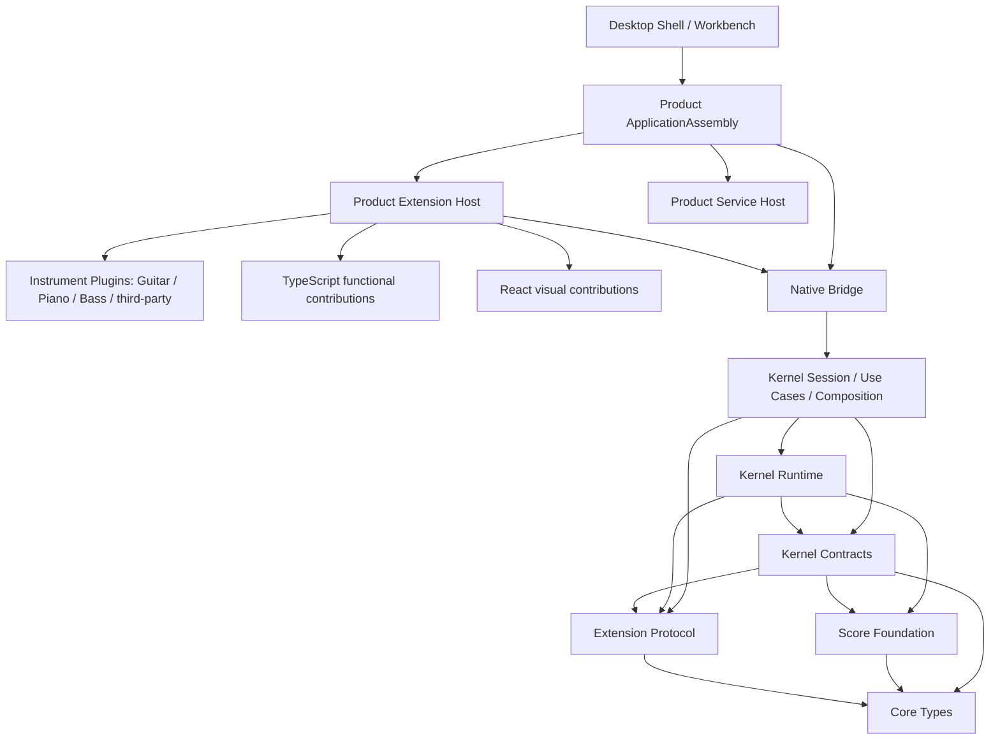
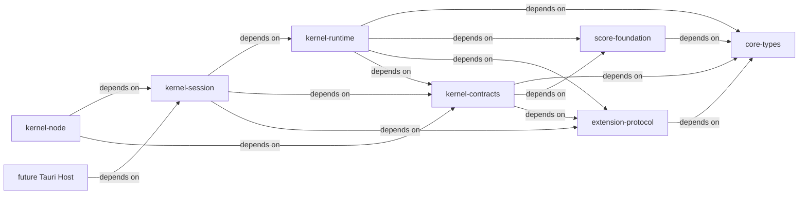
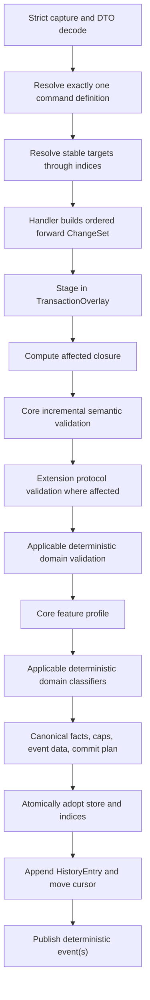
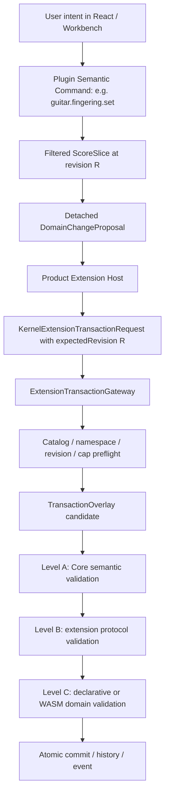
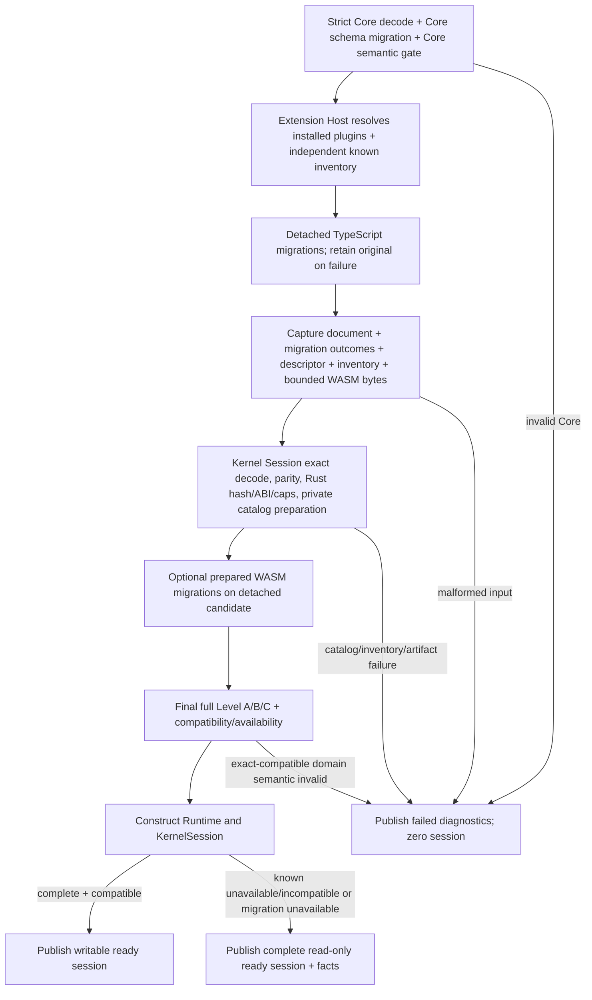
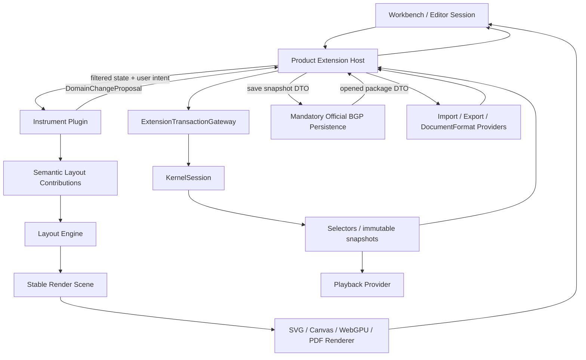

# Brilliant Guitar Architecture Reset V2 — Implementation Architecture Candidate

## 0. Authority, status, and reading contract

This is the self-contained implementation-level candidate for the next Brilliant Guitar architecture. Future operators must be able to understand the target without reconstructing historical Trellis tasks.

| Property | Candidate value |
|---|---|
| Planning base | `5e1599598b1468784ae9b7410383ef63b33201b8` |
| Branch | `codex/brilliant-guitar-architecture-reset-v2` |
| Lifecycle | `planning` |
| Authority | proposed, not current |
| Production authorization | false |
| RKP-1 lifecycle | absent and not started |
| Promotion gate | independent architecture review `0/0/0` plus explicit user acceptance |

Normative words are **MUST**, **MUST NOT**, **SHOULD**, and **MAY**. A future task may choose concrete Rust signatures and containers only where this document explicitly delegates that choice. It may not silently change ownership, observable compatibility, complexity, ordering, or lifecycle decisions.

This candidate changes no production code. Existing documents remain the current historical/operational inputs until a separate docs-only authority-sync commit is accepted.

---

## 1. Executive decision

Brilliant Guitar requires a large internal architecture refactor, not a product reset and not a blind rewrite.

We retain the product goal, general ScoreDocument semantics, 28 Core commands, command/result/failure/issue/event behavior, `brilliant-score-1`, deterministic ordering, unknown-extension preservation, rejection zero-delta, accepted official-provider contracts as migration oracles, and the staged RKP program.

We replace nested-array full scans on writes, full-document clone-per-effect-set transactions, growing history arrays copied per operation, repeated full semantic validation, complete callback-view cloning, and the overloaded use of “Core Kernel” for unrelated owners.

The replacement is an indexed Rust live store, typed generational handles, isolated overlays, compact ChangeSets, cursor history, incremental validation, explicit snapshot materialization, and a KernelSessionComposition that prepares an independent known-requirement inventory plus a private FrozenKernelContributionCatalog from bounded data-only inputs. Guitar/Piano/Bass/third-party Instrument Plugins are equal Product Extension Host consumers of one protocol; official status adds distribution/qualification rather than Runtime privilege.

> Rust is the target runtime, but language replacement alone is not the fix. Translating the current full-scan/full-clone algorithm literally fails this architecture.

---

## 2. Current physical architecture audit

### 2.1 Repository facts at the planning base

The base contains:

- exactly one production source subtree: `src/core-kernel`;
- 71 TypeScript production files and approximately 24,765 production lines;
- `commands` (10,821 lines) plus `registry` (4,563 lines), about 62.12% of production lines;
- centralized files including `commands/integrated-runtime.ts`, `commands/effects.ts`, and `registry/domain-catalog.ts`;
- no production Guitar Domain, Layout, Renderer, Playback, Persistence, Workbench, or public Extension Host;
- no Cargo workspace, Rust production crate, Tauri application, or React application;
- an inherited verified full-suite baseline of 531/531;
- accepted and archived RKP-0 contract/oracle artifacts;
- no implemented RKP-1 through RKP-9.

CVN-7's official stress measurement at `b21540fa...` timed out during `stress-submit`; it produced invalid/incomplete evidence rather than a Core qualification pass or a candidate-specific regression verdict. It motivates remediation but does not authorize observable-contract drift.

### 2.2 Proven interactive hot paths

| Problem | Current evidence | Consequence |
|---|---|---|
| Nested-array target search | `src/core-kernel/commands/target-resolver.ts:185` | Write resolution walks the object graph despite stable IDs. |
| Read index not consumed by writes | `src/core-kernel/read/entity-index.ts:17,29,89,272-293` | Snapshot indexing does not make transactions indexed. |
| Whole-document clone for effects | `src/core-kernel/commands/effects.ts:1741,1753` | Every local edit allocates and visits the full score. |
| Growing arrays copied for history | `src/core-kernel/commands/runtime.ts:203,361,456-457,492` | Repeated commits add an avoidable quadratic history-copy term. |
| Full callback/read-view clone | `src/core-kernel/commands/integrated-runtime.ts:641` | Provider assessment pays global materialization cost. |
| Repeated global semantic pipeline | `src/core-kernel/commands/integrated-runtime.ts:687,692,2003,2134,2315,2400` | A local change repeatedly validates/profiles/classifies global state. |
| DTO tree as runtime and snapshot form | Current command/read modules | Editing, queries and persistence compete around one representation. |

For `K` commands against `E` entities, current work includes a component approximately `O(K × E + K²)`. Constants and language affect absolute time but not this shape.

### 2.3 Governance problems

1. `Core Kernel` currently names product semantics, document truth, transaction mechanics, extension machinery and sometimes the entire product core.
2. Historical architecture documents describe different repository eras.
3. `PURE_CORE_KERNEL_V1_SCOPE` is a compatibility name easily misread as the future physical architecture.
4. Synthetic contract consumers exist, but a real Guitar product vertical slice does not.
5. The accepted TypeScript Module SDK is an official-module compatibility/oracle surface, not automatically a public plugin SDK.
6. Private kernel assembly identity and Product ApplicationAssembly are distinct but historically easy to conflate.

---

## 3. Ubiquitous language and bounded contexts

### 3.1 Top-level model

```text
Brilliant Core Platform
├── Core Types
├── Score Foundation
├── Extension Protocol
├── Kernel Contracts
├── Kernel Runtime
├── Kernel Session / Use Cases
└── Native Bridge
```

`Brilliant Core Platform` is the stable product core. “Microkernel” applies narrowly to Kernel Runtime: a small state/transaction owner that consumes one frozen, data-only contribution catalog through versioned contracts. It does not put music primitives, product workflows, installation and rendering into one module. Imported uses of `LIN` are replaced by `Brilliant Guitar`.

### 3.2 Context ownership

#### Core Types

Owns only cross-context primitives that must remain stable without importing score, command or plugin implementations: EntityId and other stable identifiers, PluginId, ContributionId, NamespaceId, Revision, SchemaVersion, ErrorCode and bounded JSON value primitives. It is the dependency leaf and contains no command DTO, ScoreDocument, runtime state or host object.

#### Score Foundation

Owns pure, runtime-free Fraction, NoteValue, WrittenPitch, Transposition, ScoreDocument, Measure, Part, Staff, Voice, Event, Note, ExtensionBlock envelope, schema-level music invariants, and deterministic `brilliant-score-1` semantic encoding order.

It MUST NOT own command routing, session state, history, RuntimeHandle, Guitar fingering/techniques, UI, layout, playback, filesystem, or plugin lifecycle.

#### Kernel Contracts

Owns versioned Core command/result/failure/issue/event/selector/snapshot DTOs, public schema versions and FFI-safe session types. It composes Core Types, Score Foundation and Extension Protocol types, and does not depend on runtime internals, Node, Tauri, React or any instrument plugin.

#### Extension Protocol

Owns language-neutral, data-only namespace ownership, `ExtensionMutationOperation` fragments, schema/reference/capability declarations, deterministic domain-rule descriptors, WASM module descriptors, migration descriptors, `KernelKnownRequirementInventoryV1`, `KernelContributionCatalogDescriptorV1` and bounded WASM artifact-bundle descriptors. The composite DomainChangeProposal/KernelExtensionTransactionRequest belongs to Kernel Contracts because it may combine a fixed CoreCommand envelope with Extension Protocol operations. Extension Protocol contains no TypeScript instance, DOM object, mutable store or instrument-specific type. The compiled `PreparedKernelContributionCatalog` and `FrozenKernelContributionCatalog` are private Kernel Session objects, not FFI DTOs.

#### Kernel Runtime

Owns LiveScoreStore, every live index, TransactionOverlay, ChangeSet adoption, affected-closure/incremental-validation caches and execution substrate, history cursor/checkpoints, snapshot cache, event sequencing and dirty/replay mechanics. It is the **only** state/transaction/history/event owner, but it does not own validation policy, deterministic WASM preparation/execution, Core handler registration or plugin instances.

#### Kernel Use Cases

Owns orchestration of the 28 Core commands, routes, indexed target resolution, three-level extension validation, no-op, batch, undo, redo and replay. It lives in `brilliant-kernel-session` with the Core handlers and calls Runtime through explicit transaction APIs.

#### Kernel Session / Composition Root

`KernelSessionComposition` is the unique composition root. It captures the document candidate, independent known-requirement inventory, installed contribution descriptor and bounded WASM artifact bundle; prepares one private catalog; then combines Kernel Runtime, Kernel Use Cases, the 28 Core handlers and ExtensionTransactionGateway. Its atomic result is `ready(writable session | global read-only session) | failed`; Runtime itself does not discover or instantiate handlers.

#### Native Bridge

Owns adapters only. Node-API supports compatibility/differential migration. A future Tauri host links Kernel Session directly. Adapters cannot own state or repeat transaction/validation logic.

#### Product Application

Outside Rust Core, it owns Desktop Shell, Workbench, Editor Session, Product ApplicationAssembly, create/open/save/close/recover workflows, Product Extension Host, service composition, public plugin lifecycle/configuration, i18n and presentation. Guitar, Piano, Bass and third-party instruments are equal Instrument Plugins selected here.

### 3.3 Context graph



---

## 4. Rust workspace and dependency law

### 4.1 Target workspace

```text
crates/
├── brilliant-core-types/
├── brilliant-score-foundation/
├── brilliant-extension-protocol/
├── brilliant-kernel-contracts/
├── brilliant-kernel-runtime/
├── brilliant-kernel-session/
└── brilliant-kernel-node/
```

This seven-crate shape closes two problems in the earlier candidate: a minimal leaf prevents Score Foundation from depending on oversized command contracts, and a separate Kernel Session crate prevents Runtime from owning Core handlers/composition. It takes effect only after V2 acceptance and a separate Rust-parent authority sync.

### 4.2 Dependency graph

Every arrow below is labeled `depends on` and points from the consumer to its dependency.



### 4.3 Crate owner table

| Crate | Owns | Does not own |
|---|---|---|
| `core-types` | Stable IDs, revisions, schema/version/error primitives and bounded JSON values | ScoreDocument, commands, runtime, plugins |
| `score-foundation` | Musical values, DTO semantic model, schema semantics, codec ordering | Sessions, commands, history, plugins |
| `extension-protocol` | Extension mutations, known inventory, namespace/reference/capability/schema/rule/WASM artifact/migration/catalog data contracts | Core command envelope, plugin executable instances, compiled artifacts, store, UI |
| `kernel-contracts` | Core commands plus composite plugin proposal/request/result/event/snapshot/session DTOs and versions | Store, host callbacks, instrument implementations |
| `kernel-runtime` | Store, indices, overlay adoption, affected closure/validation substrate, history, snapshots, events | validation policy/WASM executor, Core handler directory, UI, plugin lifecycle |
| `kernel-session` | Use Cases, 28 Core handlers, inventory/catalog/artifact preparation, deterministic validation executor, Extension Gateway and unique composition root | Product plugin discovery, UI, files |
| `kernel-node` | Node capture/mapping, opaque handle, DTO conversion, panic containment | Business truth or second state/validation |

### 4.4 Forbidden dependencies

Architecture checks enforce: Core Types imports no project crate; Foundation imports only Core Types; Extension Protocol imports only Core Types; Contracts never import Runtime/Session/Node/Tauri/React/instrument plugins; Runtime never imports Session/Guitar/product services/React/Tauri/plugin instances; Session never discovers product plugins; Node never implements semantic validation/adoption; Product Host never obtains mutable store; public plugins never link Runtime internals.

---

## 5. Score truth and active representation

### 5.1 One semantic truth, two representations

```text
ScoreDocument DTO
    ↓ descriptor-first capture + exact decode + full validation
LiveScoreStore
    ↓ explicit snapshot / encode
ScoreDocument DTO
```

`ScoreDocument` remains the exchange, persistence, migration and round-trip form. `LiveScoreStore` is the sole mutable form inside a loaded session. Full conversion is limited to session load, explicit full snapshot, encode/save handoff, migration, full-validator fallback, and differential diagnostics. An ordinary local edit MUST NOT rebuild the complete DTO.

### 5.2 Logical store

```text
LiveScoreStore
├── SlotMap<Measure>
├── SlotMap<Part>
├── SlotMap<Staff>
├── SlotMap<Voice>
├── SlotMap<Event>
├── SlotMap<Note>
├── ExtensionBlockStore
├── EntityIndex
├── OwnershipIndex
├── OrderedChildrenIndices
├── VoiceTimeIndices
├── ExtensionIndex
└── ReferenceDependencyIndex
```

`SlotMap` means typed generational storage, not a preselected library. RKP-2 chooses the concrete container after determinism/benchmark evidence.

### 5.3 Identity separation

**EntityId** is persisted, globally unique across score entity types, stable across save/open/migration, and present in commands/events/snapshots/extensions.

**RuntimeHandle** is typed `(slot,generation)` or equivalent, session-private, invalid after generation change, average `O(1)` to dereference, and forbidden from files, FFI, SDK, snapshots and events.

**MusicalLocation** is an exact Fraction position derived from Voice ordering, sequence start and Event durations. It is an index/query key, not identity.

EntityId MUST NOT embed an arena offset or memory address. That would leak allocation into persistence, break reload/compaction and weaken stale-handle detection.

### 5.4 Index inventory

| Index | Key → value | Contract |
|---|---|---|
| Entity | `EntityId → typed RuntimeHandle` | average `O(1)`, duplicate detection |
| Ownership | child handle → parent handle | average `O(1)` |
| Ordered children | parent → ordered children | deterministic stable order |
| Measure order | score → ordered measures | insertion/move/removal |
| Part content | `(Part,Measure) → content/voices` | direct structural lookup |
| Voice timeline | exact Fraction/range → events | `O(log n + k)` |
| Extension | `(namespace,owner) → blocks` | compatibility/migration lookup |
| References | target EntityId → referrers | incremental closure |

Only overlay commit mutates store/indices. A commit plan lists all primary records and index operations; adoption applies all or none. RKP-2 must prove incrementally maintained indices equal indices rebuilt from accepted store state.

### 5.5 Complexity contract

- exact entity and owner lookup: average `O(1)`;
- ordered/exact-time range: `O(log n + k)`;
- pitch edit: one Note plus declared refs/ancestor closure;
- duration edit: one Event plus affected Voice suffix/time aggregate and declared closure;
- insert/delete: affected collections, Voice range, refs and ancestors only;
- ordinary local edit: zero visits to unrelated Part/Voice collections.

Public order is defined by semantic keys, never HashMap, slot, pointer or allocation iteration order.

---

## 6. Score, Guitar, and persistence ownership

### 6.1 Core rhythmic truth

- Event owns duration/NoteValue.
- Event start derives from Voice sequence and preceding durations.
- Chord Notes share the Event start/duration.
- Note stores stable EntityId and WrittenPitch.
- SoundingPitch derives from Part transposition.
- Note MUST NOT gain persistent `time`, `tick`, `duration`, `string`, or `fret`.

Voice time indices may cache aggregates, but they are rebuildable implementation state rather than a second persisted truth.

### 6.2 ExtensionBlock V1

Owner stays `score` or `part(partId)`. Guitar, Piano, Bass and third-party Instrument Plugins are equal protocol consumers and store their data only in accepted namespaces they own. The default official Guitar Plugin may store Part-owned `fingeringByNoteId`, `techniqueByEventId`, `tuning` and domain references; “official” adds no Runtime privilege. Runtime may index declared references, and encoding restores the accepted envelope. Entity/Note-owned blocks require a separate schema task.

### 6.3 `.bgp` boundary

Core Platform owns `brilliant-score-1` meaning, strict semantic codec, Core migration entry and extension compatibility. Mandatory Official BGP Persistence is the sole V1 canonical `.bgp` package owner: zip/package, manifest, paths, atomic replacement, autosave, crash recovery, resource bytes, permissions and unknown-block preservation. Public providers extend import/export/additional formats. Replacing the canonical `.bgp` owner requires a separate product architecture decision. Core never opens a user path or owns product save lifecycle.

---

## 7. KernelSession and native boundary

### 7.1 Required equivalent capabilities

Concrete signatures are frozen by RKP-1/RKP-3, but runtime capability MUST remain equivalent to:

```text
KernelSession::load(...)
KernelSession::submit(...)
KernelSession::undo()
KernelSession::redo()
KernelSession::replay(...)
KernelSession::read_state()
KernelSession::select(...)
KernelSession::mark_persisted(...)
KernelSession::encode_snapshot(...)
```

Every call returns versioned data-only success/failure. Panics are contained at adapter boundaries and mapped to stable failures without backtraces, pointers, file paths, or raw provider errors.

### 7.2 Node-API V1

- exposes opaque `KernelSessionHandle`;
- load and explicit full snapshot/encode may transfer a complete DTO;
- submit/undo/redo/select/markPersisted transfer small DTOs;
- normal edits never transfer a full ScoreDocument in either direction;
- TypeScript captures hostile JavaScript properties descriptor-first;
- Rust exact-shape decodes captured DTOs again;
- returned DTOs are detached/immutable at the TypeScript boundary;
- Rust does not call arbitrary JavaScript transaction callbacks.

The future Tauri host links runtime directly rather than passing through Node. It may use a serialized actor but must preserve identical KernelSession call ordering and results.

---

## 8. Command and transaction protocol

### 8.1 Core command pipeline



### 8.2 Plugin golden path and three distinct objects



The three objects are never aliases:

| Object | Owner/executor | Meaning |
|---|---|---|
| Plugin Semantic Command | TypeScript plugin in Extension Host | Interprets user intent, such as `guitar.fingering.set`. |
| DomainChangeProposal | Plugin output | Detached data-only proposed Core/extension operations based on revision R. |
| KernelExtensionTransactionRequest | Fixed host-to-kernel protocol | Contribution identity, expected revision, prepared-catalog fingerprint and canonical proposal. Validation policy is not a request field. |

Rust registers only fixed Core commands and the generic Extension transaction entry. It does not register or dispatch `guitar.*`, `piano.*` or `bass.*` handlers.

The minimum versioned request shape is equivalent to:

```text
KernelExtensionTransactionRequestV1 {
  protocolVersion: 1
  pluginId
  contributionId
  originPluginCommandId
  expectedRevision
  catalogFingerprint
  proposal: DomainChangeProposalV1
}

DomainChangeProposalV1 {
  operations: nonempty ordered list of
    | CoreCommandOperation(fixed accepted Core command envelope)
    | ReplaceOwnedExtensionBlock(owner, namespace, schemaVersion, payload)
    | RemoveOwnedExtensionBlock(owner, namespace)
}
```

The request does not select or downgrade validation policy. `validationPolicy`, namespace grants, schema allowlists, rule/WASM identities, budgets or Core command capabilities appearing as extra request fields fail exact-shape decoding. KernelSession resolves all of them only from its private frozen catalog. `CoreCommandOperation` is permitted only when the contribution explicitly declares that fixed Core command capability; every Core operation is still routed through the accepted Core handler and all operations share one overlay/history/event unit.

Stable preflight precedence is:

```text
exact root request decode
→ catalog/session identity
→ contribution and namespace ownership
→ expectedRevision
→ proposal/operation exact decode and caps
→ overlay candidate
→ Level A
→ Level B candidate/reference/schema validation
→ Level C domain validation
→ facts/event/cap precommit
→ atomic adoption
```

Stale revision exits before proposal operation decoding, WASM, overlay mutation, history or event work. Validation policy and WASM identity come only from the catalog.

### 8.3 Three-level validation authority

| Level | Owner | Mandatory checks |
|---|---|---|
| A — Core Semantic | Score Foundation defines rules; Kernel Session invokes them over the Runtime overlay | Score hierarchy, stable identities, references, rhythm/time, Core music invariants. |
| B — Extension Protocol | Extension Protocol defines codec/rules; Kernel Session invokes them | catalog authenticity, namespace owner, schema version, operation allowlist, reference declarations, ownership and resource caps. |
| C — Plugin Domain | Plugin supplies accepted rule/WASM data; Kernel Session owns the deterministic executor | Instrument/domain consistency such as tuning/string/fret/pitch, pedal state or technique relationships. |

An Instrument Plugin whose persisted data influences layout, playback, migration or later writes declares `validationPolicy=domain-required` only in its installed contribution descriptor and provides either accepted DeclarativeDomainRules or a deterministic WASM validator. The independent inventory retains the accepted `requiredForWrite: true` fact rather than duplicating policy. A known required contribution that is absent or version-incompatible makes the entire KernelSession read-only under the accepted availability oracle; namespace-local write degradation is not introduced by V2. An installed `domain-required` descriptor lacking its declared rule/artifact is malformed preparation and publishes zero session rather than silently degrading its claimed validation. A `structural-only` policy is limited to installed opaque/advisory metadata that does not claim instrument-domain validity.

Validators return diagnostics/classification only. The only writer remains Runtime through Overlay/ChangeSet.

### 8.4 Deterministic WASM execution contract

Transaction WASM receives canonical detached input containing the compatible filtered ScoreSlice, current ExtensionBlock data, proposal, declared schema and resource budget. Output is exact and role-specific:

```text
validator: valid | invalid(ordered diagnostics)
classifier: supported | unsupported(ordered facts)
migration: target-version replace-owned-block candidate
```

Validator `unsupported`, classifier `valid`, migration diagnostics, or any cross-role union is malformed output. The host environment exposes no mutable store, wall clock, random source, filesystem, UI/DOM, thread creation or arbitrary host callback. Execution is bounded by the Rust-computed module hash, exact ABI version, at most 512 linear-memory pages (32 MiB), 10,000,000 fuel units per call, a 1 MiB engine stack limit, 1 MiB returned bytes, 1,024 diagnostics per callback, 4,096 aggregate transaction diagnostics and 131,072 canonical facts. Trap, timeout/fuel exhaustion, malformed output or cap overflow produces an atomic contribution failure; later domain validators do not run and state remains zero-delta. Changing these V1 limits requires a versioned protocol decision.

Simple plugin authors can use TypeScript SDK builders for DeclarativeDomainRules. Complex domains may ship a WASM module produced by any toolchain that conforms to the same versioned protocol; Rust knowledge is not an application-level privilege.

### 8.5 Handler and proposal boundary

A Core handler receives exact decoded payload, stable target IDs, a restricted detached read view and a restricted typed ChangeSet builder. A plugin handler executes in Product Extension Host and returns DomainChangeProposal data; it never receives a Rust builder.

It never receives mutable LiveScoreStore, RuntimeHandles, mutable indices, history, event dispatcher, Node/React/Tauri objects, or async/Promise callbacks.

### 8.6 ChangeSet and inverse

Each change records a typed stable address, necessary precondition and forward action/value. Runtime reads the overlay-aware current value and derives inverse before staging forward. Inverses are stored in reverse-safe order.

Required change classes include scalar replacement, entity insert/remove, ordered-child insert/remove/move, ExtensionBlock replace/remove, and declared reference update. RKP-3 freezes exact enums and resource caps. History/FFI never stores closures or trait/function pointers.

### 8.7 Atomicity and rejection

Before commit the session completes decode, route, indexed resolve, proposal/request checks, overlay checks, affected closure, Level A/B/C assessment, profile/classification, resource caps, canonical facts/addresses/event data and the entire store/index commit plan.

On rejection, all are unchanged:

- live entities and every index;
- revision and snapshot-cache identity;
- history entries/cursor/redo tail;
- checkpoint identity;
- dirty and validation availability;
- event sequence and subscriber observations.

Subscriber failure occurs after commit, is isolated, and cannot roll back the transaction.

### 8.8 Stale revision

Every plugin request carries `expectedRevision`. If it differs from current revision, Kernel Session returns stable `extension.stale-revision` before proposal application or domain validation. Runtime performs no automatic rebase.

Extension Host may reacquire the latest ScoreSlice and re-execute the original Plugin Semantic Command once when the command descriptor marks it `recomputable`. It submits a newly derived proposal; it never edits/rebases the old proposal. Positional/destructive commands or a second stale result return to Workbench for explicit user confirmation.

### 8.9 Batch

Batch children share one overlay and later children see earlier staged changes. Any child rejection discards the whole overlay. One accepted batch creates exactly one revision, history entry and committed event unit while preserving child boundaries in history/facts. V2 does not create an arbitrary public transaction callback.

### 8.10 No-op

A semantic no-op still performs target resolution, Level A Core assessment, applicable Level B extension validation, applicable Level C domain validation, profile and classification. It does not adopt store/indices, increment revision/history, change dirty state, or publish a committed event.

---

## 9. History, undo, redo, replay, and checkpoint

### 9.1 Structure

```text
History
├── Vec<HistoryEntry>
└── cursor: usize
```

Each entry stores semantic command identity/envelope data, ordered forward ChangeSet, reverse-safe inverse ChangeSet, canonical stable affected addresses, module/contribution identity where applicable, batch-child boundaries, and deterministic facts needed by accepted behavior.

It never stores a full document, RuntimeHandle, handler/function, wall clock, random ID, raw error, UI object or file object.

### 9.2 Behavior

- accepted submit after undo truncates entries after cursor;
- undo applies inverse without command preparer;
- redo applies forward without command preparer;
- undo/redo rerun Level A/B/C validation and classification under accepted behavior;
- replay reroutes original semantic envelopes and never uses stored ChangeSets as commands;
- empty undo/redo retains existing stable failures;
- history is never silently evicted.

### 9.3 Checkpoint

Checkpoint is scheduled after 512 committed entries or 32 MiB accumulated ChangeSets. Snapshot construction runs after the interactive commit critical section and is tied to an accepted revision. Physical journal/crash recovery belongs to Persistence.

---

## 10. Incremental validation

### 10.1 Validator declaration

Every validator declares directly observed entity/change classes, parent/ancestor closure, referenced-entity closure, document-wide invariants, canonical issue ordering key, incremental support and full-fallback classes. Undeclared reads are a contract defect.

### 10.2 Affected closure

The default closure grows only as declared:

```text
changed Note/Event
→ owning Event/Voice
→ affected Voice time suffix
→ MeasureContent
→ Part
→ referenced MeasureDefinition/entities
→ explicitly declared document-wide invariant
```

It does not automatically include every Part, Voice, Event or ExtensionBlock.

### 10.3 Full fallback

Full validation is required for session load, migration, unclassified ChangeSet, validators not yet accepted for incremental closure, explicit parity check, debug/differential sampling, and index rebuild/recovery verification. Fallback is visible in metrics, not changed public ordering.

### 10.4 Equivalence gate

Before acceptance:

```text
canonical(incremental diagnostics) == canonical(full diagnostics)
```

Compare code, location, severity, issue order, facts, support classification and validation availability. Property/generative cases cover changes inside and outside the closure. Hash/slot iteration order never becomes public diagnostic order.

---

## 11. Selectors, snapshots, events, and concurrency

### 11.1 Selectors and snapshots

- selectors query LiveScoreStore/indices directly;
- selector must not first materialize a complete ScoreDocument;
- full DocumentSnapshot is explicit and revision-addressed;
- at most one full snapshot per revision may be cached;
- a commit creates a new revision and never mutates an older snapshot;
- FFI results are detached/immutable;
- RuntimeHandle never appears in results.

Domain-validation views are filtered by capability, target/owner and compatibility. They are detached semantic views, not clones of unrelated sections.

### 11.2 Events

Retain committed and dirty-state-changed events with stable command identity, affected stable addresses, deterministic sequence, cause, and accepted facts. Events exclude ChangeSet/inverse, RuntimeHandle/index key, provider object, full document, UI/React/Tauri object, path, and raw panic.

### 11.3 Thread model

- one KernelSession has one sequential write owner;
- submit/undo/redo/replay/markPersisted execute in call order;
- Level C declarative/WASM validation is synchronous and bounded during transaction; arbitrary TypeScript/React plugin code remains outside the transaction;
- reentrant write retains stable rejection behavior;
- immutable snapshots may be read by background tasks;
- Node-API V1 is synchronous/owner-thread bound;
- future Tauri may use one serialized session actor without changing semantics.

---

## 12. Extension and assembly architecture

### 12.1 Unified plugin package

Guitar, Piano, Bass, other instruments, functional plugins and visual contributions use one Product Extension Host lifecycle and versioned public plugin protocol. “Official” means default distribution, project maintenance and qualification level; it never grants direct Store access or a private handler API.

An Instrument Plugin package may contain:

```text
plugin manifest
TypeScript semantic command handlers
Extension namespace/schema/reference declarations
DeclarativeDomainRules and/or deterministic validator WASM
detached pre-session migrations
React Workbench contributions
Layout contributions
Playback contributions
optional bounded compute WASM
```

### 12.2 Namespace ownership and cross-plugin collaboration

Each accepted contribution has one owner `(pluginId, contributionId)` and a declared namespace set. Default write authority is exactly its own namespaces. Read authority is the filtered Core snapshot plus explicitly published contribution APIs/capabilities.

Plugin A never mutates Plugin B's ExtensionBlock. Cross-plugin collaboration uses a versioned, declared, read-only/public contribution contract or asks B through a Product Host capability. Dependencies, versions, namespace collisions and capabilities are resolved before session composition and frozen for the session.

### 12.3 Independent known-requirement inventory

Installed contributions and known document requirements are separate inputs. V2 retains the accepted `KernelKnownRequirementInventoryV1` shape and extends no authority through it:

```text
KernelKnownRequirementInventoryV1 {
  inventoryVersion: 1
  requirements: up to 1,024 exact rows {
    requirementVersion: 1
    namespace
    moduleId
    contributionId
    supportedSchemaVersions: 1..256 strictly ascending positive safe integers
    requiredForWrite: true
  }
}
```

The strict codec accepts a dense requirement array in any input order, rejects accessors, extra fields and malformed rows, then normalizes rows canonically by namespace, moduleId and contributionId. `supportedSchemaVersions` itself must already be nonempty, strictly ascending and duplicate-free. Duplicate namespace rows, more than 1,024 rows or more than 256 versions in one row reject preparation. Every installed catalog **requirement row** must appear exactly once with identical data; inventory may additionally retain a requirement whose module/contribution identity is absent. Reusing an installed identity with a namespace, versions or required-for-write fact that does not match one of that contribution's real requirement rows rejects parity rather than borrowing authority. In V1 the Product Plugin `pluginId` is captured as the exact same lexical runtime `moduleId`; there is no alias map, and a future rename requires protocol versioning.

The inventory is assembled from the application-known plugin registry plus package requirement metadata. Future Official BGP Persistence carries this exact data in the `.bgp` manifest; before that product service exists, RKP fixtures and explicit application construction supply it. Package/inventory data can only restrict availability and identify an absent requirement; it never grants namespace write authority, Core command capability or executable identity.

The existing catalog-only compatibility overload remains exact and derives an installed-only inventory. New Product Application session construction uses the explicit inventory form so absent requirements are reachable. Neither path changes the accepted application runtime export count, Module SDK `8/34` surface or nine-field contribution ABI.

After a valid inventory decode, a matching row means **known** even when its plugin is absent. A row with a matching block version and no installed contribution is unavailable; an unlisted/future version is incompatible whether or not the contribution is installed. Only an inventory miss is unknown opaque data. Unknown blocks remain losslessly preserved and writable under Core rules but are excluded from installed-domain completeness claims.

### 12.4 Preparation descriptor, WASM artifacts and private catalog

Product Extension Host resolves selected plugins and produces a strict `KernelContributionCatalogDescriptorV1` containing identities, namespaces, schema versions, reference policies, validation policies, rule descriptors, WASM references, resource budgets and deterministic order. It contains no TypeScript/React instance, DOM object, arbitrary callback, local path or mutable alias.

WASM reaches Rust only through a one-time `KernelWasmArtifactBundleV1` captured with session preparation:

```text
KernelWasmArtifactBundleV1 {
  artifactBundleVersion: 1
  artifacts: up to 256 exact rows {
    artifactId
    role: validator | classifier | migration
    abiVersion
    declaredSha256
    bytes: detached immutable byte sequence, at most 8 MiB
  }
}
aggregate artifact bytes: at most 64 MiB
```

The Node bridge copies a contiguous byte carrier once into Rust-owned memory before validation; Tauri passes an owned byte vector. Local paths, lazy loaders, shared mutable buffers and host callbacks are excluded. Every catalog reference resolves exactly one artifact and every supplied artifact must be referenced. Rust computes SHA-256 from captured bytes, compares it to the descriptor, checks the exact ABI/role, applies the count/per-artifact/aggregate caps, and compiles a private prepared artifact. Hash mismatch, unsupported ABI/role, duplicate or unused artifact, cap overflow and compile failure are distinct deterministic preparation diagnostics and publish no partial catalog or runtime.

`KernelSessionComposition` then compiles a private `PreparedKernelContributionCatalog` from the authentic descriptor, independent inventory and prepared artifacts. Construction priority is fixed: Core strict decode/schema migration/semantic validity; descriptor exact decode/authenticity; inventory decode/caps; installed-inventory parity; artifact bundle exact decode/caps; Rust hash; ABI/role; compile; private composition identity; extension compatibility/availability; migrations; final Level A/B/C; Runtime construction. Current accepted failure precedence and data-only mappings remain migration oracles; RKP-5 freezes the Rust enum/mapping without adding an application runtime export.

The final `FrozenKernelContributionCatalog` contains data-only normalized entries plus private prepared artifact handles, a process-local composition identity and a canonical fingerprint over descriptor + inventory + artifact hashes + limits. It is never serialized or accepted back from FFI. A request's `catalogFingerprint` is only a deterministic session-mismatch check, not authenticity. Structural lookalikes cannot manufacture the private identity. Ready-session membership is immutable; plugin configuration changes take effect in a new session.

### 12.5 KernelSessionComposition and availability

Owned exactly once by `brilliant-kernel-session`. It combines:

```text
KernelRuntime
KernelUseCases
28 CoreHandlers
ExtensionTransactionGateway
KernelKnownRequirementInventoryV1
FrozenKernelContributionCatalog
```

Its atomic result is:

```text
ready {
  session
  mode: writable | read-only
  writeAvailability
  validationAvailability
  compositionIdentity
}
| failed { data-only diagnostics }
```

Known unavailable or incompatible blocks produce a complete **read-only KernelSession**, not a result outside composition. That session retains decode/encode, immutable snapshot, selectors, inspection, checkpoint bookkeeping, incomplete validation reporting and exact opaque ExtensionBlock preservation. Submit, undo, redo and the first replay write run one cached global availability preflight before request decoding, empty-history checks, proposal handling, WASM or other callbacks. Incompatible wins the public failure code over unavailable while the result carries the complete canonical mixed fact list. Empty replay remains the accepted no-write exception. Namespace-local write mode is outside V2.

Malformed Core data, malformed preparation inputs, catalog/inventory parity failure, artifact preparation failure or installed exact-compatible domain semantic invalidity yields `failed` and publishes zero session. Missing plugins, unsupported block versions or an unavailable migration preserve the Core-valid document and publish a read-only session with canonical availability/diagnostic facts. Kernel Runtime itself neither discovers plugins nor owns the Core handler count.

### 12.6 Product ApplicationAssembly

Owned exactly once by Product Host. It combines an accepted KernelSession factory, Product Extension Host, selected Instrument/functional/visual plugins, Workbench contributions, service providers, Official BGP Persistence and i18n. It returns `ready | failed` and freezes after ready.

Product assembly identity is distinct from KernelSession composition identity. Product Host passes only the detached document candidate, inventory, catalog descriptor, migration outcomes, bounded artifact bundle and fixed DTOs through the bridge; KernelSessionComposition alone prepares the private catalog and never exposes it back to the host. Product Host never reconstructs Runtime private state.

### 12.7 Pre-session preparation and migration

Opening a document uses this sequence:



TypeScript migration executes in Product Extension Host before any session exists and may transform only a detached block/candidate. A throw, malformed return or failed owner/namespace/source/target check discards that candidate and records a data-only migration-unavailable outcome against the unchanged Core-valid document. After capture, arbitrary TypeScript no longer runs.

Optional WASM migration executes only through the prepared private artifact after Rust hash/ABI/cap checks. It must return a target-version owned-block replacement; remove, cross-namespace change, wrong version, trap, fuel exhaustion or malformed output discards the candidate. Rust performs strict round-trip decode and final Level A/B/C validation before publishing. Missing plugins and failed/unavailable migrations preserve the original ExtensionBlock and enter the complete read-only session path; no partially migrated writable session exists.

### 12.8 Plugin lifecycle

Product Extension Host owns discovery, install/remove, enable/disable config, manifest, dependency resolution, permission/capability mapping, fault isolation, version compatibility and restart prompts. V1 changes apply to a new session; ready-session hot reload/unload/replace remains outside the first architecture.

---

## 13. Product service data flow



### 13.1 Layout and rendering separation

Instrument Plugin describes **what must be represented** using versioned semantic layout contributions such as `StringNumber`, `FretLabel`, `BendCurve` or `TabStaff`. Layout Engine decides position/spacing and produces a renderer-neutral Render Scene. Renderer decides how that scene becomes SVG, Canvas, WebGPU or PDF. Instrument plugins never receive renderer objects or issue `drawLine`/DOM calls.

### 13.2 Service qualification levels

Layout, Renderer, Playback and Import/Export can have replaceable providers behind Product Host ports. Canonical `.bgp` durability is different: Official BGP Persistence is a mandatory qualified product service and the sole V1 owner of save, atomic replacement, autosave/recovery and unknown-extension preservation. Additional `DocumentFormatProvider` implementations do not replace canonical save implicitly.

### 13.3 No second truth

KernelSession owns score truth/transactions. Services and plugins consume immutable/filtered reads and return DTOs/proposals. Workbench may cache selection, viewport and input state but cannot become an alternative mutable score.

### 13.4 Architectural style

Brilliant Guitar is intentionally a hybrid: Microkernel/Plugin Architecture + Domain Model + Ports & Adapters + Command/Handler + CQRS-like read/write separation + Transactional Runtime Core. “Microkernel” does not force Product Host, plugins, persistence or rendering into Kernel Runtime.

---

## 14. Compatibility boundary

Architecture Reset preserves these observable inventories as migration inputs:

| Surface | Frozen value |
|---|---|
| Core commands | 28 IDs |
| Application runtime exports | 51 |
| Module SDK runtime exports | 8 |
| Module SDK type exports | 34 |
| Contribution ABI | 9 fields |
| Persisted schema | `brilliant-score-1` |

The accepted TypeScript Module SDK remains a compatibility/oracle surface for CVN behavior. V2's future public Plugin SDK is a separate Product Extension Host surface and does not reinterpret the old SDK as a privileged instrument API. RKP-8 removes obsolete TypeScript transaction execution from the live Product ApplicationAssembly when Rust becomes default. RKP-9 may clean internal oracle code only after differential and qualification acceptance. Public names remain until an independently versioned compatibility decision.

---

## 15. Performance and resource qualification

### 15.1 Blocking targets

| Operation | Target |
|---|---:|
| Representative submit/undo/redo | p95 ≤ 8 ms; p99 ≤ 16 ms |
| Local edit in 102,400-Event score | p95 ≤ 16 ms; p99 ≤ 33 ms |
| Cached selector | p95 ≤ 1 ms |
| Batch-100 | p95 ≤ 100 ms |
| Replay-100 | p95 ≤ 500 ms |
| 10,000 submit | ≤ 180 s |
| 10,000 replay | ≤ 180 s |
| Representative peak RSS | ≤ 1 GiB |
| Stress peak RSS | ≤ 2 GiB |

Qualification uses versioned fixtures, deterministic seeds, explicit warmup/sample methods, machine metadata, native exit diagnostics, progress evidence, and zero partial publication on invalid runs.

### 15.2 Complexity counters

Every measured operation records full-document scans, full-document clones, full semantic validations, full snapshot materializations, entities visited, indices updated, overlay records, ChangeSet bytes, and FFI request/response bytes.

For ordinary local submit/undo/redo after load/warmup, the first four counters MUST be zero. A latency pass with hidden global work is not an architecture pass.

### 15.3 Resource rules

Accepted CVN caps remain migration inputs. Rust allocations, recursion, callback issue/fact counts, ChangeSet size, affected-address count, snapshot and FFI payloads require caps and stable data-only failure. Observable limit changes require compatibility proof or separate versioning.

---

## 16. Staged migration and rollback

### 16.1 RKP ownership

| Stage | Unique deliverable | Default runtime after acceptance |
|---|---|---|
| RKP-0 | Current authority, 64-row oracle, qualification method | TypeScript |
| RKP-1 | Seven-crate workspace, Core Types, contracts and bridge/session smoke | TypeScript |
| RKP-2 | Indexed LiveScoreStore, load/encode/index parity | TypeScript |
| RKP-3 | Overlay/ChangeSet and 28 Core commands | TypeScript |
| RKP-4 | History, selectors/snapshots, events, replay | TypeScript |
| RKP-5 | Incremental validation; Extension Protocol/request codecs; Catalog-only policy; DeclarativeDomainRules; bounded WASM artifact capture, hash/ABI compilation and deterministic executor | TypeScript |
| RKP-6 | Known inventory; descriptor/inventory parity; private catalog/composition identity; global read-only KernelSession; gateway/stale revision/namespace enforcement; detached TS/prepared-WASM migration orchestration; two external synthetic Instrument Plugins | TypeScript |
| RKP-7 | Full TS/Rust differential and performance gates for Core plus unavailable/incompatible/unknown/mixed, artifact preparation, migration and plugin transaction golden paths | TypeScript |
| RKP-8 | One reviewed commit switches the default KernelSession implementation | Rust |
| RKP-9 | Qualification V2 of already implemented Core/Session/plugin-protocol capabilities; persistence/layout product-port fixtures only; obsolete TS-oracle cleanup after PASS | Rust |

RKP-0 remains accepted input. After V2 acceptance, RKP-1 planning must adopt the seven-crate split and repaired plugin/session boundaries through a separate authority-sync; it may not start from the older four/five-crate proposals unchanged.

### 16.2 Stage protocol

Every stage has one dependency-satisfied child, independent branch/worktree, exact allowlist, frozen rollback point, focused/full/differential gates, separate implementation audit, explicit acceptance and archive. Failure returns to the previous accepted stage.

No long-lived product-visible dual-engine switch exists. TypeScript remains default through RKP-7; RKP-8 performs one reviewed switch; RKP-9 cleans only after qualification.

RKP-5 is the sole owner of the deterministic rule/WASM preparation and executor mechanism. RKP-6 is the sole owner of composition-time inventory, availability, gateway, namespace, stale-revision and migration orchestration. RKP-7 only proves parity/performance and returns feature changes to RKP-5 or RKP-6. RKP-8 only changes the default KernelSession implementation. RKP-9 qualifies accepted capabilities and may clean the old oracle only after PASS; it does not implement Official BGP Persistence, Layout, Renderer or the real Guitar Plugin. Those remain independent post-RKP product children with their own implementation and qualification.

### 16.3 Rollback

- RKP-1–RKP-7: abandon/revert new Rust artifacts; TypeScript default never moved.
- RKP-8: revert the single default-KernelSession switch to accepted RKP-7.
- RKP-9: cleanup is later than qualification; failure leaves accepted RKP-8 and retained oracle evidence.

---

## 17. First post-Rust Guitar Core Loop

Immediately after RKP-9 acceptance/archive:

```text
Default Official Guitar Instrument Plugin through the public plugin protocol
→ create one default guitar Part
→ insert ordinary notes/rests
→ attach basic fingering
→ derive Layout primitives
→ render SVG
→ basic Playback
→ save/open .bgp
→ undo/redo the journey
```

V1 is limited to one default Guitar Part, bounded measures, ordinary note/rest entry, basic string/fret assignment, visible notation/tab, basic playback, save/reopen semantic equality, and undo/redo across the journey.

This is the first real vertical consumer of Core Platform and the same protocol later used by Piano, Bass and third parties. The minimum public Plugin SDK required for this one plugin is implemented with the loop; broader marketplace/lifecycle APIs, generic registries, advanced techniques, complex engraving and broad capability frameworks wait until it passes.

---

## 18. Supersession decisions

| Old idea or wording | V2 decision | Owner/rule |
|---|---|---|
| Rust Core equals Microkernel | Revised | Core Platform has several contexts; only Runtime is microkernel-like. |
| Kernel owns plugin lifecycle | Superseded | Product Extension Host owns it. |
| Multiple generic registries | Superseded | FrozenKernelContributionCatalog plus Product Application provider directory. |
| Application Layer all in Rust | Revised | Kernel Use Cases/Composition in `kernel-session`; Product Application host-side. |
| Note stores time/duration | Rejected | Event/Voice sequence is truth. |
| Runtime slot forms stable ID | Rejected | EntityId and RuntimeHandle stay separate. |
| per-Note ExtensionBlock in performance work | Deferred | V1 remains score/Part-owned. |
| TypeScript and React are both plugin languages | Revised | TypeScript executes plugin semantics; React is optional visual contribution; deterministic declarative/WASM logic may enter the transaction. |
| Translate old full-document algorithm into Rust | Rejected | Indexed store/overlay/incremental validation required. |
| Permanent TS/Rust dual engine | Rejected | RKP-8 cutover, RKP-9 cleanup. |
| Continue horizontal Kernel work after Rust | Rejected | Guitar Core Loop first. |
| `PURE_CORE_KERNEL_V1_SCOPE` describes future physical architecture | Historical compatibility name | Retain export; V2 defines physical contexts. |
| Instrument Domain is a privileged official Rust provider | Rejected | Guitar/Piano/Bass/third-party plugins use the same Product Extension Host protocol. |
| ApplicationAssembly equals kernel composition | Rejected | Product ApplicationAssembly and KernelSessionComposition have separate owners, identities and failure boundaries. |
| Every persistence provider may replace `.bgp` | Rejected | Official BGP Persistence is mandatory canonical owner; other formats use provider ports. |
| Instrument plugin draws through Renderer APIs | Rejected | Semantic Layout Contribution → Layout Engine → Render Scene → Renderer. |

Old documents remain for traceability. Candidate creation does not edit them. A later accepted docs-only sync marks conflicts `historical/superseded` and updates current indexes.

---

## 19. Future implementation verification matrix

| Area | Required evidence |
|---|---|
| Load/encode | semantic/deterministic parity; duplicate EntityId; unknown ExtensionBlock preservation |
| Handles/indices | stale handle; O(1) counters; exact-time range; rebuild parity |
| Local edits | insert/delete/pitch/duration; zero unrelated Part/Voice visits; zero global counters |
| Transaction | rejection zero-delta; ordered multi-effect; batch atomicity; no-op; caps |
| History | submit/undo/redo; tail truncation; empty cases; 512/32MiB checkpoint; no document copies |
| Replay | semantic reroute; no stored-effect command input; deterministic state/event |
| Validation | incremental/full parity; fallback; canonical issues/facts/availability |
| Known requirements | exact `requirementVersion: 1`; explicit inventory 1,024/1,025 rows; versions 256/257; duplicate namespace/parity; arbitrary dense input-order normalization; unavailable/incompatible/unknown/mixed; canonical facts; complete read-only Session |
| Domain contributions | installed catalog order; inventory parity; zero-compatible callbacks; throw/panic/malformed isolation; restricted view/builder |
| Plugin request | Plugin Command/Proposal/Kernel Request separation; `validationPolicy` extra-field rejection; stale revision; one recomputation; no Core rebase |
| WASM preparation | artifacts 256/257; 8 MiB and aggregate 64 MiB boundaries; detached-byte alias isolation; Rust SHA-256; hash/ABI/role/unused/compile precedence |
| Domain validation | Level A/B/C order; declarative/WASM parity; trap/fuel/memory/stack/output/issue/fact caps; zero-delta |
| Namespace | owner-only writes; collision; declared cross-plugin contribution; missing dependency degradation |
| Migration | detached pre-session TS then prepared-WASM migration; original-candidate preservation; missing/failed migration read-only Session; zero partial writable session |
| Snapshot/event | old snapshot stability; cache; detached aliases; event identity/order/dirty |
| Boundary | hostile JS; exact Rust decode; no handle/pointer/path/backtrace leaks; FFI caps |
| Differential | 64-row oracle; 28 commands; 51 exports; SDK 8/34; ABI 9; schema V1 |
| Performance | 60 FPS; 102,400-Event edit; batch/replay; 10,000 operations; RSS; complexity counters |
| RKP qualification | RKP-7 differential/performance; RKP-8 switch only; RKP-9 qualifies already implemented Core/Session/plugin fixtures and cleans only after PASS |
| Post-RKP product | Guitar edit, fingering, layout, SVG, playback, `.bgp`, reopen, undo/redo through separately implemented product children |
| Product services | semantic layout chain; renderer replacement; mandatory canonical BGP owner; import/export providers; no premature RKP-9 service qualification claim |

---

## 20. Protected compatibility inventories

### 20.1 Core semantic commands (28)

```text
core.document.set-metadata
core.note.set-written-pitch
core.event.set-note-value
core.voice.insert-notes-event
core.voice.insert-rest-event
core.event.remove
core.measure.insert
core.measure.remove
core.measure.move
core.measure.set-definition
core.part.insert
core.part.remove
core.part.move
core.part.set-name
core.part.set-instrument
core.staff.insert
core.staff.remove
core.staff.move
core.staff.set-definition
core.voice.insert
core.voice.remove
core.voice.move
core.voice.set-default-staff
core.voice.set-sequence-start
core.event.set-staff-assignment
core.range.delete
core.range.transpose-written-pitch
core.transaction.batch
```

### 20.2 Application runtime exports (51)

```text
CORE_KERNEL_STARTUP_MANIFEST
CommandBus
K1_SCORE_FEATURE_PROFILE
KernelModuleGateway
KernelRegistry
PURE_CORE_KERNEL_V1_SCOPE
SCORE_DOCUMENT_SCHEMA_VERSION
addFractions
compareFractions
createDiagnostic
createFraction
createKernelRegistry
createKernelValidationReport
createModuleInternalIssue
createScoreDocument
decodeScoreDocument
deriveSequenceEventStarts
encodeScoreDocumentJson
getEffectiveMeasureDuration
getNoteValueDuration
isCanonicalFraction
isJsonValue
isNoteValueBase
isNoteValueDots
isScoreDocumentSchemaVersion
isTransposition
isWrittenPitch
mapCheckpointFailureToKernelIssues
mapCommandBusCreationFailureToKernelIssues
mapCommandFailureToKernelIssues
mapDiagnosticToKernelIssue
mapEventSubscriptionFailureToKernelIssues
mapReadFailureToKernelIssues
mapRegistryAccessFailureToKernelIssues
mapRegistryStartupFailureToKernelIssues
migrateKernelExtension
migrateScoreDocument
multiplyFractions
parseScoreDocumentJson
replayCoreCommands
replayKernelCommands
selectDirtyState
selectHistoryState
selectScoreEntity
selectScoreEntityOwnership
selectScoreMetadata
selectScoreRange
subtractFractions
transposeWrittenPitch
validateScoreDocumentSemantics
validateScoreFeatureProfile
```

### 20.3 Module SDK runtime exports (8)

```text
ModuleKernelErrorBase
OFFICIAL_MODULE_SDK_V1_LIMITS
compileOfficialModuleCatalogV1
createModuleKernelIssueV1
defineDomainCommandContributionV1
defineDomainCommandRegistrationEntryV1
defineDomainCommandV1
defineModuleEffectV1
```

### 20.4 Module SDK type exports (34)

```text
CompiledDomainCommandContributionV1
CompiledDomainCommandDefinitionV1
CompiledDomainCommandRegistrationEntryV1
CompiledModuleEffectDefinitionV1
CoreWrittenPitchEffectRequestV1
DomainCommandDecodeInputV1
DomainCommandDecodeResultV1
DomainCommandDecoderV1
DomainCommandDefinitionInputV1
DomainCommandDescriptorV1
DomainCommandPreparationResultV1
DomainCommandPreparerV1
DomainContributionReadViewV1
DomainEffectRequestV1
DomainSemanticValidatorV1
DomainSupportClassificationV1
DomainSupportClassifierV1
ExtensionRuntimeRequirementV1
KernelIntegratedCatalog
ModuleEffectApplyInputV1
ModuleEffectApplyResultV1
ModuleEffectDefinitionInputV1
ModuleEffectDescriptorV1
ModuleEffectPayloadDecodeResultV1
ModuleEffectPayloadDecoderV1
ModuleEffectTransformerV1
ModuleIssueCode
ModuleIssueCreationResultV1
ModuleIssueInputV1
ModuleKernelIssue
ModuleOwnedEffectRequestV1
OfficialModuleCatalogCompilationResultV1
OfficialModuleDefinitionResultV1
OfficialModuleSdkV1Limits
```

### 20.5 Contribution ABI fields (9)

```text
apiVersion
moduleId
contributionId
extensionNamespaces
extensionRequirements
commands
validate
classify
effects
```

---

## 21. Architecture invariants

1. One active mutable score owner: Kernel Runtime.
2. One persisted semantic model: Score Foundation and `brilliant-score-1`.
3. DTO and live representations convert explicitly and are not edited simultaneously.
4. EntityId, RuntimeHandle and MusicalLocation remain distinct.
5. Ordinary local edits perform no full scan, clone, validation or snapshot.
6. Store and indices adopt atomically from one overlay.
7. History stores changes, not documents.
8. Incremental validation is gated by full parity.
9. Public ordering is semantic, not hash/allocation order.
10. Guitar, Piano, Bass and third-party Instrument Plugins use the same protocol and never access mutable store.
11. Plugin Semantic Commands execute in Extension Host; Rust receives only fixed data-only requests.
12. Known requirements and installed contributions are separate; only a valid inventory miss is unknown opaque data.
13. Any known unavailable/incompatible requirement makes the complete KernelSession globally read-only while preserving selectors, snapshots and encode.
14. Transaction requests never carry validation policy; private prepared catalog data is the sole transaction-time source.
15. Domain-required writes pass DeclarativeDomainRules or bounded deterministic WASM inside the transaction.
16. WASM bytes are captured once, hashed and compiled by Rust before any WASM migration or validation.
17. Plugins write only owned namespaces; cross-plugin collaboration uses declared public contributions.
18. React contributes views, not score truth; Instrument Plugins contribute semantics, not renderer calls.
19. KernelSessionComposition and Product ApplicationAssembly have different unique owners.
20. Plugin migrations finish on detached data before a writable session exists; unavailable migration publishes only a read-only Session over preserved data.
21. Official BGP Persistence uniquely owns canonical `.bgp` durability in V1 and is implemented after RKP qualification.
22. Product files and plugin lifecycle remain outside Core Platform.
23. Every RKP stage remains reversible until the one reviewed cutover.
24. RKP-9 qualifies implemented Core/Session/plugin fixtures; real Persistence/Layout/Guitar qualification belongs to their post-RKP product children.

Any future task needing to violate an invariant returns to architecture planning and independent review rather than stretching a stage.
