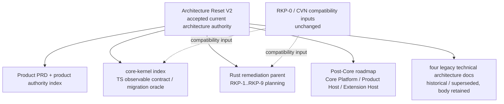

# Design — Architecture Reset V2 Authority Sync

## 1. Source of truth

The accepted source is `.trellis/tasks/08-16-brilliant-guitar-architecture-reset-v2/design.md` at content commit `e81c739b1452a41a412966ee1f40367476011916`. The independent read-only audit task `01a01da3-548c-7513-a53c-0e10d1aa7350` audited that content and returned `PASS`, P0/P1/P2=`0/0/0`, checklist `34/34`; the audit-record commit is `ea574ec4495ac2c82445d1275ad6648035231fc6`. This sync records acceptance and pointers only; it does not rewrite the audited V2 design, PRD, implement plan or research.

## 2. Authority graph



The graph is a documentation authority graph, not a runtime dependency graph. V2 is the only current architecture authority. Active TypeScript specs remain the observable contract and migration oracle until a separately accepted runtime stage changes implementation; they do not grant Rust privileged domain ownership.

## 3. Unique ownership contract

| Boundary | Unique owner | Explicit non-owner |
|---|---|---|
| Kernel Runtime state/indices/transactions/history/events | `brilliant-kernel-runtime` | Kernel Session, Product Host, plugins |
| Kernel Session / Composition / use cases / 28 handlers | `brilliant-kernel-session` | Runtime, Product ApplicationAssembly, plugins |
| Product ApplicationAssembly | Product Host / Workbench Editor Session future child | Kernel Session, Extension Host, Instrument Plugin |
| Product Extension Host | Product Host future public-extension child | Kernel Runtime, Kernel Session, Instrument Plugin |
| Instrument Plugin protocol consumer | equal Guitar/Piano/Bass/third-party plugins | no Rust privileged Guitar provider |
| Kernel private composition identity | Kernel Session private state | Product ApplicationAssembly identity |
| Product ApplicationAssembly identity | Product Host session assembly | Kernel private identity |

`KernelSessionComposition` returns an atomic `ready | failed` result with private kernel identity. `Product ApplicationAssembly` consumes an accepted session factory and returns a separate atomic `ready | failed` result with application assembly identity/fingerprint. Neither identity crosses persistence, public events, FFI or plugin payloads.

## 4. Seven-crate dependency projection

```text
brilliant-score-foundation ──depends on──> brilliant-core-types
brilliant-extension-protocol ──depends on──> brilliant-core-types
brilliant-kernel-contracts ──depends on──> brilliant-core-types,
                                      brilliant-score-foundation,
                                      brilliant-extension-protocol
brilliant-kernel-runtime ──depends on──> brilliant-core-types,
                                      brilliant-score-foundation,
                                      brilliant-extension-protocol,
                                      brilliant-kernel-contracts
brilliant-kernel-session ──depends on──> brilliant-kernel-runtime,
                                      brilliant-kernel-contracts,
                                      brilliant-extension-protocol
brilliant-kernel-node ──depends on──> brilliant-kernel-session,
                                      brilliant-kernel-contracts
```

This is the exact V2 dependency projection; arrows point from consumer to dependency. Future collection choices remain owned by the V2 design/RKP stages. This task only synchronizes the names and ownership; it creates no Cargo workspace.

## 5. Rollback

Rollback is path-limited: revert this single docs commit, restore the old files from its parent, and keep the accepted V2 source task and all archived oracle/CVN paths unchanged. If the independent sync audit returns a finding, repair only the named planning document, rerun the complete validation set, and keep status `review-pending`. No rollback may create RKP-1 or alter production files.
