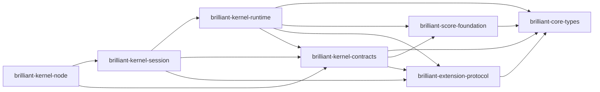

# Design — RKP-1 Seven-Crate Workspace Contracts Bridge Session Smoke

## 0. Status and authority

This is a planning candidate, not an implementation. It consumes accepted Architecture Reset V2, the accepted `d722789...` authority sync, the Rust remediation parent and archived RKP-0. Any conflict resolves in that order; this design may narrow RKP-1 but may not reinterpret those authorities.

## 1. Exact workspace and dependency law

Every arrow points from consumer to direct project dependency:



The seven nodes are the complete workspace membership. Direct edges not drawn above are forbidden. In particular, Foundation cannot depend on Contracts; Contracts cannot depend on Runtime/Session/Node; Runtime cannot depend on Session/Node/Product/Guitar; Session cannot depend on Node/Product/Guitar; Node cannot own semantic DTOs or state transitions.

### Crate-owned RKP-1 surface

| Crate | RKP-1 owns | Explicitly deferred |
|---|---|---|
| `brilliant-core-types` | API/schema versions, stable ID/revision/safe-integer primitives, bounded canonical JSON value and bounded stable path primitives | Score semantics, bridge failure codes, commands, store |
| `brilliant-score-foundation` | structural `ScoreDocument` DTO family, `brilliant-score-1`, exact/canonical JSON mapping used by smoke | full semantic parity, migration, indexed import/export |
| `brilliant-extension-protocol` | version/namespace/requirement/descriptor data contracts only | provider instances, catalog, WASM, migration execution |
| `brilliant-kernel-contracts` | create/read request/result DTOs, closed `StableFailureV1`, top-level strict byte codecs, codec caps/version dispatch | handlers, mutable state, N-API |
| `brilliant-kernel-runtime` | immutable RKP-1 holder for one accepted document and revision `0` | indices, overlay, ChangeSet, history, validation, events |
| `brilliant-kernel-session` | `KernelSession::create` and `read_state` orchestration only | 28 handlers, gateway, composition/catalog behavior |
| `brilliant-kernel-node` | opaque synchronized handle, buffer transport, two exports, panic boundary | business truth, semantic validation, JS callbacks, product packaging |

## 2. Toolchain, dependency and feature freeze

- `rust-toolchain.toml`: channel `1.97.1`, profile `minimal`, components `rustfmt` and `clippy`.
- Workspace: Edition `2024`, Cargo Resolver `3`, `rust-version = "1.88"`, exact seven `members` and `default-members`.
- Initial lock creation is exactly `cargo +1.97.1 generate-lockfile --manifest-path Cargo.toml`; `Cargo.lock` is committed before any command uses `--locked`.
- MSRV gate: `cargo +1.88.0 check --workspace --all-targets --locked` and focused tests that do not require loading the newer host toolchain output.
- Direct external pins: `serde = =1.0.229` with `derive`; `serde_json = =1.0.151`; `napi = =3.12.0`; `napi-derive = =3.6.2`; `napi-build = =2.4.0`. `Cargo.lock` is committed; all build/test commands use `--locked` after lock creation.
- No `anyhow`, `thiserror`, async runtime, Tokio, logging, tracing, random, provider, WASM or platform framework dependency.
- Six non-Node crates have `default = []` and declare no optional feature. Node has exactly `default = ["node-api-v8"]` and `node-api-v8 = ["napi/napi8"]`; napi/napi-derive defaults are disabled and derive enables only `strict`. Node-API v8 is required for native object type tags; lowering the level is not an implementation choice.
- `crates/brilliant-kernel-node/Cargo.toml` has exactly `[lib] crate-type = ["cdylib"]`. It does not declare `rlib`, `staticlib`, a binary, an example or an additional artifact target.
- Features may alter adapter availability only, never DTO shape, semantic behavior or failure codes. `--all-features` and `--no-default-features` compile checks prevent hidden alternatives.
- Every one of the six non-Node crate roots has `#![forbid(unsafe_code)]`. The Node crate root has `#![deny(unsafe_code)]` and `#![deny(unsafe_op_in_unsafe_fn)]`, and lowers the first lint only for the literal declaration `#[allow(unsafe_code)] mod boundary;`. `crates/brilliant-kernel-node/src/boundary.rs` is the sole RKP-1 unsafe owner; it also enables `#![deny(unsafe_op_in_unsafe_fn)]`, exposes safe Rust wrappers to `lib.rs`, and contains only the minimum explicit unsafe blocks required by the pinned N-API calls. Every unsafe block is immediately preceded by a `// SAFETY:` comment that states the mechanically checked object-liveness, type-tag, pointer-ownership and exactly-once invariant. Other files may contain only the exact crate-root unsafe lint attributes just named; they may not contain an unsafe block/function/impl/trait, an unsafe extern block or another lint lowering. Clippy runs with warnings denied.
- Dev/test/release use `panic = "unwind"` so the adapter can contain panics. Release uses thin LTO and one codegen unit; these do not create a performance claim.

Toolchain choice is an intentional reproducibility pin, not “latest at implementation time.” napi-rs v3 requires Rust `1.88.0`; the pinned development toolchain is the accepted Rust release current at planning. Version changes require a planning repair and rereview.

## 3. DTO codec responsibility and wire law

### 3.1 TypeScript capture

The private TypeScript adapter receives `unknown`, calls the existing descriptor-first strict capture/decode path, and uses captured primordial JSON operations. It rejects accessors, sparse/non-data shapes, depth/property overflow and encode failure without invoking user getters or arbitrary callbacks. Only detached plain data is converted to UTF-8 bytes.

### 3.2 Rust decoding

`brilliant-kernel-node` performs only the 64 MiB byte cap and passes bytes to `brilliant-kernel-contracts`. Contracts require valid UTF-8, one complete JSON value, no trailing bytes, `apiVersion: 1`, exact fields, no duplicates and deterministic union tags. Nested decoders delegate:

- IDs, safe numbers, revisions and bounded JSON to Core Types;
- ScoreDocument structure and canonical key/list order to Foundation;
- extension protocol descriptors to Extension Protocol.

No `serde(flatten)` or untagged public enum is permitted. Every boundary struct uses exact fields. JSON objects whose order is not semantically meaningful become lexical `BTreeMap` data; score arrays preserve accepted order. Canonical encoder declaration order is frozen and tested by byte equality across two generations.

### 3.3 Stable failures

`StableFailureV1` is a closed internally tagged union. Every variant has required keys `failureVersion: 1` then `code`; it has exactly the additional keys below in the listed canonical order. There are no optional keys and no extension map.

`brilliant-kernel-contracts` is the sole Rust owner of this union and its canonical encoder. Core Types owns only `StablePathV1`/bounded scalar primitives; Foundation/Protocol return private typed classifications that Contracts maps, and Node constructs the Contracts-owned bridge variants. The private TypeScript adapter mirrors the exact closed wire table for pre-native capture failure only and is byte-tested against Contracts fixtures; it does not create a public second contract owner.

| `code` | Exact additional keys | Allowed value contract |
|---|---|---|
| `bridge.capture-invalid` | none | descriptor-first capture, cycle, accessor, sparse or non-data input failed |
| `bridge.request-too-large` | `limitBytes`, `actualBytes` | safe non-negative integers; `limitBytes=67108864` |
| `codec.invalid-utf8` | none | no decoder message or byte offset |
| `codec.invalid-json` | none | syntax, trailing bytes or more than one value; no parser text/offset |
| `codec.invalid-shape` | `path`, `violation` | `path: StablePathV1`; violation is `missing-field`, `extra-field`, `duplicate-field`, `wrong-type` or `invalid-tag` |
| `contract.unsupported-api-version` | `supportedVersion` | exactly `1`; the supplied value is not echoed |
| `contract.unsupported-protocol-version` | `supportedVersion` | exactly `1`; the supplied value is not echoed |
| `score.unsupported-schema` | `supportedSchema` | exactly `brilliant-score-1`; the supplied value is not echoed |
| `score.invalid-structure` | `path`, `violation` | `path: StablePathV1`; violation is `duplicate-id`, `invalid-reference` or `invalid-value` |
| `codec.depth-limit` | `limit`, `actual` | safe integers; `limit=64` |
| `codec.property-limit` | `limit`, `actual` | safe integers; `limit=1048576` |
| `codec.number-out-of-range` | `path` | `path: StablePathV1` |
| `bridge.handle-unknown` | none | not an RKP-1 type-tagged handle |
| `bridge.handle-stale` | none | tagged envelope exists but its private lifecycle generation is no longer live |
| `bridge.handle-wrong-environment` | none | current `napi_env` is not the private creation environment |
| `bridge.handle-wrong-thread` | none | current Rust thread is not the private creation thread |
| `bridge.handle-reentrant` | none | the same handle is already active in this thread-local adapter scope |
| `bridge.handle-busy` | none | non-blocking `try_lock` returned `WouldBlock` |
| `bridge.handle-poisoned` | none | non-blocking `try_lock` returned `Poisoned` |
| `bridge.response-too-large` | `limitBytes`, `actualBytes` | safe non-negative integers; `limitBytes=67108864` |
| `bridge.panic-contained` | none | guarded unwind contained; no panic data |
| `bridge.internal` | none | final closed fallback; no native/library data |

`StablePathV1` is a detached array of at most 64 static field-name strings or safe non-negative array indices. It never contains a user-provided string, ID, native path, thread/environment identity or pointer. Failures never contain `message`, `name`, `stack`, `cause`, serde/napi `Display` text, source chains, panic messages, OS errors, local paths, pointers or backtraces. The TypeScript adapter deep-clones and deep-freezes the decoded result; exact-key and detached/immutable tests reject prototype or alias leakage.

Failure selection is first-match and uses exactly these eight stages:

1. descriptor-first TypeScript capture, then encoded request size (`bridge.capture-invalid`, then `bridge.request-too-large`);
2. UTF-8 (`codec.invalid-utf8`);
3. JSON syntax, exactly one value and no trailing bytes (`codec.invalid-json`);
4. bounded preorder structural walk: depth, property count, exact missing/extra/duplicate/type/tag shape, then safe-number range; within one class the first lexical object key/array index path wins;
5. API version, then Extension Protocol version;
6. score schema, then Foundation structural invariants;
7. handle type tag/unwrap, live generation, environment, owner thread, thread-local reentrancy, then `try_lock` result (`WouldBlock` before the mutually exclusive `Poisoned` branch);
8. response cap, contained panic, then closed internal fallback.

Create does not execute stage 7; read begins at stage 7 because it has no request bytes. A contained panic is stage 8 because no earlier classification completed. Tests combine two or more invalid conditions at every adjacent boundary and assert the exact winning bytes; no lower-priority raw error may replace the winner.

## 4. Minimal session data flow

RKP-1 implements this one path:

```text
unknown JS ScoreDocument
  -> descriptor-first TS capture and canonical bytes
  -> Node 64 MiB cap
  -> Contracts strict create-request decode
  -> Foundation structural ScoreDocument decode
  -> Runtime immutable holder(document, revision=0)
  -> KernelSession::create
  -> opaque Node handle
  -> KernelSession::read_state
  -> Contracts canonical read-result bytes
  -> TS parse, detach and deep-freeze
```

Create request V1 is exactly `{ apiVersion: 1, document: ScoreDocument }`. Success is exactly `{ apiVersion: 1, status: "created", value: { documentId, documentVersion: 0 } }`. Failure is exactly `{ apiVersion: 1, status: "rejected", failure: StableFailureV1 }` and has no handle.

Read success is exactly `{ apiVersion: 1, status: "ok", value: { snapshot: { documentId, schemaVersion: "brilliant-score-1", documentVersion: 0, document }, history: { undoDepth: 0, redoDepth: 0 }, dirty: false } }`. Read failure is exactly `{ apiVersion: 1, status: "rejected", failure: StableFailureV1 }`. Read has no command, history mutation, event or selection behavior. The full DTO transfer is permitted because Architecture V2 allows a full document on load and explicit full snapshot; normal edit transfer is absent.

Canonical UTF-8 JSON has no BOM, whitespace or trailing LF. Key order is frozen: outer `apiVersion,status,value|failure`; create value `documentId,documentVersion`; read value `snapshot,history,dirty`; snapshot `documentId,schemaVersion,documentVersion,document`; history `undoDepth,redoDepth`; failure `failureVersion,code` followed by the table order. Success and every failure variant have exact-byte tests.

The Runtime holder is the RKP-2 import seam, not a claimed `LiveScoreStore`. RKP-2 must replace its representation while preserving the already reviewed create/read DTO boundary.

## 5. Node-API V1 private bridge

The raw addon exports exactly:

1. `createKernelSessionV1(requestBytes: unknown) -> { payload: Buffer; handle?: OpaqueKernelSessionHandle }`
2. `readKernelSessionV1(handle: unknown) -> Buffer`

The addon manually validates `unknown` inputs inside the guarded boundary so generated N-API argument conversion cannot leak an exception message. On create it constructs one empty plain Node object with no user-visible enumerable fields and attaches the fixed Node-API v8 `TypeTag { lower: 0x4252_494c_4c49_414e, upper: 0x545f_524b_5031_5f31 }` (`BRILLIANT_RKP1_1`). The private transport handle table is keyed only by the wrapped allocation identity plus a monotonically increasing generation and stores one `Arc<HandleEnvelope>`; the envelope contains one `Mutex<KernelSession>`, the live generation, creation `napi_env` identity and Rust owner `ThreadId`. The table is lifetime/stale-handle machinery only: it is not a `LiveScoreStore`, contains no document/snapshot/revision cache, is never exposed, and cannot become a second semantic owner.

`crates/brilliant-kernel-node/src/boundary.rs` freezes the only permitted pinned API composition. It does **not** use `wrap_and_tag` because pinned napi `3.12.0` supplies no finalizer through that helper; it does not use `#[napi]` classes, a handwritten JS wrapper or `napi_add_finalizer`. Before any wrap, safe code creates the empty handle object, completes the unreturned `{ payload, handle }` result, allocates a boxed token containing the sole token-owned `Arc<HandleEnvelope>`, obtains the private table guard with no callback/reentrancy point, proves the allocation/generation key fresh and calls `HashMap::try_reserve(1)` as the complete capacity preflight. Failure in any preflight remains pre-wrap and publishes nothing. With the table guard and reserved slot retained, the only remaining sequence is `napi_wrap` -> fixed `tag_object` -> exact allocation/generation insertion as the last step -> return the already-complete result. The key is fresh, the slot is reserved, no user hasher/callback runs and no fallible operation follows tag success; insertion is therefore contractually infallible in RKP-1's recoverable failure model. No post-insert rollback branch exists.

The construction guard is an explicit ownership state machine; a transition changes the only token releaser, never creates shared raw-pointer ownership:

| State | Sole token releaser | Allowed transition |
|---|---|---|
| `PreWrapOwned` | construction guard | `napi_wrap` failure -> guard drops token once -> `Released`; `napi_wrap == napi_ok` -> `WrappedFinalizerOwns` without a guard drop |
| `WrappedFinalizerOwns` | registered `finalize_kernel_session_handle` | tag success -> last-step table insert and eventual finalizer -> `Released`; rollback `napi_remove_wrap == napi_ok` -> `RemovedGuardOwns`; rollback non-`napi_ok` -> remain here until finalizer |
| `RemovedGuardOwns` | construction guard | compare returned address without dereference, drop the original expected token once -> `Released` |
| `Released` | nobody | terminal; any second release is a test failure |

After `napi_wrap == napi_ok`, the guard retains only the non-owning expected address and state; it must not drop, dereference or reconstruct the token while `WrappedFinalizerOwns`. If `napi_wrap` is non-`napi_ok`, no finalizer owns the token and the `PreWrapOwned` guard drops the token plus its pending table `Arc` exactly once.

Tag failure invokes `napi::sys::napi_remove_wrap` with its out pointer initialized to null and branches on `napi_status` **before** reading that out pointer. On `napi_ok`, wrapping is removed and the finalizer is cancelled, so the guard transitions to `RemovedGuardOwns`. It then compares the returned address with the expected token address without dereferencing either: equality releases the expected token once; mismatch (including null) never dereferences/frees the returned unknown pointer, still releases the now guard-owned expected token once, returns canonical `bridge.internal`, publishes no result/session/table entry and leaks no raw address/status. On non-`napi_ok`, the out pointer is untrusted and is neither read, compared, dereferenced nor freed; wrapping/finalizer ownership remains registered, the guard stays non-owning, drops only its separate pending table `Arc`, and returns canonical `bridge.internal`. Because table capacity/result construction completed before wrap and insertion is the final infallible step after tag success, every rollback occurs with the table entry absent; the local handle is unpublished and the registered finalizer later releases the expected token/envelope.

The sole finalizer installed by `napi_wrap` conditionally removes a table entry only when both allocation identity and generation match the finalizer's token. An absent entry is valid for non-`napi_ok` rollback; a newer generation or different handle is never removed. It then drops the matching table `Arc` if present and reconstructs/drops the boxed token exactly once, reaching `Released`. It does not call into JavaScript, add another finalizer, retain a `napi_ref`, use a returned unknown pointer or free semantic state anywhere else. Tests count every state transition, table action, finalizer dispatch, token drop and envelope drop and require one terminal releaser with no double-free, leak or hang.

The internal Rust-only fault seam adds no addon export and must assert these terminal counters after bounded finalizer completion:

| Injected path | Stable result / publication | Table | Exact release and pointer counters |
|---|---|---|---|
| `napi_wrap != napi_ok` | `bridge.internal`; result/session unpublished; event/observable delta `0` | absent | guard token release `1`; finalizer `0`; token drop `1`; envelope drop `1` |
| tag failure; `napi_remove_wrap == napi_ok`; returned expected | `bridge.internal`; unpublished; delta `0` | absent | out-address compare `1`; guard token release `1`; finalizer `0`; token/envelope drop `1/1` |
| tag failure; `napi_remove_wrap == napi_ok`; returned mismatched/null | `bridge.internal`; unpublished; delta `0` | absent | out-address compare `1`; unknown dereference/free `0/0`; guard token release `1`; finalizer `0`; token/envelope drop `1/1` |
| tag failure; `napi_remove_wrap != napi_ok` | `bridge.internal`; unpublished; delta `0` | absent before and after call | out-pointer read/compare/dereference/free `0/0/0/0`; guard token release `0`; finalizer `1`; token/envelope drop `1/1` |

Each case has a bounded no-hang assertion, terminal state `Released`, total token releasers `1`, no leaked allocation, no published table entry and no raw status/address in result or diagnostics.

Every read performs, before any token dereference or registry access, object-kind validation and the fixed-tag `napi::bindgen_prelude::validate_type_tag`; a wrong kind/tag maps to `bridge.handle-unknown` and leaves the table lookup/mutation counters at zero. One explicit unsafe `napi::sys::napi_unwrap` follows successful validation; only then may the safe wrapper use the returned token to look up the exact live allocation/generation. Stage 7 remains: wrong kind/tag or unwrap -> `bridge.handle-unknown`; missing generation -> `bridge.handle-stale`; wrong `napi_env`; wrong owner thread; thread-local same-handle reentrancy; then session `try_lock`. The RAII active-handle guard is installed immediately before `try_lock` and always removed on return/unwind. Blocking `lock` is forbidden; `WouldBlock` maps to `bridge.handle-busy` and `Poisoned` to `bridge.handle-poisoned`. No failure contains environment/thread/pointer/generation data.

Garbage collection owns normal release through that unique finalizer. A narrow Rust test seam may construct rollback/stale/foreign-owner/busy/poison states and observe counters without adding a third addon export. There is no JS callback, asynchronous work, runtime selector or arbitrary native loader in a public export. The `Mutex<KernelSession>` remains the single serialized session owner for future mutation; RKP-1 exposes only create/read, and every later writer must acquire this same owner rather than creating adapter-side state.

The raw addon remains private. `src/core-kernel/native/rust-kernel-smoke.ts` is not exported from `src/core-kernel/index.ts`; focused tests load only the fixed artifact below. Existing application factories and `npm` default behavior keep using TypeScript.

### 5.1 Exact Windows native artifact and loader law

RKP-1 native build/load qualification is only Windows `x86_64-pc-windows-msvc` debug. The exact build is:

```powershell
cargo +1.97.1 build --manifest-path Cargo.toml --package brilliant-kernel-node --target x86_64-pc-windows-msvc --locked
$nativeSource = 'target\x86_64-pc-windows-msvc\debug\brilliant_kernel_node.dll'
$nodeTarget = 'target\rkp-1-node\brilliant_kernel_node.node'
if (-not (Test-Path -LiteralPath $nativeSource -PathType Leaf)) { throw 'missing RKP-1 native DLL' }
New-Item -ItemType Directory -Force -Path (Split-Path -Parent $nodeTarget) | Out-Null
Copy-Item -LiteralPath $nativeSource -Destination $nodeTarget
if (-not (Test-Path -LiteralPath $nodeTarget -PathType Leaf)) { throw 'missing RKP-1 .node copy' }
if ([IO.Path]::GetExtension($nodeTarget) -cne '.node') { throw 'invalid RKP-1 addon suffix' }
node -e "const path=require('node:path');const holder={exports:{}};process.dlopen(holder,path.resolve('target/rkp-1-node/brilliant_kernel_node.node'));const k=Object.keys(holder.exports).sort();if(k.length!==2||k.join(',')!=='createKernelSessionV1,readKernelSessionV1')throw new Error('unexpected native exports')"
node -e "const b=require('./target/rkp-1-node/brilliant_kernel_node.node');const k=Object.keys(b).sort();if(k.length!==2||k.join(',')!=='createKernelSessionV1,readKernelSessionV1')throw new Error('unexpected native exports')"
```

The repository-relative source artifact is `target/x86_64-pc-windows-msvc/debug/brilliant_kernel_node.dll`; the only smoke load target is `target/rkp-1-node/brilliant_kernel_node.node`. `target/**` remains ignored build output, so this does not widen the package/source allowlist. Stage 4 repeats the same build/copy/load/export/create/read procedure from a fresh local clone at the exact implementation candidate and asserts `git status --porcelain` is empty after ignored outputs. Linux, macOS, Windows GNU, ARM and release-artifact naming/loading/qualification are explicit RKP-1 exclusions; a later reviewed task must decide those platforms.

## 6. Panic containment and no-leak boundary

Each exported body executes inside `catch_unwind(AssertUnwindSafe(...))`. A once-installed panic hook delegates to the previous hook unless a thread-local adapter guard is active; for guarded addon work it suppresses raw panic payload/location/backtrace. An RAII guard resets the thread-local marker during both return and unwind. Contained panic maps to canonical `bridge.panic-contained` data.

Normal code forbids `unwrap`, `expect`, unchecked indexing and deliberate panic outside a Rust unit-test injection closure. Tests prove:

- injected panic does not unwind through N-API;
- returned bytes contain only the stable code;
- captured stderr/result bytes contain no injected message, `.rs` path, line, pointer or backtrace token;
- a panic outside the guarded adapter still reaches the previous hook, proving the hook does not globally silence unrelated Rust failures.

## 7. Resource and compatibility gates

| Boundary | Inclusive limit | Failure |
|---|---:|---|
| request buffer | 64 MiB | `bridge.request-too-large` |
| response buffer/capped writer | 64 MiB | `bridge.response-too-large` |
| nested data depth | 64 | `codec.depth-limit` |
| captured/decoded properties or nodes | 1,048,576 | `codec.property-limit` |
| integer wire values | JavaScript safe integer | `codec.number-out-of-range` |
| JSON input | one UTF-8 value, no trailing bytes | `codec.invalid-json` |
| handle acquisition | validation before non-blocking lock | stage-7 exact handle code |

RKP-1 records request/response byte counts for its canonical smoke fixture only. It makes no latency/RSS/60 FPS/102,400-Event claim and does not run official qualification.

Compatibility tests re-read RKP-0's manifest and assert `brilliant-score-1`, 28 command IDs, 51 application exports, 8/34 Module SDK exports and nine ABI fields unchanged. The private addon still has exactly two raw exports, but no Rust name is added to the TypeScript public application surface.

## 8. Rollout and rollback

Implementation is five ordered, small commits defined in `implement.md`. Through all five, TypeScript stays default. If any stage fails, revert that stage only; earlier accepted stages remain independently buildable. If final RKP-1 implementation review fails, revert/abandon the RKP-1 commit range without touching the accepted TypeScript baseline or RKP-0 archive. RKP-2 is not created until RKP-1 is independently accepted and archived by separate authority.
