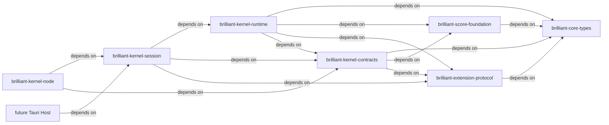
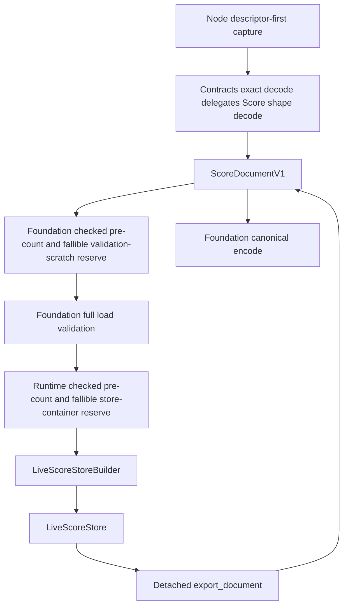

# Design — RKP-2 Indexed LiveScoreStore, Load/Encode and Index Parity

## 0. Status and authority

This document is the implementation-level RKP-2 candidate. It consumes accepted Architecture Reset V2 and archived RKP-1. It changes no production path while in planning.

```text
planning base 063b332d
├── accepted/archived RKP-1 production 94387b3
├── this RKP-2 docs-only planning line
└── sibling RKP-1 post-archive repair line f7fecdc (planning PASS; implementation pending)
```

RKP-2 implementation activation requires a new exact base containing the accepted/archived sibling repair plus this approved planning contract. Merge resolution must preserve both parent-child references and must rerun all entry gates. TypeScript stays default through RKP-7.

## 1. Ownership and dependency boundary



Every arrow points from a consumer to its dependency, exactly matching Architecture Reset V2. Tauri is shown only as the frozen future consumer; it is not implemented by RKP-2. RKP-2 preserves all seven Rust crates. `slotmap` is a workspace dependency consumed only by Runtime. Foundation owns pure DTO/music validation. Runtime owns live storage and indices. Session maps internal build outcomes to the existing stable contract. Node remains an adapter and owns no score state.

## 2. Concrete dependency decision

The root workspace adds exactly `slotmap = "=1.1.1"`. Runtime uses standard `SlotMap` and `new_key_type!`; default `std` remains on, while `serde` and `unstable` remain off.

Decision reasons:

- typed key declarations prevent Measure/Part/Staff/Voice/Event/Note key interchange at compile time;
- slot plus generation gives stale-key invalidation and average O(1) access;
- `try_reserve` supports pre-publication capacity preparation;
- the library's arbitrary iteration order is acceptable because every externally visible order is held separately and tested;
- no key serialization feature is enabled, reinforcing the RuntimeHandle boundary.

Rejected for RKP-2:

- raw `usize` indices: stale deletion/reuse is not detected;
- embedding slot/generation in EntityId: persistence and session allocation become coupled;
- DenseSlotMap iteration as public order: removal/move can reorder values;
- one untyped arena: type confusion becomes a runtime concern;
- tree-only entity lookup: misses the required average O(1) target.

## 3. One truth and two representations



The DTO and store express one score truth. The DTO is transient inside create/read. A successful Runtime contains no `ScoreDocumentV1` field and no complete copy of the original tree. Scalars and bounded payload values move or clone into record stores, topology and indices. Export creates a new detached DTO.

## 4. Private type model

### 4.1 Typed keys

Equivalent private declarations:

```rust
new_key_type! {
    struct MeasureHandle;
    struct PartHandle;
    struct StaffHandle;
    struct VoiceHandle;
    struct EventHandle;
    struct NoteHandle;
    struct ExtensionHandle;
}

enum RuntimeEntityRef {
    Document,
    Measure(MeasureHandle),
    Part(PartHandle),
    Staff(StaffHandle),
    Voice(VoiceHandle),
    Event(EventHandle),
    Note(NoteHandle),
}
```

The names are private to `brilliant-kernel-runtime`. `KeyData::as_ffi`, slot numbers and generations are excluded from logs, diagnostics, normalized parity output, DTOs and Node values.

### 4.2 Records

Each slot record owns only its semantic scalar fields:

| Record | Scalar/data fields |
|---|---|
| DocumentHeader | id, metadata |
| MeasureRecord | id, meter, optional pickup duration |
| PartRecord | id, name, instrument/transposition |
| StaffRecord | id, line count, clef |
| VoiceRecord | id, default staff stable reference, sequence start |
| EventRecord | id, duration, optional staff stable reference, rest/notes tag |
| NoteRecord | id, written pitch |
| ExtensionRecord | namespace, schema version, owner stable descriptor, bounded payload |
| PartMeasureContentRecord | part handle, measure handle; no invented persisted ID |

Parent/child ordering lives in topology, not in slot iteration.

### 4.3 Semantic topology

```text
ScoreTopology
├── measure_order: Vec<MeasureHandle>
├── part_order: Vec<PartHandle>
├── staff_order: HashMap<PartHandle, Vec<StaffHandle>>
├── content_order: HashMap<PartHandle, Vec<MeasureHandle>>
├── contents: HashMap<PartMeasureKey, PartMeasureContentRecord>
├── voice_order: HashMap<PartMeasureKey, Vec<VoiceHandle>>
├── event_order: HashMap<VoiceHandle, Vec<EventHandle>>
├── note_order: HashMap<EventHandle, Vec<NoteHandle>>
└── extension_order: Vec<ExtensionHandle>
```

`PartMeasureKey` is exactly `{ part: PartHandle, measure: MeasureHandle }`. The content order vector preserves input `measureContents` order even when it differs from document measure order. Validation still requires exact one-to-one coverage.

## 5. Derived index model

### 5.1 EntityIndex

```text
HashMap<StableId, RuntimeEntityRef>
```

The document ID is inserted first as `Document`. Every later entity is inserted in canonical DTO traversal order. A collision rejects at the later entity's exact ID path. Code never iterates this map to determine output order.

### 5.2 OwnershipIndex

Typed maps provide average O(1) parent lookup:

```text
MeasureHandle -> Document
PartHandle -> Document
StaffHandle -> PartHandle
VoiceHandle -> PartMeasureKey
EventHandle -> VoiceHandle
NoteHandle -> EventHandle
ExtensionHandle -> score | PartHandle
```

Top-level document ownership may be represented without a HashMap because every Measure/Part is already in the root topology, but the normalized parity projection must include these edges.

### 5.3 Part content index

`HashMap<PartMeasureKey, PartMeasureContentRecord>` is the single direct lookup for Part/Measure content. Duplicate measure coverage is rejected before insertion of a second row. Missing coverage is rejected after the part's input rows are visited in global measure order.

### 5.4 VoiceTimeIndices

```rust
struct VoiceTimeEntry {
    start: ExactFraction,
    end: ExactFraction,
    semantic_ordinal: u32,
    event: EventHandle,
}

struct VoiceTimeIndex {
    entries: Vec<VoiceTimeEntry>,
}
```

Entries are built from sequence start and ordered positive event durations. They are sorted by `(start, semantic_ordinal)` and non-overlapping within one voice.

- exact-start query: lower-bound/upper-bound on `start`;
- range query: half-open `[start, end)`, returning events whose intervals overlap that range in semantic order;
- empty/reversed ranges reject at the internal query boundary used by tests; no public selector is added;
- lookup by stable voice ID is EntityIndex average O(1), then binary search O(log n + k).

A sorted Vec is chosen over a node tree for RKP-2 because Voice is scoped to one measure content, traversal is compact/cache-friendly, all capacity can be reserved before publication, and the required query bound is met. RKP-3 later updates only the affected voice suffix; a different structure requires new benchmark evidence and planning review.

### 5.5 ExtensionIndex

```text
(namespace, score) -> Vec<ExtensionHandle>
(namespace, part handle) -> Vec<ExtensionHandle>
```

The schema permits at most one block per `(namespace, owner)` after semantic validation, while the value remains a vector so future compatible evolution does not change key identity. Values preserve document extension order. Unknown namespaces stay indexed and preserved.

### 5.6 ReferenceDependencyIndex

```text
StableId target -> ordered Vec<StableReferenceAddress>
```

Addresses cover only Core references: measure-content measure ID, voice default staff ID, optional event staff ID and extension Part owner. Ordering key is `(target stable id, referrer canonical path)`; construction appends in canonical traversal and parity normalization sorts by this key. Opaque extension payload values are never scanned for ID-like strings.

## 6. Exact Fraction and duration law

`ExactFraction` is a private validated value with `i64` numerator/denominator fields and checked `i128` intermediates. Input safe integers fit `i64`. Accepted values use denominator `> 0`, gcd reduction, zero normalized to `0/1`, and current Foundation sign rules.

Operations:

1. compare with checked cross multiplication;
2. add with checked cross multiplication/addition then gcd reduction;
3. derive NoteValue duration using the accepted base/dot/time-modification algorithm;
4. verify reduced numerator/denominator remain in the JavaScript safe-integer domain;
5. map arithmetic/domain failure to the current semantic path and `invalid-value`.

Validation uses the same arithmetic values that populate VoiceTimeIndex. A second approximate path is excluded.

## 7. Deterministic semantic validation

### 7.1 Fixed traversal

The full load validator visits fields in this order:

1. document `id`;
2. metadata tempo;
3. `measureDefinitions` required, then each measure: id, meter numerator, meter denominator, pickup canonical/sign/bounds;
4. `parts` required, then each part: id, transposition, staves required, each staff id/line count/clef line, each measure content in input order;
5. each content: measure reference/duplicate coverage, voices required;
6. each voice: id, default staff reference, sequence start, each event;
7. each event: id, optional staff reference, content/note IDs/written+sounding pitch, duration, accumulated bounds;
8. after each part, missing measure coverage in document measure order;
9. extensions in input order: namespace, schema version, owner, duplicate `(owner,namespace)`, payload.

The later occurrence wins as the reported duplicate path. The first issue in this fixed sequence becomes the stable failure. Object source-member order and HashMap order do not participate.

### 7.2 Mapping table

| Semantic class | Stable violation |
|---|---|
| globally repeated document/entity ID | `duplicate-id` |
| missing measure/staff/Part owner | `invalid-reference` |
| duplicate/missing measure coverage | `invalid-reference` |
| empty top-level `measureDefinitions` or `parts` | `invalid-value` |
| empty `NotesContent.notes` | `invalid-value` |
| empty `Part.staves` or `PartMeasureContent.voices` | `invalid-reference` |
| tempo/meter/fraction/transposition/clef/pitch/duration/time bounds | `invalid-value` |
| extension namespace/version/payload/owner-namespace duplicate | `invalid-value`, except missing Part owner -> `invalid-reference` |

RKP-2 exposes no new diagnostic codes. RKP-5 owns rich incremental diagnostics; RKP-7 proves full TypeScript/Rust observable parity before cutover.

### 7.3 Global failure precedence

RKP-1 bridge/codec precedence remains earlier than RKP-2 semantic/store work:

```text
capture/request bytes
→ UTF-8/JSON/depth/property
→ exact shape/tag/safe number
→ API/schema
→ Foundation validation-scratch checked-count/reserve
→ Foundation semantic first failure
→ Runtime store checked-count/reserve/local checks
→ created
```

Capacity failures do not masquerade as semantic failures. A Foundation scratch count/reserve failure precedes semantic traversal and therefore wins over any latent semantic fault in the same decoded DTO. A Foundation semantic failure prevents Runtime construction entirely. Runtime store capacity/local-check failures are reachable only after Foundation validation succeeds.

Response-size failure occurs only when an accepted session is read/encoded. It does not destroy or mutate that session.

## 8. Atomic import protocol

### 8.1 Foundation validation-capacity phase

After exact Score shape decode has produced a transient `ScoreDocumentV1`, Foundation performs a read-only canonical pre-count for the maps/vectors needed by full semantic validation. All additions and conversions use checked arithmetic. Foundation then fallibly reserves only this validation scratch before running the deterministic full validator. `decode_score_document_value` retains its current signature and returns only an already validated DTO.

Validation scratch uses pre-sized `HashSet`/`HashMap` entries with borrowed StableId/namespace/owner keys plus exact-size `Vec` worklists where traversal requires one. It replaces the current allocation-per-node `BTreeSet<String>` pattern, clones no StableId string merely for membership, never derives diagnostics from hash iteration, and invokes `try_reserve` on every scratch collection before its first insertion. A private `#[cfg(test)]` reservation adapter can force a reserve error; production always calls the real standard-library reserve path, and no environment flag, Node export or public fault hook is added.

`FoundationDecodeFailure` keeps its five existing shape/semantic variants and adds exactly one workspace-internal `InternalCapacity` variant with no path, allocator detail or payload. Kernel Contracts keeps the existing decode seam and maps only that new internal variant to existing `StableFailureV1::BridgeInternal`. This changes no public DTO, discriminant or failure count: the stable union remains exactly 22. No other Kernel Contracts code is owned by RKP-2.

### 8.2 Runtime store-capacity phase

After Contracts returns the already validated DTO, Runtime independently pre-counts exact record, topology, reference-edge, time-entry and store-index capacities. It fallibly reserves all target SlotMaps, HashMaps and Vecs before inserting records. Per-voice/per-parent vectors reserve their exact child count when created. A checked-count or reserve failure returns private `LiveStoreBuildFailure::InternalCapacity`, later mapped to `bridge.internal`. Runtime never assumes the Foundation scratch reservation also reserves store capacity.

Runtime's store builder has a private Rust-test reservation adapter analogous to Foundation's. Session routes real construction through one private coordinator that accepts the production Runtime factory; Session unit tests substitute a failing factory and prove `LiveStoreBuildFailure::InternalCapacity -> StableFailureV1::BridgeInternal` with no `KernelSession` value. Neither seam is exported from its crate's public application surface. The existing unchanged Node rule—wrap/table publication occurs only after Session returns accepted—then proves zero Node handle without a Node fault-injection API.

### 8.3 Build

The private builder:

- inserts in canonical DTO order;
- moves/clones scalar data into records;
- appends explicit topology;
- resolves references through EntityIndex/typed local maps, never by scanning arrays;
- builds exact time entries while visiting each event once;
- accumulates deterministic private counters.

The builder is not reachable through Runtime, Session or Node until finish succeeds.

### 8.4 Production candidate checks

Before publication, the builder verifies all typed handles resolve, record/topology counts agree, every live record has one semantic position, every Core reference resolves to the expected type, and index entry counts match the pre-count. These checks are linear and do not allocate a second complete index bundle.

### 8.5 Independent parity rebuild

`rebuild_indices_from_store(&records, &topology)` creates a fresh index bundle from completed primary state. Both original and rebuilt indices become `NormalizedIndexProjection` containing only stable IDs, canonical fractions and canonical stable paths. Exact equality is required by unit/differential verification.

The rebuild is not called by every release-mode session create. Tests include one test-only corrupted index to prove mismatch detection; a verification-mode mismatch fails the test/candidate and is never published as accepted evidence.

### 8.6 Round-trip proof and publication

The normal create path constructs the revision-zero Runtime after production candidate checks, returns Session, and only then lets Node publish its opaque handle. It does not perform an otherwise unused export/encode/decode cycle during every file open.

RKP-2 verification explicitly exports a detached DTO, compares semantic equality to the accepted input, canonical-encodes it, decodes/validates it, encodes again and compares bytes. The existing Node `read_state` also exercises real export after publication. These proofs run on minimal, edge, representative and stress fixtures before the candidate is accepted.

No Node wrapper/table insertion occurs before Session creation returns accepted, preserving RKP-1 ownership law.

## 9. Export and read behavior

`KernelRuntime` replaces the internal name `SmokeRuntime`. It owns `LiveScoreStore` plus existing revision-zero state. `SmokeRuntime` is removed rather than retained as a second holder/alias.

`KernelRuntime::read_state` calls `export_document` and builds the existing `KernelReadStateV1`. RKP-2 intentionally materializes a full DTO per explicit read because the only RKP-1 Node read endpoint is a full snapshot. RKP-4 later introduces revision snapshot caching and selector-first reads.

Export rules:

- read root/topology vectors only;
- dereference typed handles and fail internally on stale/missing invariant;
- construct owned/detached DTO vectors and payload maps;
- preserve optional-field absence and enum tags;
- never sort semantic arrays by ID;
- never expose internal counters, handles or index entries.

## 10. Store invariants

A publishable LiveScoreStore satisfies all of these:

1. every topology handle resolves to exactly one live slot of the correct type;
2. every live entity slot except root appears exactly once in topology;
3. EntityIndex contains document plus every entity exactly once and no extension block;
4. all ownership edges agree with topology;
5. every Part has exact one content row per document Measure and preserves its input content order;
6. every Voice/Event/Note appears under one parent;
7. every Core stable reference resolves to the expected entity type and is represented in the reference index;
8. every time entry matches the owning event duration and semantic ordinal;
9. every extension appears once in document order and once in the matching lookup key;
10. export is semantically identical to accepted input;
11. no RuntimeHandle is serialized or normalized as public evidence.

## 11. Resource and complexity instrumentation

Private `Rkp2StoreMetrics` is available to Rust tests and task-local evidence, not Node/Contracts. It records:

```text
entities_visited
records_inserted_by_type
topology_edges_visited
reference_edges_built
time_entries_built
entity_index_lookups
owner_index_lookups
time_index_comparisons
index_rebuild_entries
full_document_materializations
canonical_encode_bytes
```

Acceptance structural bounds:

- import `entities_visited == input entity count` for the build pass;
- each record is inserted once;
- each reference/time/topology edge is built once per primary build and once per explicit parity rebuild;
- no counter representing full-document lookup scans exists on an ID lookup path;
- a successful direct entity lookup performs one EntityIndex lookup plus one typed slot lookup;
- export visits each semantic record/topology edge once;
- repeated explicit read may rematerialize once per call in RKP-2, clearly recorded as deferred RKP-4 work.

The representative/stress worker has a 180-second liveness guard and reports elapsed/RSS/counters as diagnostic evidence. It does not replace RKP-7 product budgets.

## 12. Test architecture

### 12.1 Foundation unit tests

- canonical/noncanonical/negative/zero Fraction cases;
- checked compare/add, dot and tuplet durations, safe-integer overflow;
- document ID collision with each entity type;
- deterministic first failure and exact path for every mapping class;
- exact wire/path assertions freezing empty top-level measures/parts and empty notes as `invalid-value`;
- exact wire/path assertions freezing empty staves/voices and missing/duplicate coverage/reference as `invalid-reference`;
- private Foundation reserve-fault injection on a semantic-invalid DTO returns `FoundationDecodeFailure::InternalCapacity` before semantic traversal;
- Contracts maps `FoundationDecodeFailure::InternalCapacity` to exact existing `bridge.internal` bytes with no new stable variant;
- measure coverage, staff/event references, sequence bounds;
- extension namespace/version/owner/duplicate/payload cases.

### 12.2 Runtime unit tests

- minimal, representative and stress import;
- typed record counts and semantic topology order;
- document/entity average-O(1) lookup path counters;
- owner and Part/Measure direct lookup;
- exact-start and half-open overlap range query;
- stale remove/reinsert generation test through private test fixture;
- incremental-built versus rebuilt normalized projection;
- deliberately perturbed index rejected;
- unknown extension round-trip and input order;
- no retained whole DTO field by module-level construction law.

### 12.3 Session/Node integration tests

- exact create/read bytes on existing smoke fixture;
- repeated read exact bytes and detached input/output aliases;
- valid RKP-0 representative fixtures canonical parity;
- invalid create yields no handle;
- private Runtime/Session fault tests map semantic-valid DTO plus Runtime reserve failure to exact `bridge.internal` and construct zero Runtime/Session;
- unchanged RKP-1 Node publish-after-accepted-Session characterization closes zero Node-handle publication without a Node fault hook;
- exact two Node exports and 22 stable failures;
- request/response/depth/property/safe-number caps unchanged;
- 102,400-event load/export diagnostic worker completes with linear counters;
- TypeScript default and 28/51/8/34/9 compatibility inventories remain exact.

## 13. Planning allowlist

This docs-only candidate may change only:

```text
.trellis/tasks/08-24-rkp-2-indexed-live-score-store-load-encode-parity/check.jsonl
.trellis/tasks/08-24-rkp-2-indexed-live-score-store-load-encode-parity/design.md
.trellis/tasks/08-24-rkp-2-indexed-live-score-store-load-encode-parity/implement.jsonl
.trellis/tasks/08-24-rkp-2-indexed-live-score-store-load-encode-parity/implement.md
.trellis/tasks/08-24-rkp-2-indexed-live-score-store-load-encode-parity/operator-handoff.md
.trellis/tasks/08-24-rkp-2-indexed-live-score-store-load-encode-parity/prd.md
.trellis/tasks/08-24-rkp-2-indexed-live-score-store-load-encode-parity/review-candidate.md
.trellis/tasks/08-24-rkp-2-indexed-live-score-store-load-encode-parity/task.json
.trellis/tasks/08-24-rkp-2-indexed-live-score-store-load-encode-parity/research/container-and-index-decision.md
.trellis/tasks/08-24-rkp-2-indexed-live-score-store-load-encode-parity/research/current-rust-and-ts-baseline-audit.md
.trellis/tasks/08-24-rkp-2-indexed-live-score-store-load-encode-parity/research/file-test-and-rollback-matrix.md
.trellis/tasks/08-24-rkp-2-indexed-live-score-store-load-encode-parity/research/planning-candidate-self-audit.md
.trellis/tasks/08-24-rkp-2-indexed-live-score-store-load-encode-parity/research/rkp1-repair-and-rkp2-entry-gate.md
.trellis/tasks/08-15-core-rust-runtime-performance-remediation/task.json
.trellis/tasks/08-15-core-rust-runtime-performance-remediation/implement.md
.trellis/tasks/08-15-core-rust-runtime-performance-remediation/research/stage-dependency-and-rollback-map.md
```

Every production, test, Cargo, package, tsconfig and active-spec path remains identical to `063b332d`.

## 14. Future implementation allowlist

Only these production/config paths may change after approved activation:

```text
Cargo.toml
Cargo.lock
crates/brilliant-score-foundation/src/lib.rs
crates/brilliant-score-foundation/src/codec.rs
crates/brilliant-score-foundation/src/fraction.rs
crates/brilliant-score-foundation/src/validation.rs
crates/brilliant-kernel-contracts/src/codec.rs
crates/brilliant-kernel-runtime/Cargo.toml
crates/brilliant-kernel-runtime/src/lib.rs
crates/brilliant-kernel-runtime/src/smoke_runtime.rs
crates/brilliant-kernel-runtime/src/handles.rs
crates/brilliant-kernel-runtime/src/records.rs
crates/brilliant-kernel-runtime/src/topology.rs
crates/brilliant-kernel-runtime/src/indices.rs
crates/brilliant-kernel-runtime/src/time_index.rs
crates/brilliant-kernel-runtime/src/store.rs
crates/brilliant-kernel-runtime/src/runtime.rs
crates/brilliant-kernel-session/src/session.rs
test/core-kernel/rust-migration/rkp-2-live-score-store-parity.test.ts
test/core-kernel/rust-migration/rkp-2-workspace-contracts.test.ts
test/core-kernel/rust-migration/rkp-2-store-fixtures.ts
```

Only these task/coordination paths may change during implementation:

```text
.trellis/tasks/08-24-rkp-2-indexed-live-score-store-load-encode-parity/task.json
.trellis/tasks/08-24-rkp-2-indexed-live-score-store-load-encode-parity/operator-handoff.md
.trellis/tasks/08-24-rkp-2-indexed-live-score-store-load-encode-parity/review-candidate.md
.trellis/tasks/08-24-rkp-2-indexed-live-score-store-load-encode-parity/research/implementation-evidence.md
.trellis/tasks/08-15-core-rust-runtime-performance-remediation/task.json
.trellis/tasks/08-24-rkp-2-indexed-live-score-store-load-encode-parity/check.jsonl
.trellis/tasks/08-24-rkp-2-indexed-live-score-store-load-encode-parity/implement.jsonl
.trellis/tasks/08-24-rkp-2-indexed-live-score-store-load-encode-parity/design.md
.trellis/tasks/08-24-rkp-2-indexed-live-score-store-load-encode-parity/implement.md
.trellis/tasks/08-24-rkp-2-indexed-live-score-store-load-encode-parity/research/file-test-and-rollback-matrix.md
.trellis/tasks/08-25-rkp-2-cross-platform-full-test-runner-contract-repair/task.json
.trellis/tasks/08-25-rkp-2-cross-platform-full-test-runner-contract-repair/prd.md
.trellis/tasks/08-25-rkp-2-cross-platform-full-test-runner-contract-repair/design.md
.trellis/tasks/08-25-rkp-2-cross-platform-full-test-runner-contract-repair/implement.md
.trellis/tasks/08-25-rkp-2-cross-platform-full-test-runner-contract-repair/implement.jsonl
.trellis/tasks/08-25-rkp-2-cross-platform-full-test-runner-contract-repair/check.jsonl
.trellis/tasks/08-25-rkp-2-cross-platform-full-test-runner-contract-repair/operator-handoff.md
.trellis/tasks/08-25-rkp-2-cross-platform-full-test-runner-contract-repair/review-candidate.md
.trellis/tasks/08-25-rkp-2-cross-platform-full-test-runner-contract-repair/research/current-runner-reproduction.md
.trellis/tasks/08-25-rkp-2-cross-platform-full-test-runner-contract-repair/research/node-test-api-and-version-contract.md
.trellis/tasks/08-25-rkp-2-cross-platform-full-test-runner-contract-repair/research/file-test-integration-and-rollback-matrix.md
.trellis/tasks/08-25-rkp-2-cross-platform-full-test-runner-contract-repair/research/planning-self-audit.md
```

The five appended authority-repair paths are a one-time exception used only after the planned Stage 5 deletion of `smoke_runtime.rs`: `implement.jsonl` and `check.jsonl` may each project their single stale `smoke_runtime.rs` row to the live successor `runtime.rs`, while `design.md`, `implement.md` and `research/file-test-and-rollback-matrix.md` close that projection under executable governance. The historical invariant is anchored to approved planning state `53646c92b81bc3ac160ec5d72b0d3f80c97b7eb0`: its LF-normalized manifests must equal those at Stage 5 parent `4f5f45a5f5a97968ef5280524cd4e6ab8dbebda8`, and manifest projection `bda15099f4932aced965eabc6b6e147accd9b5ce` may differ from that approved state only in the `file` and `reason` fields of the one designated successor row per manifest. The three commits must exist, the approved state must be an ancestor of the Stage 5 parent, and the Stage 5 parent must be the direct parent of the projection. This bounded repair is not a regular implementation-time planning edit. Its exact candidate must pass a dedicated targeted planning rereview before these five files freeze again; any later change requires a new planning review.

The twelve appended `08-25-rkp-2-cross-platform-full-test-runner-contract-repair` paths are a separate coordination projection for the blocking full-runner child and make that child the sole test-infrastructure owner; they do not add an RKP-2 technical path, authorize Stage 6, or create a directory wildcard. Accepted planning head `cc82ba168ed45b8c3e0182ea8e1370b1474f1155` produced a separate implementation line through clean Stage 2 `d366653788a42eb56cd5755a63b1e73700c67310`; real Node events then disproved the unique nesting-zero file-terminal premise. Content commit P `44832ad01d136368c1b61203e9207ca4a521241f` and anchor A `c69d7b76175e2b818f4d276504a39b741e6e1975` passed dedicated planning rereview and were explicitly merged by `b4906ac64a44cc735de7b923818817300d5c70fd`. The first implementation candidate `15c84a1929d1365ebf466088e896fd5309a4fa57` was returned at `0/1/1`; reversible commits `f77549ef429dd2611d7f6144c164511599da9129` and `139f1271b651af0c1b70e151ba9604ef154442d7` repair only first-observed failure precedence and missing fail-closed evidence. The rereview candidate still uses `P..candidate` for exactly four technical plus eleven active lifecycle paths, never inserted into RKP-2's twenty-one technical plus twenty-two coordination ownership.

The corrected event contract keeps only `test:pass`/`test:fail` as truth sources, treats `test:interrupted` as failure, and consumes event type plus pass `data.file` only. Any fail at any nesting is fatal. Every pass file must be a non-empty absolute manifest member; duplicate passes are idempotent, and normal success requires independent equality among the enumerator manifest, exact `run()` files array and pass-seen file set. `data.name`, `data.nesting`, `details.type`, `test:complete` and reporter text cannot establish file identity or success. Missing/non-string/relative/unknown files and partial coverage fail. Node 20.20.2/24.15.0 TEMP two-file and real 78-file raw/fast/slow characterization is evidence only and does not hard-code future totals.

Stage 4 of the child stops at `READY FOR INDEPENDENT IMPLEMENTATION REVIEW`. Only after implementation PASS and owner authorization may native archive create `.trellis/tasks/archive/2026-08/08-25-rkp-2-cross-platform-full-test-runner-contract-repair/` with exactly thirteen artifacts, including `research/implementation-evidence.md`. The bounded closeout must remove all twelve active child paths before adding the thirteen archived successors, producing exactly twenty-three RKP-2 coordination paths (historical ten plus archived thirteen), with no active/archive dual authority. It then pins accepted implementation/archive commits, recomputes the same five hashes while keeping both RKP-2 JSONLs zero-delta, runs full gates and creates an explicit integration descendant. Stage 6 still requires a later user authorization.

The PRD and all other planning authority/research stay zero-delta during implementation. Relative to approved planning state `53646c92b81bc3ac160ec5d72b0d3f80c97b7eb0`, the two JSONL manifests stay zero-delta except for the one successor projection in each file; their row counts, every other row and field, and per-file path uniqueness remain unchanged. New child-local `research/implementation-evidence.md` is created only for the child Stage 4 candidate and becomes the thirteenth archive artifact only after implementation PASS.

Protected examples include all `src/**`, all other `test/**`, `package*.json`, `tsconfig.json`, `rust-toolchain.toml`, `rustfmt.toml`, Core Types, all Kernel Contracts paths except the single allowlisted `crates/brilliant-kernel-contracts/src/codec.rs` mapping, Extension Protocol, Node source, active specs, CVN tasks, Guitar/product/plugin paths and qualification code. The child planning candidate changes only the one existing allowlisted RKP-2 workspace-law test; `package.json` and the new runner/test paths remain future child implementation paths and are zero-delta now.

## 15. Rollout and rollback

Implementation follows one activation commit plus six technical/evidence commits. Each technical commit passes its focused tests. Revert in reverse order:

- revert Stage 6: remove evidence/status only;
- revert Stage 5: restore RKP-1 `SmokeRuntime` create/read holder while keeping unused store modules only if Stage 4 remains; normally continue reverse;
- revert Stage 4: remove derived indices/time/parity;
- revert Stage 3: remove store/topology/typed handles;
- revert Stage 2: restore RKP-1 Foundation validation/arithmetic;
- revert Stage 1: remove slotmap and RKP-2 contract tests;
- revert activation: return task/parent to accepted planning HEAD.

Acceptance/archive happens only after a separate read-only implementation audit. A failed RKP-2 leaves TypeScript default and blocks RKP-3 creation. No dual runtime selector or partial store mode is published.

## 16. Decisions deferred to named stages

| Decision | Owner |
|---|---|
| mutation overlay, ordered ChangeSet, inverse | RKP-3 |
| local edit update algorithm and edit latency | RKP-3/RKP-7 |
| history vector+cursor and checkpoints | RKP-4 |
| selector API and snapshot cache | RKP-4 |
| incremental closure/full parity | RKP-5 |
| plugin-declared payload references | RKP-5/RKP-6 |
| provider/catalog/inventory/composition | RKP-6 |
| default cutover | RKP-8 |
| official Qualification V2 | RKP-9 |

RKP-2 stores no Guitar-specific field and grants no official instrument privilege.
