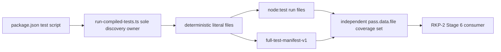

# Design — RKP-2 Cross-platform Full Test Runner Contract Repair

## 0. Authority and lifecycle

This child is the only test-infrastructure owner blocking RKP-2 Stage 6. Its planning base is `eed4871a86191783d539b7d4097be3627e98e4a0`; its parent remains in progress with Stage 5 complete, Stage 6 not started/authorized, candidate readiness false, implementation review pending and TypeScript default.

The planning candidate changes no package, runner source, product source, Rust/native code or ordinary test other than the already allowlisted RKP-2 workspace-law governance test. Accepted planning head `cc82ba168ed45b8c3e0182ea8e1370b1474f1155` led to a separate implementation line through clean Stage 2 `d366653788a42eb56cd5755a63b1e73700c67310`; that implementation is paused and remains outside this amendment ancestry. This branch creates content commit P and then immutable anchor commit A. Only A is submitted to dedicated independent planning rereview; later resumption still requires a PASS and an explicit merge into the paused implementation line.

## 1. Root cause and ownership

The complete-suite script `node --test "dist/test/**/*.test.js"` delegates discovery to runtime/shell glob handling. Observed Node 24 invocations disagree (77 files/557 tests versus 29/261 with exit 0), and Node 20.20.2 rejects the literal wildcard. `package.json` and `package-lock.json` are unchanged from unified RKP-2 base `df40aef391440ae64ad3e266419579bee5887a1f` through `eed4871a...`; this is pre-existing infrastructure debt, not Stage 5 product drift.



RKP-2 workspace-law validates the child's accepted projection and later consumes its evidence; it never implements a second enumerator.

## 2. Root and traversal contract

1. CLI direct entry requires `process.cwd()` to be the repository root containing `package.json`; the only enumeration root is `resolve(repoRoot, "dist/test")`.
2. `lstat` the root without following links. Missing, non-directory or symbolic/junction-style root is an infrastructure error.
3. Recursively call `readdir(..., { withFileTypes: true })`. Reject every `Dirent.isSymbolicLink()` entry before any follow operation. A Windows junction/reparse link is treated as a symbolic entry and rejected, not traversed. Recheck traversed entries with `lstat`; only real directories recurse and only real regular files are candidates. Other entry kinds fail rather than silently disappear.
4. Convert every relative candidate separator to `/`. Select only paths ending exactly `.test.js`.
5. Reject duplicate normalized relative paths as `runner.path-duplicate`; this check is distinct from physical identity.
6. For every selected regular file, call `lstat(path, { bigint: true })`, recheck `isFile()`, and define physical identity as the exact BigInt tuple `(stats.dev, stats.ino)`. Missing/non-BigInt identity or `(0n, 0n)` fails as `runner.identity-unavailable`. Two different normalized paths sharing the tuple fail as `runner.physical-alias` before `run()` is called. There is no path-only fallback.
7. Symbolic links and junction-style entries are rejected during traversal; hard links are rejected by the physical-identity gate. A real `linkSync` fixture must prove zero runner calls. An unsupported filesystem or permission error is explicit test-environment failure evidence, never a skip.
8. Sort with the explicit code-unit comparator `a < b ? -1 : a > b ? 1 : 0`. `localeCompare` and filesystem enumeration order are forbidden.
9. Preserve spaces, Unicode and deep nesting as literal path data. No shell escaping or command-line reconstruction is used.
10. Empty selection is an infrastructure error.
11. Return a new recursively frozen manifest record whose `files` is a copied frozen array. Callers never receive or mutate traversal scratch.

## 3. Manifest contract

The immutable record is:

```ts
type FullTestManifestV1 = Readonly<{
  kind: "full-test-manifest-v1";
  root: "dist/test";
  fileCount: number;
  sha256: string;
  files: readonly string[];
}>;
```

`sha256` is lowercase hex SHA-256 of `files.join("\n") + "\n"`, where files are sorted normalized relative paths. Before test output, CLI writes exactly one canonical manifest header containing `kind`, `fileCount` and `sha256`; it does not print absolute host paths. `fileCount` and hash are computed from the same frozen relative array. The absolute array is produced once with `resolve(repoRoot, relativeFile)` and must be element-for-element equal to that projection.

No file or test total is hard-coded. The observed 77/557 baseline is evidence for `eed4871a`, not a future invariant.

## 4. Node 20/24 execution contract

Node's official stable `node:test` API provides `run({ files })`. Node 20.20.2 supports `files` and `concurrency`, and executes explicit files in separate child processes by default; later `cwd` and `isolation` options are not passed because they are absent from Node 20's option surface.

The production adapter therefore verifies repository CWD and invokes exactly:

```ts
run({ files: absoluteFiles, concurrency: true })
```

The semantic execution request captured by the injectable seam is `{ files, cwd: repoRoot, isolation: "process", concurrency: true }`: `cwd` is established before invocation; `process` is the default execution model on Node 20.20.2 and 24.15.0. Any runtime/version for which the verified default is not process isolation is unsupported and fails the version/contract preflight rather than silently changing isolation.

Supported versions are Node `>=20.0.0`; implementation evidence must run 20.20.2 and 24.15.0. The package script is exactly:

```json
"test": "npm run build && node dist/test/test-infrastructure/run-compiled-tests.js"
```

No shell glob, `globPatterns`, dependency, loader flag or per-platform branch is permitted.

## 5. Stream, event coverage normalizer, reporter and exit contract

The `TestsStream` is connected to one built-in stable reporter (`spec`) through an internal reporter factory, while a separate observer consumes structured events. Reporter text is display-only and never controls success. Listeners are attached synchronously immediately after `run()` returns; focused injection must emit/close at the earliest post-return turn to prove no event is lost.

The only cross-version truth events are the common stable `test:pass` and `test:fail`; `test:interrupted` is a failure signal. The normalizer must not consume `test:complete`, `data.details.type`, diagnostic/reporter text or version-private fields. Truth-consumed fields are exactly event type plus `data.file`. `data.name` is an opaque test title and `data.nesting` is retained only in characterization evidence; neither participates in identity, completion or success.

Any `test:fail`, at any nesting and regardless of its fields, immediately selects `runner.test-failed`; coverage need not also be proved on that path. Each `test:pass` must carry a non-empty absolute-string `data.file`. Missing, non-string, empty or relative values select `runner.outcome-path-missing`; after separator/path normalization, an absolute file outside the frozen manifest set selects `runner.outcome-unknown`. A pass adds its file to `seenManifestFiles`; repeated passes for one file are expected and idempotent. There is no duplicate-outcome error and no file/name equality rule.

The enumerator's frozen manifest, the absolute files array passed to `run()`, and `seenManifestFiles` are independent projections. Before success, manifest and run arrays must be element-for-element equal and the final seen set must equal the manifest set. A file with no internal tests is covered by Node's file-level `test:pass`; a file with internal tests is covered by one or more internal pass events. If a manifest member emits neither pass nor fail, final coverage selects `runner.outcome-missing`. Absolute-looking titles do not change identity.

On a supported version, any `test:interrupted` fails. Enumeration/manifest/version/direct-entry setup errors, synchronous `run()` throw, stream `error`/abort, close before normal `end`, missing `end`, reporter construction/pipeline/sink/flush failure, manifest/files mismatch, malformed/unknown pass or coverage mismatch are nonzero. Exit zero is possible only after normal stream end, exact three-way equality, zero fail/interrupted events and successful reporter pipeline flush. `process.exitCode` is set after completion; eager `process.exit()` remains forbidden. Listeners attach synchronously immediately after `run()` returns.

Node 20.20.2 and 24.15.0 characterization used the same TEMP two-file fixture and the real Stage-2 78-file compiled tree under raw drain, fast reporter sink and backpressured slow sink. All three consumption modes produced the same structured event sets on both versions. The two-file fixture included an empty-file pass with absolute equal `file`/`name`, an internal pass with manifest `file` and opaque title `name`, and an internal fail. The real tree produced 567 passes and one governance-only fail; all 78 manifest files were attributable through `data.file`, while no unique per-file terminal row existed. These counts are diagnostic snapshots, not future constants; the one fail only reflects the not-yet-landed Stage-3 candidate projection.

The production CLI maps success to exit `0` and every contract/infrastructure/test failure to exit `1`. It sets `process.exitCode`; it does not truncate reporter flushing with an eager `process.exit()`.

## 6. Injectable seams and direct entry

Private module seams inject filesystem traversal, hash, `run`, reporter and output sinks. The default production exports are test-infrastructure module exports only; they are not product/Core/SDK/Node APIs and add no environment flag or native export.

The contract test captures the exact semantic request and the actual `run()` options. It proves absolute files, repo root, process isolation semantics and concurrency, plus manifest equality before allowing a fake run to complete.

Compilation remains CommonJS. Direct entry is `require.main === module`, which compares module identity rather than string-normalizing a Windows command path and therefore works with drive letters, spaces and Unicode. Importing the module from its focused test never runs the suite.

## 7. Focused executable test matrix

| Area | Required cases | Frozen outcome |
|---|---|---|
| Enumeration | nested tree, shuffled directory entries, spaces, Unicode, deep paths | identical sorted normalized file array |
| Exclusion | non-test regular file | absent |
| Roots | missing, file root, empty directory | nonzero |
| Links | symlink and Windows junction-style entry | rejected before follow |
| Alias | duplicate normalized path; real `linkSync` hard link; missing/zero identity | `runner.path-duplicate`, `runner.physical-alias` or `runner.identity-unavailable`; no run |
| Manifest | exact count and SHA-256 | canonical header and immutable detached data |
| Invocation | exact absolute files, cwd, isolation semantics, concurrency | captured request equals manifest projection |
| Completion | Node 20.20.2/24.15.0 empty-file and internal-pass fixtures; duplicate pass allowed; opaque name/nesting/details; synchronous attach/emit/close race | zero only after manifest/run-files/seen equality, normal end and reporter flush |
| Failure | any nested/top-level `test:fail`, `test:interrupted`, missing/non-string/relative/unknown `data.file`, partial seen set, run throw, abort/premature close/no end, reporter error | nonzero |
| Partial discovery | fake runner completes only a strict subset while claiming full | contract failure/nonzero |
| Current tree | independent enumerator versus emitted manifest | exact set equality |
| Entry/version | PowerShell, cmd.exe/npm.cmd; Node 20.20.2 and 24.15.0 | same manifest/set and expected exit |
| Growth | add fixture `.test.js` | count/hash grow without constant edit |

Tests use temporary fixture roots only. They do not edit or reinterpret existing unit test contents.

## 8. Future implementation allowlist

Only these technical paths may change:

```text
package.json
test/test-infrastructure/run-compiled-tests.ts
test/test-infrastructure/run-compiled-tests.test.ts
test/core-kernel/rust-migration/rkp-2-workspace-contracts.test.ts
```

Only these lifecycle/authority projection paths may change:

```text
.trellis/tasks/08-25-rkp-2-cross-platform-full-test-runner-contract-repair/task.json
.trellis/tasks/08-25-rkp-2-cross-platform-full-test-runner-contract-repair/operator-handoff.md
.trellis/tasks/08-25-rkp-2-cross-platform-full-test-runner-contract-repair/review-candidate.md
.trellis/tasks/08-25-rkp-2-cross-platform-full-test-runner-contract-repair/research/implementation-evidence.md
.trellis/tasks/08-24-rkp-2-indexed-live-score-store-load-encode-parity/design.md
.trellis/tasks/08-24-rkp-2-indexed-live-score-store-load-encode-parity/implement.md
.trellis/tasks/08-24-rkp-2-indexed-live-score-store-load-encode-parity/research/file-test-and-rollback-matrix.md
.trellis/tasks/08-24-rkp-2-indexed-live-score-store-load-encode-parity/task.json
.trellis/tasks/08-24-rkp-2-indexed-live-score-store-load-encode-parity/operator-handoff.md
.trellis/tasks/08-24-rkp-2-indexed-live-score-store-load-encode-parity/review-candidate.md
.trellis/tasks/08-15-core-rust-runtime-performance-remediation/task.json
```

`package-lock.json` is deliberately excluded. Every `src/**`, `crates/**`, Cargo/toolchain, Node native, CVN/qualification, other test, active spec and product/public path remains protected. A needed path outside these two literal blocks stops for planning rereview.

## 9. Pre-review candidate projection

Planning owns one fixed interval from `eed4871a86191783d539b7d4097be3627e98e4a0` through content commit P and exactly the twenty paths in the planning matrix. First reviewed candidate `c43a34e7d02a57cfd90de506cf97787ff5571a9e` and accepted planning head `cc82ba168ed45b8c3e0182ea8e1370b1474f1155` are historical ancestors of P. Anchor commit A pins exact P in workspace-law and defines `P..implementation candidate` as the future four-technical plus eleven-lifecycle interval; no assertion uses mutable `HEAD`. P and A remain outside the paused `d366653` implementation ancestry until A passes independent rereview and is explicitly merged.

RKP-2 keeps its own twenty-one technical paths and current twenty-two coordination paths (historical ten plus the active child's twelve planning artifacts). The child implementation candidate range, from accepted planning HEAD through Stage 4, owns exactly four technical paths plus eleven active lifecycle/authority paths. These ownership sets are asserted separately and their actual changed-path union is deduplicated mechanically. Child package/runner/test/implementation-evidence paths are not inserted into RKP-2's twenty-one-plus-twenty-two owner sets.

Stage 4 records gates and creates only `READY FOR INDEPENDENT IMPLEMENTATION REVIEW`. It must not claim implementation acceptance, archive, accepted integration, post-archive content hashes or Stage 6 readiness. `runner.outcome-path-mismatch` and `runner.outcome-duplicate` are removed from the future implementation error union and tests when implementation resumes from the accepted amendment.

## 10. Post-PASS owner closeout and integration

Only a dedicated implementation audit PASS P0/P1/P2=`0/0/0` and later owner authorization open this projection:

1. Record the exact audited implementation candidate and PASS, then accept it without changing technical files.
2. Use Trellis native archive into `.trellis/tasks/archive/2026-08/08-25-rkp-2-cross-platform-full-test-runner-contract-repair/`.
3. The archive authority set is exactly thirteen paths: `task.json`, `prd.md`, `design.md`, `implement.md`, `implement.jsonl`, `check.jsonl`, `operator-handoff.md`, `review-candidate.md`, the four planning research files, and `research/implementation-evidence.md`.
4. In the same bounded closeout candidate, replace RKP-2's twelve active-child planning paths byte-for-byte by the thirteen archived successor paths. The result is exactly twenty-three coordination paths: historical ten plus archived thirteen. Mechanically prove active removal, archived addition, implementation-evidence presence and absence of active/archive dual authority.
5. Pin the exact accepted implementation and archive commits; update range projections and recompute the five LF-normalized RKP-2 authority hashes. The two RKP-2 JSONLs stay zero-delta.
6. Run full gates and create one reviewable, reversible closeout/integration commit. The original RKP-2 implementation branch consumes that accepted descendant only through an explicit fast-forward/merge gate, producing a new Stage 6 prerequisite HEAD. Stage 6 still requires a later user authorization.

The current planning workspace-law executes only the real planning-range assertion. Candidate and archive projections are executable data fixtures until their actual states exist; planning never fabricates acceptance or archived paths.

## 11. Rollback

- Pre-review implementation candidate: revert to exact amendment anchor A after its independent PASS and explicit integration into the paused implementation branch.
- Accepted archive/closeout: jointly revert the closeout projection so the active planning child and its twenty-two-path RKP-2 authority are restored; never leave active and archive authority together.
- RKP-2 integration: revert to `eed4871a86191783d539b7d4097be3627e98e4a0`, the Stage 5 blocking base.

Every rollback keeps Stage 6 blocked, preserves the twenty-one RKP-2 technical paths and TypeScript default, and does not touch Stage 1–5 product work.
