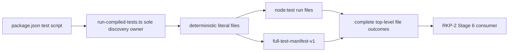

# Design — RKP-2 Cross-platform Full Test Runner Contract Repair

## 0. Authority and lifecycle

This child is the only test-infrastructure owner blocking RKP-2 Stage 6. Its planning base is `eed4871a86191783d539b7d4097be3627e98e4a0`; its parent remains in progress with Stage 5 complete, Stage 6 not started/authorized, candidate readiness false, implementation review pending and TypeScript default.

The planning candidate changes no package, runner source, product source, Rust/native code or ordinary test. It requires dedicated independent planning review. A later implementation requires a new user authorization and `task.py start`; acceptance/archive/integration and Stage 6 authorization remain later gates.

## 1. Root cause and ownership

The complete-suite script `node --test "dist/test/**/*.test.js"` delegates discovery to runtime/shell glob handling. Observed Node 24 invocations disagree (77 files/557 tests versus 29/261 with exit 0), and Node 20.20.2 rejects the literal wildcard. `package.json` and `package-lock.json` are unchanged from unified RKP-2 base `df40aef391440ae64ad3e266419579bee5887a1f` through `eed4871a...`; this is pre-existing infrastructure debt, not Stage 5 product drift.



RKP-2 workspace-law validates the child's accepted projection and later consumes its evidence; it never implements a second enumerator.

## 2. Root and traversal contract

1. CLI direct entry requires `process.cwd()` to be the repository root containing `package.json`; the only enumeration root is `resolve(repoRoot, "dist/test")`.
2. `lstat` the root without following links. Missing, non-directory or symbolic/junction-style root is an infrastructure error.
3. Recursively call `readdir(..., { withFileTypes: true })`. Reject every `Dirent.isSymbolicLink()` entry before any follow operation. A Windows junction/reparse link is treated as a symbolic entry and rejected, not traversed. Recheck traversed entries with `lstat`; only real directories recurse and only real regular files are candidates. Other entry kinds fail rather than silently disappear.
4. Convert every relative candidate separator to `/`. Select only paths ending exactly `.test.js`.
5. Deduplicate normalized relative paths. Any duplicate/alias is an error; it is never silently collapsed into a claimed full run.
6. Sort with the explicit code-unit comparator `a < b ? -1 : a > b ? 1 : 0`. `localeCompare` and filesystem enumeration order are forbidden.
7. Preserve spaces, Unicode and deep nesting as literal path data. No shell escaping or command-line reconstruction is used.
8. Empty selection is an infrastructure error.
9. Return a new recursively frozen manifest record whose `files` is a copied frozen array. Callers never receive or mutate traversal scratch.

## 3. Manifest contract

The immutable record is:

```ts
type FullTestManifestV1 = Readonly<{
  kind: "full-test-manifest-v1";
  root: "dist/test";
  fileCount: number;
  sha256: string;
  files: readonly string[];
}>;
```

`sha256` is lowercase hex SHA-256 of `files.join("\n") + "\n"`, where files are sorted normalized relative paths. Before test output, CLI writes exactly one canonical manifest header containing `kind`, `fileCount` and `sha256`; it does not print absolute host paths. `fileCount` and hash are computed from the same frozen relative array. The absolute array is produced once with `resolve(repoRoot, relativeFile)` and must be element-for-element equal to that projection.

No file or test total is hard-coded. The observed 77/557 baseline is evidence for `eed4871a`, not a future invariant.

## 4. Node 20/24 execution contract

Node's official stable `node:test` API provides `run({ files })`. Node 20.20.2 supports `files` and `concurrency`, and executes explicit files in separate child processes by default; later `cwd` and `isolation` options are not passed because they are absent from Node 20's option surface.

The production adapter therefore verifies repository CWD and invokes exactly:

```ts
run({ files: absoluteFiles, concurrency: true })
```

The semantic execution request captured by the injectable seam is `{ files, cwd: repoRoot, isolation: "process", concurrency: true }`: `cwd` is established before invocation; `process` is the default execution model on Node 20.20.2 and 24.15.0. Any runtime/version for which the verified default is not process isolation is unsupported and fails the version/contract preflight rather than silently changing isolation.

Supported versions are Node `>=20.0.0`; implementation evidence must run 20.20.2 and 24.15.0. The package script is exactly:

```json
"test": "npm run build && node dist/test/test-infrastructure/run-compiled-tests.js"
```

No shell glob, `globPatterns`, dependency, loader flag or per-platform branch is permitted.

## 5. Stream, reporter and exit contract

The `TestsStream` is connected to one built-in stable reporter (`spec`) through an internal reporter factory. The operator does not replace ordinary test output or expected skip rendering.

The coordinator has one completion promise and one terminal result. It catches:

- enumeration/manifest/version/direct-entry setup errors;
- synchronous `run()` throw;
- stream `error` or premature close;
- reporter construction/composition/pipeline error;
- any `test:fail` or cancelled top-level file;
- duplicate, unknown or missing top-level file outcome;
- a top-level outcome set/count unequal to the frozen manifest; and
- any mismatch between manifest projection and the exact `files` array received by the injected runner.

Every listed condition sets a nonzero process exit. Exit zero is written only after reporter completion and exact set equality. A skipped nested test is preserved, while an entire missing/cancelled file cannot be mistaken for success. File outcomes are compared as normalized paths, never by event arrival order.

The production CLI maps success to exit `0` and every contract/infrastructure/test failure to exit `1`. It sets `process.exitCode`; it does not truncate reporter flushing with an eager `process.exit()`.

## 6. Injectable seams and direct entry

Private module seams inject filesystem traversal, hash, `run`, reporter and output sinks. The default production exports are test-infrastructure module exports only; they are not product/Core/SDK/Node APIs and add no environment flag or native export.

The contract test captures the exact semantic request and the actual `run()` options. It proves absolute files, repo root, process isolation semantics and concurrency, plus manifest equality before allowing a fake run to complete.

Compilation remains CommonJS. Direct entry is `require.main === module`, which compares module identity rather than string-normalizing a Windows command path and therefore works with drive letters, spaces and Unicode. Importing the module from its focused test never runs the suite.

## 7. Focused executable test matrix

| Area | Required cases | Frozen outcome |
|---|---|---|
| Enumeration | nested tree, shuffled directory entries, spaces, Unicode, deep paths | identical sorted normalized file array |
| Exclusion | non-test regular file | absent |
| Roots | missing, file root, empty directory | nonzero |
| Links | symlink and Windows junction-style entry | rejected before follow |
| Alias | duplicate normalized/aliased file | nonzero, no run |
| Manifest | exact count and SHA-256 | canonical header and immutable detached data |
| Invocation | exact absolute files, cwd, isolation semantics, concurrency | captured request equals manifest projection |
| Completion | all pass | zero after reporter flush |
| Failure | test failure, cancellation, run throw, stream error, reporter error | nonzero |
| Partial discovery | fake runner completes only a strict subset while claiming full | contract failure/nonzero |
| Current tree | independent enumerator versus emitted manifest | exact set equality |
| Entry/version | PowerShell, cmd.exe/npm.cmd; Node 20.20.2 and 24.15.0 | same manifest/set and expected exit |
| Growth | add fixture `.test.js` | count/hash grow without constant edit |

Tests use temporary fixture roots only. They do not edit or reinterpret existing unit test contents.

## 8. Future implementation allowlist

Only these technical paths may change:

```text
package.json
test/test-infrastructure/run-compiled-tests.ts
test/test-infrastructure/run-compiled-tests.test.ts
test/core-kernel/rust-migration/rkp-2-workspace-contracts.test.ts
```

Only these lifecycle/authority projection paths may change:

```text
.trellis/tasks/08-25-rkp-2-cross-platform-full-test-runner-contract-repair/task.json
.trellis/tasks/08-25-rkp-2-cross-platform-full-test-runner-contract-repair/operator-handoff.md
.trellis/tasks/08-25-rkp-2-cross-platform-full-test-runner-contract-repair/review-candidate.md
.trellis/tasks/08-25-rkp-2-cross-platform-full-test-runner-contract-repair/research/implementation-evidence.md
.trellis/tasks/08-24-rkp-2-indexed-live-score-store-load-encode-parity/design.md
.trellis/tasks/08-24-rkp-2-indexed-live-score-store-load-encode-parity/implement.md
.trellis/tasks/08-24-rkp-2-indexed-live-score-store-load-encode-parity/research/file-test-and-rollback-matrix.md
.trellis/tasks/08-24-rkp-2-indexed-live-score-store-load-encode-parity/task.json
.trellis/tasks/08-24-rkp-2-indexed-live-score-store-load-encode-parity/operator-handoff.md
.trellis/tasks/08-24-rkp-2-indexed-live-score-store-load-encode-parity/review-candidate.md
.trellis/tasks/08-15-core-rust-runtime-performance-remediation/task.json
```

`package-lock.json` is deliberately excluded. Every `src/**`, `crates/**`, Cargo/toolchain, Node native, CVN/qualification, other test, active spec and product/public path remains protected. A needed path outside these two literal blocks stops for planning rereview.

## 9. Integration and freeze

The planning commit may add this child's twelve planning artifacts to the RKP-2 coordination allowlist and update the existing RKP-2 workspace-law test. RKP-2's 21 technical paths remain unchanged. The existing RKP-2 JSONL successor projection remains byte-identical.

The five RKP-2 frozen authority/manifest hashes are recomputed for this exact planning candidate: JSONL hashes remain unchanged; design/implement/matrix hashes change only because they record this blocking child. Workspace-law continues to require literal paths and exact content hashes—no wildcard or permanent task-directory exemption.

After independent planning PASS and separate implementation authorization, the child is activated and implemented in reversible stages. Only after independent implementation PASS and owner acceptance/archive may its accepted history be integrated into a new RKP-2 Stage 6 prerequisite base. RKP-2 Stage 6 then requires a separate user authorization and only consumes the runner/manifest.

## 10. Rollback

Reverse the later implementation stages in order. Reverting the child runner restores the prior package script but must keep Stage 6 blocked. Reverting RKP-2 integration removes only the accepted child projection and restores its prior content hashes. No rollback touches Stage 1–5 production work or changes TypeScript default.
