# Design: Private Scale Evidence Seam Repair

## 1. Decision summary

RKP-2 Stage 6 needs data that only private Runtime operations can produce, while the accepted S6.2 allowlist contains only TypeScript test paths. The repair adds one `cfg(test)` libtest seam at the existing Runtime index boundary and a fail-closed Windows worker around the compiled libtest. Product ownership and product behavior remain unchanged.

```mermaid
flowchart LR
  A[createStressCvn7Score single owner] --> B[TS writes temporary create request]
  B --> C[PowerShell launches exact precompiled libtest]
  C --> D[Contracts decode]
  D --> E[LiveScoreStore import]
  E --> F[verify_index_parity]
  F --> G[one export_document]
  G --> H[one canonical_score_bytes]
  H --> I[versioned private evidence record]
  I --> J[worker validates sentinel counters bytes RSS and liveness]
```

## 2. Root-cause boundary

`Rkp2StoreMetrics` contains twelve categories. Existing checked production/test-visible writes cover:

1. `entities_visited`
2. primary record counters
3. `topology_edges_visited`
4. `reference_edges_built`
5. `time_entries_built`
6. `index_entries_built`
7. `entity_index_lookups`
8. `owner_index_lookups`
9. `time_index_comparisons`
10. `index_rebuild_entries`

The two absent non-zero evidence write points are `full_document_materializations` and `canonical_encode_bytes`. They describe the evidence journey, not persistent Store state. `verify_index_parity` is a private `LiveScoreStore` operation, so a TypeScript-only worker cannot invoke it without a product export. That product export is forbidden; the correct owner is a Rust `cfg(test)` seam.

## 3. Rust seam

### 3.1 Location and visibility

- Sole Rust owner: `crates/brilliant-kernel-runtime/src/indices.rs`.
- Compiled only under `cfg(test)` into the Runtime libtest.
- The ignored test has one frozen fully-qualified name, to be pinned during E1 and invoked with libtest `--exact --ignored --nocapture`.
- No symbol is exported through Rust public API, DTO/FFI, Node-API, examples or product binaries.

### 3.2 Input and composition

The seam reads one environment variable containing an absolute temporary request path. The environment variable is visible only to the test process; it is not a product fault hook. It reads bytes once and calls the real Contracts request decoder. It then performs:

1. validated import and existing primary/index metric capture;
2. an exact owner lookup probe whose before/after counter delta is asserted;
3. `verify_index_parity`, capturing fresh rebuild metrics;
4. exactly one `export_document` into a local value;
5. exactly one `canonical_score_bytes` of that local value;
6. local evidence assignments `full_document_materializations=1` and `canonical_encode_bytes=encoded.len()`.

The exported DTO and encoded bytes live only for the test. The two local fields are never written back into `KernelRuntime`, `LiveScoreStore`, an atomic/global, interior-mutability cell or another retained owner.

### 3.3 Evidence schema

The internal record is versioned `rkp2-private-scale-evidence-v1` and data-only. It includes fixture counts, all frozen counters, canonical and request byte counts, parity result and Rust `Instant` workload elapsed milliseconds. It contains no handle/slot/generation, raw allocator error, thread identity, path outside a normalized diagnostic label, or score payload.

The child process output is captured, not relayed. The PowerShell/TypeScript boundary accepts exactly one sentinel-bearing record and emits exactly one final sentinel. Missing, duplicate or malformed sentinels fail.

## 4. Single fixture ownership

`test/core-kernel/fixtures/cvn-7-qualification-score.ts#createStressCvn7Score` is the only generator. The TypeScript worker:

1. calls it once;
2. asserts its declared counts;
3. canonicalizes the score with the existing TypeScript codec;
4. writes the exact create-request JSON to a fresh temporary path;
5. records file length `15013932` and score length `15013904`;
6. deletes its temporary directory after the process settles.

Rust may parse only that request using the real Contracts codec. It may not contain a mirrored stress builder, embedded score literal or second expected-payload owner.

Frozen snapshot:

| Item | Exact value |
| --- | ---: |
| Measures / Parts / Staves | `400 / 16 / 16` |
| Voices / Events / Notes | `12800 / 102400 / 51200` |
| Extensions / Part-owned / unknown | `18 / 16 / 1` |
| Canonical score bytes | `15013904` |
| Create request bytes | `15013932` |
| Request cap | `67108864` |

## 5. Counter contract

All additions, products, byte lengths and conversions use checked operations. Failure to represent an exact value is a test failure.

| Metric | Expected |
| --- | ---: |
| `entities_visited` | `166833` |
| records: measure/part/staff/voice/event/note/extension | `400/16/16/12800/102400/51200/18` |
| `topology_edges_visited` | `173250` |
| `reference_edges_built` | `19216` |
| `time_entries_built` | `102400` |
| `index_entries_built` | `474517` |
| `index_rebuild_entries` | `474517` |
| `full_document_materializations` | `1` |
| `canonical_encode_bytes` | `15013904` |

The owner lookup probe records a before snapshot, performs one direct owner query for a known entity, and requires an exact `owner_index_lookups` delta of one with all unrelated query counters unchanged. This closes the read-side counter blind spot without scanning the document.

## 6. Worker/process contract

### 6.1 Precompile and executable identity

E2 invokes Cargo with the pinned `+1.97.1`, `--locked`, `--no-run` and JSON message output before the liveness timer. It selects compiler artifacts whose package/target is exactly the `brilliant-kernel-runtime` libtest and whose executable exists. Zero or multiple candidates is failure. No filename glob or newest-file heuristic is allowed.

### 6.2 Timed workload

`rkp-2-scale-evidence-process.ps1` receives literal absolute paths for the executable and request. It uses `Start-Process -WindowStyle Hidden -PassThru` with literal redirected output files, then:

- starts the 180-second timer after process creation;
- samples `PeakWorkingSet64` while the process is alive;
- terminates the exact process on timeout and returns failure;
- rejects non-zero exit, premature/abnormal termination, RSS read failure and unreadable output;
- never publishes a partial evidence object.

Cold compilation, fixture generation and request-file writing are outside the 180-second interval. Rust `Instant` measures only the decoded/import/index/rebuild/export/encode workload. Peak RSS and elapsed time are diagnostic fields, not pass budgets.

### 6.3 Fail-closed precedence

The worker completes only when all layers succeed: exact executable resolution, process liveness, zero exit, one well-formed v1 sentinel, exact fixture/order/bytes/counters, parity and RSS. Any timeout, non-zero exit, OS termination, missing/duplicate/malformed sentinel, RSS failure, mismatch or overflow yields non-zero and no evidence publication. Cleanup failure is also surfaced after preserving the first failure.

## 7. Ownership and allowlists

Future technical ownership is exactly:

1. `crates/brilliant-kernel-runtime/src/indices.rs`
2. `test/core-kernel/rust-migration/rkp-2-scale-evidence-worker.ts`
3. `test/core-kernel/rust-migration/rkp-2-scale-evidence-worker.test.ts`
4. `test/core-kernel/rust-migration/rkp-2-scale-evidence-process.ps1`
5. `test/core-kernel/rust-migration/rkp-2-workspace-contracts.test.ts`

The fixture source is consumed byte-identically. Existing Runtime store/runtime/session files, Node, Contracts, Cargo, package, tsconfig and public surfaces are protected. The workspace-law test must mechanically enforce the accepted planning interval and the later implementation interval without wildcard.

Lifecycle ownership is the child task's twelve planning files plus future `research/implementation-evidence.md`, the RKP-2 parent task/handoff/review projection, and the Rust parent task projection. No active spec is changed.

## 8. Rollback and integration

Four commits remain independently reversible:

- E0 activation/state only;
- E1 Rust seam/private unit evidence;
- E2 worker, process failure tests and workspace law;
- E3 actual stress evidence and candidate freeze.

An E1 failure rolls back without leaving a worker that depends on an absent seam. An E2 failure rolls back without removing the verified Rust seam. E3 is lifecycle/evidence only. After independent implementation PASS, owner acceptance, native archive and explicit integration, the original RKP-2 branch may resume S6.2 as an evidence consumer. It must not recreate the seam or fixture.

## 9. Non-goals

No product benchmark, RKP-7 budget, RKP-9 official qualification, Node export, public selector, DTO/failure change, persistent metrics, second Store owner, new dependency, product code path, default runtime cutover, archive, push or RKP-3.
