# Design: Private Scale Evidence Seam Repair

## 1. Decision summary

RKP-2 Stage 6 needs data that only private Runtime operations can produce, while the accepted S6.2 allowlist contains only TypeScript test paths. The repair adds one `cfg(test)` libtest seam at the existing Runtime index boundary and a fail-closed Windows worker around the compiled libtest. Product ownership and product behavior remain unchanged.

```mermaid
flowchart LR
  A[createStressCvn7Score single owner] --> B[TS writes temporary create request]
  B --> C[PowerShell launches exact precompiled libtest]
  C --> D[Contracts decode]
  D --> E[LiveScoreStore import]
  E --> F[verify_index_parity]
  F --> G[one export_document]
  G --> H[one canonical_score_bytes]
  H --> I[versioned private evidence record]
  I --> J[worker validates sentinel counters bytes RSS and liveness]
```



## 2. Root-cause boundary

`Rkp2StoreMetrics` contains twelve categories. Existing checked production/test-visible writes cover:

1. `entities_visited`
2. primary record counters
3. `topology_edges_visited`
4. `reference_edges_built`
5. `time_entries_built`
6. `index_entries_built`
7. `entity_index_lookups`
8. `owner_index_lookups`
9. `time_index_comparisons`
10. `index_rebuild_entries`

The two absent non-zero evidence write points are `full_document_materializations` and `canonical_encode_bytes`. They describe the evidence journey, not persistent Store state. `verify_index_parity` is a private `LiveScoreStore` operation, so a TypeScript-only worker cannot invoke it without a product export. That product export is forbidden; the correct owner is a Rust `cfg(test)` seam.

## 3. Rust seam

### 3.1 Location and visibility

- Sole Rust owner: `crates/brilliant-kernel-runtime/src/indices.rs`.
- Compiled only under `cfg(test)` into the Runtime libtest.
- Exact ignored libtest FQN: `indices::tests::rkp2_stage_6_private_scale_evidence_v1`.
- Exact request environment variable: `BRILLIANT_RKP2_SCALE_REQUEST_V1`.
- Exact compile command: `cargo +1.97.1 test -p brilliant-kernel-runtime --lib --no-run --locked --message-format=json`.
- A Cargo JSON row is eligible only when `reason="compiler-artifact"`, `target.name="brilliant_kernel_runtime"`, `target.kind` is exactly `["lib"]`, `profile.test=true`, and `executable` is a non-empty absolute existing Windows `.exe`. The eligible set must contain exactly one row; zero or more than one is `process.protocol-invalid` before process start.
- Exact execution argv: `<exact executable> --exact indices::tests::rkp2_stage_6_private_scale_evidence_v1 --ignored --nocapture --test-threads=1`.
- No symbol is exported through Rust public API, DTO/FFI, Node-API, examples or product binaries.

### 3.2 Input and composition

The seam reads `BRILLIANT_RKP2_SCALE_REQUEST_V1`, which must be a non-empty absolute existing regular-file path. The environment variable is visible only to the libtest child and is not a product fault hook. It reads bytes once and calls the real Contracts request decoder. It then performs:

1. validated import and existing primary/index metric capture;
2. construct `let stable_id = StableId::new("cvn7-e-00-0000-0-0").expect("stable evidence entity id")`, then execute `let entity_before = store.metrics; let entity = store.lookup_entity(&stable_id).expect("known evidence entity"); let entity_after = store.metrics;` and require `RuntimeEntityRef::Event`, `entity_index_lookups` delta `1`, and every other `Rkp2StoreMetrics` field delta `0`;
3. execute `let mut owner_probe_metrics = Rkp2StoreMetrics::default(); let owner = store.indices.lookup_owner(entity, &mut owner_probe_metrics).expect("known evidence owner");`, requiring Voice owner `cvn7-v-00-0000-0`, `owner_probe_metrics.owner_index_lookups=1`, and every other field in `owner_probe_metrics=0`;
4. `verify_index_parity`, capturing fresh rebuild metrics;
5. exactly one `export_document` into a local value;
6. exactly one `canonical_score_bytes` of that local value;
7. local evidence assignments `full_document_materializations=1` and `canonical_encode_bytes=encoded.len()`.

The second probe must not call `LiveScoreStore::lookup_owner`, because that convenience path performs another entity lookup. `entityProbe` is derived only from `entity_before/entity_after`; `ownerProbe` is derived only from `owner_probe_metrics`. They are separate internal-sentinel records and do not alter the frozen import or rebuild totals.

The exported DTO and encoded bytes live only for the test. The two local fields are never written back into `KernelRuntime`, `LiveScoreStore`, an atomic/global, interior-mutability cell or another retained owner.

### 3.3 Exact Rust internal protocol

Rust emits exactly one line beginning `BRILLIANT_RKP2_SCALE_RUST_V1:` followed immediately by compact UTF-8 JSON. No whitespace or reporter text is part of the payload. Object keys appear in the order below; all fields are required, extra fields are forbidden, strings are exact literals/enums, booleans are JSON booleans, and every integer is in `0..=Number.MAX_SAFE_INTEGER`.

| Field | Exact type/value |
| --- | --- |
| `schemaVersion` | integer literal `1` |
| `status` | string literal `ok` |
| `fixtureId` | string literal `cvn7-stress-v1` |
| `counts` | exact object: `measures`, `parts`, `staves`, `measureContents`, `voices`, `events`, `notes`, `extensions`, `partOwnedExtensions`, `unknownExtensions` |
| `bytes` | exact object: `canonicalScoreBytes`, `createRequestBytes` |
| `metrics` | exact object: `entitiesVisited`, `records`, `topologyEdgesVisited`, `referenceEdgesBuilt`, `timeEntriesBuilt`, `entityIndexLookups`, `ownerIndexLookups`, `timeIndexComparisons`, `indexEntriesBuilt`, `indexRebuildEntries`, `fullDocumentMaterializations`, `canonicalEncodeBytes`; `records` is exact `measures/parts/staves/voices/events/notes/extensions` |
| `entityProbe` | exact object: `stableId="cvn7-e-00-0000-0-0"`, `entityKind="event"`, `entityIndexLookupsDelta=1`, `otherCounterDelta=0` |
| `ownerProbe` | exact object: `entityKind="event"`, `ownerKind="voice"`, `ownerStableId="cvn7-v-00-0000-0"`, `ownerIndexLookupsDelta=1`, `otherCounterDelta=0` |
| `parity` | exact object: `normalizedProjectionEqual=true`, `indexEntryCountEqual=true` |
| `roundTrip` | exact object: `semanticEqual=true`, `canonicalBytesEqual=true` |
| `ordering` | exact object: `topologyCanonical=true`, `extensionsPreserved=true` |
| `workloadElapsedMicros` | safe integer measured by Rust `Instant`, diagnostic only |

The internal payload contains no RuntimeHandle, slot/generation, allocator error, thread identity, filesystem path, raw output, backtrace or score payload.

## 4. Single fixture ownership

`test/core-kernel/fixtures/cvn-7-qualification-score.ts#createStressCvn7Score` is the only generator. The TypeScript worker:

1. calls it once;
2. asserts its declared counts;
3. canonicalizes the score with the existing TypeScript codec;
4. writes the exact create-request JSON to a fresh temporary path;
5. records file length `15013932` and score length `15013904`;
6. hands the request/root to PowerShell and, after the final envelope, asserts that the wrapper removed them; TypeScript cleans only a pre-handoff `pwsh` launch failure for which no process envelope exists.

Rust may parse only that request using the real Contracts codec. It may not contain a mirrored stress builder, embedded score literal or second expected-payload owner.

Frozen snapshot:

| Item | Exact value |
| --- | ---: |
| Measures / Parts / Staves | `400 / 16 / 16` |
| Voices / Events / Notes | `12800 / 102400 / 51200` |
| Extensions / Part-owned / unknown | `18 / 16 / 1` |
| Canonical score bytes | `15013904` |
| Create request bytes | `15013932` |
| Request cap | `67108864` |

## 5. Counter contract

All additions, products, byte lengths and conversions use checked operations. Failure to represent an exact value is a test failure.

| Metric | Expected |
| --- | ---: |
| `entities_visited` | `166833` |
| records: measure/part/staff/voice/event/note/extension | `400/16/16/12800/102400/51200/18` |
| `topology_edges_visited` | `173250` |
| `reference_edges_built` | `19216` |
| `time_entries_built` | `102400` |
| import/rebuild `entity_index_lookups` | `0` |
| import/rebuild `owner_index_lookups` | `0` |
| import/rebuild `time_index_comparisons` | `0` |
| `index_entries_built` | `474517` |
| `index_rebuild_entries` | `474517` |
| `full_document_materializations` | `1` |
| `canonical_encode_bytes` | `15013904` |

The two probes are separate read-side results, not part of those import/rebuild totals. `entity_before=store.metrics`, real `store.lookup_entity(&stable_id)`, and `entity_after=store.metrics` prove only `entity_index_lookups` changed by `1`. A distinct `Rkp2StoreMetrics::default()` passed to `store.indices.lookup_owner(entity, &mut owner_probe_metrics)` proves exactly `owner_index_lookups=1` and every other field `0`, returning Voice `cvn7-v-00-0000-0`. Calling `LiveScoreStore::lookup_owner` for the second probe is forbidden because it would repeat entity lookup.

## 6. Worker/process contract

### 6.1 Exact TypeScript to PowerShell invocation

TypeScript invokes exactly:

```text
pwsh -NoProfile -NonInteractive -ExecutionPolicy Bypass -File <absolute-script> -ExecutablePath <absolute-exe> -RequestPath <absolute-request> -TestName indices::tests::rkp2_stage_6_private_scale_evidence_v1 -TimeoutMs 180000 -PollIntervalMs 25 -MaxStdoutBytes 1048576 -MaxStderrBytes 1048576
```

The script parameter block is frozen:

| Parameter | PowerShell type | Required/default and validation |
| --- | --- | --- |
| `ExecutablePath` | `[string]` | mandatory; non-empty absolute existing regular `.exe` |
| `RequestPath` | `[string]` | mandatory; non-empty absolute existing regular file |
| `TestName` | `[string]` | default and only accepted value `indices::tests::rkp2_stage_6_private_scale_evidence_v1` |
| `TimeoutMs` | `[int]` | default and only accepted value `180000` |
| `PollIntervalMs` | `[int]` | default and only accepted value `25` |
| `MaxStdoutBytes` | `[int]` | default and only accepted value `1048576` |
| `MaxStderrBytes` | `[int]` | default and only accepted value `1048576` |

TypeScript validates every named argument and the executable/script/test identities before creating any owned TEMP resource. A validation failure is therefore a TypeScript pre-call failure: TypeScript fails closed, cleans anything it created before handoff, does not invoke PowerShell and does not fabricate a PowerShell process envelope. Only after validation may TypeScript create the owned TEMP root/request and hand them to the wrapper.

### 6.2 Exact process lifecycle

Ownership transfers when the validated PowerShell wrapper accepts the already-created request and owned TEMP root. From that point the wrapper is the sole cleanup owner for the request, redirect stdout/stderr and owned TEMP root, including when `Start-Process` throws. If `pwsh` itself cannot start and no wrapper accepts the handoff, TypeScript retains ownership, performs bounded cleanup and fails closed outside the process-envelope protocol.

The script saves whether `BRILLIANT_RKP2_SCALE_REQUEST_V1` existed and its prior value, sets it only in its own process before `Start-Process`, and restores the prior value or removes the variable in `finally`. The child inherits it; no user/global environment is changed. The same `finally` first closes any process/redirection handles, then restores/removes the environment variable, then cleans owned resources in exact order `request -> stdout -> stderr -> owned TEMP root`.

The script creates unique TEMP stdout/stderr files and uses `Start-Process -WindowStyle Hidden -PassThru -RedirectStandardOutput <stdout> -RedirectStandardError <stderr>` with exact libtest argv. The liveness clock begins only after `Start-Process` succeeds. Cold compilation, fixture generation and request writing are outside it.

Every `25ms` poll performs, in order: `Refresh()`, checked `PeakWorkingSet64` max update, checked stdout length, checked stderr length, elapsed/timeout check, then bounded wait. Output over `1048576` bytes or `180000ms` selects the cap/timeout primary, requests termination of the visible process tree using validated `%SystemRoot%\System32\taskkill.exe /PID <pid> /T /F`, and then performs bounded reap (`5000ms`) regardless of termination outcome. Termination and reap outcomes are recorded only in the fixed secondary statuses and never replace the primary. Normal/nonzero exit does not request termination, calls `WaitForExit()` to flush redirected streams, records the actual reap result, and then performs one final `Refresh`, RSS and output-cap check.

Rust `Instant` measures decode/import/index/probe/rebuild/export/encode only. `PeakWorkingSet64` must be available, positive and safe-integer representable. Both are required diagnostics with no latency or RSS pass budget.

Cleanup is bounded and idempotent. For each target in the exact order above, the wrapper checks existence, attempts deletion at most twice, and waits exactly `25ms` before the second attempt. Any failed attempt makes final `cleanupStatus="failed"` even if retry succeeds; any resource that remains after the second attempt also makes it failed. The test fixture may release an intentionally injected lock only after protocol assertions and must then prove zero test residue; that fixture cleanup is not part of protocol status.

The wrapper completes this `finally`, observes the actual cleanup result, and only then constructs the sole external final sentinel. It may never publish success before cleanup. A successful workload followed by cleanup failure becomes rejection `process.cleanup-failed` with `partialEvidence=false`.

### 6.3 Exact final process protocol

The script captures libtest output and never relays it. After `finally` has completed, its stdout contains exactly one line beginning `BRILLIANT_RKP2_SCALE_PROCESS_V1:` followed by compact exact-shape JSON; stderr is empty for protocol output.

Success shape, key order and allowed fields are exactly:

| Field | Exact type/value |
| --- | --- |
| `schemaVersion` | integer `1` |
| `status` | string `ok` |
| `evidence` | exact Rust internal evidence object from section 3.3 |
| `process` | exact object `exitCode=0`, `timedOut=false`, positive safe integer `peakWorkingSetBytes`, safe integers `stdoutBytes` and `stderrBytes`, `terminationStatus="not-required"`, `reapStatus="succeeded"`, `cleanupStatus="succeeded"` |
| `partialEvidence` | boolean `false` |

Rejection shape has exactly `schemaVersion=1`, `status="rejected"`, `failure`, `process`, `partialEvidence=false`; it must not contain `evidence`. `failure` is exactly `{code,details}`. Rejection `process` is exactly `{exitCode,timedOut,peakWorkingSetBytes,stdoutBytes,stderrBytes,terminationStatus,reapStatus,cleanupStatus}`: `exitCode` and `peakWorkingSetBytes` are safe integers or `null`; byte counts are safe integers; `terminationStatus` and `reapStatus` are exactly `not-required|succeeded|failed`; `cleanupStatus` is exactly `succeeded|failed`. No raw stdout/stderr, filesystem path, OS error, backtrace, payload or partial counter is allowed.

Status reachability is frozen:

- `Start-Process` failure after wrapper handoff: primary `process.start-failed`, `exitCode=null`, `timedOut=false`, `peakWorkingSetBytes=null`, both byte counts `0`, `terminationStatus="not-required"`, `reapStatus="not-required"`, and `cleanupStatus` records the actual `succeeded|failed` result; cleanup failure cannot replace the start primary;
- output cap or timeout: the selected primary remains cap/timeout; termination is requested and records `succeeded|failed`; bounded reap always follows and records `succeeded|failed`; cleanup records `succeeded|failed`;
- normal or nonzero exit: `terminationStatus="not-required"`; reap and cleanup record their real `succeeded|failed` outcomes;
- success requires normal zero exit plus `reapStatus="succeeded"` and `cleanupStatus="succeeded"`;
- a normal zero-exit `reapStatus="failed"` with no earlier primary selects existing `process.protocol-invalid` details `{stage:"process",reason:"identity"}` at the protocol stage, because complete redirected output cannot be proven;
- cleanup failure with no earlier primary selects `process.cleanup-failed`; with an earlier primary it changes only `cleanupStatus="failed"`; successful workload plus cleanup failure is therefore rejected, never success.

### 6.4 Closed failure union

| Code | Exact `details` object |
| --- | --- |
| `process.start-failed` | `{stage:"start"}` |
| `process.output-limit-exceeded` | `{stream:"stdout"|"stderr",limitBytes:1048576}` |
| `process.timeout` | `{timeoutMs:180000}` |
| `process.nonzero-exit` | `{exitCode:<safe unsigned Windows exit code>}` |
| `process.sentinel-count-invalid` | `{expected:1,actual:<safe integer>}` |
| `process.sentinel-malformed` | `{stage:"json"}` |
| `process.protocol-invalid` | `{stage:"arguments"|"cargo-artifact"|"internal"|"process",reason:"shape"|"type"|"range"|"version"|"extra-field"|"identity"}` |
| `process.rss-unavailable` | `{stage:"poll"|"final-refresh"}` |
| `process.rss-invalid` | `{reason:"zero"|"negative"|"unsafe-integer"}` |
| `evidence.counter-mismatch` | `{counter:<closed counter name>,expected:<safe integer>,actual:<safe integer>}` |
| `evidence.overflow` | `{field:<closed numeric field name>}` |
| `evidence.parity-mismatch` | `{check:"normalized-index-projection"|"index-entry-count"}` |
| `evidence.bytes-mismatch` | `{field:"canonicalScoreBytes"|"createRequestBytes",expected:<safe integer>,actual:<safe integer>}` |
| `evidence.order-mismatch` | `{field:"topology"|"extensions"}` |
| `evidence.payload-mismatch` | `{field:"fixtureId"|"counts"|"entityProbe"|"ownerProbe"|"roundTrip"}` |
| `process.cleanup-failed` | `{target:"request"|"stdout"|"stderr"|"temp-directory"}` |

The closed counter names are every leaf in `metrics` plus `entityProbe.entityIndexLookupsDelta`, `entityProbe.otherCounterDelta`, `ownerProbe.ownerIndexLookupsDelta`, and `ownerProbe.otherCounterDelta`. The closed numeric field names are those counters plus both `bytes` leaves, `workloadElapsedMicros`, and the four numeric `process` leaves. No free-form message/detail field exists.

### 6.5 First-failure precedence

Primary selection order is exact: start → sampling/refresh → stdout/stderr cap → timeout → exit code → internal sentinel count → JSON parse → exact protocol/range → RSS validity → frozen counts/bytes/counters → parity → ordering → payload/round-trip → cleanup. Shutdown secondary statuses do not participate in primary selection.

The first selected failure is immutable. Cap plus termination failure remains `process.output-limit-exceeded` with `terminationStatus="failed"`; timeout plus reap failure remains `process.timeout` with `reapStatus="failed"`. Cleanup failure is `process.cleanup-failed` only when no earlier primary exists; otherwise it changes only `cleanupStatus="failed"`. Every rejection remains `partialEvidence=false`. Focused injected fixtures cover those exact combinations and every reachable primary code without copying production parsing logic.

Cleanup-specific negative fixtures are exact: a syntactically eligible existing `.exe` that passes pre-handoff path validation but is not a valid libtest makes `Start-Process` fail, reports primary `process.start-failed` plus `cleanupStatus="succeeded"`, settles without a hang and leaves no owned TEMP root; an injected first deletion failure followed by successful retry keeps primary `process.start-failed`, reports `cleanupStatus="failed"` and leaves no owned TEMP root; two failed attempts report rejection with the earlier primary (or `process.cleanup-failed` when cleanup is the first failure), `cleanupStatus="failed"` and no partial evidence, after which the fixture releases its injected fault and proves zero test residue.

## 7. Ownership and allowlists

Future technical ownership is exactly:

1. `crates/brilliant-kernel-runtime/src/indices.rs`
2. `test/core-kernel/rust-migration/rkp-2-scale-evidence-worker.ts`
3. `test/core-kernel/rust-migration/rkp-2-scale-evidence-worker.test.ts`
4. `test/core-kernel/rust-migration/rkp-2-scale-evidence-process.ps1`
5. `test/core-kernel/rust-migration/rkp-2-workspace-contracts.test.ts`

The fixture source is consumed byte-identically. Existing Runtime store/runtime/session files, Node, Contracts, Cargo, package, tsconfig and public surfaces are protected. The workspace-law test must mechanically enforce the accepted planning interval and later implementation interval without wildcard.

Nine planning-authority files become immutable after this repair: `prd.md`, `design.md`, `implement.md`, both JSONLs, and the four planning research files. `task.json.meta.immutable_planning_authority` is the sole digest registry, containing each repository-relative path and its LF-normalized UTF-8 SHA-256. E0-E3 recompute all nine digests and exact-match them; those files are not implementation lifecycle owners.

Implementation lifecycle mutation is exactly eight paths: child `task.json`, `operator-handoff.md`, `review-candidate.md`, future `research/implementation-evidence.md`; RKP-2 parent `task.json`, `operator-handoff.md`, `review-candidate.md`; Rust parent `task.json`. Any ninth mutable lifecycle path fails closed. No active spec is changed.

## 8. Rollback and integration

Four commits remain independently reversible:

- E0 activation/state only;
- E1 Rust seam plus compile and small existing Rust unit proof only; it does not require a stress request;
- E2 sole TypeScript fixture/request generation, worker/process failure tests, workspace law and one real stress integration run;
- E3 a fresh temporary request, a second real evidence run and candidate freeze.

An E1 failure rolls back without leaving a worker that depends on an absent seam. An E2 failure rolls back without removing the verified Rust seam. E3 is lifecycle/evidence only. After independent implementation PASS, owner acceptance, native archive and explicit integration, the original RKP-2 branch may resume S6.2 as an evidence consumer. It must not recreate the seam or fixture.

## 9. Non-goals

No product benchmark, RKP-7 budget, RKP-9 official qualification, Node export, public selector, DTO/failure change, persistent metrics, second Store owner, new dependency, product code path, default runtime cutover, archive, push or RKP-3.
