# Design: RKP-2 E3 Acceptance and Archive Closure

## 1. Problem and fixed-point decision

The reviewed candidate `f27daf7` correctly prevents forged acceptance: its law accepts only the pre-acceptance terminal state and rejects every archive flag. A direct archive is therefore not a bookkeeping-only operation; it changes a path and lifecycle state that the current law deliberately forbids.

This task adds one final archive-aware state machine. The implementation candidate already contains the native archive of the target acceptance-state task. The law also accepts the later native archive of this closure task without another technical modification. The closure task is scaffolding, not a new product authority.

## 2. Authority graph

```mermaid
flowchart LR
    E3["E3 audited candidate<br/>0c561d14"]
    Projection["acceptance projection<br/>f27daf7"]
    ProjectionAudit["dedicated PASS<br/>0/0/0"]
    ClosureRecord["334-byte record<br/>closure task owner"]
    TargetArchive["acceptance task<br/>native archive"]
    ClosureCandidate["archive-aware law<br/>independent review"]
    ClosureArchive["closure task<br/>native archive"]
    Next["owner decision<br/>E3 law parent"]

    E3 --> Projection --> ProjectionAudit --> ClosureRecord
    ClosureRecord --> TargetArchive --> ClosureCandidate --> ClosureArchive --> Next
```



The old 323-byte record continues to bind the audit of `0c561d14`. The new 334-byte record binds the separate audit of `f27daf7`. They have different candidates, verdicts, digests, and owners.

## 3. Record contract

The exact V1 record and field order are:

```ts
interface E3AcceptanceProjectionAuditRecordV1 {
  readonly schemaVersion: 1;
  readonly reviewTaskId: "01a01e48-1934-77b0-821e-a8026cd9e5f7";
  readonly reviewTurnId: "01a0562d-c544-7371-861f-0ead4d04cea2";
  readonly candidateCommit: "f27daf7b514731adaabbe8f7814d2b57e12a7df7";
  readonly technicalCommit: "4abfef9b3f7620d6428382af287cccd662aa7bf7";
  readonly verdict: "PASS_READY_FOR_OWNER_ACCEPTANCE_AND_ARCHIVE_CLOSURE";
  readonly P0: 0;
  readonly P1: 0;
  readonly P2: 0;
}
```

Canonical JSON uses that order, no whitespace, UTF-8 without BOM: 334 bytes, SHA-256 `8559f7aed98ddc45154f90dd459688530ba5e24efedeb573389e06ca7d099436`.

Exactly one of these owner paths exists:

```text
.trellis/tasks/08-31-rkp-2-e3-acceptance-archive-closure/task.json
.trellis/tasks/archive/2026-08/08-31-rkp-2-e3-acceptance-archive-closure/task.json
```

The immediate parents contain only the selected owner path and digest. A duplicate structured record is rejected.

## 4. Lifecycle phases

| Phase | Target acceptance task | Closure task | Parent live child | Permitted result |
|---|---|---|---|---|
| P0 planning | active, review pending | active planning | target implementation + closure planning | one planned closeout gap |
| P1 transition | active, review pending | active implementation | closure implementation | law/helper construction only |
| P2 owner acceptance | active, review passed and archive authorized | active implementation | closure implementation | native target archive may run |
| P3 review candidate | archived completed | active, candidate ready/review pending | closure implementation | dedicated implementation audit |
| P4 terminal | archived completed | archived completed | none | owner decision for E3 law parent |

P3 is the independently reviewed implementation candidate. P4 changes only already-declared lifecycle/archive paths and is validated by the P3 law. P4 never changes the Workspace Law test.

## 5. Archive resolver

For each governed task, pure resolution returns exactly one state:

```text
active-only   -> read active task.json and exactly 11 artifacts
archive-only  -> read archive task.json and exactly 11 artifacts
both          -> reject
neither       -> reject
```

The target acceptance task must be `archive-only` in P3/P4. The closure task is `active-only` in P0-P3 and `archive-only` in P4. The archive month is fixed to `2026-08` because native archive executes on the task creation/completion date already recorded by the project clock.

The resolver uses literal repository-relative paths. It does not scan arbitrary archive months or select the newest matching slug.

## 6. Path-set contract

Path evidence uses:

```text
git diff --name-status --no-renames f27daf7..HEAD
```

P3 has exactly 40 path identities:

```text
11 A  active closure-task artifacts
 1 M  Workspace Law test
 3 M  E3 law parent lifecycle files
 3 M  Stage 6 parent lifecycle files
11 D  active target-task artifacts
11 A  archived target-task artifacts
```

P4 also has exactly 40 identities, replacing the 11 active closure additions with 11 archived closure additions. Source/target status letters, not just names, are verified. Rename detection is disabled so source deletion and archive addition remain explicit.

The 11 artifact names are fixed:

```text
check.jsonl
design.md
implement.jsonl
implement.md
operator-handoff.md
prd.md
research/audit-pass-and-transition-gap.md or research/current-state-and-recursion-audit.md
research/file-test-and-rollback-matrix.md or research/file-state-test-matrix.md
research/planning-self-audit.md
review-candidate.md
task.json
```

Each task has its own literal 11-name manifest; `or` above describes the two different task manifests, not an implementation-time choice.

## 7. Lifecycle projections

### Target archived task

- `status=completed`, `completedAt=2026-08-31`;
- `implementation_candidate_ready=true`;
- `implementation_review=passed_dedicated_independent_acceptance_projection_implementation_review`;
- exact source review record reference/digest;
- accepted audited candidate `f27daf7`;
- `acceptance_authorized=true`, `archive_authorized=true`;
- `integration/qualification/cutover/push/RKP3=false`;
- S6.2/S6.3 false, TypeScript default.

### E3 law parent

- remains `in_progress` and unarchived;
- original E3 review remains bound to `0c561d14`;
- target acceptance task recorded completed at its archive path;
- closure task is the current planning/implementation child only while active;
- after P4 both current child pointers are null;
- final next gate is `explicit_owner_decision_for_e3_law_parent_acceptance_archive`.

### Stage 6 parent

- remains `in_progress`;
- E3 law parent remains its current implementation child;
- S6.1 retained; S6.2/S6.3 false;
- TypeScript default and all later authorizations false;
- stores only the closure review record owner/digest reference.

RKP-2 and Rust-parent task files are immutable in this task.

## 8. Workspace Law changes

The sole technical file adds pure helpers equivalent to:

```ts
resolveExactTaskLocation(activeRoot, archiveRoot, manifest)
canonicalizeAcceptanceProjectionAuditRecord(record)
assertSingleAcceptanceProjectionAuditRecordOwner(records)
acceptedArchiveClosureChanges(phase)
assertAcceptanceArchiveLifecycleProjection(input, phase)
```

Repository I/O remains in the owning top-level test. Pure negative fixtures cover mutations without moving files.

## 9. Negative matrix

| Mutation | Result |
|---|---|
| missing/extra/reordered audit field | reject |
| wrong task, turn, candidate, technical commit, verdict, or P count | reject |
| byte/hash drift | reject |
| active and archived owner both present | reject |
| target active in P3/P4 | reject |
| missing or twelfth archive artifact | reject |
| wrong A/M/D status or rename-collapsed path set | reject |
| archive marked complete without reviewed `f27daf7` | reject |
| closure archived before implementation PASS | reject |
| parent points to another child | reject |
| S6.2/S6.3, integration, qualification, Rust default, push, or RKP-3 | reject |
| old 323-byte and new 334-byte record owner conflated | reject |

## 10. Rollback

1. Before target archive: revert the one technical commit, then lifecycle activation.
2. After target archive but before P3 acceptance: revert the native archive commit first, then acceptance-sync and technical commits.
3. After closure archive: revert its native archive commit to restore the P3 reviewed state.
4. Never move task directories manually and never rewrite the audited endpoints.

No product data, E3 evidence, runtime state, or build artifact participates in rollback.
