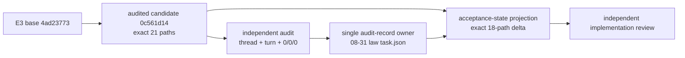

# Design: RKP-2 E3 Acceptance-State Projection

## 1. Problem and decision

The audited E3 Workspace Law candidate is valid at `0c561d14`, but its live lifecycle assertion deliberately accepts only `implementation_review=pending` and rejects `passed`. That rule correctly prevented a forged pre-audit PASS. After an actual independent PASS, the same rule blocks the legitimate state transition.

The repair does not weaken `passed` validation. It introduces an exact audit-bound transition and freezes the previously audited candidate as historical evidence.

## 2. Authority graph



The E3 Workspace Law task owns the canonical audit record because it owns the audited candidate. The Stage 6 parent and the transition child store only its path and digest.

## 3. Immutable historical candidate

The current function that derives E3 final state from `4ad23773..HEAD` must be split:

- historical E3 candidate: `git diff --name-only 4ad23773..0c561d14`, exact 21 paths;
- current acceptance transition: `git diff --name-only 0c561d14..HEAD` plus unstaged, staged and untracked paths.

The first projection is always commit-to-commit. Future planning, implementation and lifecycle files never re-enter the audited 21-path set.

The historical candidate lifecycle is read with `git show 0c561d14:<path>`, proving that the audited state was pending and preventing current lifecycle changes from rewriting its meaning.

## 4. Canonical audit record

### 4.1 Shape

```ts
interface E3WorkspaceLawAuditRecordV1 {
  readonly schemaVersion: 1;
  readonly reviewTaskId: "01a01e48-1934-77b0-821e-a8026cd9e5f7";
  readonly reviewTurnId: "01a05589-d996-7ec1-ab58-b6f2db049e69";
  readonly candidateCommit: "0c561d14193374436361eec09b361cab0170278a";
  readonly technicalCommit: "36fe1956ec8660d664eb9606912dbc6e1b6c3ede";
  readonly verdict: "PASS_READY_FOR_E3_ACCEPTANCE_PREPARATION";
  readonly P0: 0;
  readonly P1: 0;
  readonly P2: 0;
}
```

### 4.2 Canonicalization

Serialization is exact one-line JSON with the field order shown above, no whitespace and UTF-8 without BOM. The expected byte length is 323 and expected SHA-256 is `dee0b92ce8a2ff6c8a9737c5b98104e39633b85aaad70e594f61e4847fdd7589`.

No timestamp, model, machine path or prose is included in the canonical record. Those values are not required to bind the verdict and would introduce unstable authority.

## 5. Transition phases

| Phase | Exact delta from `0c561d14` | Parent review state | Child state | Result |
|---|---:|---|---|---|
| planning candidate | 12 paths | pending | planning | one planned old-law projection failure |
| activated + technical commit | 13 paths | pending | in_progress, candidate false | new law accepts exact transition state |
| terminal candidate | 18 paths | passed with exact V1 record | in_progress, candidate true | `11/8/3`, ready for independent review |

The planning 12 paths are eight immutable planning files plus four lifecycle paths already created during planning: child `task.json`, `operator-handoff.md`, `review-candidate.md` and the parent law `task.json` child link.

The terminal 18 paths are the disjoint ownership union defined by E3ASP-R004. Paths are classified by authority role, not by the first commit that created them.

## 6. Lifecycle projection

Terminal state requires:

- E3 law task remains `in_progress`;
- E3 law `implementation_review=passed` and its result exact-matches V1;
- Stage 6 remains `in_progress`, references the law record digest and reports review passed;
- transition child remains `in_progress`, candidate ready, independent implementation review pending;
- current planning child becomes null only after activation; current implementation child is the transition child while it owns the projection;
- RKP-2 remains paused before S6.2;
- S6.2/S6.3 false;
- TypeScript default;
- archive, integration, qualification, runtime switch, push and RKP-3 false.

The transition does not write an acceptance or archive verdict. `review passed` and `task accepted` remain separate facts.

## 7. Validation functions

The technical change adds or refactors pure helpers equivalent to:

```ts
historicalE3AuditedCandidateChanges(): ReadonlySet<string>
currentAcceptanceProjectionChanges(): ReadonlySet<string>
canonicalizeE3AuditRecord(record: unknown): string
assertExactE3AuditRecord(record: unknown): void
assertAcceptanceProjectionPathSet(paths, phase): void
assertE3AcceptanceLifecycleProjection(input): void
```

Each helper receives explicit fixtures for negative tests. Repository reads occur only in the owning top-level test.

## 8. Negative matrix

| Mutation | Expected |
|---|---|
| audit record missing | reject |
| task or turn ID changed | reject |
| candidate or technical commit changed | reject |
| P0/P1/P2 non-zero | reject |
| canonical bytes/hash changed | reject |
| Stage 6 duplicates the full record | reject |
| historical 21-path set reads live HEAD | reject |
| acceptance projection has extra/missing/duplicate owner | reject |
| passed + S6.2/S6.3 | reject |
| passed + archive/integration/qualification/cutover/push/RKP-3 | reject |
| default runtime Rust | reject |
| 08-30 claims live ownership | reject |

## 9. Compatibility and rollback

No product, Rust, FFI, DTO, fixture, process or build behavior changes. Rollback is commit-local:

1. revert lifecycle candidate commit to return to the exact technical transition state;
2. revert the technical commit to return to the accepted planning state;
3. remove the planning worktree/branch only after confirming `0c561d14` and the original E3 source are untouched.

The audited candidate `0c561d14` is always the safe baseline.
