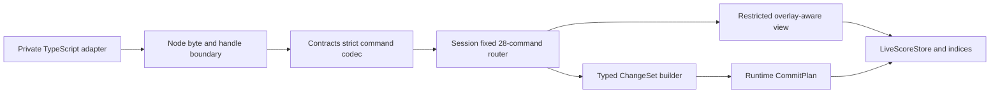

# Design — RKP-3 Transaction Overlay, ChangeSet and 28 Core Commands

## 0. Status and authority

This is an implementation-level planning candidate based on accepted RKP-2
commit `6d0956c970f4414cb61e0f3d7148672a6e635032`.

```text
accepted RKP-2 indexed LiveScoreStore
  -> this reviewed RKP-3 planning contract
  -> later explicit implementation activation
  -> implementation candidate and independent review
  -> possible owner acceptance/archive
  -> only then RKP-4 planning
```

No production code is changed by this planning artifact. The task remains
`planning`; TypeScript remains default. This design consumes:

- the exact TypeScript 28-command catalog and V1 semantics;
- Architecture Reset V2 restricted-handler, ChangeSet, atomicity, batch, no-op,
  metrics, cap, and stage-ownership decisions;
- the archived RKP-0 oracle without changing its bytes;
- the accepted RKP-2 store/index/opaque-handle implementation.

## 1. Stage boundary

RKP-3 owns one private, end-to-end, valid-command transaction slice:



RKP-3 does not own history, snapshot caching, dirty state, events, replay,
incremental semantic/domain/extension validation, support classification,
plugin composition, qualification, or default selection.

Consequently, its native submit result is explicitly stage-private and smaller
than the final public application `CommandResult`. It cannot be selected as the
product engine.

## 2. Crate ownership and dependency law

| Crate/layer | RKP-3 responsibility |
|---|---|
| `brilliant-core-types` | add only checked `DocumentVersionV1::checked_next()` bounded by `JS_SAFE_INTEGER_MAX` |
| `brilliant-kernel-contracts` | exact command DTOs, strict request decode, stable stage result/failure serialization, byte caps |
| `brilliant-kernel-runtime` | stable ChangeSet, overlay, restricted read/builder, preflight, reservations, CommitPlan, store/index adoption, counters |
| `brilliant-kernel-session` | fixed catalog, route order, 28 handlers, batch child coordination, failure mapping |
| `brilliant-kernel-node` | value-only `submitKernelStage3V1` over the existing opaque handle and mutex |
| private TypeScript adapter | capture/encode/decode/freeze Stage-3 DTOs; no default selection |

No dependency or crate edge changes. In particular, Session receives
Foundation DTO value types through the Contracts/Runtime APIs and does not gain
a new manifest dependency. Runtime handles, stores, builders, ChangeSets,
closures, trait objects, and Rust references never cross Node.

## 3. Private Stage-3 wire contract

### 3.1 Request

```rust
struct KernelStage3SubmitRequestV1 {
    api_version: u64,            // exactly 1
    command: CoreCommandEnvelopeV1,
}
```

The serialized object has exactly `apiVersion`, `command`. The command object
has exactly `commandVersion`, `commandId`, `target`, `payload`. Decoder order is:

1. bridge value/Buffer and 64 MiB request cap;
2. UTF-8 and JSON syntax;
3. depth 64, properties 1,572,864, duplicate/extra/missing members, safe numbers;
4. exact top-level shape and API version;
5. exact command envelope shape;
6. safe-integer command version, then version equality;
7. string command ID, then exact catalog lookup;
8. target discriminant, then expected target kind;
9. exact target and payload shape/domain decoding;
10. handler target/anchor/reference resolution.

This preserves the accepted `invalid-envelope -> unsupported-version ->
unknown-id -> target-mismatch` route precedence from
`src/core-kernel/commands/strict-codec.ts:249-312`.

### 3.2 Command DTOs

`CoreCommandEnvelopeV1` is a closed enum with exactly 28 variants in catalog
order. Targets and anchors are closed enums matching
`src/core-kernel/commands/contracts.ts:27-57`:

- targets: document, measure, part, staff, voice, event, note;
- anchors: start or the matching stable sibling kind;
- ranges: measure, part-measure, voice-event with typed endpoints;
- batch payload: dense 1..100 raw child values decoded one at a time.

All payload domain values reuse Foundation/Core Types DTOs. Batch children are
held as bounded strict values until child routing; a nested batch is rejected at
the lowest child index before its payload executes.

### 3.3 Result

The exact stage wire union is:

```text
committed
{ apiVersion: 1, status: "committed",
  value: { documentVersion, affected, metrics } }

no-op
{ apiVersion: 1, status: "no-op",
  value: { documentVersion, affected: [], metrics } }

command rejection
{ apiVersion: 1, status: "command-rejected",
  value: { documentVersion, metrics }, failure }

bridge/contract rejection before session command execution
{ apiVersion: 1, status: "rejected", failure }
```

`affected` contains canonical stable target objects in first-observed order.
There is no document, snapshot, history, dirty, event, support, facts,
diagnostics, ChangeSet, RuntimeHandle, raw request, path, or error text.

The command failure vocabulary contains only the RKP-3-owned subset:

- invalid envelope, unsupported version, unknown ID, target mismatch/not found;
- anchor missing/wrong owner/self-reference;
- reference conflict;
- invalid range, endpoint missing, owner mismatch, and range transform invalid
  with stable Note address and one of the four accepted pitch reasons;
- empty/nested batch and batch-child wrapper with lowest zero-based index;
- resource limit with the five accepted public limit kinds, plus the private
  `changeset-logical-bytes` kind;
- version overflow and internal error;
- private `stage3.local-invariant-rejected` for a candidate that requires
  RKP-5 semantic diagnostics or violates a local store invariant.

The private extra cases are not added to the public TypeScript union. Their
presence is an explicit cutover blocker, not a hidden compatibility claim.

Bridge/codec/handle failures reuse the existing 22-case `StableFailureV1` and
do not change its count or shapes.

## 4. Runtime transaction model

### 4.1 Restricted view

Handlers receive `CoreReadViewV1`, which can only:

- resolve a stable target to a detached typed record view;
- resolve its stable owner;
- read one typed order collection;
- read Part/Measure content;
- query a Voice event/time interval;
- list declared references to a stable target;
- detach one entity bundle for removal/inverse;
- compare typed scalar/reference values.

Every method checks overlay state before base store state. It returns stable IDs
and detached values, never handles or mutable containers. There is no generic
document traversal method and no `export_document` access.

### 4.2 Restricted builder

`CoreChangeBuilderV1` exposes only typed methods corresponding to the frozen
operation enum in
`research/changeset-overlay-and-capacity-decision.md`. Each method:

1. reads current state through the restricted view;
2. verifies typed preconditions;
3. derives and records inverse before forward;
4. charges caps;
5. changes only the overlay;
6. records affected stable addresses.

Handlers cannot directly update indices, topology, version, metrics, or live
records.

### 4.3 Overlay representation

The overlay stores:

- new/replaced/tombstoned typed entity records and detached removal bundles;
- only touched order vectors, copied on first write;
- entity/owner/reference/extension/time delta projections;
- ordered forward/inverse `ChangeOpV1` arrays;
- unique affected addresses in first-observed order;
- batch segment ranges;
- a handler-supplied prepared semantic-effect count distinct from primitive
  ChangeSet operation count;
- checked logical-byte and work counters.

Stable-ID lookup checks overlay entity state, then RKP-2 `EntityIndex`. A local
scalar replacement clones no order vector. A Voice event insert/remove touches
one event order and one Voice time index. Measure operations touch the global
Measure order plus one content order per Part because that is the accepted
aggregate semantic closure.

## 5. ChangeSet and inverse

The exact private operation classes are:

1. `ReplaceScalar`;
2. `InsertEntity`;
3. `RemoveEntity`;
4. `InsertOrderedChild`;
5. `RemoveOrderedChild`;
6. `MoveOrderedChild`;
7. `ReplaceOrderedChildren` for typed Measure-content normalization only;
8. `InsertExtensionBlock`;
9. `ReplaceExtensionBlock`;
10. `RemoveExtensionBlock`;
11. `UpdateReference`.

Every operation carries a typed stable address/owner/order, exact old-state
precondition, and forward data. Insert/remove values use detached Measure,
Part, Staff, Voice, Event, or Note bundles so child identity/order and unknown
ExtensionBlocks are lossless.

Inverse laws:

- scalar/reference/replace swap expected and value;
- insert becomes remove of the exact inserted bundle and resulting anchor;
- remove becomes insert of the detached bundle at its previous stable anchor;
- move swaps old/new stable anchors;
- order replacement swaps exact old/new vectors;
- extension insert/remove/replace mirror the same rule;
- operations inside a child and effective batch children are reversed.

The Runtime returns an internal committed forward/inverse pair to Session.
RKP-3 drops it after stage evidence; RKP-4 later owns history storage. Test-only
Runtime entry points apply forward/inverse without a command handler to prove
round-trip store/index equality. No such entry point crosses Node.

## 6. Handler behavior matrix

| # | Command | Handler result and primary change |
|---:|---|---|
| 1 | `core.document.set-metadata` | resolve document; deep-equal no-op or replace metadata |
| 2 | `core.note.set-written-pitch` | resolve Note; equal no-op or replace WrittenPitch |
| 3 | `core.event.set-note-value` | resolve Event; equal no-op or replace duration and rebuild owning Voice time suffix/index |
| 4 | `core.voice.insert-notes-event` | resolve Voice/anchor; validate inserted IDs/references locally; insert Event+Notes bundle |
| 5 | `core.voice.insert-rest-event` | resolve Voice/anchor; insert Rest Event bundle |
| 6 | `core.event.remove` | resolve Event/owner; remove Event+Notes bundle |
| 7 | `core.measure.insert` | resolve document/anchor/all Part coverage; insert Measure bundle; normalize every Part content order when required |
| 8 | `core.measure.remove` | resolve Measure; detach definition plus every Part content/descendant; remove and normalize |
| 9 | `core.measure.move` | reject self/missing anchor; move global definition and every Part content order; aligned result is no-op |
| 10 | `core.measure.set-definition` | equal no-op or replace meter/pickup; duration semantics deferred to RKP-5 |
| 11 | `core.part.insert` | resolve document/anchor; canonicalize and insert Part/Staff/content/descendant bundle; command insert carries no extensions |
| 12 | `core.part.remove` | resolve Part; detach/remove its complete bundle and owned extensions |
| 13 | `core.part.move` | move Part order; aligned result no-op |
| 14 | `core.part.set-name` | equal no-op or replace name |
| 15 | `core.part.set-instrument` | equal no-op or replace typed instrument |
| 16 | `core.staff.insert` | resolve owning Part/anchor; insert Staff after global duplicate check |
| 17 | `core.staff.remove` | reject if reference index has live Voice/Event reference; remove Staff |
| 18 | `core.staff.move` | require anchor in same Part, reject self; aligned result no-op |
| 19 | `core.staff.set-definition` | equal no-op or replace line count/clef |
| 20 | `core.voice.insert` | resolve Part+Measure content/anchor; insert Voice/Event/Note bundle and references/time index |
| 21 | `core.voice.remove` | resolve/detach/remove Voice descendants and indices |
| 22 | `core.voice.move` | require anchor in same PartMeasure owner, reject self; aligned result no-op |
| 23 | `core.voice.set-default-staff` | require Staff owned by same Part; effective equal no-op or reference update |
| 24 | `core.voice.set-sequence-start` | equal no-op or scalar replace plus owning time-index rebuild |
| 25 | `core.event.set-staff-assignment` | resolve effective staff in owning Part; effective-equal no-op or optional reference update |
| 26 | `core.range.delete` | resolve indexed inclusive interval; stage Measure bundles or Event removals in semantic order |
| 27 | `core.range.transpose-written-pitch` | resolve indexed interval; zero transpose no-op; replace selected Note pitches in order or reject first invalid transformation |
| 28 | `core.transaction.batch` | validate document target and 1..100 children; sequential shared overlay; one adoption or total discard |

Caller-supplied inserted IDs are never rewritten. Global duplicate checks use
the overlay entity index, so an earlier batch insert is visible to a later
child. Unknown ExtensionBlocks are detached/reinserted byte-equivalently and
never scanned for stable-ID-looking strings. In particular, Part removal
captures owned ExtensionBlocks for its inverse, while an ordinary Part insert
uses the accepted empty extension list.

Prepared-effect compatibility accounting follows the TypeScript preparers,
not primitive ChangeSet expansion:

- each effective non-range command counts one prepared effect, except Measure
  insert/remove/move counts two when its optional content-order normalization
  effect is present;
- range delete counts one per selected Measure bundle or removed Event;
- range transpose counts one per actually changed Note;
- batch sums effective child counts in order and rejects the first child that
  raises the aggregate above 131,072;
- no-op commands count zero.

## 7. Indexed range behavior

Range resolution preserves `src/core-kernel/commands/range-selection.ts`:

- endpoints are inclusive;
- reversed endpoints normalize to lower/upper semantic positions;
- duplicate/corrupt projection is `command.invalid-range`;
- a missing endpoint is `command.range-endpoint-not-found`;
- Part endpoints must share one Part;
- Voice-event endpoints must name one Voice and each Event must be owned by it;
- traversal follows Measure, content, Voice, Event, and Note semantic order.

Rust resolves each endpoint through EntityIndex and OwnershipIndex, locates it
inside the one typed order vector, then walks only the selected interval and
descendants. It does not scan all Parts/Voices to find a stable ID.

Written-pitch transposition ports the exact seven-step/natural-semitone
algorithm and four failure reasons from
`src/core-kernel/domain/pitch.ts:26-30,117-169`. Checked integer arithmetic
replaces JavaScript safe-integer checks.

## 8. Batch, no-op and version

Batch rules:

- outer target must be the current document;
- commands list is dense and length 1..100;
- a child identifying `core.transaction.batch` fails at that child with
  `command.batch-nested` even if its other fields are malformed;
- each non-nested child is decoded/routed only when reached;
- later children see all earlier staged records/orders/references;
- failures wrap one leaf in `command.batch-child-rejected` with the lowest
  zero-based index and discard the entire overlay;
- prepared semantic effect count and unique affected-address count retain the
  accepted 131,072 caps;
- each handler reports the TypeScript-compatible prepared-effect units
  explicitly; primitive ChangeSet operation count is not substituted for this
  compatibility counter;
- effective child segments are retained in order; no-op children create no
  segment;
- an all-no-op batch is no-op; any effective batch adopts once and increments
  version once.

`DocumentVersionV1::checked_next()` returns `None` at
`Number.MAX_SAFE_INTEGER`; an otherwise effective submit then rejects with
`command.version-overflow` before commit. Rejection/no-op keeps the current
version. Explicit read returns the current Runtime version while history depths
and dirty remain their RKP-2/RKP-3 placeholders until RKP-4.

## 9. Atomic commit protocol

### 9.1 Preflight

Before the first live mutation, Runtime completes:

- all handler and overlay checks;
- local store/topology/index/reference/time invariants;
- affected address and ChangeSet logical-byte accounting;
- checked insertion/removal/index/time counts;
- all detached values and replacement vectors;
- checked next version;
- `try_reserve` for every growing live/scratch collection;
- a complete stable-ID/token-based CommitPlan.

Any expected failure drops the overlay. Store records, semantic topology,
index entries, version, committed metrics, and encoded read remain identical.
Unused capacity created by an earlier successful `try_reserve` is non-semantic
and never observable.

### 9.2 Adoption

`CommitPlan::adopt` has no expected `Result` edge. Under the exclusive session
mutex it:

1. inserts new records and binds temporary tokens to typed handles;
2. swaps prepared record values and touched order vectors;
3. applies prepared index/time/reference removals and inserts;
4. removes obsolete slots last;
5. writes the prechecked next version;
6. merges committed metrics and returns the internal ChangeSet.

No serialization, handler, callback, allocation request, user data decode, or
fallible validation runs in this phase.

If an impossible panic still occurs, the existing boundary returns
`bridge.panic-contained`, the mutex becomes poisoned, and all subsequent
operations return `bridge.handle-poisoned`. A partially adopted session is
never returned as a normal command rejection or reused.

## 10. Resource and complexity contract

RKP-3 retains:

- batch children: 100;
- prepared semantic effects: 131,072;
- unique affected addresses: 131,072;
- strict depth: 64;
- native-wire properties: 1,572,864;
- request/response: 64 MiB;
- logical ChangeSet: 256 MiB.

Logical ChangeSet accounting and proof obligations are frozen in
`research/changeset-overlay-and-capacity-decision.md`. At-cap accepts; one-byte
logical overflow rejects before adoption. A failed proof that all accepted
native input bounds fit the cap reopens planning.

Per-submit metrics include the four zero-global-work counters, indexed lookup
work, overlay records/order copies, change op/bytes, affected count, index
deltas, and FFI bytes. Failed attempt metrics are detached response evidence
only; committed store metrics change only after adoption.

An ordinary local command after load must report:

```text
full_document_scans = 0
full_document_clones = 0
full_semantic_validations = 0
full_snapshot_materializations = 0
```

An explicit post-submit read may materialize and encode once, and its counters
are reported separately from submit.

## 11. Native boundary

`submitKernelStage3V1(handle, requestBytes)` is the exact third native export.
It preserves the existing owner-environment, owner-thread, reentrancy/busy,
stale/unknown, GC/finalizer, mutex, byte-cap, and panic containment laws.

The TypeScript adapter:

- strict-captures the command before stringify;
- copies the Buffer before native use;
- verifies exact response keys/tags/numbers/failure shapes;
- deep-detaches and freezes the returned DTO;
- treats throw/malformed/extra-field/oversized response as existing private
  bridge rejection;
- never exposes or accepts a ChangeSet or full document in submit;
- keeps the opaque handle frozen with zero own keys.

RKP-1/RKP-2 tests retain create/read guarantees but stop owning total successor
export count. RKP-3 alone asserts the exact sorted exports:
`createKernelSessionV1`, `readKernelSessionV1`, `submitKernelStage3V1`.

## 12. Verification and acceptance boundary

The candidate must prove:

1. exact decoder/catalog/target/payload coverage for 28 IDs;
2. every operation class forward/inverse and index parity;
3. expected failure and capacity zero-delta;
4. batch sequential visibility, caps, child precedence, one adoption;
5. indexed range semantics and transposition reasons;
6. 28 accepted + 28 missing-target + two batch oracle projections;
7. no frozen fixture changes;
8. local-submit zero-global-work counters;
9. real native handle/byte/panic/detachment behavior;
10. all predecessor Rust/Node/TypeScript tests and protected inventory laws;
11. no Cargo dependency/manifest delta and exact implementation allowlist;
12. a separate implementation review with P0/P1/P2 all zero.

A technical PASS only makes the exact candidate eligible for owner
acceptance/archive. It does not authorize RKP-4, qualification, cutover, or
push.
