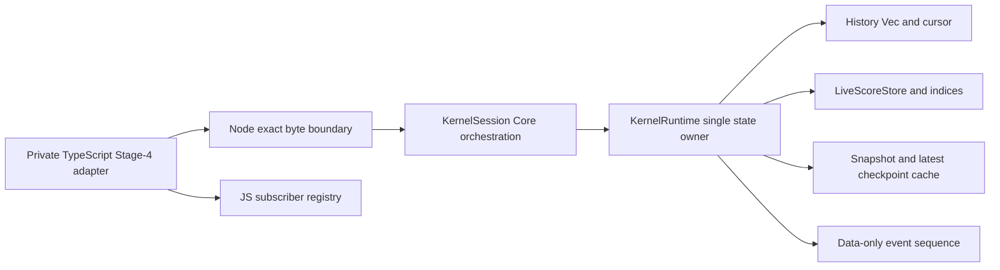

# Design — RKP-4 History, Snapshots, Events and Replay

## 0. Status and authority

This is a planning candidate based on accepted RKP-3 coordination head
`46a684c78551d118f75b4864a8ed6ec5d3de77c3` and audited RKP-3 technical source
`3ca82f1fcf68070e6c775d0848839864dbc87c71`.

```text
accepted and archived RKP-3
  -> this reviewed RKP-4 planning contract
  -> later explicit task.py start authorization
  -> private implementation candidate and bounded review
  -> separate owner acceptance/archive
  -> only then RKP-5 planning
```

The task remains `planning`. No production source is changed by this document,
and TypeScript remains the default runtime.

## 1. Stage boundary and ownership



| Layer | RKP-4 responsibility |
|---|---|
| `brilliant-kernel-contracts` | exact Stage-4 operation/read/select/replay DTOs, history/checkpoint/event/failure data, strict codecs and capped encoders |
| `brilliant-kernel-runtime` | sole owner of history/cursor, per-version identities, dirty/clean identity, stored-effect adoption, indices/selectors, snapshot cache, operational checkpoint, event sequence and counters |
| `brilliant-kernel-session` | Core submit/undo/redo/mark-persisted orchestration and semantic replay loop; no validation policy or callbacks |
| `brilliant-kernel-node` | two private byte exports over the existing opaque handle and mutex/panic boundary |
| private TypeScript adapter | exact capture/decode/freeze, JS snapshot reuse, subscribers and reentrant-write guard |

Runtime remains the only mutable state owner. Session never owns a second
history, dirty flag, event counter, or snapshot. Node and TypeScript never see
Rust handles, `ChangeSetV1`, internal checkpoint objects, callbacks, or mutable
store references.

## 2. Runtime state model

```rust
struct HistoryEntryV1 {
    sequence: u64,
    command: CoreCommandEnvelopeV1,
    change_set: ChangeSetV1,
    affected: Vec<StableAddressV1>,
    batch_segments: Vec<BatchSegmentV1>,
}

struct HistoryStateV1 {
    entries: Vec<HistoryEntryV1>,
    cursor: usize,
    next_sequence: u64,
}

struct SnapshotCacheV1 {
    document_id: EntityIdV1,
    schema_version: ScoreDocumentSchemaVersionV1,
    document_version: u64,
    document: Arc<ScoreDocumentV1>,
}

struct OperationalCheckpointV1 {
    document_version: u64,
    history_cursor: usize,
    content_identity: u64,
    document: Arc<ScoreDocumentV1>,
}

struct CheckpointScheduleV1 {
    committed_entries_since_checkpoint: u64,
    changeset_bytes_since_checkpoint: u64,
    due: bool,
    latest: Option<OperationalCheckpointV1>,
}

struct SessionProjectionStateV1 {
    clean_state_identity: u64,
    state_identity_by_document_version: Vec<u64>,
    snapshot_cache: Option<SnapshotCacheV1>,
    checkpoint: CheckpointScheduleV1,
    next_event_sequence: u64,
}
```

`KernelRuntime` embeds these fields beside the accepted RKP-3 store/version and
committed metrics. `Arc` is an internal immutable ownership tool only; it never
crosses FFI.

Invariants:

- `cursor <= entries.len()`;
- `undoDepth = cursor`, `redoDepth = entries.len() - cursor`;
- every entry sequence is positive, strictly increasing in append order, and
  less than or equal to `Number.MAX_SAFE_INTEGER`;
- `next_sequence` is greater than every sequence ever issued, including
  entries removed from a redo tail;
- `content_identity = entries[cursor - 1].sequence`, or `0` when cursor is 0;
- the per-version identity vector begins `[0]` and has one element for every
  committed document version;
- a snapshot/checkpoint revision never exceeds the live document version;
- `next_event_sequence` is the next unissued positive safe integer.

History owns the already detached Rust command and `ChangeSet`; it does not
clone the document or retain a Node/JS input value.

## 3. Atomic transition algorithms

### 3.1 Effective submit

1. Session strictly decodes and routes the Core semantic envelope and asks the
   accepted RKP-3 path to prepare its overlay and `ChangeSetV1`.
2. Runtime computes the next document/history/event values, the dirty state
   before and after, and whether one or two events are required.
3. Before mutation, it validates cursor invariants and safe-integer arithmetic,
   reserves the history vector and per-version identity vector, reserves the
   complete event sequence interval, and completes the RKP-3 store/index
   `CommitPlan`.
4. Adoption begins only after all expected failures are exhausted. The store
   and indices adopt, redo tail truncates, one history entry appends, cursor and
   document version advance, the new identity appends, snapshot cache clears,
   scheduler counters advance, and event sequence commits.
5. The runtime releases the interactive commit section. If the checkpoint is
   due it attempts maintenance materialization, then returns the operation
   result plus ordered event DTOs.

A no-op never allocates a history sequence or event sequence and never clears a
redo tail.

### 3.2 Undo

1. Reject `history.empty-undo` when cursor is zero before any reservation.
2. Select `entries[cursor - 1]`; preflight its reverse-safe inverse operations
   against current stable-address preconditions and prepare all store/index
   deltas without running a command handler.
3. Reserve version identity and required event sequences. RKP-5 later inserts
   accepted validation/classification immediately before final adoption.
4. Atomically adopt the inverse, decrement cursor, increment document version,
   append the resulting content identity, clear the snapshot cache, and commit
   events. History entries and scheduler entry/byte counts do not change.

### 3.3 Redo

Redo mirrors undo using `entries[cursor].change_set.forward`, then increments
cursor. It never invokes a command preparer or allocates a new history sequence.

### 3.4 `markPersisted`

The exact checkpoint decoder runs before lookup. Document mismatch precedes
version availability. The per-version vector resolves the observed version to
its content identity in O(1). If clean identity is unchanged, return `no-op`.
If it changes, reserve a dirty event only when current dirty changes, then
commit clean identity and event sequence together. Document version, history,
store, indices, snapshot cache, and operational checkpoint are untouched.

### 3.5 Failure and panic boundary

Every expected error returns before the first live write. After that point the
code path contains only pre-reserved vector operations, swaps, scalar writes,
and the accepted infallible RKP-3 adoption sequence. A caught unexpected panic
poisons the opaque session permanently. Subscriber failures occur later in JS
and cannot roll back a committed transition.

## 4. Dirty identity and branch semantics

The identity vector records content identity, not a document hash:

```text
initial:             version 0 -> identity 0
submit A:            version 1 -> identity 1
submit B:            version 2 -> identity 2
mark version 1:      clean identity = 1; current remains dirty
undo B:              version 3 -> identity 1; current becomes clean
submit C after undo: version 4 -> identity 3; B tail removed; current dirty
```

Sequence `2` is never reused. Even if C happens to produce bytes deeply equal
to a previously persisted state, identity `3 != 1`; no full-document equality
check can incorrectly clear dirty.

The identity vector is append-only for the session lifetime so delayed saves of
any observed committed version remain resolvable after undo/redo/branching.
This is distinct from history-tail retention: a removed redo entry may still
have its historical version-to-identity value recorded.

## 5. Snapshot cache and direct selectors

### 5.1 Cache-aware full read

The Stage-4 read request contains `knownSnapshotVersion: number | null`.

- If the caller's known version equals the live version and the native cache
  matches, the response carries snapshot identity/version, history, dirty, and
  `document: null`; the adapter reuses its matching deeply frozen object.
- Otherwise Runtime exports the store once, constructs/reuses the current
  `Arc<ScoreDocumentV1>`, and Node returns the complete document. The adapter
  creates and deeply freezes one `DocumentSnapshot` and remembers it.
- If an adapter has no cache, it sends `null`; Native never returns an
  identity-only response that the caller cannot satisfy.

The read state is assembled under one session lock, so snapshot revision,
history depths, and dirty cannot describe different transitions. Encoding
occurs from the immutable cached document. An over-64-MiB wire response returns
the existing stable response-limit failure and does not damage the cache or
runtime.

The legacy `readKernelSessionV1` behaves as a caller with no JS cache and thus
returns a complete document while reporting real history/dirty values.

### 5.2 Selector routing

| Selector | Runtime path |
|---|---|
| metadata | document metadata record only |
| entity: document | explicit full snapshot cache |
| entity: measure/part/staff/voice/event/note | stable ID index, owner/topology chain, selected DTO only |
| ownership | entity and ownership indices only |
| measure/part-measure range | normalized endpoints plus ordered topology slice |
| voice-event range | owner index plus Voice time/order index |
| history | cursor/vector lengths only |
| dirty | current versus clean identity only |

Each response includes the observed document version so the adapter can prove
coherence. Selector materialization owns fresh DTO data before releasing the
lock. Missing and malformed inputs use accepted read failures; no selector
warms or invalidates the full cache except explicit document selection.

## 6. Operational checkpoint state machine

The scheduler constants are exact:

```text
CHECKPOINT_ENTRY_INTERVAL_V1 = 512
CHECKPOINT_CHANGESET_BYTES_V1 = 33,554,432
CHECKPOINT_RETAINED_COUNT_V1 = 1
```

Only an effective submit creates a committed history entry, so only it adds one
entry and its checked `ChangeSetV1.logical_bytes` to the counters. Branch-tail
truncation does not subtract already committed work. When either threshold is
reached, `due=true` is committed with the edit.

After the interactive commit section, Runtime exports the accepted revision to
a detached immutable document and constructs the candidate checkpoint. It
replaces `latest` and resets both counters only after complete success. If
allocation/materialization fails, the previous checkpoint and counters stay
unchanged and `due` remains true; a later successful submit, undo, redo, or
explicit full read may retry after its own critical section. Maintenance
failure is not a command rejection and produces no event.

The checkpoint is not exposed as a public restore API in RKP-4. It proves the
bounded snapshot substrate required by future persistence while paths,
journaling, fsync, crash recovery, and reopening remain out of scope.

## 7. Deterministic events and JS dispatch

For an interactive transition Runtime builds events only after it knows the
exact post-state, but reserves their sequence interval before mutation:

```text
effective submit/undo/redo
  -> committed event
  -> optional dirty-changed event

effective markPersisted dirty toggle
  -> dirty-changed event
```

The committed event uses the outer semantic command ID (`core.transaction.batch`
for a batch), the entry's canonical affected addresses, the transition cause,
and the new document version. Undo/redo reuse the selected entry's command ID
and affected addresses. Event sequence increments by the exact emitted count;
overflow rejects zero-delta.

The TypeScript adapter keeps an ordered array of subscription records. For each
event it snapshots the current array, then invokes every still-present snapshot
entry in registration order. Unsubscribing during dispatch affects later
events, not the current snapshot. Each returned thenable is assimilated through
captured safe primitives and given a rejection handler; callback errors are
never copied into results.

`dispatchDepth > 0` permits cache-aware reads and selectors, but returns
`event.reentrant-write` locally for submit/undo/redo/mark-persisted before a
native call. Therefore Rust never needs to store or invoke host callbacks.

## 8. Private Node wire

RKP-4 preserves:

```text
createKernelSessionV1
readKernelSessionV1
submitKernelStage3V1
```

and adds exactly:

```text
operateKernelStage4V1
replayKernelStage4V1
```

### 8.1 Operation request

```rust
struct KernelStage4OperationRequestV1 {
    api_version: u64, // exactly 1
    operation: KernelStage4OperationV1,
}

enum KernelStage4OperationV1 {
    Submit { command: CoreCommandEnvelopeV1 },
    Undo,
    Redo,
    MarkPersisted { checkpoint: PersistedCheckpointV1 },
    Read { known_snapshot_version: Option<u64> },
    Select { selector: SelectorRequestV1 },
}
```

Each JSON variant has an exact discriminated shape. All inputs use the existing
depth 64, native property 1,572,864, dense-array, safe-integer, duplicate-key,
and 64 MiB request protections. Results are tagged exact-shape data plus an
ordered `events` array for state-changing operations and explicit metrics for
stage evidence. No result contains a `ChangeSet`, Rust handle, raw exception,
callback, path, backtrace, or full document on submit/undo/redo.

The existing Stage-3 submit export calls the same Stage-4-aware Core submit
transition, maps the stage-owned subset to its old response, and discards the
event DTOs because that legacy private call has no subscription registry. This
keeps history and event sequence internally coherent if predecessor and
successor evidence calls share a handle.

### 8.2 Replay request

```rust
struct KernelStage4ReplayRequestV1 {
    api_version: u64, // exactly 1
    initial_document: ScoreDocumentV1,
    commands: Vec<CoreCommandEnvelopeV1>,
}
```

Replay owns a new Session, iterates commands in input order, and stops after
recording the first rejected result. It returns only stage-owned result fields,
final version/document, and failed index where applicable. It never takes an
opaque handle, so it cannot mutate a live session or reach its subscribers.

## 9. Replay pipeline

```text
strict document + dense envelopes
  -> fresh KernelSession
  -> Core semantic decode/catalog/handler
  -> RKP-3 overlay and ChangeSet adoption
  -> RKP-4 history/version result
  -> stop on first rejection
  -> detached canonical final document
```

The replay loop does not apply stored effects and does not call undo/redo. It
uses the same submit transition and therefore preserves no-op, batch,
tail-independent history, caps, and failure ordering. Throwaway event data is
not exposed or dispatched, no `markPersisted` is invoked, and no cache or
subscriber survives the call.

RKP-4 deliberately omits public `support` from native replay results. RKP-5
must add validation/classification before RKP-7 can compare complete public
`CommandResult` objects.

## 10. Failure and zero-delta matrix

| Condition | Result | Required invariant |
|---|---|---|
| empty undo/redo | `history.empty-undo` / `history.empty-redo` | all state and events unchanged |
| stored precondition/index failure | `history.invariant-violation` | no adoption, cursor/version unchanged |
| history/version allocation or arithmetic failure | stable private resource/invariant or `command.version-overflow` | no tail truncation or store delta |
| event interval overflow | `event.sequence-overflow` | store/history/dirty/cache/checkpoint unchanged |
| invalid checkpoint | `checkpoint.invalid` | clean identity and events unchanged |
| wrong document | `checkpoint.document-mismatch` | clean identity and events unchanged |
| unknown observed revision | `checkpoint.version-unavailable` | clean identity and events unchanged |
| callback-time write | `event.reentrant-write` | rejected in adapter; native not called |
| invalid/missing selector target | accepted `read.*` failure | no state change |
| snapshot/selector response over bridge cap | stable bridge response-limit failure | live state/cache remain usable |
| maintenance checkpoint allocation failure | private deferred maintenance status | commit remains; previous checkpoint retained; no event |
| replay command rejection | replay `rejected`, exact failed index | fresh replay state stops; live sessions untouched |
| panic after adoption begins | poisoned opaque handle | no normal success/rejection claim |

## 11. Metrics and complexity evidence

Extend, without resetting predecessor attempt evidence, the stage counters for:

- full snapshot materializations and serialized full snapshot bytes;
- snapshot cache hits/misses;
- selector entity/index/ordered records visited and returned;
- history entries/cursor operations and stored ChangeSet bytes;
- operational checkpoint attempts/successes/failures/materialized bytes;
- events reserved/emitted;
- replay commands attempted/committed/no-op/rejected.

Interactive submit/undo/redo metrics remain separate from checkpoint
maintenance. A non-threshold local transition must show the first four global
counters at zero. A threshold transition may show one maintenance snapshot but
must not relabel it as interactive work. RKP-4 proves bounded structural work
and cache behavior; the blocking latency/RSS targets remain RKP-7 qualification.

## 12. Verification architecture

### Rust unit/property gates

- vector/cursor identities, branch truncation, sequence overflow and capacity;
- every RKP-3 forward/inverse change class through undo/redo;
- precondition failure and panic poisoning;
- dirty and all observed-version checkpoint transitions;
- cache invalidation/hit/old-`Arc` stability and direct selector parity;
- event counts/order/overflow and checkpoint threshold/failure injection;
- replay semantic rerouting, dense rejection, first failure and repeatability.

### Real Node gates

- exact five exports and predecessor successor-compatibility;
- cache-known and cache-missing read handshake;
- frozen/detached snapshots, selected DTOs, events, and replay output;
- JS subscriber ordering/snapshot/duplicates/unsubscribe/isolation;
- read during callback and local reentrant-write rejection;
- hostile values, malformed raw JSON, request/response caps, wrong/stale/
  cross-thread/busy/poisoned handles.

### Oracle and regression gates

- mechanically select immutable RKP-0 rows 57-61;
- retain RKP-1/RKP-2/RKP-3 Rust, Node, workspace and oracle tests;
- keep public TypeScript behavior and protected inventories byte/shape stable;
- run full Rust and TypeScript gates before candidate freeze.

## 13. Exact implementation boundary

The implementation candidate may add Stage-4 modules under the four owned Rust
crates, update the private native adapter, add `rkp-4-*` migration tests and
fixtures, and make the minimal successor-aware edits to RKP-1/2/3 migration
tests. It may update only the concise Rust transition spec and RKP-4/parent
Trellis artifacts outside those paths.

No public `src/core-kernel/index.ts` export, TypeScript command/runtime behavior,
foundation schema, dependency manifest/lock version, frozen oracle fixture,
qualification contract, application composition/default, RKP-5+, product
feature, or generated build artifact is allowed.

## 14. Rollback and lifecycle

Each implementation commit is reversible in reverse order. Full rollback
removes the two private exports and Stage-4 modules and restores the accepted
RKP-3 behavior; TypeScript was always default.

An implementation candidate requires a bounded review and then a separate
owner acceptance/archive instruction. Neither planning completion nor technical
PASS authorizes RKP-5, qualification, cutover, cleanup, or push.
