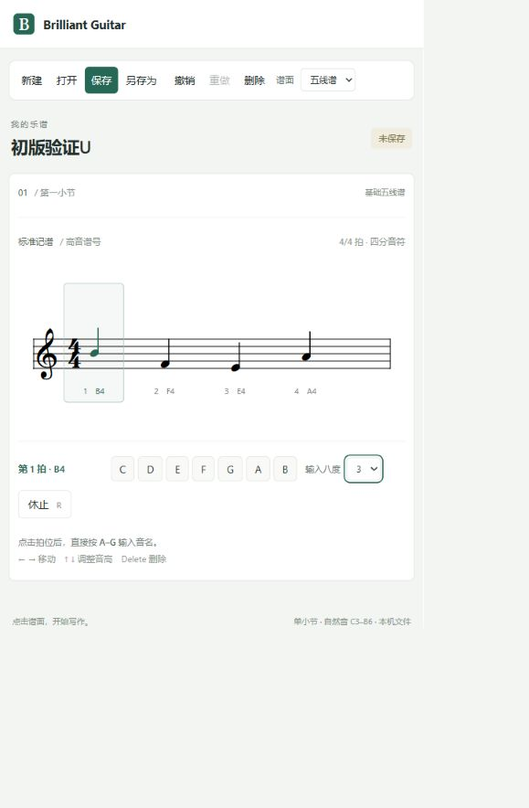

# 五线谱编辑器：视觉与输入重设计

2026-09-13。状态：Product Design 视觉探索，等待选择；本轮未修改运行中的 UI、用户乐谱或内核。沿用此前直接规划的决定，不创建 Trellis 任务。

## 目标与纠正

让用户能够连续写入并修改一段包含不同音高、时值和休止的旋律。首版仍是基础五线谱；后续吉他领域和六线谱通过明确接口接入。

上一轮验证了接入链路，却把功能接通当成了产品可用。本次必须同时解决视觉比例、操作可发现性和基本音乐编辑。时值属于本轮基础编辑要求，不能继续以最小演示为由排除。

## 当前界面检查

检查对象是用户当前打开的 `http://127.0.0.1:4319/`。只读取页面及代码，没有改动用户当前未保存内容。

1. **进入写谱界面：层级失衡。** 当前完整截图中，标题、卡片内说明、巨大拍位框与留白压过了实际谱面。常用文件操作有文字标签，这是应保留的可发现性；写作动作却缺少同等清晰的组织。
2. **定位与输入：表达有误导。** 同一截图里独立 A–G 按钮和大拍位框占据注意力，文案以“点击拍位后”开头。代码实际上支持键盘输入和方向键，但界面没有清晰表达持续写入位置与已选对象的区别。本轮不在用户当前乐谱上重新执行输入。
3. **改变节奏：功能缺失。** 当前页面没有时值入口，应用投影只有 pitch，宿主限定四个四分事件，绘制也固定 `q/qr`。Core 已有 `core.event.set-note-value` 公共语义命令；仍需验证实际 Native 编辑和节奏重排，不能只增加一个外观按钮。

截图和当前 DOM 可见部分次要文字较淡、字号较小；键盘焦点当前位于八度下拉控件。对比度、屏幕阅读器和完整键盘旅程尚未作新的合规测评，不宣称可访问性达标。

## 新交互方案

- 新建后明确出现写入光标，获得编辑焦点即可开始。进入写入状态后持续保留，输入一个音符无需确认。
- “写入”和“选择”状态明确可见，可用键盘切换；不会因为当前位置是休止或音符就悄悄改变用户意图。
- 时值控制固定、可发现：全音符、二分、四分、八分、十六分，休止与附点按同一组规则组织。原型需明确哪些值已经可用。
- 写入状态下改时值影响后续输入；选择状态下改时值作用于明确选择的音符。控件标签分别显示“当前输入”或“已选音符”，不混用两个状态。
- 输入成功后按照实际音乐时长前进，不能按四个固定数组槽移动。修改已选对象后保留其身份和选择。
- 键盘是完整主路径，点击只提供定位和可发现入口。按钮、菜单、快捷键使用同一个动作定义和可用性判定。
- 图中 `+ / −` 作为时值快捷键候选，用于避开未来六线谱数字输入；最终按键映射需检查焦点与输入法冲突，不在视觉图阶段冻结快捷键标准。
- 修改长短不能覆盖后续已写音符。实现前验证两种明确策略：保留后续时间、只消耗/补入休止；或显式节奏重排。默认优先验证前者，空间不足时原位说明原因，提供另行重排入口；不弹逐音确认。
- 跨小节、拆分与连音涉及音乐结构命令，不由渲染器私自制造“看起来正确”的文档。若初版暂限一小节，应明确边界且能在其中输入和修改混合时值。

## UI 分层与模块合同

模块化既约束代码依赖，也约束视觉与交互的一致性。不能只把一个巨大页面拆成几个文件。

| 层 | 职责与对外合同 | 不应拥有 |
|---|---|---|
| 视觉基础 | 语义颜色、字号、间距、状态样式、按钮/选择控件/提示组件 | 音乐文档、业务规则、内核依赖 |
| 工作台布局 | 文件入口、工具区/谱面容器/上下文区/状态栏的编排与响应式规则 | 乐器特判、具体绘谱对象 |
| 编辑交互 | 光标、对象选择、输入默认时值、焦点、动作定义与快捷键路由 | 第二套文档与撤销栈 |
| 谱面适配 | 五线谱绘制、命中、音乐位置与显示坐标映射；输出只读投影和交互意图 | 文件服务、Native 实现、直接写音乐事实 |
| 宿主与公共内核边界 | 将语义意图转换为公共命令/批处理，版本校验、读回、历史、文件服务 | UI 颜色、DOM 布局、乐器专属控件 |

通用工具条不直接调用某个五线谱实例的方法；输入动作与可用能力经公开合同连接。谱面插件不导入内核内部目录。绘谱库类型留在适配模块内。

UI 注册合同覆盖 identity、capability、mount/update/dispose；键盘绑定按作用域声明，避免未来吉他品号与通用快捷键冲突。默认五线谱也走相同入口。当前只落实实际使用的扩展点，不提前做插件市场或热安装。

主题、工具区显示偏好和布局偏好属于 UI 设置；音符时值与音乐内容属于文档；临时输入时值与连续工具状态属于编辑会话。三者不混存，不共用撤销历史。

## 视觉探索范围

目标为桌面编辑器 1440 × 1024，探索工具区在上方、下方以及上下文编辑区的不同组织。三张独立效果图共享键盘优先、时值可见、基础五线谱、无需逐音确认等硬约束。

当前截图作为被否决的功能参照附给生成工具，不作为必须保留的视觉风格。不复用旧工作台候选作为已获认可的设计。使用排版、对齐、间距和细分隔建立层级，减少卡片套卡片和大面积装饰。

效果图用于选择方向，不证明符号、快捷键、时值编辑或插件合同已经实现。选择之后将视觉目标落实为共享样式与模块，再接通时值的真实编辑链路。

## 下一次实现的验收

1. 全程键盘输入一段混合四分/八分时值的旋律，不逐音点击、不逐音确认。
2. 定位已有音符改变音高与时值；正确处理邻接休止，不静默丢弃已有音符。
3. 撤销/重做恢复事件、时间及选择，保存重开后节奏保持；验证真实 Native 命令和拒绝路径。
4. 字段输入、快捷键、IME 和谱面焦点不串用；查看模式与写入模式可辨别。
5. 谱面模块只依赖公开接口；全局视觉基础与模块样式分开，注册/销毁不重复订阅。
6. 桌面及窄窗口下常用时值入口仍可发现，谱面不被巨大的空卡片挤压；实现截图与选定设计同状态比较。
