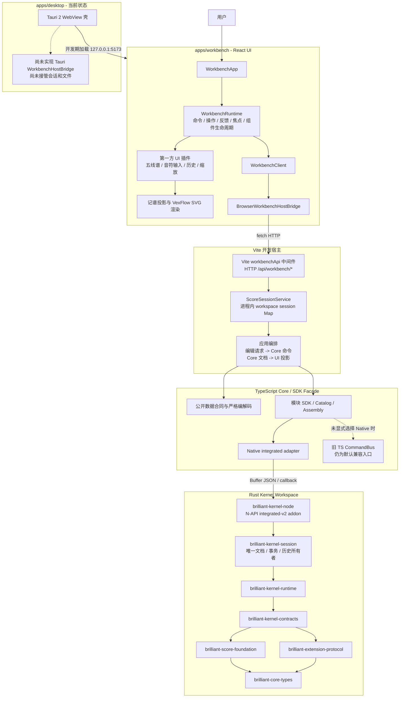
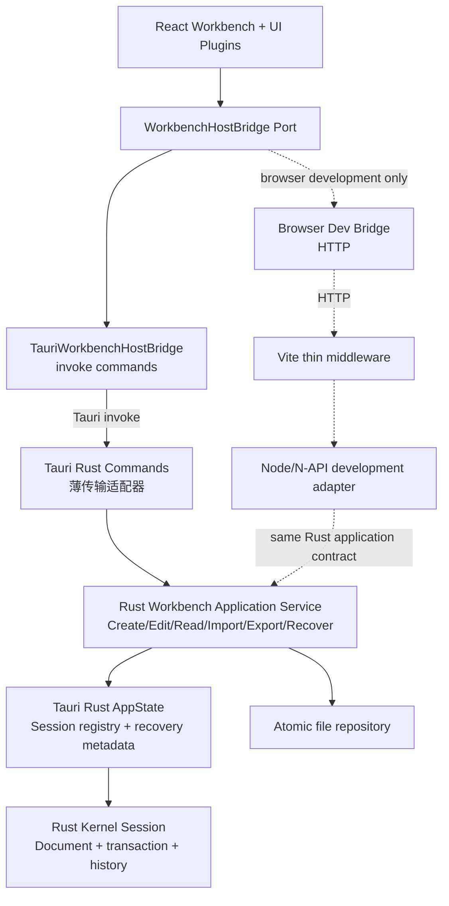

# Brilliant Guitar 软件架构审计

> 状态更新（2026-09-16）：本文主体记录迁移前的审计基线。Rust 生产宿主的代码链路已经接通，但真实桌面业务闭环和双宿主合同仍在验证，不能标记为迁移完成。当前目标生产路径为 `React -> Tauri invoke -> Rust application service -> Rust Kernel`，Vite/Node/N-API 只计划用于浏览器开发和合同回归。实施进度见 `docs/tauri-rust-host-migration-handoff.md` 和 `docs/desktop-host-plan.md`。

审计日期：2026-09-16

## 结论摘要

当前系统已经形成清晰的分层雏形：React Workbench 负责交互与渲染，Node/Vite Host 负责应用用例和会话编排，TypeScript Core Facade 提供公开合同，Rust Kernel 持有可变乐谱、事务和历史，Tauri 作为未来桌面宿主。

核心内核和前端工作台的模块边界总体健康，测试覆盖也较强。当前最大问题不在领域内核，而在“产品宿主尚未收口”：开发模式依赖 Vite 中间件和 Node N-API addon，Tauri 只有 WebView 外壳，没有实现同等宿主能力。因此浏览器开发闭环可用，但静态生产构建和桌面安装包尚不是完整可运行产品。

## 当前实际架构



### 当前主运行链

```text
React Workbench
  -> BrowserWorkbenchHostBridge
  -> Vite HTTP middleware
  -> ScoreSessionService
  -> TS Core/SDK facade
  -> integrated-v2 N-API addon
  -> Rust Kernel Session
  -> Rust document / transaction / history
```

Tauri 开发窗口仍复用这条链。Tauri 自身没有 command handler，因此它目前是显示宿主，不是业务宿主。

## 架构优点

### 1. 核心状态所有权明确

产品使用的 integrated 路径由 Rust Session 持有唯一可变文档、事务和撤销/重做历史，UI 不维护第二份可编辑乐谱。这个方向正确，能够避免双状态漂移。

### 2. 内核分层合理

Rust workspace 从基础类型、乐谱规则、扩展协议、边界合同、运行时、会话到 Node 桥逐层依赖，没有发现 UI 或 Tauri 反向进入领域层。TypeScript 侧也有专门的禁止依赖边界测试。

### 3. UI 工作台机制与业务组件分离

WorkbenchRuntime 统一命令、异步操作、反馈、焦点和组件生命周期；第一方能力也经过 UI Plugin Manifest 装配。组件通过受限上下文执行命令，没有直接持有 Core 或文件系统。

### 4. 边界防御较完整

输入有严格解码，编辑请求带文档版本和 requestId，宿主实现了乐观并发和幂等保护；Core 事件订阅异常与已提交事务隔离。HTTP 入口还限制了 body 大小、Content-Type 和同源请求。

### 5. 测试资产扎实

仓库包含 Core 行为回归、TS/Rust 差分、Native/WASM、事务原子性、历史、恶意输入、公开边界和 Workbench 组件/宿主测试。这为后续宿主替换提供了较好的安全网。

## 主要问题与风险

### P0：生产宿主链路尚未闭合

`apps/desktop/src-tauri/src/lib.rs` 只创建默认 Tauri Builder，没有注册任何 command。WorkBench 的默认桥仍向 `/api/workbench/*` 发 HTTP 请求，而这些接口只存在于 Vite dev/preview middleware。

影响：

- `vite build` 生成的静态资源本身不包含 Node middleware。
- Tauri `frontendDist` 指向静态输出，正式打包后没有对应 `/api/workbench/*` 服务。
- 当前桌面构建即使能显示页面，也不能保证创建、编辑、保存和打开乐谱可用。

建议：优先实现 `TauriWorkbenchHostBridge` 与对应 Rust commands，并让运行时根据宿主能力显式选择桥。完成前继续保持 `bundle.active = false` 是正确的。

### P1：构建不是完整、可复现的产品流水线

Workbench 的 prebuild 只把根目录 TypeScript Core 编译到 `apps/workbench/.kernel`，随后运行时硬编码加载 `target/integrated-v2/brilliant_kernel_node.node`。UI build 不负责构建、校验或打包这个 addon。

影响：

- TypeScript facade、Rust 源码和本地遗留 addon 可能版本不一致。
- CI 的前端构建成功不能证明应用能够启动业务会话。
- `.kernel` 是源码镜像式生成物，增加了调试路径和产物身份复杂度。

建议：建立单一顶层构建编排，产出带版本/协议标识的 host bundle；启动时校验 addon 协议版本和构建身份。中期将共享 TS 合同发布为 workspace package，避免复制整个 `src` 树。

### P1：会话只存在于 Vite 进程内存

`ScoreSessionService` 使用 `Map<workspaceId, SessionEntry>` 保存会话。Vite 重启会直接丢失未导出的内容；32 个 workspace 达到上限后没有 TTL、LRU 或显式关闭机制。

影响：开发服务器重启、构建触发或宿主崩溃会丢失会话；长期运行时会话生命周期不可控。

建议：桌面端由 Tauri/Rust AppState 持有 session registry，增加显式 close、最近恢复文件和原子保存。浏览器开发适配器至少增加 TTL/LRU、dispose 和崩溃恢复提示。

### 已确认的迁移事项：旧 TS 内核退役

项目已经明确旧 TS 可变内核废弃，后续将完成 Rust 默认切换和旧实现清理。因此这不是“架构方向存在两个真相”，也不应作为当前产品架构重新选型的问题。

当前审计只保留一个工程提醒：迁移完成前，产品入口和测试入口必须显式固定 Rust integrated 路径，避免新增调用方误用旧 `CommandBus.create()`。该事项应纳入既有迁移计划，而不是阻塞桌面宿主闭环。

### P2：应用层职责集中在 Node Host 文件中

`ScoreSessionService` 同时承担 session registry、用例编排、UI edit DTO 到 Core command 的翻译、幂等、并发控制、领域错误映射、导入导出和 notation projection 协调。

影响：Tauri 移植容易复制业务逻辑；新增吉他谱、播放、文件恢复等用例会继续扩大该文件。

建议：建立 Rust Workbench application crate，承载 `CreateScore`、`EditScore`、`Import/ExportScore`、`NotationProjection` 和 session lifecycle。Tauri command 只做 transport adapter；浏览器开发入口通过薄 Node/N-API 适配器复用同一 Rust application crate，避免复制业务规则。

### P2：仓库不是统一依赖工作区

根目录、Workbench、Desktop 各自维护 `package.json`/lockfile；根目录 TypeScript 5.8，Workbench 使用 TypeScript 7.0。Rust 桌面壳也通过嵌套 workspace 与核心 workspace 隔离。

影响：依赖升级、类型行为、脚本和 CI 缓存容易漂移，跨包变更缺少统一拓扑构建。

建议：采用 npm workspaces（或明确选定的 monorepo 工具）统一 JS 依赖图和脚本；Rust 是否保持双 workspace 可以保留，但应由顶层任务统一验证。

### P2：桌面安全配置仅适合开发阶段

Tauri 当前 `csp` 为 `null`，capability 和文件权限尚未随真实 command 设计收口。

建议：实现桌面桥时同步建立最小 capability、严格 CSP、命令参数校验、路径作用域和原子文件写入；不要在桥完成前扩大 Tauri 权限。

### P3：少数核心文件复杂度偏高

TypeScript integrated runtime、effects 和 domain catalog 已形成数万字节级单文件；WorkbenchApp 和输入 hooks 也开始集中较多装配职责。

建议：只按稳定职责拆分，不做纯行数重构。优先拆 protocol codec、session adapter、assessment pipeline、application use case；保持公开合同不变。

### P3：前端主包仍有较大静态资源

当前生产构建通过，但 VexFlow/Bravura 相关输出存在超过 500 kB 的 chunk。桌面应用对此比网站更宽容，但仍会影响首次载入、内存和更新包体积。

建议：宿主闭环完成后，再对非首屏对话框、导出能力、VexFlow 字体包和备用字体做按需加载；不要让包体优化阻塞当前更重要的桌面会话闭环。

## 推荐目标架构



### 与当前架构的实质区别

| 维度 | 当前架构 | 推荐生产架构 |
| --- | --- | --- |
| 桌面业务调用 | WebView -> HTTP -> Vite/Node | WebView -> Tauri invoke -> Rust |
| 生产进程依赖 | Tauri + Vite/Node host + N-API addon | Tauri/WebView + Rust desktop process |
| 应用用例 | `score-session.ts` 中的 TS/Node 服务 | 独立 Rust Workbench application crate |
| Kernel 集成 | Node 通过 Buffer/JSON N-API 调用 Rust | Tauri Rust 直接调用 Rust crate 类型/API |
| Session 所有者 | Vite 进程内 `Map` | Tauri Rust `AppState` |
| 文件能力 | HTTP 导入导出和浏览器下载 | 原生文件对话框、真实路径、原子写入和恢复 |
| Vite/Node/N-API | 产品运行链必需 | 只服务浏览器开发和兼容验证 |

关键原则：生产桌面不再把 Node 开发宿主带进运行链；Tauri command 不复制业务规则；Rust application service 直接组合 Rust Kernel。React UI 和 `WorkbenchHostBridge` 可以基本保持不变。

## 优化顺序

### 第一阶段：闭合桌面产品链路

1. 实现 Tauri commands：create/read/edit/undo/redo/import/export/close。
2. 实现 `TauriWorkbenchHostBridge`，在 Tauri 环境显式选择它。
3. 将 session registry 放入 Rust AppState，并让桌面 crate 直接依赖 Rust Kernel crate。
4. 实现原生文件选择、真实路径和原子保存。
5. 增加桌面端到端测试，证明静态 `frontendDist` 下完整编辑闭环可用。

### 第二阶段：收口构建和应用层

1. 提取 Rust Workbench application crate，避免业务规则留在 Tauri command 或 Vite middleware。
2. 建立统一 workspace 构建，自动构建并校验 Rust 产物。
3. 浏览器开发入口通过薄 Node/N-API adapter 复用 Rust application contract。
4. 为仍保留的 Native 开发协议增加版本握手和产物身份检查。
5. 将 `.kernel` 源码镜像替换为生成的前端 DTO/Schema 合同包。

### 第三阶段：完成 Rust 默认迁移

1. 按既有计划完成旧 TS 内核退役；不再重新讨论内核技术选型。
2. 完成性能、资源、WASM 和平台资格门禁。
3. 将 Rust 设为正式默认后端。
4. 冻结并最终删除旧 TS 可变会话实现，仅保留必要合同、SDK 和测试 oracle。

### 第四阶段：可运维性与扩展

1. 会话关闭、TTL/恢复和诊断导出。
2. 启动健康检查：UI、host、protocol、addon、kernel 版本。
3. 长谱增量投影和渲染性能预算。
4. 在稳定权限模型上逐步开放更多第一方或第三方插件能力。

## 建议的架构门禁

- 静态桌面包必须通过 create -> edit -> undo -> save -> reopen 的端到端测试。
- 产品代码不得调用旧 `CommandBus.create()`。
- UI/插件不得导入 Core 实现、Node、Tauri 或文件系统模块。
- transport adapter 不得包含 Core command 构造和领域判断。
- 构建必须从源码生成并校验唯一 Native addon，不接受未知本地产物。
- 每个 session 必须只有一个文档和历史所有者。
- 文件写入必须采用临时文件、fsync/flush 和原子替换策略。
- Tauri command 和 capability 采用最小权限，生产 CSP 不得为 `null`。

## 审计验证

- 根目录 TypeScript typecheck：通过。
- Workbench kernel preparation 与 TypeScript typecheck：通过。
- 根目录 TypeScript/Native 完整测试：896 项，894 通过、2 条件跳过、0 失败。
- Workbench 测试：108 项通过、0 失败。
- 根目录与 Workbench 生产构建：通过；Workbench 构建报告大于 500 kB 的 chunk 警告。
- Rust workspace 测试：本机当前 shell 找不到 `cargo`，本轮无法重新执行；仓库文档中的既有通过记录不能替代本轮验证。
- 本轮未修改业务代码。
